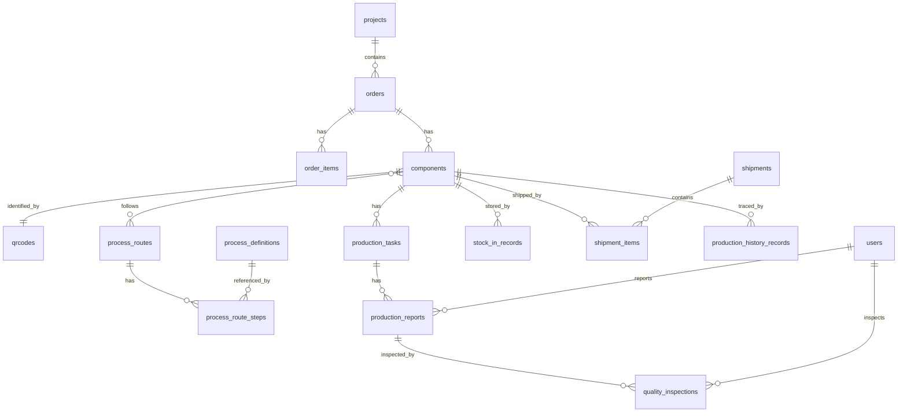

# MES 第2阶段数据库详细设计方案 V1.0

> 项目：钢结构出口加工厂 MES
> 数据库：PostgreSQL 16
> 开发库：jiangxing_mes
> 文档版本：V1.0
> 编写者：孙麦 / MES 项目开发工程师（AI）
> 状态：**待评审**（未执行任何 SQL，未创建业务表）

---

## 目录

1. 设计总则
2. 数据库总体架构
3. 命名规范
4. 通用字段规范
5. 数据类型规范
6. 状态字段与状态流转规则
7. 核心业务主线与实体关系图
8. 模块划分与表清单
9. 表结构详细设计
   - 9.1 系统与权限模块
   - 9.2 组织与人员模块
   - 9.3 项目与订单模块
   - 9.4 构件与图纸模块
   - 9.5 二维码模块
   - 9.6 工艺与工序模块
   - 9.7 生产任务与报工模块
   - 9.8 质量管理模块
   - 9.9 仓储与入库模块
   - 9.10 发运与装箱模块
   - 9.11 生产履历模块
   - 9.12 系统支撑模块
10. 索引设计策略
11. 约束设计策略
12. 二维码与构件关系设计
13. 生产履历贯穿机制设计
14. ERP / MES 接口预留字段
15. 数据库初始化 SQL（设计稿，不执行）
16. 自检报告
17. 待确认事项

---

## 1. 设计总则

### 1.1 设计核心原则

| 原则 | 说明 |
|------|------|
| 构件为核心 | 所有业务数据最终都关联到「构件 (component)」 |
| 二维码为入口 | 车间操作通过扫码定位构件、工序、任务 |
| 生产履历为主线 | 全生命周期数据可追溯 |
| 数据完整性优先 | 主外键关系、唯一性、状态一致性 |
| 可追溯性 | 关键操作记录操作人、时间、前后状态 |
| 软删除 | 业务数据不物理删除，使用 deleted_at 软删除 |
| 扩展能力 | 预留 ERP 接口字段、扩展字段 |

### 1.2 业务约束

- PostgreSQL 16 是正式数据库
- 字符集 UTF8，时区 Asia/Shanghai
- 不直接修改生产数据库结构，所有变更通过 Alembic migration 管理
- 当前阶段仅设计，不执行 SQL，不创建业务表

---

## 2. 数据库总体架构

### 2.1 Schema 划分

采用 PostgreSQL Schema 进行模块隔离（非强制，可在 v1 只用 public，后续按需拆分）：

| Schema | 用途 | 当前阶段 |
|--------|------|----------|
| public | 所有业务表 | v1 默认使用 |
| audit | 操作审计日志（可选） | 预留 |
| meta | 系统元数据 | 预留 |

> 决策：v1 阶段统一使用 `public` schema，避免过早复杂化；后续如需拆分可通过 Alembic migration 完成。

### 2.2 模块依赖关系

```
┌─────────────────────────────────────────────────────┐
│ 系统与权限模块 (users/roles/permissions)             │
│  ↑                                                  │
│  依赖：被所有模块引用（created_by/updated_by）       │
└─────────────────────────────────────────────────────┘
                       ↑
┌─────────────────────────────────────────────────────┐
│ 组织与人员模块 (departments/workers)                │
└─────────────────────────────────────────────────────┘
                       ↑
┌─────────────────────────────────────────────────────┐
│ 项目与订单模块 (projects/orders/order_items)        │
└─────────────────────────────────────────────────────┘
                       ↓
┌─────────────────────────────────────────────────────┐
│ 构件与图纸模块 (components/drawings)                 │
│   ← 二维码模块 (qrcodes) 关联                       │
│   ← 工艺路线 (process_routes) 关联                  │
└─────────────────────────────────────────────────────┘
                       ↓
┌─────────────────────────────────────────────────────┐
│ 生产模块 (production_orders/tasks/reports)          │
│   ← 质量模块 (quality_inspections/defects)         │
│   ← 仓储模块 (inventory/stock_in_records)          │
│   ← 发运模块 (shipments/shipment_items)            │
└─────────────────────────────────────────────────────┘
                       ↓
┌─────────────────────────────────────────────────────┐
│ 生产履历模块 (production_history_records) - 统一汇总│
└─────────────────────────────────────────────────────┘
```

依赖方向：上层依赖下层，不允许循环依赖。

---

## 3. 命名规范

### 3.1 表命名

| 规则 | 示例 |
|------|------|
| 全小写 snake_case | `production_tasks` |
| 表名用复数 | `components`、`orders` |
| 关联表用两实体单数 + `_` 连接 | `user_roles`、`role_permissions` |
| 不使用 SQL 关键字 | 避开 `order` 用 `orders` |
| 前缀分类（可选） | 不加前缀，保持简洁 |

### 3.2 字段命名

| 规则 | 示例 |
|------|------|
| 全小写 snake_case | `created_at`、`project_id` |
| 主键统一为 `id` | `id` |
| 外键为 `{表名单数}_id` | `component_id`、`order_id` |
| 布尔字段以 `is_` / `has_` 开头 | `is_active`、`has_drawing` |
| 时间字段以 `_at` 结尾 | `created_at`、`completed_at` |
| 操作人以 `_by` 结尾 | `created_by`、`inspected_by` |
| 状态字段为 `status` 或 `{模块}_status` | `status`、`inspection_status` |
| 枚举值用小写下划线 | `in_progress`、`pending` |

### 3.3 约束命名

| 类型 | 规则 | 示例 |
|------|------|------|
| 主键 | `pk_{table}` | `pk_components` |
| 外键 | `fk_{table}_{referenced_table}` | `fk_components_orders` |
| 唯一约束 | `uq_{table}_{columns}` | `uq_qrcodes_code_value` |
| 检查约束 | `ck_{table}_{rule}` | `ck_components_status` |
| 索引 | `idx_{table}_{columns}` | `idx_components_order_id` |

### 3.4 序列命名

- 使用 `GENERATED ALWAYS AS IDENTITY`，不显式创建 SEQUENCE，避免额外命名管理。

---

## 4. 通用字段规范

### 4.1 每张业务表都包含的通用字段

| 字段 | 类型 | 说明 |
|------|------|------|
| id | BIGINT | 主键，GENERATED ALWAYS AS IDENTITY |
| created_at | TIMESTAMPTZ | 创建时间，DEFAULT NOW()，NOT NULL |
| updated_at | TIMESTAMPTZ | 更新时间，DEFAULT NOW()，NOT NULL，通过 trigger 自动更新 |
| created_by | BIGINT | 创建人 user_id，FK → users |
| updated_by | BIGINT | 更新人 user_id，FK → users |
| deleted_at | TIMESTAMPTZ NULL | 软删除时间，NULL 表示未删除 |
| remark | TEXT NULL | 备注 |

### 4.2 部分关键业务表额外包含

| 字段 | 类型 | 适用表 | 说明 |
|------|------|------|------|
| version | INTEGER DEFAULT 1 | 构件、订单、生产任务 | 乐观锁版本号 |
| erp_code | VARCHAR(64) NULL | 项目、订单、构件 | ERP 系统 code，预留接口 |
| erp_synced_at | TIMESTAMPTZ NULL | 同上 | 最后同步到 ERP 的时间 |
| erp_sync_status | VARCHAR(20) DEFAULT 'pending' | 同上 | pending/syncing/synced/failed |

### 4.3 updated_at 自动更新 trigger

所有业务表统一使用一个 trigger 函数：

```sql
CREATE OR REPLACE FUNCTION set_updated_at()
RETURNS TRIGGER AS $$
BEGIN
    NEW.updated_at = NOW();
    RETURN NEW;
END;
$$ LANGUAGE plpgsql;
```

每张表创建 trigger：
```sql
CREATE TRIGGER trg_{table}_updated_at
    BEFORE UPDATE ON {table}
    FOR EACH ROW EXECUTE FUNCTION set_updated_at();
```

> 注：trigger 创建会包含在 Alembic migration 中，本阶段不执行。

---

## 5. 数据类型规范

| 业务含义 | PostgreSQL 类型 | 说明 |
|------|------|------|
| 主键/外键 | BIGINT | 性能优于 INT，未来扩展空间大 |
| 短编码 | VARCHAR(32) | 项目编号、订单号、构件号 |
| 长编码 | VARCHAR(64) | 二维码值、UUID 等 |
| 名称 | VARCHAR(200) | 项目名、构件名 |
| 文本描述 | TEXT | 备注、说明 |
| 状态枚举 | VARCHAR(20) + CHECK | 用字符串而非数字，可读性强 |
| 数量 | INTEGER | 构件数量、报工数量 |
| 重量 | NUMERIC(12,3) | 钢构件重量，单位 kg |
| 尺寸 | NUMERIC(10,2) | 长度/宽度/厚度，单位 mm |
| 金额 | NUMERIC(14,2) | 单价、总价 |
| 时间戳 | TIMESTAMPTZ | 全部带时区 |
| 布尔 | BOOLEAN | 标志位 |
| JSON 配置 | JSONB | 扩展属性、动态字段 |

---

## 6. 状态字段与状态流转规则

### 6.1 项目状态 (projects.status)

```
planning(规划中)
  ↓
confirmed(已确认)
  ↓
in_progress(进行中)
  ↓
completed(已完成)
  ↓
closed(已关闭)

任意状态 → cancelled(已取消) [终态]
```

CHECK 约束允许值：`planning, confirmed, in_progress, completed, closed, cancelled`

### 6.2 订单状态 (orders.status)

```
draft(草稿)
  ↓
confirmed(已确认)
  ↓
in_production(生产中)
  ↓
completed(已完成)
  ↓
closed(已关闭)

任意状态 → cancelled(已取消) [终态]
```

CHECK 允许值：`draft, confirmed, in_production, completed, closed, cancelled`

### 6.3 构件状态 (components.status)

```
draft(草稿)
  ↓
released(已下发)
  ↓
in_production(生产中)
  ↓
in_inspection(质检中)
  ↓
in_stock(已入库)
  ↓
shipped(已发运)
  ↓
completed(已完成) [终态]

特殊分支：
- in_production / in_inspection → on_hold(已暂停) → 回到原状态
- in_inspection → rework(返修中) → in_production
- 任意状态 → scrapped(已报废) [终态]
```

CHECK 允许值：`draft, released, in_production, in_inspection, rework, in_stock, shipped, completed, scrapped, on_hold`

### 6.4 生产任务状态 (production_tasks.status)

```
pending(待分配)
  ↓
assigned(已分配)
  ↓
in_progress(进行中)
  ↓
completed(已完成) [终态]

特殊分支：
- assigned / in_progress → paused(已暂停)
- 任意状态 → cancelled(已取消) [终态]
```

CHECK 允许值：`pending, assigned, in_progress, paused, completed, cancelled`

### 6.5 质检状态 (quality_inspections.inspection_status)

```
pending(待检)
  ↓
passed(合格) [终态]
  ↓
failed(不合格) [终态]
  ↓
rework(返修) → 回到生产
```

CHECK 允许值：`pending, passed, failed, rework`

### 6.6 二维码状态 (qrcodes.status)

```
unused(未使用)
  ↓
active(已激活，绑定构件)
  ↓
disabled(已停用) [可重新激活]
  ↓
voided(已作废) [终态]
```

CHECK 允许值：`unused, active, disabled, voided`

### 6.7 入库状态 (stock_in_records.status)

```
pending(待入库)
  ↓
completed(已入库) [终态]
  ↓
cancelled(已取消) [终态]
```

### 6.8 发运状态 (shipments.status)

```
planning(计划中)
  ↓
confirmed(已确认)
  ↓
loading(装车中)
  ↓
shipped(已发运)
  ↓
delivered(已送达) [终态]
  ↓
cancelled(已取消) [终态]
```

CHECK 允许值：`planning, confirmed, loading, shipped, delivered, cancelled`

---

## 7. 核心业务主线与实体关系图

### 7.1 业务主线

```
项目 project
  ↓ 1:N
订单 order
  ↓ 1:N
订单明细 order_item (可选，用于按行项目管理的订单)
  ↓ 1:N
构件 component  ←─── 二维码 qrcode (1:1 主码, 1:N 历史码)
  ↓ 1:N
工艺路线实例 (component 对应 process_route)
  ↓ 1:N
生产任务 production_task (每个工序一个任务)
  ↓ 1:N
生产报工 production_report
  ↓ 1:1
质检 quality_inspection (该工序完工后)
  ↓ (入库) 1:N
入库记录 stock_in_record
  ↓ (发运) 1:N
发运明细 shipment_item
  ↓ (汇总) 1:N
生产履历 production_history_record (每一步操作一条记录)
```

### 7.2 ER 关系图（Mermaid）



---

## 8. 模块划分与表清单

### 8.1 系统与权限模块

| 表名 | 说明 |
|------|------|
| users | 系统用户 |
| roles | 角色 |
| permissions | 权限点 |
| user_roles | 用户-角色关联 |
| role_permissions | 角色-权限关联 |

### 8.2 组织与人员模块

| 表名 | 说明 |
|------|------|
| departments | 部门 |
| workers | 车间工人（与 users 关联，扩展工号、技能） |
| work_centers | 工作中心（车间工位） |
| equipment | 设备 |

### 8.3 项目与订单模块

| 表名 | 说明 |
|------|------|
| projects | 项目（钢结构出口项目） |
| orders | 订单 |
| order_items | 订单明细行 |

### 8.4 构件与图纸模块

| 表名 | 说明 |
|------|------|
| component_categories | 构件类别（梁/柱/支撑/连接板等） |
| components | 构件主表（核心） |
| component_specifications | 构件规格参数（JSONB 或 KV） |
| drawings | 图纸（电子文件元数据） |

### 8.5 二维码模块

| 表名 | 说明 |
|------|------|
| qrcodes | 二维码主表（与构件 1:1 主码） |
| qrcode_scan_logs | 扫码日志（每次扫码一条） |

### 8.6 工艺与工序模块

| 表名 | 说明 |
|------|------|
| process_definitions | 工序定义（切割/组立/焊接/打磨/涂装/包装…） |
| process_routes | 工艺路线模板 |
| process_route_steps | 路线步骤（模板） |
| component_process_routes | 构件实际工艺路线（实例化） |

### 8.7 生产任务与报工模块

| 表名 | 说明 |
|------|------|
| production_orders | 生产工单（按订单/批次下达） |
| production_tasks | 生产任务（构件 × 工序） |
| production_reports | 报工记录 |

### 8.8 质量管理模块

| 表名 | 说明 |
|------|------|
| quality_inspection_plans | 质检计划 |
| quality_inspections | 质检记录 |
| quality_defects | 不合格缺陷记录 |
| nonconformance_reports | 不合格品处理单 |

### 8.9 仓储与入库模块

| 表名 | 说明 |
|------|------|
| warehouses | 仓库 |
| locations | 库位 |
| inventory | 库存（按构件） |
| stock_in_records | 入库记录 |
| stock_out_records | 出库记录（非发运，如领用、报废） |

### 8.10 发运与装箱模块

| 表名 | 说明 |
|------|------|
| shipments | 发运单 |
| shipment_items | 发运明细（构件） |
| packing_lists | 装箱单 |
| packing_list_items | 装箱明细 |

### 8.11 生产履历模块

| 表名 | 说明 |
|------|------|
| production_history_records | 生产履历统一表（每条业务事件一条记录） |

### 8.12 系统支撑模块

| 表名 | 说明 |
|------|------|
| operation_logs | 操作日志 |
| system_configs | 系统配置（KV） |
| attachments | 附件元数据 |
| dictionaries | 数据字典 |
| dictionary_items | 字典项 |

---

## 9. 表结构详细设计

> 以下所有 DDL 为**设计稿**，本阶段不执行。
> 字段顺序：业务字段 → 通用字段（created_at/updated_at/...）

### 9.1 系统与权限模块

#### 9.1.1 users

| 字段 | 类型 | 约束 | 说明 |
|------|------|------|------|
| id | BIGINT | PK, IDENTITY | 用户 ID |
| username | VARCHAR(64) | NOT NULL, UNIQUE | 登录名 |
| password_hash | VARCHAR(255) | NOT NULL | 哈希密码（bcrypt） |
| real_name | VARCHAR(64) | NOT NULL | 真实姓名 |
| email | VARCHAR(128) | NULL | 邮箱 |
| phone | VARCHAR(32) | NULL | 手机 |
| department_id | BIGINT | FK → departments.id | 部门 |
| is_active | BOOLEAN | DEFAULT TRUE | 是否启用 |
| last_login_at | TIMESTAMPTZ | NULL | 最后登录时间 |
| 通用字段 | ... | ... | |

索引：`idx_users_department_id`、`idx_users_is_active`
唯一：`uq_users_username`

#### 9.1.2 roles

| 字段 | 类型 | 约束 | 说明 |
|------|------|------|------|
| id | BIGINT | PK | 角色 ID |
| code | VARCHAR(64) | NOT NULL, UNIQUE | 角色编码（admin/planner/worker…） |
| name | VARCHAR(64) | NOT NULL | 角色名称 |
| description | TEXT | NULL | 描述 |
| is_system | BOOLEAN | DEFAULT FALSE | 是否系统内置（不可删） |
| 通用字段 | ... | ... | |

#### 9.1.3 permissions

| 字段 | 类型 | 约束 | 说明 |
|------|------|------|------|
| id | BIGINT | PK | 权限 ID |
| code | VARCHAR(128) | NOT NULL, UNIQUE | 权限点（如 `component:create`） |
| name | VARCHAR(128) | NOT NULL | 权限名称 |
| module | VARCHAR(64) | NOT NULL | 所属模块 |
| description | TEXT | NULL | 描述 |
| 通用字段 | ... | ... | |

#### 9.1.4 user_roles（关联）

| 字段 | 类型 | 约束 | 说明 |
|------|------|------|------|
| user_id | BIGINT | FK → users.id | 用户 |
| role_id | BIGINT | FK → roles.id | 角色 |
| 通用字段 | ... | ... | |

PK：(user_id, role_id)

#### 9.1.5 role_permissions（关联）

| 字段 | 类型 | 约束 | 说明 |
|------|------|------|------|
| role_id | BIGINT | FK → roles.id | 角色 |
| permission_id | BIGINT | FK → permissions.id | 权限 |
| 通用字段 | ... | ... | |

PK：(role_id, permission_id)

### 9.2 组织与人员模块

#### 9.2.1 departments

| 字段 | 类型 | 约束 | 说明 |
|------|------|------|------|
| id | BIGINT | PK | 部门 ID |
| code | VARCHAR(64) | NOT NULL, UNIQUE | 部门编码 |
| name | VARCHAR(128) | NOT NULL | 部门名称 |
| parent_id | BIGINT | FK → departments.id NULL | 上级部门（自引用） |
| path | VARCHAR(512) | NULL | 层级路径（如 `/1/3/5/`） |
| is_active | BOOLEAN | DEFAULT TRUE | 是否启用 |
| 通用字段 | ... | ... | |

索引：`idx_departments_parent_id`、`idx_departments_path`

#### 9.2.2 workers

| 字段 | 类型 | 约束 | 说明 |
|------|------|------|------|
| id | BIGINT | PK | 工人 ID |
| user_id | BIGINT | FK → users.id, UNIQUE | 关联用户 |
| worker_no | VARCHAR(32) | NOT NULL, UNIQUE | 工号 |
| work_center_id | BIGINT | FK → work_centers.id NULL | 所属工位 |
| skill_level | VARCHAR(20) | NULL | 技能等级 |
| 通用字段 | ... | ... | |

#### 9.2.3 work_centers

| 字段 | 类型 | 约束 | 说明 |
|------|------|------|------|
| id | BIGINT | PK | 工作中心 ID |
| code | VARCHAR(64) | NOT NULL, UNIQUE | 编码 |
| name | VARCHAR(128) | NOT NULL | 名称 |
| workshop | VARCHAR(64) | NULL | 车间 |
| type | VARCHAR(20) | NOT NULL | 类型：cutting/welding/painting... |
| is_active | BOOLEAN | DEFAULT TRUE | 是否启用 |
| 通用字段 | ... | ... | |

#### 9.2.4 equipment

| 字段 | 类型 | 约束 | 说明 |
|------|------|------|------|
| id | BIGINT | PK | 设备 ID |
| code | VARCHAR(64) | NOT NULL, UNIQUE | 设备编码 |
| name | VARCHAR(128) | NOT NULL | 名称 |
| work_center_id | BIGINT | FK → work_centers.id NULL | 所属工位 |
| status | VARCHAR(20) | DEFAULT 'idle' | idle/running/maintenance/broken |
| 通用字段 | ... | ... | |

### 9.3 项目与订单模块

#### 9.3.1 projects

| 字段 | 类型 | 约束 | 说明 |
|------|------|------|------|
| id | BIGINT | PK | 项目 ID |
| code | VARCHAR(32) | NOT NULL, UNIQUE | 项目编号（如 P2026-001） |
| name | VARCHAR(200) | NOT NULL | 项目名称 |
| client | VARCHAR(128) | NULL | 客户 |
| destination | VARCHAR(128) | NULL | 出口目的地 |
| status | VARCHAR(20) | NOT NULL | 见状态规则 |
| planned_start_date | DATE | NULL | 计划开始 |
| planned_end_date | DATE | NULL | 计划结束 |
| actual_start_date | DATE | NULL | 实际开始 |
| actual_end_date | DATE | NULL | 实际结束 |
| erp_code | VARCHAR(64) | NULL | ERP 项目编码 |
| 通用字段 + version + erp_synced_at + erp_sync_status | ... | ... | |

索引：`idx_projects_status`、`idx_projects_client`

#### 9.3.2 orders

| 字段 | 类型 | 约束 | 说明 |
|------|------|------|------|
| id | BIGINT | PK | 订单 ID |
| project_id | BIGINT | FK → projects.id NOT NULL | 项目 |
| order_no | VARCHAR(32) | NOT NULL, UNIQUE | 订单号 |
| order_type | VARCHAR(20) | NOT NULL | production(生产)/rework(返修)/sample(样品) |
| status | VARCHAR(20) | NOT NULL | 见状态规则 |
| planned_quantity | INTEGER | NULL | 计划构件数量 |
| actual_quantity | INTEGER | NULL | 实际构件数量 |
| planned_delivery_date | DATE | NULL | 计划交货 |
| actual_delivery_date | DATE | NULL | 实际交货 |
| erp_code | VARCHAR(64) | NULL | ERP 订单号 |
| 通用字段 + version + erp_synced_at + erp_sync_status | ... | ... | |

索引：`idx_orders_project_id`、`idx_orders_status`、`idx_orders_order_no`

#### 9.3.3 order_items

| 字段 | 类型 | 约束 | 说明 |
|------|------|------|------|
| id | BIGINT | PK | 明细 ID |
| order_id | BIGINT | FK → orders.id NOT NULL | 订单 |
| line_no | VARCHAR(16) | NOT NULL | 行号（如 001） |
| category_id | BIGINT | FK → component_categories.id NULL | 构件类别 |
| planned_quantity | INTEGER | NOT NULL | 计划数量 |
| description | TEXT | NULL | 描述 |
| 通用字段 | ... | ... | |

唯一：(order_id, line_no)
索引：`idx_order_items_order_id`

### 9.4 构件与图纸模块

#### 9.4.1 component_categories

| 字段 | 类型 | 约束 | 说明 |
|------|------|------|------|
| id | BIGINT | PK | 类别 ID |
| code | VARCHAR(32) | NOT NULL, UNIQUE | 类别编码（beam/column/brace…） |
| name | VARCHAR(128) | NOT NULL | 类别名称 |
| parent_id | BIGINT | FK → component_categories.id NULL | 父类别 |
| path | VARCHAR(512) | NULL | 层级路径 |
| 通用字段 | ... | ... | |

#### 9.4.2 components（核心表）

| 字段 | 类型 | 约束 | 说明 |
|------|------|------|------|
| id | BIGINT | PK | 构件 ID |
| project_id | BIGINT | FK → projects.id NOT NULL | 项目 |
| order_id | BIGINT | FK → orders.id NULL | 订单（可空，样品可无订单） |
| order_item_id | BIGINT | FK → order_items.id NULL | 订单明细 |
| category_id | BIGINT | FK → component_categories.id NULL | 类别 |
| component_no | VARCHAR(32) | NOT NULL, UNIQUE | 构件编号（项目内唯一） |
| drawing_no | VARCHAR(64) | NULL | 图纸号 |
| name | VARCHAR(200) | NOT NULL | 构件名称 |
| material | VARCHAR(64) | NULL | 材质（Q355B 等） |
| weight_kg | NUMERIC(12,3) | NULL | 重量（kg） |
| length_mm | NUMERIC(10,2) | NULL | 长度 |
| width_mm | NUMERIC(10,2) | NULL | 宽度 |
| thickness_mm | NUMERIC(10,2) | NULL | 厚度 |
| surface_area_m2 | NUMERIC(10,2) | NULL | 表面积（涂装用） |
| process_route_id | BIGINT | FK → process_routes.id NULL | 工艺路线 |
| current_process_id | BIGINT | FK → process_definitions.id NULL | 当前工序 |
| status | VARCHAR(20) | NOT NULL | 见状态规则 |
| planned_start_date | DATE | NULL | 计划开工 |
| planned_end_date | DATE | NULL | 计划完工 |
| actual_start_date | DATE | NULL | 实际开工 |
| actual_end_date | DATE | NULL | 实际完工 |
| erp_code | VARCHAR(64) | NULL | ERP 构件码 |
| 通用字段 + version + erp_synced_at + erp_sync_status | ... | ... | |

索引：
- `idx_components_project_id`
- `idx_components_order_id`
- `idx_components_status`
- `idx_components_component_no` (UNIQUE 已含)
- `idx_components_category_id`
- `idx_components_current_process_id`

#### 9.4.3 component_specifications

| 字段 | 类型 | 约束 | 说明 |
|------|------|------|------|
| id | BIGINT | PK | 规格 ID |
| component_id | BIGINT | FK → components.id NOT NULL | 构件 |
| spec_key | VARCHAR(64) | NOT NULL | 规格键 |
| spec_value | VARCHAR(255) | NULL | 规格值 |
| 通用字段 | ... | ... | |

唯一：(component_id, spec_key)

#### 9.4.4 drawings

| 字段 | 类型 | 约束 | 说明 |
|------|------|------|------|
| id | BIGINT | PK | 图纸 ID |
| component_id | BIGINT | FK → components.id NULL | 构件（可空，项目级图纸） |
| drawing_no | VARCHAR(64) | NOT NULL, UNIQUE | 图号 |
| revision | VARCHAR(16) | NOT NULL | 版本（A/B/C/1/2） |
| file_path | VARCHAR(512) | NULL | 存储路径 |
| file_size | BIGINT | NULL | 文件大小 |
| 通用字段 | ... | ... | |

唯一：(drawing_no, revision)
索引：`idx_drawings_component_id`

### 9.5 二维码模块

#### 9.5.1 qrcodes（核心表，与构件 1:1 主码）

| 字段 | 类型 | 约束 | 说明 |
|------|------|------|------|
| id | BIGINT | PK | 二维码 ID |
| component_id | BIGINT | FK → components.id UNIQUE | 绑定构件（1:1） |
| code_value | VARCHAR(64) | NOT NULL, UNIQUE | 二维码内容（编码） |
| code_type | VARCHAR(20) | NOT NULL DEFAULT 'component' | 类型：component/process/box |
| status | VARCHAR(20) | NOT NULL DEFAULT 'unused' | 见状态规则 |
| printed_at | TIMESTAMPTZ | NULL | 打印时间 |
| printed_by | BIGINT | FK → users.id NULL | 打印人 |
| activated_at | TIMESTAMPTZ | NULL | 激活时间 |
| 通用字段 | ... | ... | |

索引：`idx_qrcodes_component_id` (UNIQUE)、`idx_qrcodes_code_value` (UNIQUE)

**二维码编码规则见第 12 节。**

#### 9.5.2 qrcode_scan_logs

| 字段 | 类型 | 约束 | 说明 |
|------|------|------|------|
| id | BIGINT | PK | 日志 ID |
| qrcode_id | BIGINT | FK → qrcodes.id NOT NULL | 二维码 |
| component_id | BIGINT | FK → components.id NULL | 当时关联构件（冗余便于查询） |
| user_id | BIGINT | FK → users.id NULL | 扫码人 |
| device | VARCHAR(64) | NULL | 设备标识（Android 设备） |
| scan_purpose | VARCHAR(20) | NULL | query/report/inspect/incoming/outgoing |
| scan_result | VARCHAR(20) | NULL | success/fail |
| error_message | TEXT | NULL | 失败原因 |
| scanned_at | TIMESTAMPTZ | NOT NULL | 扫码时间 |
| 通用字段 | ... | ... | |

索引：`idx_qrcode_scan_logs_qrcode_id`、`idx_qrcode_scan_logs_scanned_at`

### 9.6 工艺与工序模块

#### 9.6.1 process_definitions

| 字段 | 类型 | 约束 | 说明 |
|------|------|------|------|
| id | BIGINT | PK | 工序 ID |
| code | VARCHAR(32) | NOT NULL, UNIQUE | 工序编码（cutting/welding…） |
| name | VARCHAR(128) | NOT NULL | 工序名称 |
| sequence | INTEGER | NOT NULL | 默认顺序 |
| work_center_type | VARCHAR(20) | NULL | 关联工作中心类型 |
| need_inspection | BOOLEAN | DEFAULT TRUE | 是否需要质检 |
| description | TEXT | NULL | 描述 |
| 通用字段 | ... | ... | |

#### 9.6.2 process_routes

| 字段 | 类型 | 约束 | 说明 |
|------|------|------|------|
| id | BIGINT | PK | 路线 ID |
| code | VARCHAR(32) | NOT NULL, UNIQUE | 路线编码 |
| name | VARCHAR(128) | NOT NULL | 路线名称 |
| category_id | BIGINT | FK → component_categories.id NULL | 适用构件类别 |
| is_default | BOOLEAN | DEFAULT FALSE | 是否默认路线 |
| is_active | BOOLEAN | DEFAULT TRUE | 是否启用 |
| 通用字段 | ... | ... | |

#### 9.6.3 process_route_steps

| 字段 | 类型 | 约束 | 说明 |
|------|------|------|------|
| id | BIGINT | PK | 步骤 ID |
| route_id | BIGINT | FK → process_routes.id NOT NULL | 路线 |
| step_no | INTEGER | NOT NULL | 步骤序号 |
| process_id | BIGINT | FK → process_definitions.id NOT NULL | 工序 |
| work_center_id | BIGINT | FK → work_centers.id NULL | 默认工作中心 |
| standard_time_min | NUMERIC(8,2) | NULL | 标准工时（分钟） |
| need_inspection | BOOLEAN | DEFAULT TRUE | 本步是否质检 |
| 通用字段 | ... | ... | |

唯一：(route_id, step_no)
索引：`idx_process_route_steps_route_id`、`idx_process_route_steps_process_id`

#### 9.6.4 component_process_routes（构件实例化路线）

| 字段 | 类型 | 约束 | 说明 |
|------|------|------|------|
| id | BIGINT | PK | 实例 ID |
| component_id | BIGINT | FK → components.id NOT NULL UNIQUE | 构件 |
| route_id | BIGINT | FK → process_routes.id NOT NULL | 来源模板 |
| 通用字段 | ... | ... | |

### 9.7 生产任务与报工模块

#### 9.7.1 production_orders

| 字段 | 类型 | 约束 | 说明 |
|------|------|------|------|
| id | BIGINT | PK | 工单 ID |
| order_id | BIGINT | FK → orders.id NOT NULL | 订单 |
| production_order_no | VARCHAR(32) | NOT NULL, UNIQUE | 工单号 |
| batch_no | VARCHAR(32) | NULL | 批次号 |
| planned_quantity | INTEGER | NOT NULL | 计划数量 |
| status | VARCHAR(20) | NOT NULL | 工单状态 |
| planned_start_date | DATE | NULL | 计划开始 |
| planned_end_date | DATE | NULL | 计划结束 |
| 通用字段 | ... | ... | |

索引：`idx_production_orders_order_id`、`idx_production_orders_status`

#### 9.7.2 production_tasks（核心表，构件 × 工序）

| 字段 | 类型 | 约束 | 说明 |
|------|------|------|------|
| id | BIGINT | PK | 任务 ID |
| production_order_id | BIGINT | FK → production_orders.id NOT NULL | 工单 |
| component_id | BIGINT | FK → components.id NOT NULL | 构件 |
| process_id | BIGINT | FK → process_definitions.id NOT NULL | 工序 |
| work_center_id | BIGINT | FK → work_centers.id NULL | 工作中心 |
| assigned_worker_id | BIGINT | FK → workers.id NULL | 分配工人 |
| task_no | VARCHAR(32) | NOT NULL, UNIQUE | 任务号 |
| sequence | INTEGER | NOT NULL | 工序顺序 |
| status | VARCHAR(20) | NOT NULL | 见状态规则 |
| planned_quantity | INTEGER | DEFAULT 1 | 计划数量 |
| actual_quantity | INTEGER | DEFAULT 0 | 实际完成数量 |
| planned_start_at | TIMESTAMPTZ | NULL | 计划开始 |
| planned_end_at | TIMESTAMPTZ | NULL | 计划结束 |
| actual_start_at | TIMESTAMPTZ | NULL | 实际开始 |
| actual_end_at | TIMESTAMPTZ | NULL | 实际结束 |
| labor_time_min | NUMERIC(8,2) | NULL | 工时（分钟） |
| 通用字段 + version | ... | ... | |

唯一：(component_id, process_id, sequence)（同一构件同一顺序的工序任务唯一）
索引：
- `idx_production_tasks_component_id`
- `idx_production_tasks_production_order_id`
- `idx_production_tasks_status`
- `idx_production_tasks_process_id`
- `idx_production_tasks_assigned_worker_id`

#### 9.7.3 production_reports

| 字段 | 类型 | 约束 | 说明 |
|------|------|------|------|
| id | BIGINT | PK | 报工 ID |
| task_id | BIGINT | FK → production_tasks.id NOT NULL | 任务 |
| component_id | BIGINT | FK → components.id NOT NULL | 构件（冗余便于查询） |
| worker_id | BIGINT | FK → workers.id NOT NULL | 报工人 |
| report_type | VARCHAR(20) | NOT NULL | start(开工)/progress(进度)/complete(完工)/rework(返工) |
| quantity | INTEGER | NOT NULL DEFAULT 0 | 本次报工数量 |
| labor_time_min | NUMERIC(8,2) | NULL | 工时 |
| work_center_id | BIGINT | FK → work_centers.id NULL | 工作中心 |
| equipment_id | BIGINT | FK → equipment.id NULL | 使用设备 |
| location | VARCHAR(128) | NULL | 操作地点（GPS/工位） |
| remark | TEXT | NULL | 备注 |
| 通用字段 | ... | ... | |

索引：`idx_production_reports_task_id`、`idx_production_reports_component_id`、`idx_production_reports_worker_id`、`idx_production_reports_created_at`

### 9.8 质量管理模块

#### 9.8.1 quality_inspection_plans

| 字段 | 类型 | 约束 | 说明 |
|------|------|------|------|
| id | BIGINT | PK | 计划 ID |
| process_id | BIGINT | FK → process_definitions.id NOT NULL | 工序 |
| inspection_item | VARCHAR(128) | NOT NULL | 检验项 |
| inspection_method | VARCHAR(64) | NULL | 检验方法 |
| standard_value | VARCHAR(128) | NULL | 标准值 |
| tolerance | VARCHAR(64) | NULL | 公差 |
| is_required | BOOLEAN | DEFAULT TRUE | 是否必检 |
| 通用字段 | ... | ... | |

#### 9.8.2 quality_inspections

| 字段 | 类型 | 约束 | 说明 |
|------|------|------|------|
| id | BIGINT | PK | 质检 ID |
| task_id | BIGINT | FK → production_tasks.id NOT NULL | 任务 |
| component_id | BIGINT | FK → components.id NOT NULL | 构件 |
| process_id | BIGINT | FK → process_definitions.id NOT NULL | 工序 |
| inspector_id | BIGINT | FK → users.id NOT NULL | 质检员 |
| inspection_status | VARCHAR(20) | NOT NULL | 见状态规则 |
| inspection_type | VARCHAR(20) | NOT NULL | first(首检)/self(自检)/patrol(巡检)/final(终检) |
| inspected_at | TIMESTAMPTZ | NOT NULL | 质检时间 |
| passed_items | INTEGER | DEFAULT 0 | 合格数 |
| failed_items | INTEGER | DEFAULT 0 | 不合格数 |
| remark | TEXT | NULL | 备注 |
| 通用字段 | ... | ... | |

索引：`idx_quality_inspections_task_id`、`idx_quality_inspections_component_id`、`idx_quality_inspections_inspection_status`

#### 9.8.3 quality_defects

| 字段 | 类型 | 约束 | 说明 |
|------|------|------|------|
| id | BIGINT | PK | 缺陷 ID |
| inspection_id | BIGINT | FK → quality_inspections.id NOT NULL | 质检记录 |
| component_id | BIGINT | FK → components.id NOT NULL | 构件 |
| defect_type | VARCHAR(64) | NOT NULL | 缺陷类型 |
| severity | VARCHAR(20) | NOT NULL | critical/major/minor |
| description | TEXT | NOT NULL | 描述 |
| disposition | VARCHAR(20) | NULL | rework(返修)/scrap(报废)/accept(让步接收)/re_sort(返修再检) |
| 通用字段 | ... | ... | |

索引：`idx_quality_defects_inspection_id`、`idx_quality_defects_component_id`

#### 9.8.4 nonconformance_reports

| 字段 | 类型 | 约束 | 说明 |
|------|------|------|------|
| id | BIGINT | PK | NCR ID |
| ncr_no | VARCHAR(32) | NOT NULL, UNIQUE | NCR 编号 |
| component_id | BIGINT | FK → components.id NOT NULL | 构件 |
| inspection_id | BIGINT | FK → quality_inspections.id NULL | 关联质检 |
| defect_summary | TEXT | NOT NULL | 缺陷概述 |
| disposition | VARCHAR(20) | NOT NULL | 处理意见 |
| status | VARCHAR(20) | NOT NULL | open/in_review/approved/closed |
| approved_by | BIGINT | FK → users.id NULL | 审批人 |
| approved_at | TIMESTAMPTZ | NULL | 审批时间 |
| 通用字段 | ... | ... | |

### 9.9 仓储与入库模块

#### 9.9.1 warehouses

| 字段 | 类型 | 约束 | 说明 |
|------|------|------|------|
| id | BIGINT | PK | 仓库 ID |
| code | VARCHAR(32) | NOT NULL, UNIQUE | 仓库编码 |
| name | VARCHAR(128) | NOT NULL | 名称 |
| address | VARCHAR(255) | NULL | 地址 |
| is_active | BOOLEAN | DEFAULT TRUE | 是否启用 |
| 通用字段 | ... | ... | |

#### 9.9.2 locations

| 字段 | 类型 | 约束 | 说明 |
|------|------|------|------|
| id | BIGINT | PK | 库位 ID |
| warehouse_id | BIGINT | FK → warehouses.id NOT NULL | 仓库 |
| code | VARCHAR(32) | NOT NULL | 库位编码 |
| name | VARCHAR(128) | NOT NULL | 库位名称 |
| 通用字段 | ... | ... | |

唯一：(warehouse_id, code)

#### 9.9.3 inventory

| 字段 | 类型 | 约束 | 说明 |
|------|------|------|------|
| id | BIGINT | PK | 库存 ID |
| component_id | BIGINT | FK → components.id NOT NULL | 构件 |
| warehouse_id | BIGINT | FK → warehouses.id NOT NULL | 仓库 |
| location_id | BIGINT | FK → locations.id NULL | 库位 |
| quantity | INTEGER | NOT NULL DEFAULT 0 | 数量 |
| status | VARCHAR(20) | NOT NULL DEFAULT 'in_stock' | in_stock(在库)/reserved(已预占)/shipped(已发) |
| incoming_at | TIMESTAMPTZ | NULL | 入库时间 |
| 通用字段 | ... | ... | |

唯一：(component_id, warehouse_id, location_id)

#### 9.9.4 stock_in_records

| 字段 | 类型 | 约束 | 说明 |
|------|------|------|------|
| id | BIGINT | PK | 入库 ID |
| component_id | BIGINT | FK → components.id NOT NULL | 构件 |
| warehouse_id | BIGINT | FK → warehouses.id NOT NULL | 仓库 |
| location_id | BIGINT | FK → locations.id NULL | 库位 |
| task_id | BIGINT | FK → production_tasks.id NULL | 关联任务（完工入库） |
| inspector_id | BIGINT | FK → users.id NULL | 质检员（终检） |
| quantity | INTEGER | NOT NULL | 数量 |
| status | VARCHAR(20) | NOT NULL | pending/completed/cancelled |
| incoming_at | TIMESTAMPTZ | NULL | 实际入库时间 |
| 通用字段 | ... | ... | |

索引：`idx_stock_in_records_component_id`、`idx_stock_in_records_status`

#### 9.9.5 stock_out_records

| 字段 | 类型 | 约束 | 说明 |
|------|------|------|------|
| id | BIGINT | PK | 出库 ID |
| component_id | BIGINT | FK → components.id NOT NULL | 构件 |
| warehouse_id | BIGINT | FK → warehouses.id NOT NULL | 仓库 |
| out_type | VARCHAR(20) | NOT NULL | shipment(发运)/scrap(报废)/transfer(调拨) |
| quantity | INTEGER | NOT NULL | 数量 |
| ref_id | BIGINT | NULL | 关联单据 ID（shipment_id 等） |
| outgoing_at | TIMESTAMPTZ | NULL | 实际出库时间 |
| 通用字段 | ... | ... | |

### 9.10 发运与装箱模块

#### 9.10.1 shipments

| 字段 | 类型 | 约束 | 说明 |
|------|------|------|------|
| id | BIGINT | PK | 发运单 ID |
| shipment_no | VARCHAR(32) | NOT NULL, UNIQUE | 发运单号 |
| project_id | BIGINT | FK → projects.id NOT NULL | 项目 |
| order_id | BIGINT | FK → orders.id NULL | 订单 |
| destination | VARCHAR(255) | NULL | 目的地 |
| transport_type | VARCHAR(20) | NULL | sea(海运)/land(陆运)/air(空运) |
| container_no | VARCHAR(64) | NULL | 集装箱号 |
| vehicle_no | VARCHAR(64) | NULL | 车牌/船名 |
| planned_shipment_date | DATE | NULL | 计划发运 |
| actual_shipment_date | DATE | NULL | 实际发运 |
| status | VARCHAR(20) | NOT NULL | 见状态规则 |
| 通用字段 | ... | ... | |

索引：`idx_shipments_project_id`、`idx_shipments_status`

#### 9.10.2 shipment_items

| 字段 | 类型 | 约束 | 说明 |
|------|------|------|------|
| id | BIGINT | PK | 明细 ID |
| shipment_id | BIGINT | FK → shipments.id NOT NULL | 发运单 |
| component_id | BIGINT | FK → components.id NOT NULL | 构件 |
| packing_list_id | BIGINT | FK → packing_lists.id NULL | 装箱单 |
| quantity | INTEGER | DEFAULT 1 | 数量 |
| 通用字段 | ... | ... | |

唯一：(shipment_id, component_id)
索引：`idx_shipment_items_shipment_id`、`idx_shipment_items_component_id`

#### 9.10.3 packing_lists

| 字段 | 类型 | 约束 | 说明 |
|------|------|------|------|
| id | BIGINT | PK | 装箱单 ID |
| packing_list_no | VARCHAR(32) | NOT NULL, UNIQUE | 装箱单号 |
| shipment_id | BIGINT | FK → shipments.id NULL | 发运单 |
| box_no | VARCHAR(32) | NULL | 箱号 |
| gross_weight_kg | NUMERIC(10,2) | NULL | 毛重 |
| net_weight_kg | NUMERIC(10,2) | NULL | 净重 |
| dimension_lwh | VARCHAR(64) | NULL | 长×宽×高 |
| 通用字段 | ... | ... | |

#### 9.10.4 packing_list_items

| 字段 | 类型 | 约束 | 说明 |
|------|------|------|------|
| id | BIGINT | PK | ID |
| packing_list_id | BIGINT | FK → packing_lists.id NOT NULL | 装箱单 |
| component_id | BIGINT | FK → components.id NOT NULL | 构件 |
| quantity | INTEGER | DEFAULT 1 | 数量 |
| 通用字段 | ... | ... | |

### 9.11 生产履历模块

#### 9.11.1 production_history_records（统一履历表）

> 设计思路：所有业务事件（开工/报工/质检/入库/发运/状态变更）都写入此表，形成构件完整时间线。

| 字段 | 类型 | 约束 | 说明 |
|------|------|------|------|
| id | BIGINT | PK | 记录 ID |
| component_id | BIGINT | FK → components.id NOT NULL | 构件 |
| project_id | BIGINT | FK → projects.id NULL | 项目（冗余） |
| order_id | BIGINT | FK → orders.id NULL | 订单（冗余） |
| event_type | VARCHAR(32) | NOT NULL | 事件类型 |
| event_subtype | VARCHAR(32) | NULL | 子类型 |
| ref_table | VARCHAR(64) | NULL | 关联业务表名 |
| ref_id | BIGINT | NULL | 关联业务记录 ID |
| process_id | BIGINT | FK → process_definitions.id NULL | 工序（若关联） |
| task_id | BIGINT | FK → production_tasks.id NULL | 任务（若关联） |
| operator_id | BIGINT | FK → users.id NULL | 操作人 |
| from_status | VARCHAR(20) | NULL | 前状态 |
| to_status | VARCHAR(20) | NULL | 后状态 |
| quantity | INTEGER | NULL | 涉及数量 |
| occurred_at | TIMESTAMPTZ | NOT NULL | 事件发生时间 |
| remark | TEXT | NULL | 备注 |
| 通用字段 | ... | ... | |

事件类型枚举：
- `status_change` 状态变更
- `task_assigned` 任务分配
- `task_started` 任务开工
- `task_completed` 任务完工
- `production_reported` 报工
- `inspection_passed` 质检合格
- `inspection_failed` 质检不合格
- `rework_started` 返工开始
- `rework_completed` 返工完成
- `stock_in` 入库
- `stock_out` 出库
- `shipped` 发运
- `qr_scanned` 扫码
- `ncr_created` NCR 创建
- `ncr_closed` NCR 关闭

索引：
- `idx_production_history_records_component_id`（核心）
- `idx_production_history_records_event_type`
- `idx_production_history_records_occurred_at`
- `idx_production_history_records_project_id`
- `idx_production_history_records_ref_table_ref_id`

### 9.12 系统支撑模块

#### 9.12.1 operation_logs

| 字段 | 类型 | 约束 | 说明 |
|------|------|------|------|
| id | BIGINT | PK | 日志 ID |
| user_id | BIGINT | FK → users.id NULL | 操作人 |
| module | VARCHAR(64) | NOT NULL | 模块 |
| action | VARCHAR(64) | NOT NULL | 动作（create/update/delete/login…） |
| target_table | VARCHAR(64) | NULL | 操作表 |
| target_id | BIGINT | NULL | 操作记录 ID |
| before_data | JSONB | NULL | 操作前数据 |
| after_data | JSONB | NULL | 操作后数据 |
| ip | VARCHAR(64) | NULL | IP |
| user_agent | VARCHAR(255) | NULL | 客户端 |
| occurred_at | TIMESTAMPTZ | NOT NULL | 时间 |
| 通用字段 | ... | ... | |

索引：`idx_operation_logs_user_id`、`idx_operation_logs_target_table_target_id`、`idx_operation_logs_occurred_at`

#### 9.12.2 system_configs

| 字段 | 类型 | 约束 | 说明 |
|------|------|------|------|
| id | BIGINT | PK | 配置 ID |
| config_key | VARCHAR(128) | NOT NULL, UNIQUE | 键 |
| config_value | TEXT | NULL | 值 |
| config_type | VARCHAR(20) | NULL | string/integer/boolean/json |
| description | TEXT | NULL | 描述 |
| 通用字段 | ... | ... | |

#### 9.12.3 attachments

| 字段 | 类型 | 约束 | 说明 |
|------|------|------|------|
| id | BIGINT | PK | 附件 ID |
| ref_table | VARCHAR(64) | NOT NULL | 关联表 |
| ref_id | BIGINT | NOT NULL | 关联 ID |
| file_name | VARCHAR(255) | NOT NULL | 原文件名 |
| file_path | VARCHAR(512) | NOT NULL | 存储路径 |
| file_size | BIGINT | NULL | 文件大小 |
| mime_type | VARCHAR(128) | NULL | MIME 类型 |
| uploaded_by | BIGINT | FK → users.id NULL | 上传人 |
| 通用字段 | ... | ... | |

索引：`idx_attachments_ref_table_ref_id`

#### 9.12.4 dictionaries / dictionary_items

| 表 | 字段 |
|------|------|
| dictionaries | id, code, name, description, 通用字段 |
| dictionary_items | id, dictionary_id(FK), item_code, item_value, sort_order, is_active, 通用字段 |

唯一：dictionaries.code、(dictionary_id, item_code)

---

## 10. 索引设计策略

### 10.1 索引原则

| 原则 | 说明 |
|------|------|
| 主键自动索引 | IDENTITY PK 自带索引 |
| 外键必加索引 | 所有 FK 字段都加索引（避免锁升级） |
| 高频查询字段 | status、component_no、code_value 等加索引 |
| 唯一约束自动加索引 | UNIQUE 约束自动创建唯一索引 |
| 复合索引谨慎 | 仅在多列联合查询频繁时使用 |
| 部分索引 | 软删除查询用 `WHERE deleted_at IS NULL` |

### 10.2 软删除查询优化

对常查未删除数据的表，建议使用部分索引：

```sql
CREATE INDEX idx_components_active ON components(project_id)
    WHERE deleted_at IS NULL;
```

### 10.3 履历表索引

`production_history_records` 是查询最频繁的表，重点索引：
- `(component_id, occurred_at)` 复合索引：构件履历时间线查询
- `event_type` 单列：按事件类型筛选
- `project_id` 单列：项目履历汇总

---

## 11. 约束设计策略

| 约束类型 | 用途 | 示例 |
|------|------|------|
| NOT NULL | 关键业务字段 | component_no、code_value、status |
| UNIQUE | 唯一性 | component_no 全局唯一、code_value 全局唯一 |
| CHECK | 枚举值、范围 | status CHECK IN(...)、quantity >= 0 |
| FOREIGN KEY | 引用完整性 | component_id → components.id |
| DEFAULT | 默认值 | status DEFAULT 'draft'、created_at DEFAULT NOW() |

外键删除策略：统一 `ON DELETE RESTRICT`，业务数据不允许因父删除而级联删除；通过软删除处理。

---

## 12. 二维码与构件关系设计

### 12.1 二维码与构件关系

```
1 个构件 (component) ←→ 1 个主二维码 (qrcode, type=component, status=active)
```

- 主码绑定后不可变更（构件销毁则主码 voided）
- 一个构件历史可能有多个已 voided 的码（旧码损坏补打）
- 通过 `qrcodes.component_id` (UNIQUE) 强制 1:1 当前主码关系

### 12.2 二维码编码规则（建议）

```
格式：MES-{项目编码}-{构件号}-{校验位}
示例：MES-P2026001-B001-3F
```

- 前缀 `MES-`：识别本系统二维码
- 项目编码：构件所属项目
- 构件号：构件在项目内编号
- 校验位：2-3 字符 hash（防伪）

> 校验位算法：基于构件 ID + 项目 ID 的 CRC32 前 2 位十六进制（具体算法待业务确认）。

### 12.3 二维码附加类型（预留）

| 类型 | 用途 | 说明 |
|------|------|------|
| component | 构件身份码 | 主类型，与构件 1:1 |
| process | 工序码 | 后续可选，用于工序身份（v1 不强制） |
| box | 装箱码 | 用于发运装箱（与 packing_list 关联） |

> v1 阶段仅实现 `component` 类型，其他类型预留字段。

### 12.4 二维码状态流转

详见第 6.6 节。

### 12.5 二维码使用场景

| 场景 | 操作 | 影响 |
|------|------|------|
| 车间扫码查构件 | scan → 查询构件信息 | 写入 qrcode_scan_logs |
| 扫码开工 | scan → 任务开工 | 写入 production_reports + production_history_records |
| 扫码报工 | scan → 报工 | 同上 |
| 扫码质检 | scan → 质检 | 写入 quality_inspections |
| 扫码入库 | scan → 入库 | 写入 stock_in_records |
| 扫码发运 | scan → 装箱 | 写入 shipment_items |

---

## 13. 生产履历贯穿机制设计

### 13.1 履历设计原则

- **统一表**：所有业务事件写入 `production_history_records`，避免跨表拼接履历。
- **不可修改**：履历记录只新增，不修改不删除（写入后 updated_at 不变，deleted_at 不允许）。
- **完整链路**：从构件 draft → completed 全过程每一步都有一条记录。
- **冗余字段**：component_id/project_id/order_id 冗余存储，便于直接查询。
- **关联追溯**：ref_table + ref_id 指向具体业务记录，需要详情时再回查。

### 13.2 履历生成时机（触发器或应用层）

| 业务事件 | 写入时机 | event_type |
|------|------|------|
| 构件下发 | status: draft → released | status_change |
| 任务分配 | task.status: pending → assigned | task_assigned |
| 任务开工 | task.status: assigned → in_progress | task_started |
| 每次报工 | 插入 production_reports | production_reported |
| 质检完成 | 插入 quality_inspections | inspection_passed / inspection_failed |
| 返工 | task.status → rework | rework_started / rework_completed |
| 入库 | 插入 stock_in_records | stock_in |
| 发运 | 插入 shipment_items | shipped |
| 扫码 | 插入 qrcode_scan_logs | qr_scanned |

### 13.3 履历查询场景

```sql
-- 查询某构件完整履历
SELECT * FROM production_history_records
WHERE component_id = ?
ORDER BY occurred_at ASC;

-- 查询某项目所有构件关键履历
SELECT * FROM production_history_records
WHERE project_id = ?
  AND event_type IN ('task_completed','inspection_passed','stock_in','shipped')
ORDER BY component_id, occurred_at;
```

### 13.4 履历不可变保证

通过应用层 + trigger 双重保证：
- trigger：BEFORE UPDATE / DELETE on production_history_records → RAISE EXCEPTION
- 应用层：DAO 不提供 update/delete 方法

```sql
CREATE OR REPLACE FUNCTION prevent_history_modify()
RETURNS TRIGGER AS $$
BEGIN
    RAISE EXCEPTION 'production_history_records is immutable';
END;
$$ LANGUAGE plpgsql;

CREATE TRIGGER trg_prevent_history_update
    BEFORE UPDATE OR DELETE ON production_history_records
    FOR EACH ROW EXECUTE FUNCTION prevent_history_modify();
```

---

## 14. ERP / MES 接口预留字段

### 14.1 通用预留

| 字段 | 适用表 | 用途 |
|------|------|------|
| erp_code | projects, orders, components, component_categories | ERP 主键映射 |
| erp_synced_at | 同上 | 最后同步时间 |
| erp_sync_status | 同上 | pending/syncing/synced/failed |
| erp_extra | JSONB NULL | 同上 | ERP 扩展字段（任意 JSON） |

### 14.2 接口对接策略

- MES 主导：MES 是新系统，ERP 已有，MES 通过 `erp_code` 反查 ERP 数据。
- 同步方向：MES 主要做"读取 ERP 数据"和"上报完工"。
- 同步方式：批处理 + 手动触发，v1 不实现实时同步。

### 14.3 预留字段示例

```sql
ALTER TABLE components
    ADD COLUMN erp_code VARCHAR(64) NULL,
    ADD COLUMN erp_synced_at TIMESTAMPTZ NULL,
    ADD COLUMN erp_sync_status VARCHAR(20) DEFAULT 'pending',
    ADD COLUMN erp_extra JSONB NULL;
```

---

## 15. 数据库初始化 SQL（设计稿，不执行）

> 以下为**设计稿**，本阶段**不会执行**，仅作为后续 Alembic migration 的参考蓝本。
> 排序遵循依赖关系：先无依赖表，后有依赖表。

### 15.1 顺序概要

1. 通用 trigger 函数
2. 系统与权限：roles, permissions, users, user_roles, role_permissions
3. 组织：departments, work_centers, equipment, workers
4. 项目订单：projects, orders, order_items
5. 构件：component_categories, components, component_specifications, drawings
6. 二维码：qrcodes, qrcode_scan_logs
7. 工艺：process_definitions, process_routes, process_route_steps, component_process_routes
8. 生产：production_orders, production_tasks, production_reports
9. 质量：quality_inspection_plans, quality_inspections, quality_defects, nonconformance_reports
10. 仓储：warehouses, locations, inventory, stock_in_records, stock_out_records
11. 发运：shipments, shipment_items, packing_lists, packing_list_items
12. 履历：production_history_records
13. 系统：operation_logs, system_configs, attachments, dictionaries, dictionary_items
14. 所有表的 updated_at trigger + 履历不可变 trigger
15. 所有索引、约束

### 15.2 完整 DDL（略，待评审通过后生成 Alembic migration）

> 注：完整 DDL 文件较长，将在评审通过后，作为 Alembic migration 文件生成到 `backend/alembic/versions/`，本设计稿只记录结构。

---

## 16. 自检报告

### 16.1 循环依赖检查

| 检查项 | 结果 |
|------|------|
| components → projects/orders ✓ | 单向 |
| qrcodes → components ✓ | 单向 |
| production_tasks → components ✓ | 单向 |
| production_history_records → components/projects/orders/tasks ✓ | 单向 |
| departments 自引用 parent_id ✓ | 自引用允许，path 字段避免递归 |
| component_categories 自引用 ✓ | 同上 |

**结论**：未发现循环依赖。

### 16.2 重复字段检查

| 检查项 | 结果 |
|------|------|
| production_reports 与 production_tasks 都有 component_id | 故意冗余，便于查询，已说明 |
| production_history_records 冗余 project_id/order_id | 故意冗余，避免 JOIN，已说明 |
| 通用字段 created_by/updated_by 在所有表 | 规范统一，非重复 |
| erp_code 在多表 | 接口预留字段，每表独立，非重复 |

**结论**：冗余字段都有明确理由，不存在无意义重复。

### 16.3 命名一致性检查

| 检查项 | 结果 |
|------|------|
| 所有表名复数 | ✓ 通过 |
| 所有外键 `{表单数}_id` | ✓ 通过（component_id、order_id、project_id…） |
| 状态字段统一 `status` 或 `{模块}_status` | ✓ 通过（quality_inspections.inspection_status 区分） |
| 时间字段统一 `_at` 后缀 | ✓ 通过 |
| 布尔字段 `is_` / `has_` 前缀 | ✓ 通过 |

**结论**：命名一致。

### 16.4 复杂度检查

| 检查项 | 结果 |
|------|------|
| 表数量 | 32 张表，按模块清晰划分，无过度设计 |
| 单表字段数 | 最大 components 表约 20 字段，合理 |
| JSONB 使用 | 仅 erp_extra 用，避免滥用 |
| 关联表 | 仅 user_roles、role_permissions 两张纯关联表，合理 |
| 自引用 | 仅 departments、component_categories，使用 path 字段简化 |

**结论**：复杂度可控，无过度设计。

### 16.5 状态流转完整性

| 业务对象 | 状态机 | 终态 |
|------|------|------|
| 项目 | planning→...→closed/cancelled | closed, cancelled |
| 订单 | draft→...→closed/cancelled | closed, cancelled |
| 构件 | draft→...→completed/scrapped | completed, scrapped |
| 任务 | pending→...→completed/cancelled | completed, cancelled |
| 质检 | pending→passed/failed/rework | passed, failed |
| 二维码 | unused→active→disabled/voided | voided |
| 入库 | pending→completed/cancelled | completed, cancelled |
| 发运 | planning→...→delivered/cancelled | delivered, cancelled |

**结论**：每个状态机都有终态，避免悬挂状态。

### 16.6 二维码与构件关系检查

- 1 构件 1 主码：✓ `qrcodes.component_id` UNIQUE
- 主码绑定后不可换：✓ 状态流转 active → disabled/voided
- 历史码可追溯：✓ `qrcode_scan_logs.qrcode_id` 关联，且 disabled 码历史保留
- 扫码有日志：✓ `qrcode_scan_logs` 表

### 16.7 履历贯穿检查

- 履历表存在：✓ `production_history_records`
- 履历生成时机覆盖全事件：✓ 见 13.2
- 履历不可变：✓ trigger 阻止 UPDATE/DELETE
- 履历可追溯：✓ ref_table + ref_id + 冗余字段
- 履历可查询：✓ 复合索引 (component_id, occurred_at)

---

## 17. 待确认事项

以下事项需要你与交叉评审 AI 一起确认：

1. **二维码编码规则**：第 12.2 节建议的 `MES-{项目编码}-{构件号}-{校验位}` 格式是否接受？校验位算法（CRC32 前 2 位）是否合适？是否需要加入批次号？

2. **构件编号 component_no 唯一性**：当前设计为**全局唯一**。是否应改为**项目内唯一**（即不同项目可有相同构件号）？这会影响 UNIQUE 约束设计。

3. **批次 batch 概念**：当前批次只作为 production_orders 的一个字段。是否需要独立的 `batches` 表来管理批次（含批次状态、批次号规则、批次质检）？

4. **ERP 接口预留字段**：第 14 节预留字段是否够用？是否还需要 `erp_created_at`、`erp_updated_at` 反向同步时间戳？

5. **工艺路线实例化**：第 9.6.4 节 `component_process_routes` 表是否必要？也可以让 `components.process_route_id` 直接指向模板，运行中修改则复制为实例表。哪种方案更好？

6. **质量缺陷处理**：第 9.8.4 `nonconformance_reports` 与 `quality_defects` 是否合并为一张表？还是保持分离（NCR 是单据，defects 是明细）？

7. **库存模型**：是否需要支持"批次库存"（同构件不同批次分别管理）？目前 v1 设计是按构件唯一管理（1 构件 1 件）。

8. **多项目共享构件**：是否允许一个构件同时属于多个项目？目前设计是 1 构件 1 项目。

9. **软删除策略**：所有表都加 `deleted_at`，还是仅关键业务表（构件、订单、项目、用户）加？支撑表（日志、字典）不需要软删除？

10. **状态字段类型**：使用 VARCHAR(20) + CHECK 还是 PostgreSQL ENUM 类型？VARCHAR 更灵活（便于扩展），ENUM 更严格但不便修改。

11. **operation_logs 的 before/after_data**：用 JSONB 存储完整数据是否会导致日志表过大？是否只记录变更字段？

12. **图纸 drawings 与构件关系**：当前是构件→图纸 1:N。是否需要支持项目级图纸（不属于具体构件）？已预留 `component_id` NULL，确认即可。

---

## 18. 下一步计划

本设计方案完成后：

1. 你与交叉评审 AI 一起评审本设计
2. 根据评审意见修改 V1.0 → V1.1
3. 评审通过后，生成 Alembic migration（在 backend/ 中）和初始化 SQL
4. 执行 migration 到开发库 jiangxing_mes
5. 验证表结构、约束、索引

---

**文档结束。**

本设计稿**未执行任何 SQL**，**未创建任何业务表**，**未修改数据库**。
等待评审与你的下一步指令。
