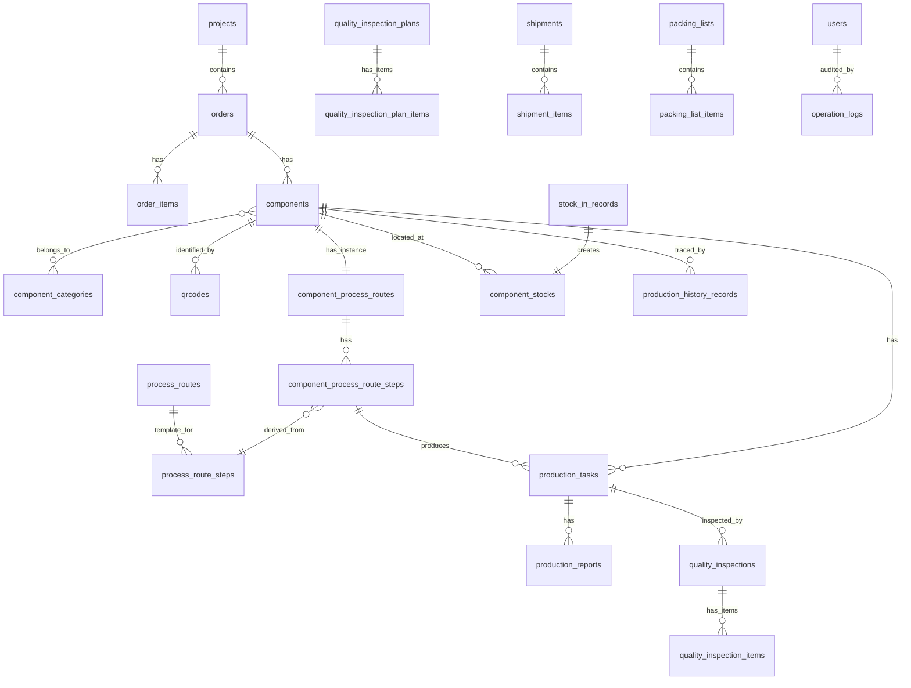

# MES 第2阶段数据库详细设计方案 V1.1

> 项目：钢结构出口加工厂 MES
> 数据库：PostgreSQL 16
> 开发库：jiangxing_mes
> 文档版本：V1.1（基于 V1.0 评审意见修订）
> 编写者：孙麦 / MES 项目开发工程师（AI）
> 状态：**待第二轮评审**（未执行任何 SQL，未创建业务表，未生成 Alembic migration）

---

## 目录

1. 设计总则
2. 数据库总体架构
3. 命名规范
4. 通用字段规范（按表类型分级）
5. 数据类型规范
6. 状态字段与状态流转规则（完整分支版）
7. 核心业务主线与实体关系图
8. 模块划分与表清单
9. 表结构详细设计
10. 索引设计策略
11. 约束设计策略
12. 二维码与构件关系设计
13. 生产履历贯穿机制设计
14. ERP / MES 接口预留字段
15. 数据库初始化 SQL（设计稿，不执行）
16. 自检报告
17. V1.0 → V1.1 修改说明

---

## 1. 设计总则

### 1.1 设计核心原则

| 原则 | 说明 |
|------|------|
| 构件为核心 | 所有业务数据最终都关联到「构件 (component)」 |
| 二维码为入口 | 车间操作通过扫码定位构件、工序、任务 |
| 生产履历为主线 | 全生命周期数据可追溯 |
| 数据完整性优先 | 主外键关系、唯一性、状态一致性 |
| 单一事实来源 | 每个业务事实只在一个地方表达，避免重复 |
| 可追溯性 | 关键操作记录操作人、时间、前后状态 |
| 软删除分级 | 业务表软删除，不可变表禁止修改 |
| 扩展能力 | 预留 ERP 接口字段、扩展字段 |

### 1.2 业务约束

- PostgreSQL 16 是正式数据库
- 字符集 UTF8，时区 Asia/Shanghai
- 不直接修改生产数据库结构，所有变更通过 Alembic migration 管理
- 当前阶段仅设计，不执行 SQL，不创建业务表，不生成 Alembic migration

---

## 2. 数据库总体架构

### 2.1 Schema 划分

| Schema | 用途 | 当前阶段 |
|--------|------|----------|
| public | 所有业务表 | v1 默认使用 |
| audit | 操作审计日志（可选） | 预留 |
| meta | 系统元数据 | 预留 |

> 决策：v1 阶段统一使用 `public` schema。

### 2.2 模块依赖关系

```
系统与权限模块 (users/roles/permissions)
        ↑ 被所有模块引用（created_by/updated_by）
组织与人员模块 (departments/workers/work_centers/equipment)
        ↑
项目与订单模块 (projects/orders/order_items)
        ↓
构件与图纸模块 (component_categories/components/drawings)
   ← 二维码模块 (qrcodes/scan_logs)
   ← 工艺路线模块（模板: process_routes/steps, 实例: component_process_routes/steps）
        ↓
生产模块 (production_orders/tasks/reports)
   ← 质量模块 (inspection_plans/plan_items/inspections/inspection_items/defects/ncr)
   ← 仓储模块 (warehouses/locations/component_stocks/stock_in/stock_out)
   ← 发运模块 (shipments/shipment_items/packing_lists/packing_list_items)
        ↓
生产履历模块 (production_history_records) - 不可变，与业务同事务
        ↓
系统支撑模块 (operation_logs/system_configs/attachments/dictionaries/dictionary_items) - 独立审计
```

依赖方向：上层依赖下层，不允许循环依赖。

---

## 3. 命名规范

### 3.1 表命名

| 规则 | 示例 |
|------|------|
| 全小写 snake_case | `production_tasks` |
| 表名用复数 | `components`、`orders` |
| 关联表用两实体单数 + `_` 连接 | `user_roles` |
| 不使用 SQL 关键字 | 避开 `order` 用 `orders` |

### 3.2 字段命名

| 规则 | 示例 |
|------|------|
| 全小写 snake_case | `created_at`、`project_id` |
| 主键统一为 `id` | `id` |
| 外键为 `{表单数}_id` | `component_id`、`order_id` |
| 布尔字段以 `is_` / `has_` 开头 | `is_active` |
| 时间字段以 `_at` 结尾 | `created_at`、`completed_at` |
| 操作人以 `_by` 结尾 | `created_by`、`inspected_by` |
| 状态字段为 `status` 或 `{模块}_status` | `status`、`inspection_status` |
| 枚举值用小写下划线 | `in_progress`、`pending` |

### 3.3 约束命名

| 类型 | 规则 | 示例 |
|------|------|------|
| 主键 | `pk_{table}` | `pk_components` |
| 外键 | `fk_{table}_{referenced_table}` | `fk_components_projects` |
| 唯一约束 | `uq_{table}_{columns}` | `uq_components_project_component_no` |
| 检查约束 | `ck_{table}_{rule}` | `ck_components_status` |
| 索引 | `idx_{table}_{columns}` | `idx_components_project_id` |
| 部分唯一索引 | `uq_{table}_{columns}_active` | `uq_qrcodes_component_active` |

### 3.4 序列命名

- 使用 `GENERATED ALWAYS AS IDENTITY`，不显式创建 SEQUENCE。

---

## 4. 通用字段规范（按表类型分级）

> V1.1 重大修改：不再机械要求所有表都有全部通用字段。按表类型分级。

### 4.1 表类型划分

| 类型 | 说明 | 示例 |
|------|------|------|
| A. 普通业务表 | 可增删改查，需审计与软删除 | components, orders, projects, users, shipments |
| B. 配置/字典表 | 低频修改，需审计，可选软删除 | system_configs, dictionaries, roles, permissions, work_centers, warehouses |
| C. 不可变日志/履历表 | 只允许 INSERT，禁止 UPDATE/DELETE | production_history_records, operation_logs, qrcode_scan_logs |
| D. 关联表 | 纯多对多关联 | user_roles, role_permissions |

### 4.2 A 类（普通业务表）通用字段

| 字段 | 类型 | NULL | 默认 | 说明 |
|------|------|------|------|------|
| id | BIGINT | NOT NULL | IDENTITY | 主键 |
| created_at | TIMESTAMPTZ | NOT NULL | NOW() | 创建时间 |
| updated_at | TIMESTAMPTZ | NOT NULL | NOW() | 更新时间，trigger 自动维护 |
| created_by | BIGINT | NULL | NULL | 创建人（FK→users.id，系统操作可为 NULL） |
| updated_by | BIGINT | NULL | NULL | 更新人 |
| deleted_at | TIMESTAMPTZ | NULL | NULL | 软删除时间 |
| remark | TEXT | NULL | NULL | 备注 |
| version | INTEGER | NOT NULL | 1 | 乐观锁（仅关键表） |

### 4.3 B 类（配置/字典表）通用字段

| 字段 | 类型 | NULL | 默认 | 说明 |
|------|------|------|------|------|
| id | BIGINT | NOT NULL | IDENTITY | 主键 |
| created_at | TIMESTAMPTZ | NOT NULL | NOW() | 创建时间 |
| updated_at | TIMESTAMPTZ | NOT NULL | NOW() | 更新时间 |
| created_by | BIGINT | NULL | NULL | 创建人 |
| updated_by | BIGINT | NULL | NULL | 更新人 |
| is_active | BOOLEAN | NOT NULL | TRUE | 启用标志（代替软删除） |

> 说明：配置表通过 `is_active = FALSE` 停用，不使用 deleted_at 软删除。

### 4.4 C 类（不可变日志/履历表）通用字段

| 字段 | 类型 | NULL | 默认 | 说明 |
|------|------|------|------|------|
| id | BIGINT | NOT NULL | IDENTITY | 主键 |
| occurred_at | TIMESTAMPTZ | NOT NULL | NOW() | 事件发生时间（业务时间） |
| operator_id | BIGINT | NULL | NULL | 操作人（FK→users.id） |

> **关键约束**：
> - **不包含 updated_at / updated_by / deleted_at**
> - **禁止 UPDATE 与 DELETE**（通过 trigger 强制）
> - **不包含 version 字段**

### 4.5 D 类（关联表）通用字段

| 字段 | 类型 | NULL | 默认 | 说明 |
|------|------|------|------|------|
| created_at | TIMESTAMPTZ | NOT NULL | NOW() | 创建时间 |
| created_by | BIGINT | NULL | NULL | 创建人 |

> 关联表只需创建时间与人，不需要更新/软删除（解除关联即 DELETE 行）。

### 4.6 updated_at 自动更新 trigger（A/B 类表）

```sql
CREATE OR REPLACE FUNCTION set_updated_at()
RETURNS TRIGGER AS $$
BEGIN
    NEW.updated_at = NOW();
    RETURN NEW;
END;
$$ LANGUAGE plpgsql;
```

### 4.7 不可变表保护 trigger（C 类表）

```sql
CREATE OR REPLACE FUNCTION prevent_immutable_modify()
RETURNS TRIGGER AS $$
BEGIN
    RAISE EXCEPTION 'Table % is immutable: UPDATE/DELETE not allowed', TG_TABLE_NAME;
END;
$$ LANGUAGE plpgsql;
```

对每张 C 类表：
```sql
CREATE TRIGGER trg_prevent_{table}_modify
    BEFORE UPDATE OR DELETE ON {table}
    FOR EACH ROW EXECUTE FUNCTION prevent_immutable_modify();
```

---

## 5. 数据类型规范

| 业务含义 | PostgreSQL 类型 | 说明 |
|------|------|------|
| 主键/外键 | BIGINT | 性能与扩展性 |
| 短编码 | VARCHAR(32) | 项目编号、订单号、构件号 |
| 长编码 | VARCHAR(64) | 二维码值、UUID |
| 名称 | VARCHAR(200) | 项目名、构件名 |
| 文本描述 | TEXT | 备注、说明 |
| 状态枚举 | VARCHAR(20) + CHECK | 字符串可读性强 |
| 数量 | INTEGER | 构件数量、报工数量 |
| 重量 | NUMERIC(12,3) | 重量，单位 kg |
| 尺寸 | NUMERIC(10,2) | 长度/宽度/厚度，单位 mm |
| 金额 | NUMERIC(14,2) | 单价、总价 |
| 时间戳 | TIMESTAMPTZ | 全部带时区 |
| 布尔 | BOOLEAN | 标志位 |
| JSON 配置 | JSONB | 扩展属性 |

---

## 6. 状态字段与状态流转规则（完整分支版）

> V1.1 重大修改：状态机完善暂停/取消/返工/复检/重新激活等实际业务分支。

### 6.1 项目状态 (projects.status)

```
planning(规划中)
  ↓
confirmed(已确认)
  ↓
in_progress(进行中) ⇄ on_hold(已暂停)
  ↓
completed(已完成)
  ↓
closed(已关闭) [终态]

任意非终态 → cancelled(已取消) [终态]
任意非终态 → on_hold(已暂停) → 回到原状态
```

CHECK 允许值：`planning, confirmed, in_progress, on_hold, completed, closed, cancelled`

### 6.2 订单状态 (orders.status)

```
draft(草稿)
  ↓
confirmed(已确认)
  ↓
in_production(生产中) ⇄ on_hold(已暂停)
  ↓
completed(已完成)
  ↓
closed(已关闭) [终态]

任意非终态 → cancelled(已取消) [终态]
任意非终态 → on_hold(已暂停) → 回到原状态
```

CHECK 允许值：`draft, confirmed, in_production, on_hold, completed, closed, cancelled`

### 6.3 构件状态 (components.status)

```
draft(草稿)
  ↓
released(已下发)
  ↓
in_production(生产中) ⇄ on_hold(已暂停)
  ↓
in_inspection(质检中)
  ↓ ┌──────────────┐
passed(质检合格)   failed(质检不合格)
  │                │
  ↓                ↓
in_stock(已入库)  rework(返修中) → in_production(回到生产)
  ↓                │
shipped(已发运)    ↓
  ↓            re_inspection(复检中) → passed/failed
completed(已完成) [终态]

任意非终态 → scrapped(已报废) [终态]
任意非终态 → on_hold(已暂停) → 回到原状态
```

CHECK 允许值：`draft, released, in_production, on_hold, in_inspection, passed, failed, rework, re_inspection, in_stock, shipped, completed, scrapped`

### 6.4 生产任务状态 (production_tasks.status)

> V1.1 重大修改：支持返工与再次执行。增加 attempt_no（执行次数）字段区分首次与返工任务。

```
pending(待分配)
  ↓
assigned(已分配)
  ↓
in_progress(进行中) ⇄ paused(已暂停)
  ↓
completed(已完成)

completed → rework_requested(返工请求) → pending(重新待分配，新 attempt_no)
任意非终态 → cancelled(已取消) [终态]
```

CHECK 允许值：`pending, assigned, in_progress, paused, completed, rework_requested, cancelled`

### 6.5 质检状态 (quality_inspections.inspection_status)

> V1.1 重大修改：不再使用 pending → passed → failed → rework 顺序流。
> 质检结果为：待检 → 检验中 → 合格/不合格 → 不合格后进入返工/复检。

```
pending(待检)
  ↓
inspecting(检验中)
  ↓ ┌──────────────┐
passed(合格) [终态]  failed(不合格)
                     │
                     ↓
                 rework(返工中) → re_inspection(复检中) → passed(复检合格) [终态]
                                                                  ↓
                                                              failed(复检不合格) [终态]
```

CHECK 允许值：`pending, inspecting, passed, failed, rework, re_inspection`

### 6.6 二维码状态 (qrcodes.status)

> V1.1 重大修改：明确主码/历史码/补码关系。

```
unused(未使用)
  ↓
active(已激活，当前主码)
  ↓
disabled(已停用，成为历史码) → 可重新激活为 active
  ↓
voided(已作废) [终态]

active → voided (构件销毁，直接作废)
```

CHECK 允许值：`unused, active, disabled, voided`

**约束**：同一时间同一构件只能有一个 `active` 状态的主码（通过部分唯一索引保证，见第 12 节）。

### 6.7 入库状态 (stock_in_records.status)

```
pending(待入库)
  ↓
completed(已入库) [终态]
  ↓
cancelled(已取消) [终态]

任意非终态 → cancelled(已取消) [终态]
```

CHECK 允许值：`pending, completed, cancelled`

### 6.8 发运状态 (shipments.status)

```
planning(计划中)
  ↓
confirmed(已确认)
  ↓
loading(装车中) ⇄ on_hold(已暂停)
  ↓
shipped(已发运)
  ↓
delivered(已送达) [终态]

任意非终态 → cancelled(已取消) [终态]
任意非终态 → on_hold(已暂停) → 回到原状态
```

CHECK 允许值：`planning, confirmed, loading, on_hold, shipped, delivered, cancelled`

### 6.9 NCR 状态 (nonconformance_reports.status)

```
open(已创建)
  ↓
in_review(评审中)
  ↓
approved(已批准处理意见)
  ↓
in_rework(返工执行中)
  ↓
closed(已关闭) [终态]

任意非终态 → rejected(已驳回) [终态]
```

CHECK 允许值：`open, in_review, approved, in_rework, closed, rejected`

---

## 7. 核心业务主线与实体关系图

### 7.1 业务主线

```
项目 project
  ↓ 1:N
订单 order
  ↓ 1:N
订单明细 order_item
  ↓ 1:N
构件 component  ←─── 二维码 qrcode (1 主码 + N 历史码)
  ↓ 1:1
构件工艺路线实例 component_process_route
  ↓ 1:N
构件工艺步骤实例 component_process_route_step
  ↓ 1:N
生产任务 production_task (含 attempt_no 支持返工)
  ↓ 1:N
生产报工 production_report
  ↓ 1:N
质检 quality_inspection → 质检明细 quality_inspection_item
  ↓ (合格后)
入库 stock_in_record → 构件库存 component_stock (构件实体/位置)
  ↓ (发运)
发运明细 shipment_item → 装箱明细 packing_list_item
  ↓ (汇总，同事务写入)
生产履历 production_history_record (不可变)
```

### 7.2 ER 关系图（Mermaid）



---

## 8. 模块划分与表清单

### 8.1 系统与权限模块（B 类）

| 表名 | 类型 | 说明 |
|------|------|------|
| users | A | 系统用户 |
| roles | B | 角色 |
| permissions | B | 权限点 |
| user_roles | D | 用户-角色关联 |
| role_permissions | D | 角色-权限关联 |

### 8.2 组织与人员模块

| 表名 | 类型 | 说明 |
|------|------|------|
| departments | A | 部门 |
| workers | A | 车间工人 |
| work_centers | B | 工作中心 |
| equipment | A | 设备 |

### 8.3 项目与订单模块

| 表名 | 类型 | 说明 |
|------|------|------|
| projects | A | 项目 |
| orders | A | 订单 |
| order_items | A | 订单明细行 |

### 8.4 构件与图纸模块

| 表名 | 类型 | 说明 |
|------|------|------|
| component_categories | B | 构件类别 |
| components | A | 构件主表（核心） |
| component_specifications | A | 构件规格参数 |
| drawings | A | 图纸 |

### 8.5 二维码模块

| 表名 | 类型 | 说明 |
|------|------|------|
| qrcodes | A | 二维码（主码 + 历史码） |
| qrcode_scan_logs | C | 扫码日志（不可变） |

### 8.6 工艺与工序模块

| 表名 | 类型 | 说明 |
|------|------|------|
| process_definitions | B | 工序定义 |
| process_routes | B | 工艺路线模板 |
| process_route_steps | B | 模板步骤 |
| component_process_routes | A | 构件工艺路线实例 |
| component_process_route_steps | A | 构件工艺步骤实例（V1.1 新增） |

### 8.7 生产任务与报工模块

| 表名 | 类型 | 说明 |
|------|------|------|
| production_orders | A | 生产工单 |
| production_tasks | A | 生产任务（含 attempt_no） |
| production_reports | C | 报工记录（不可变） |

### 8.8 质量管理模块

| 表名 | 类型 | 说明 |
|------|------|------|
| quality_inspection_plans | B | 质检计划 |
| quality_inspection_plan_items | B | 质检计划检验项（V1.1 新增） |
| quality_inspections | A | 质检记录 |
| quality_inspection_items | A | 质检明细项（V1.1 新增） |
| quality_defects | A | 不合格缺陷 |
| nonconformance_reports | A | NCR 不合格品处理单 |

### 8.9 仓储与入库模块

| 表名 | 类型 | 说明 |
|------|------|------|
| warehouses | B | 仓库 |
| locations | B | 库位 |
| component_stocks | A | 构件库存（实体/位置，V1.1 重构） |
| stock_in_records | A | 入库记录 |
| stock_out_records | A | 出库记录 |
| stock_transfer_records | A | 库位转移记录（V1.1 新增） |

### 8.10 发运与装箱模块

| 表名 | 类型 | 说明 |
|------|------|------|
| shipments | A | 发运单 |
| shipment_items | A | 发运明细（发运单↔构件） |
| packing_lists | A | 装箱单 |
| packing_list_items | A | 装箱明细（装箱单↔构件） |

### 8.11 生产履历模块

| 表名 | 类型 | 说明 |
|------|------|------|
| production_history_records | C | 生产履历（不可变，与业务同事务） |

### 8.12 系统支撑模块

| 表名 | 类型 | 说明 |
|------|------|------|
| operation_logs | C | 操作审计日志（不可变） |
| system_configs | B | 系统配置 |
| attachments | A | 附件元数据 |
| dictionaries | B | 数据字典 |
| dictionary_items | B | 字典项 |

**表总数：35 张**（V1.0 为 32 张，V1.1 新增 3 张：component_process_route_steps, quality_inspection_plan_items, quality_inspection_items, stock_transfer_records，去除 component_specifications 的 KV 模型... 实际净增详见修改说明）

---

## 9. 表结构详细设计

> 以下所有 DDL 为**设计稿**，本阶段不执行。
> 字段顺序：业务字段 → 类型对应通用字段

### 9.1 系统与权限模块

#### 9.1.1 users（A 类）

| 字段 | 类型 | NULL | 默认 | 约束 | 说明 |
|------|------|------|------|------|------|
| id | BIGINT | NOT NULL | IDENTITY | PK | 用户 ID |
| username | VARCHAR(64) | NOT NULL | - | UNIQUE | 登录名 |
| password_hash | VARCHAR(255) | NOT NULL | - | - | 哈希密码（bcrypt） |
| real_name | VARCHAR(64) | NOT NULL | - | - | 真实姓名 |
| email | VARCHAR(128) | NULL | - | - | 邮箱 |
| phone | VARCHAR(32) | NULL | - | - | 手机 |
| department_id | BIGINT | NULL | - | FK→departments.id | 部门 |
| is_active | BOOLEAN | NOT NULL | TRUE | - | 是否启用 |
| last_login_at | TIMESTAMPTZ | NULL | - | - | 最后登录时间 |
| created_at | TIMESTAMPTZ | NOT NULL | NOW() | - | |
| updated_at | TIMESTAMPTZ | NOT NULL | NOW() | - | |
| created_by | BIGINT | NULL | - | FK→users.id | |
| updated_by | BIGINT | NULL | - | FK→users.id | |
| deleted_at | TIMESTAMPTZ | NULL | - | - | 软删除 |
| remark | TEXT | NULL | - | - | |
| version | INTEGER | NOT NULL | 1 | - | 乐观锁 |

索引：`idx_users_department_id`、`idx_users_is_active`
唯一：`uq_users_username`

#### 9.1.2 roles（B 类）

| 字段 | 类型 | NULL | 默认 | 约束 | 说明 |
|------|------|------|------|------|------|
| id | BIGINT | NOT NULL | IDENTITY | PK | 角色 ID |
| code | VARCHAR(64) | NOT NULL | - | UNIQUE | 角色编码 |
| name | VARCHAR(64) | NOT NULL | - | - | 角色名称 |
| description | TEXT | NULL | - | - | 描述 |
| is_system | BOOLEAN | NOT NULL | FALSE | - | 系统内置 |
| is_active | BOOLEAN | NOT NULL | TRUE | - | 启用 |
| created_at | TIMESTAMPTZ | NOT NULL | NOW() | - | |
| updated_at | TIMESTAMPTZ | NOT NULL | NOW() | - | |
| created_by | BIGINT | NULL | - | FK→users.id | |
| updated_by | BIGINT | NULL | - | FK→users.id | |

#### 9.1.3 permissions（B 类）

| 字段 | 类型 | NULL | 默认 | 约束 | 说明 |
|------|------|------|------|------|------|
| id | BIGINT | NOT NULL | IDENTITY | PK | 权限 ID |
| code | VARCHAR(128) | NOT NULL | - | UNIQUE | 权限点 |
| name | VARCHAR(128) | NOT NULL | - | - | 权限名称 |
| module | VARCHAR(64) | NOT NULL | - | - | 所属模块 |
| description | TEXT | NULL | - | - | 描述 |
| is_active | BOOLEAN | NOT NULL | TRUE | - | 启用 |
| created_at | TIMESTAMPTZ | NOT NULL | NOW() | - | |
| updated_at | TIMESTAMPTZ | NOT NULL | NOW() | - | |
| created_by | BIGINT | NULL | - | FK→users.id | |
| updated_by | BIGINT | NULL | - | FK→users.id | |

#### 9.1.4 user_roles（D 类）

| 字段 | 类型 | NULL | 默认 | 约束 | 说明 |
|------|------|------|------|------|------|
| user_id | BIGINT | NOT NULL | - | FK→users.id, PK | 用户 |
| role_id | BIGINT | NOT NULL | - | FK→roles.id, PK | 角色 |
| created_at | TIMESTAMPTZ | NOT NULL | NOW() | - | |
| created_by | BIGINT | NULL | - | FK→users.id | |

PK：(user_id, role_id)

#### 9.1.5 role_permissions（D 类）

| 字段 | 类型 | NULL | 默认 | 约束 | 说明 |
|------|------|------|------|------|------|
| role_id | BIGINT | NOT NULL | - | FK→roles.id, PK | 角色 |
| permission_id | BIGINT | NOT NULL | - | FK→permissions.id, PK | 权限 |
| created_at | TIMESTAMPTZ | NOT NULL | NOW() | - | |
| created_by | BIGINT | NULL | - | FK→users.id | |

PK：(role_id, permission_id)

### 9.2 组织与人员模块

#### 9.2.1 departments（A 类）

| 字段 | 类型 | NULL | 默认 | 约束 | 说明 |
|------|------|------|------|------|------|
| id | BIGINT | NOT NULL | IDENTITY | PK | 部门 ID |
| code | VARCHAR(64) | NOT NULL | - | UNIQUE | 部门编码 |
| name | VARCHAR(128) | NOT NULL | - | - | 部门名称 |
| parent_id | BIGINT | NULL | - | FK→departments.id | 上级部门 |
| path | VARCHAR(512) | NULL | - | - | 层级路径 |
| is_active | BOOLEAN | NOT NULL | TRUE | - | 启用 |
| created_at | TIMESTAMPTZ | NOT NULL | NOW() | - | |
| updated_at | TIMESTAMPTZ | NOT NULL | NOW() | - | |
| created_by | BIGINT | NULL | - | FK→users.id | |
| updated_by | BIGINT | NULL | - | FK→users.id | |
| deleted_at | TIMESTAMPTZ | NULL | - | - | 软删除 |
| remark | TEXT | NULL | - | - | |

索引：`idx_departments_parent_id`、`idx_departments_path`

#### 9.2.2 workers（A 类）

| 字段 | 类型 | NULL | 默认 | 约束 | 说明 |
|------|------|------|------|------|------|
| id | BIGINT | NOT NULL | IDENTITY | PK | 工人 ID |
| user_id | BIGINT | NULL | - | FK→users.id, UNIQUE | 关联用户 |
| worker_no | VARCHAR(32) | NOT NULL | - | UNIQUE | 工号 |
| work_center_id | BIGINT | NULL | - | FK→work_centers.id | 所属工位 |
| skill_level | VARCHAR(20) | NULL | - | - | 技能等级 |
| is_active | BOOLEAN | NOT NULL | TRUE | - | 启用 |
| created_at | TIMESTAMPTZ | NOT NULL | NOW() | - | |
| updated_at | TIMESTAMPTZ | NOT NULL | NOW() | - | |
| created_by | BIGINT | NULL | - | FK→users.id | |
| updated_by | BIGINT | NULL | - | FK→users.id | |
| deleted_at | TIMESTAMPTZ | NULL | - | - | 软删除 |
| remark | TEXT | NULL | - | - | |

#### 9.2.3 work_centers（B 类）

| 字段 | 类型 | NULL | 默认 | 约束 | 说明 |
|------|------|------|------|------|------|
| id | BIGINT | NOT NULL | IDENTITY | PK | 工作中心 ID |
| code | VARCHAR(64) | NOT NULL | - | UNIQUE | 编码 |
| name | VARCHAR(128) | NOT NULL | - | - | 名称 |
| workshop | VARCHAR(64) | NULL | - | - | 车间 |
| type | VARCHAR(20) | NOT NULL | - | CHECK IN (...) | 类型 |
| is_active | BOOLEAN | NOT NULL | TRUE | - | 启用 |
| created_at | TIMESTAMPTZ | NOT NULL | NOW() | - | |
| updated_at | TIMESTAMPTZ | NOT NULL | NOW() | - | |
| created_by | BIGINT | NULL | - | FK→users.id | |
| updated_by | BIGINT | NULL | - | FK→users.id | |

CHECK：`type IN ('cutting','assembly','welding','grinding','painting','packaging','inspection','warehouse','other')`

#### 9.2.4 equipment（A 类）

| 字段 | 类型 | NULL | 默认 | 约束 | 说明 |
|------|------|------|------|------|------|
| id | BIGINT | NOT NULL | IDENTITY | PK | 设备 ID |
| code | VARCHAR(64) | NOT NULL | - | UNIQUE | 设备编码 |
| name | VARCHAR(128) | NOT NULL | - | - | 名称 |
| work_center_id | BIGINT | NULL | - | FK→work_centers.id | 所属工位 |
| status | VARCHAR(20) | NOT NULL | 'idle' | CHECK | idle/running/maintenance/broken |
| created_at | TIMESTAMPTZ | NOT NULL | NOW() | - | |
| updated_at | TIMESTAMPTZ | NOT NULL | NOW() | - | |
| created_by | BIGINT | NULL | - | FK→users.id | |
| updated_by | BIGINT | NULL | - | FK→users.id | |
| deleted_at | TIMESTAMPTZ | NULL | - | - | 软删除 |
| remark | TEXT | NULL | - | - | |

### 9.3 项目与订单模块

#### 9.3.1 projects（A 类）

| 字段 | 类型 | NULL | 默认 | 约束 | 说明 |
|------|------|------|------|------|------|
| id | BIGINT | NOT NULL | IDENTITY | PK | 项目 ID |
| code | VARCHAR(32) | NOT NULL | - | UNIQUE | 项目编号 |
| name | VARCHAR(200) | NOT NULL | - | - | 项目名称 |
| client | VARCHAR(128) | NULL | - | - | 客户 |
| destination | VARCHAR(128) | NULL | - | - | 出口目的地 |
| status | VARCHAR(20) | NOT NULL | 'planning' | CHECK | 见 6.1 |
| planned_start_date | DATE | NULL | - | - | 计划开始 |
| planned_end_date | DATE | NULL | - | - | 计划结束 |
| actual_start_date | DATE | NULL | - | - | 实际开始 |
| actual_end_date | DATE | NULL | - | - | 实际结束 |
| erp_code | VARCHAR(64) | NULL | - | - | ERP 项目编码 |
| erp_synced_at | TIMESTAMPTZ | NULL | - | - | ERP 同步时间 |
| erp_sync_status | VARCHAR(20) | NOT NULL | 'pending' | CHECK | pending/syncing/synced/failed |
| erp_extra | JSONB | NULL | - | - | ERP 扩展字段 |
| created_at | TIMESTAMPTZ | NOT NULL | NOW() | - | |
| updated_at | TIMESTAMPTZ | NOT NULL | NOW() | - | |
| created_by | BIGINT | NULL | - | FK→users.id | |
| updated_by | BIGINT | NULL | - | FK→users.id | |
| deleted_at | TIMESTAMPTZ | NULL | - | - | 软删除 |
| remark | TEXT | NULL | - | - | |
| version | INTEGER | NOT NULL | 1 | - | 乐观锁 |

CHECK：
- `status IN ('planning','confirmed','in_progress','on_hold','completed','closed','cancelled')`
- `erp_sync_status IN ('pending','syncing','synced','failed')`
- `planned_end_date IS NULL OR planned_start_date IS NULL OR planned_end_date >= planned_start_date`
- `actual_end_date IS NULL OR actual_start_date IS NULL OR actual_end_date >= actual_start_date`

索引：`idx_projects_status`、`idx_projects_client`

#### 9.3.2 orders（A 类）

| 字段 | 类型 | NULL | 默认 | 约束 | 说明 |
|------|------|------|------|------|------|
| id | BIGINT | NOT NULL | IDENTITY | PK | 订单 ID |
| project_id | BIGINT | NOT NULL | - | FK→projects.id | 项目 |
| order_no | VARCHAR(32) | NOT NULL | - | UNIQUE | 订单号 |
| order_type | VARCHAR(20) | NOT NULL | - | CHECK | production/rework/sample |
| status | VARCHAR(20) | NOT NULL | 'draft' | CHECK | 见 6.2 |
| planned_quantity | INTEGER | NULL | - | CHECK ≥ 0 | 计划数量 |
| actual_quantity | INTEGER | NULL | - | CHECK ≥ 0 | 实际数量 |
| planned_delivery_date | DATE | NULL | - | - | 计划交货 |
| actual_delivery_date | DATE | NULL | - | - | 实际交货 |
| erp_code | VARCHAR(64) | NULL | - | - | ERP 订单号 |
| erp_synced_at | TIMESTAMPTZ | NULL | - | - | |
| erp_sync_status | VARCHAR(20) | NOT NULL | 'pending' | CHECK | |
| erp_extra | JSONB | NULL | - | - | |
| created_at | TIMESTAMPTZ | NOT NULL | NOW() | - | |
| updated_at | TIMESTAMPTZ | NOT NULL | NOW() | - | |
| created_by | BIGINT | NULL | - | FK→users.id | |
| updated_by | BIGINT | NULL | - | FK→users.id | |
| deleted_at | TIMESTAMPTZ | NULL | - | - | 软删除 |
| remark | TEXT | NULL | - | - | |
| version | INTEGER | NOT NULL | 1 | - | 乐观锁 |

CHECK：
- `order_type IN ('production','rework','sample')`
- `status IN ('draft','confirmed','in_production','on_hold','completed','closed','cancelled')`
- `planned_quantity IS NULL OR planned_quantity >= 0`
- `actual_quantity IS NULL OR actual_quantity >= 0`
- `actual_delivery_date IS NULL OR planned_delivery_date IS NULL OR actual_delivery_date >= planned_delivery_date`

索引：`idx_orders_project_id`、`idx_orders_status`

#### 9.3.3 order_items（A 类）

| 字段 | 类型 | NULL | 默认 | 约束 | 说明 |
|------|------|------|------|------|------|
| id | BIGINT | NOT NULL | IDENTITY | PK | 明细 ID |
| order_id | BIGINT | NOT NULL | - | FK→orders.id | 订单 |
| line_no | VARCHAR(16) | NOT NULL | - | - | 行号 |
| category_id | BIGINT | NULL | - | FK→component_categories.id | 构件类别 |
| planned_quantity | INTEGER | NOT NULL | - | CHECK ≥ 0 | 计划数量 |
| description | TEXT | NULL | - | - | 描述 |
| created_at | TIMESTAMPTZ | NOT NULL | NOW() | - | |
| updated_at | TIMESTAMPTZ | NOT NULL | NOW() | - | |
| created_by | BIGINT | NULL | - | FK→users.id | |
| updated_by | BIGINT | NULL | - | FK→users.id | |
| deleted_at | TIMESTAMPTZ | NULL | - | - | 软删除 |

唯一：`uq_order_items_order_line` (order_id, line_no)
索引：`idx_order_items_order_id`

### 9.4 构件与图纸模块

#### 9.4.1 component_categories（B 类）

| 字段 | 类型 | NULL | 默认 | 约束 | 说明 |
|------|------|------|------|------|------|
| id | BIGINT | NOT NULL | IDENTITY | PK | 类别 ID |
| code | VARCHAR(32) | NOT NULL | - | UNIQUE | 类别编码 |
| name | VARCHAR(128) | NOT NULL | - | - | 类别名称 |
| parent_id | BIGINT | NULL | - | FK→component_categories.id | 父类别 |
| path | VARCHAR(512) | NULL | - | - | 层级路径 |
| is_active | BOOLEAN | NOT NULL | TRUE | - | 启用 |
| created_at | TIMESTAMPTZ | NOT NULL | NOW() | - | |
| updated_at | TIMESTAMPTZ | NOT NULL | NOW() | - | |
| created_by | BIGINT | NULL | - | FK→users.id | |
| updated_by | BIGINT | NULL | - | FK→users.id | |

#### 9.4.2 components（核心表，A 类）

> V1.1 重大修改：
> 1. component_no 改为 UNIQUE(project_id, component_no)
> 2. 去除 order_id 和 order_item_id（避免重复事实，通过 production_orders 反查订单）
> 3. 去除 process_route_id（工艺路线通过 component_process_routes 实例表管理）
> 4. 去除 current_process_id（当前工序通过查询 production_tasks 状态推导）

| 字段 | 类型 | NULL | 默认 | 约束 | 说明 |
|------|------|------|------|------|------|
| id | BIGINT | NOT NULL | IDENTITY | PK | 构件 ID |
| project_id | BIGINT | NOT NULL | - | FK→projects.id | 项目（直接关系） |
| component_no | VARCHAR(32) | NOT NULL | - | - | 构件业务编号（项目内唯一） |
| category_id | BIGINT | NULL | - | FK→component_categories.id | 类别 |
| drawing_no | VARCHAR(64) | NULL | - | - | 图纸号（冗余，便于查询） |
| name | VARCHAR(200) | NOT NULL | - | - | 构件名称 |
| material | VARCHAR(64) | NULL | - | - | 材质 |
| weight_kg | NUMERIC(12,3) | NULL | - | CHECK ≥ 0 | 重量 |
| length_mm | NUMERIC(10,2) | NULL | - | CHECK ≥ 0 | 长度 |
| width_mm | NUMERIC(10,2) | NULL | - | CHECK ≥ 0 | 宽度 |
| thickness_mm | NUMERIC(10,2) | NULL | - | CHECK ≥ 0 | 厚度 |
| surface_area_m2 | NUMERIC(10,2) | NULL | - | CHECK ≥ 0 | 表面积 |
| status | VARCHAR(20) | NOT NULL | 'draft' | CHECK | 见 6.3 |
| planned_start_date | DATE | NULL | - | - | 计划开工 |
| planned_end_date | DATE | NULL | - | - | 计划完工 |
| actual_start_date | DATE | NULL | - | - | 实际开工 |
| actual_end_date | DATE | NULL | - | - | 实际完工 |
| erp_code | VARCHAR(64) | NULL | - | - | ERP 构件码 |
| erp_synced_at | TIMESTAMPTZ | NULL | - | - | |
| erp_sync_status | VARCHAR(20) | NOT NULL | 'pending' | CHECK | |
| erp_extra | JSONB | NULL | - | - | |
| created_at | TIMESTAMPTZ | NOT NULL | NOW() | - | |
| updated_at | TIMESTAMPTZ | NOT NULL | NOW() | - | |
| created_by | BIGINT | NULL | - | FK→users.id | |
| updated_by | BIGINT | NULL | - | FK→users.id | |
| deleted_at | TIMESTAMPTZ | NULL | - | - | 软删除 |
| remark | TEXT | NULL | - | - | |
| version | INTEGER | NOT NULL | 1 | - | 乐观锁 |

CHECK：
- `status IN ('draft','released','in_production','on_hold','in_inspection','passed','failed','rework','re_inspection','in_stock','shipped','completed','scrapped')`
- `weight_kg IS NULL OR weight_kg >= 0`
- `length_mm IS NULL OR length_mm >= 0`
- `width_mm IS NULL OR width_mm >= 0`
- `thickness_mm IS NULL OR thickness_mm >= 0`
- `surface_area_m2 IS NULL OR surface_area_m2 >= 0`
- `planned_end_date IS NULL OR planned_start_date IS NULL OR planned_end_date >= planned_start_date`
- `actual_end_date IS NULL OR actual_start_date IS NULL OR actual_end_date >= actual_start_date`
- `erp_sync_status IN ('pending','syncing','synced','failed')`

唯一：`uq_components_project_component_no` (project_id, component_no)
索引：
- `idx_components_project_id`
- `idx_components_status`
- `idx_components_category_id`

**订单关系说明**：构件与订单的关系通过 `production_orders` 表间接维护（production_orders.order_id → orders.id, production_tasks.component_id → components.id）。样品构件（order_type=sample）没有 production_orders，符合业务实际。

#### 9.4.3 component_specifications（A 类）

| 字段 | 类型 | NULL | 默认 | 约束 | 说明 |
|------|------|------|------|------|------|
| id | BIGINT | NOT NULL | IDENTITY | PK | 规格 ID |
| component_id | BIGINT | NOT NULL | - | FK→components.id | 构件 |
| spec_key | VARCHAR(64) | NOT NULL | - | - | 规格键 |
| spec_value | VARCHAR(255) | NULL | - | - | 规格值 |
| created_at | TIMESTAMPTZ | NOT NULL | NOW() | - | |
| updated_at | TIMESTAMPTZ | NOT NULL | NOW() | - | |
| created_by | BIGINT | NULL | - | FK→users.id | |
| updated_by | BIGINT | NULL | - | FK→users.id | |
| deleted_at | TIMESTAMPTZ | NULL | - | - | 软删除 |

唯一：`uq_component_specifications_component_key` (component_id, spec_key)

#### 9.4.4 drawings（A 类）

| 字段 | 类型 | NULL | 默认 | 约束 | 说明 |
|------|------|------|------|------|------|
| id | BIGINT | NOT NULL | IDENTITY | PK | 图纸 ID |
| component_id | BIGINT | NULL | - | FK→components.id | 构件（NULL=项目级图纸） |
| project_id | BIGINT | NULL | - | FK→projects.id | 项目（项目级图纸必填） |
| drawing_no | VARCHAR(64) | NOT NULL | - | - | 图号 |
| revision | VARCHAR(16) | NOT NULL | - | - | 版本 |
| file_path | VARCHAR(512) | NULL | - | - | 存储路径 |
| file_size | BIGINT | NULL | - | CHECK ≥ 0 | 文件大小 |
| created_at | TIMESTAMPTZ | NOT NULL | NOW() | - | |
| updated_at | TIMESTAMPTZ | NOT NULL | NOW() | - | |
| created_by | BIGINT | NULL | - | FK→users.id | |
| updated_by | BIGINT | NULL | - | FK→users.id | |
| deleted_at | TIMESTAMPTZ | NULL | - | - | 软删除 |
| remark | TEXT | NULL | - | - | |

CHECK：`(component_id IS NOT NULL OR project_id IS NOT NULL)` — 必须关联构件或项目之一
唯一：`uq_drawings_no_revision` (drawing_no, revision)
索引：`idx_drawings_component_id`、`idx_drawings_project_id`

### 9.5 二维码模块

#### 9.5.1 qrcodes（A 类）

> V1.1 重大修改：
> 1. component_id 不再 UNIQUE，允许历史码存在
> 2. 通过部分唯一索引保证同一构件同一时间只有一个 active 主码
> 3. 增加 is_primary 标记当前主码

| 字段 | 类型 | NULL | 默认 | 约束 | 说明 |
|------|------|------|------|------|------|
| id | BIGINT | NOT NULL | IDENTITY | PK | 二维码 ID |
| component_id | BIGINT | NULL | - | FK→components.id | 绑定构件 |
| code_value | VARCHAR(64) | NOT NULL | - | UNIQUE | 二维码内容 |
| code_type | VARCHAR(20) | NOT NULL | 'component' | CHECK | component/process/box |
| status | VARCHAR(20) | NOT NULL | 'unused' | CHECK | 见 6.6 |
| is_primary | BOOLEAN | NOT NULL | FALSE | - | 是否当前主码 |
| printed_at | TIMESTAMPTZ | NULL | - | - | 打印时间 |
| printed_by | BIGINT | NULL | - | FK→users.id | 打印人 |
| activated_at | TIMESTAMPTZ | NULL | - | - | 激活时间 |
| voided_at | TIMESTAMPTZ | NULL | - | - | 作废时间 |
| voided_reason | VARCHAR(128) | NULL | - | - | 作废原因 |
| created_at | TIMESTAMPTZ | NOT NULL | NOW() | - | |
| updated_at | TIMESTAMPTZ | NOT NULL | NOW() | - | |
| created_by | BIGINT | NULL | - | FK→users.id | |
| updated_by | BIGINT | NULL | - | FK→users.id | |
| deleted_at | TIMESTAMPTZ | NULL | - | - | 软删除 |
| remark | TEXT | NULL | - | - | |

CHECK：
- `status IN ('unused','active','disabled','voided')`
- `code_type IN ('component','process','box')`
- `(status = 'unused') OR (component_id IS NOT NULL)` — 已激活必须绑定构件
- `(status = 'active') = is_primary` — active 状态必须是主码（业务规则由应用层维护一致性）

**部分唯一索引**（核心约束）：
```sql
-- 同一构件同一时间只能有一个 active 主码
CREATE UNIQUE INDEX uq_qrcodes_component_active
    ON qrcodes(component_id)
    WHERE status = 'active' AND deleted_at IS NULL;
```

索引：`idx_qrcodes_component_id`、`uq_qrcodes_code_value`（UNIQUE）

**主码/历史码/补码规则**：
- 主码：`status = 'active'` 且 `is_primary = TRUE`，同一构件唯一（部分索引保证）
- 历史码：`status IN ('disabled', 'voided')`，保留供追溯，不限制数量
- 补码流程：原码 `voided` → 新码 `unused` → `active`，新码成为 `is_primary = TRUE`

#### 9.5.2 qrcode_scan_logs（C 类，不可变）

| 字段 | 类型 | NULL | 默认 | 约束 | 说明 |
|------|------|------|------|------|------|
| id | BIGINT | NOT NULL | IDENTITY | PK | 日志 ID |
| qrcode_id | BIGINT | NOT NULL | - | FK→qrcodes.id | 二维码 |
| component_id | BIGINT | NULL | - | FK→components.id | 当时关联构件 |
| operator_id | BIGINT | NULL | - | FK→users.id | 扫码人 |
| device | VARCHAR(64) | NULL | - | - | 设备标识 |
| scan_purpose | VARCHAR(20) | NULL | - | - | 用途 |
| scan_result | VARCHAR(20) | NULL | - | - | success/fail |
| error_message | TEXT | NULL | - | - | 失败原因 |
| occurred_at | TIMESTAMPTZ | NOT NULL | NOW() | - | 扫码时间 |

> C 类表：无 updated_at/deleted_at，禁止 UPDATE/DELETE。

索引：`idx_qrcode_scan_logs_qrcode_id`、`idx_qrcode_scan_logs_occurred_at`

### 9.6 工艺与工序模块

> V1.1 重大修改：明确"模板"和"构件实际工艺路线实例"的区别。
> 结构：process_routes（模板） → process_route_steps（模板步骤）
>       component_process_routes（构件实例） → component_process_route_steps（构件步骤实例） → production_tasks

#### 9.6.1 process_definitions（B 类）

| 字段 | 类型 | NULL | 默认 | 约束 | 说明 |
|------|------|------|------|------|------|
| id | BIGINT | NOT NULL | IDENTITY | PK | 工序 ID |
| code | VARCHAR(32) | NOT NULL | - | UNIQUE | 工序编码 |
| name | VARCHAR(128) | NOT NULL | - | - | 工序名称 |
| sequence | INTEGER | NOT NULL | - | - | 默认顺序 |
| work_center_type | VARCHAR(20) | NULL | - | - | 关联工作中心类型 |
| need_inspection | BOOLEAN | NOT NULL | TRUE | - | 是否需要质检 |
| description | TEXT | NULL | - | - | 描述 |
| is_active | BOOLEAN | NOT NULL | TRUE | - | 启用 |
| created_at | TIMESTAMPTZ | NOT NULL | NOW() | - | |
| updated_at | TIMESTAMPTZ | NOT NULL | NOW() | - | |
| created_by | BIGINT | NULL | - | FK→users.id | |
| updated_by | BIGINT | NULL | - | FK→users.id | |

#### 9.6.2 process_routes（B 类，模板）

| 字段 | 类型 | NULL | 默认 | 约束 | 说明 |
|------|------|------|------|------|------|
| id | BIGINT | NOT NULL | IDENTITY | PK | 路线 ID |
| code | VARCHAR(32) | NOT NULL | - | UNIQUE | 路线编码 |
| name | VARCHAR(128) | NOT NULL | - | - | 路线名称 |
| category_id | BIGINT | NULL | - | FK→component_categories.id | 适用类别 |
| is_default | BOOLEAN | NOT NULL | FALSE | - | 默认路线 |
| is_active | BOOLEAN | NOT NULL | TRUE | - | 启用 |
| created_at | TIMESTAMPTZ | NOT NULL | NOW() | - | |
| updated_at | TIMESTAMPTZ | NOT NULL | NOW() | - | |
| created_by | BIGINT | NULL | - | FK→users.id | |
| updated_by | BIGINT | NULL | - | FK→users.id | |

#### 9.6.3 process_route_steps（B 类，模板步骤）

| 字段 | 类型 | NULL | 默认 | 约束 | 说明 |
|------|------|------|------|------|------|
| id | BIGINT | NOT NULL | IDENTITY | PK | 步骤 ID |
| route_id | BIGINT | NOT NULL | - | FK→process_routes.id | 路线 |
| step_no | INTEGER | NOT NULL | - | - | 步骤序号 |
| process_id | BIGINT | NOT NULL | - | FK→process_definitions.id | 工序 |
| work_center_id | BIGINT | NULL | - | FK→work_centers.id | 默认工作中心 |
| standard_time_min | NUMERIC(8,2) | NULL | - | CHECK ≥ 0 | 标准工时 |
| need_inspection | BOOLEAN | NOT NULL | TRUE | - | 本步是否质检 |
| created_at | TIMESTAMPTZ | NOT NULL | NOW() | - | |
| updated_at | TIMESTAMPTZ | NOT NULL | NOW() | - | |
| created_by | BIGINT | NULL | - | FK→users.id | |
| updated_by | BIGINT | NULL | - | FK→users.id | |

唯一：`uq_process_route_steps_route_step` (route_id, step_no)
索引：`idx_process_route_steps_route_id`、`idx_process_route_steps_process_id`

#### 9.6.4 component_process_routes（A 类，构件实例）

| 字段 | 类型 | NULL | 默认 | 约束 | 说明 |
|------|------|------|------|------|------|
| id | BIGINT | NOT NULL | IDENTITY | PK | 实例 ID |
| component_id | BIGINT | NOT NULL | - | FK→components.id, UNIQUE | 构件（1 构件 1 实例） |
| source_route_id | BIGINT | NOT NULL | - | FK→process_routes.id | 来源模板 |
| created_at | TIMESTAMPTZ | NOT NULL | NOW() | - | |
| updated_at | TIMESTAMPTZ | NOT NULL | NOW() | - | |
| created_by | BIGINT | NULL | - | FK→users.id | |
| updated_by | BIGINT | NULL | - | FK→users.id | |
| deleted_at | TIMESTAMPTZ | NULL | - | - | 软删除 |
| remark | TEXT | NULL | - | - | |

#### 9.6.5 component_process_route_steps（A 类，构件步骤实例）【V1.1 新增】

> 新增理由：production_tasks 需要关联到构件的具体工艺步骤实例，而不是直接关联模板步骤。
> 这样可以记录构件实际工序顺序、实际工作中心、实际标准工时，且模板修改不影响已实例化的构件。

| 字段 | 类型 | NULL | 默认 | 约束 | 说明 |
|------|------|------|------|------|------|
| id | BIGINT | NOT NULL | IDENTITY | PK | 步骤实例 ID |
| component_route_id | BIGINT | NOT NULL | - | FK→component_process_routes.id | 构件路线实例 |
| step_no | INTEGER | NOT NULL | - | - | 步骤序号 |
| process_id | BIGINT | NOT NULL | - | FK→process_definitions.id | 工序 |
| work_center_id | BIGINT | NULL | - | FK→work_centers.id | 实际工作中心 |
| standard_time_min | NUMERIC(8,2) | NULL | - | CHECK ≥ 0 | 实际标准工时 |
| need_inspection | BOOLEAN | NOT NULL | TRUE | - | 本步是否质检 |
| source_step_id | BIGINT | NULL | - | FK→process_route_steps.id | 来源模板步骤 |
| created_at | TIMESTAMPTZ | NOT NULL | NOW() | - | |
| updated_at | TIMESTAMPTZ | NOT NULL | NOW() | - | |
| created_by | BIGINT | NULL | - | FK→users.id | |
| updated_by | BIGINT | NULL | - | FK→users.id | |
| deleted_at | TIMESTAMPTZ | NULL | - | - | 软删除 |

唯一：`uq_component_route_steps_route_step` (component_route_id, step_no)
索引：`idx_component_route_steps_component_route_id`、`idx_component_route_steps_process_id`

### 9.7 生产任务与报工模块

#### 9.7.1 production_orders（A 类）

| 字段 | 类型 | NULL | 默认 | 约束 | 说明 |
|------|------|------|------|------|------|
| id | BIGINT | NOT NULL | IDENTITY | PK | 工单 ID |
| order_id | BIGINT | NOT NULL | - | FK→orders.id | 订单 |
| production_order_no | VARCHAR(32) | NOT NULL | - | UNIQUE | 工单号 |
| batch_no | VARCHAR(32) | NULL | - | - | 生产批次编号 |
| planned_quantity | INTEGER | NOT NULL | - | CHECK ≥ 0 | 计划数量 |
| status | VARCHAR(20) | NOT NULL | 'pending' | CHECK | 工单状态 |
| planned_start_date | DATE | NULL | - | - | 计划开始 |
| planned_end_date | DATE | NULL | - | - | 计划结束 |
| created_at | TIMESTAMPTZ | NOT NULL | NOW() | - | |
| updated_at | TIMESTAMPTZ | NOT NULL | NOW() | - | |
| created_by | BIGINT | NULL | - | FK→users.id | |
| updated_by | BIGINT | NULL | - | FK→users.id | |
| deleted_at | TIMESTAMPTZ | NULL | - | - | 软删除 |
| remark | TEXT | NULL | - | - | |
| version | INTEGER | NOT NULL | 1 | - | 乐观锁 |

CHECK：
- `planned_quantity >= 0`
- `planned_end_date IS NULL OR planned_start_date IS NULL OR planned_end_date >= planned_start_date`
- `status IN ('pending','released','in_progress','on_hold','completed','closed','cancelled')`

索引：`idx_production_orders_order_id`、`idx_production_orders_status`、`idx_production_orders_batch_no`

**batch_no 说明**：`batch_no` 是生产批次编号，指同一工单下的一批构件生产批次。**不**代表原材料批次或发运批次。原材料批次由 ERP 管理，发运批次由 shipments 表的批次属性管理。

#### 9.7.2 production_tasks（A 类，核心表）

> V1.1 重大修改：
> 1. 增加 attempt_no 字段支持返工与再次执行
> 2. 唯一约束改为 (component_id, process_id, attempt_no)，允许同构件同工序多次执行
> 3. 关联到 component_process_route_steps（构件步骤实例）而非直接 process_id

| 字段 | 类型 | NULL | 默认 | 约束 | 说明 |
|------|------|------|------|------|------|
| id | BIGINT | NOT NULL | IDENTITY | PK | 任务 ID |
| production_order_id | BIGINT | NOT NULL | - | FK→production_orders.id | 工单 |
| component_id | BIGINT | NOT NULL | - | FK→components.id | 构件 |
| route_step_id | BIGINT | NOT NULL | - | FK→component_process_route_steps.id | 构件步骤实例 |
| process_id | BIGINT | NOT NULL | - | FK→process_definitions.id | 工序（冗余便于查询） |
| work_center_id | BIGINT | NULL | - | FK→work_centers.id | 工作中心 |
| assigned_worker_id | BIGINT | NULL | - | FK→workers.id | 分配工人 |
| task_no | VARCHAR(32) | NOT NULL | - | UNIQUE | 任务号 |
| attempt_no | INTEGER | NOT NULL | 1 | CHECK ≥ 1 | 执行次数（1=首次, 2=首次返工, ...） |
| status | VARCHAR(20) | NOT NULL | 'pending' | CHECK | 见 6.4 |
| planned_quantity | INTEGER | NOT NULL | 1 | CHECK ≥ 0 | 计划数量 |
| actual_quantity | INTEGER | NOT NULL | 0 | CHECK ≥ 0 | 实际完成数量 |
| planned_start_at | TIMESTAMPTZ | NULL | - | - | 计划开始 |
| planned_end_at | TIMESTAMPTZ | NULL | - | - | 计划结束 |
| actual_start_at | TIMESTAMPTZ | NULL | - | - | 实际开始 |
| actual_end_at | TIMESTAMPTZ | NULL | - | - | 实际结束 |
| labor_time_min | NUMERIC(8,2) | NULL | - | CHECK ≥ 0 | 工时 |
| parent_task_id | BIGINT | NULL | - | FK→production_tasks.id | 父任务（返工时指向上次任务） |
| created_at | TIMESTAMPTZ | NOT NULL | NOW() | - | |
| updated_at | TIMESTAMPTZ | NOT NULL | NOW() | - | |
| created_by | BIGINT | NULL | - | FK→users.id | |
| updated_by | BIGINT | NULL | - | FK→users.id | |
| deleted_at | TIMESTAMPTZ | NULL | - | - | 软删除 |
| remark | TEXT | NULL | - | - | |
| version | INTEGER | NOT NULL | 1 | - | 乐观锁 |

CHECK：
- `attempt_no >= 1`
- `planned_quantity >= 0`
- `actual_quantity >= 0`
- `actual_quantity <= planned_quantity`（不允许超产）
- `labor_time_min IS NULL OR labor_time_min >= 0`
- `actual_end_at IS NULL OR actual_start_at IS NULL OR actual_end_at >= actual_start_at`
- `planned_end_at IS NULL OR planned_start_at IS NULL OR planned_end_at >= planned_start_at`
- `status IN ('pending','assigned','in_progress','paused','completed','rework_requested','cancelled')`

唯一：`uq_production_tasks_comp_proc_attempt` (component_id, process_id, attempt_no)
索引：
- `idx_production_tasks_component_id`
- `idx_production_orders_id`（即 production_order_id）
- `idx_production_tasks_status`
- `idx_production_tasks_process_id`
- `idx_production_tasks_assigned_worker_id`
- `idx_production_tasks_route_step_id`
- `idx_production_tasks_parent_task_id`

**返工支持说明**：
- 首次任务 attempt_no = 1
- 返工时原任务 status → rework_requested，新建任务 attempt_no = 2, parent_task_id 指向原任务
- 同一构件同一工序可有多个 attempt_no 不同的任务，互不冲突

#### 9.7.3 production_reports（C 类，不可变）

| 字段 | 类型 | NULL | 默认 | 约束 | 说明 |
|------|------|------|------|------|------|
| id | BIGINT | NOT NULL | IDENTITY | PK | 报工 ID |
| task_id | BIGINT | NOT NULL | - | FK→production_tasks.id | 任务 |
| component_id | BIGINT | NOT NULL | - | FK→components.id | 构件 |
| worker_id | BIGINT | NOT NULL | - | FK→workers.id | 报工人 |
| report_type | VARCHAR(20) | NOT NULL | - | CHECK | start/progress/complete/rework |
| quantity | INTEGER | NOT NULL | 0 | CHECK ≥ 0 | 本次报工数量 |
| labor_time_min | NUMERIC(8,2) | NULL | - | CHECK ≥ 0 | 工时 |
| work_center_id | BIGINT | NULL | - | FK→work_centers.id | 工作中心 |
| equipment_id | BIGINT | NULL | - | FK→equipment.id | 设备 |
| location | VARCHAR(128) | NULL | - | - | 操作地点 |
| remark | TEXT | NULL | - | - | 备注 |
| occurred_at | TIMESTAMPTZ | NOT NULL | NOW() | - | 报工时间 |
| operator_id | BIGINT | NULL | - | FK→users.id | 操作人 |

> C 类表：无 updated_at/deleted_at，禁止 UPDATE/DELETE。

CHECK：
- `report_type IN ('start','progress','complete','rework')`
- `quantity >= 0`
- `labor_time_min IS NULL OR labor_time_min >= 0`

索引：`idx_production_reports_task_id`、`idx_production_reports_component_id`、`idx_production_reports_worker_id`、`idx_production_reports_occurred_at`

### 9.8 质量管理模块

#### 9.8.1 quality_inspection_plans（B 类）

| 字段 | 类型 | NULL | 默认 | 约束 | 说明 |
|------|------|------|------|------|------|
| id | BIGINT | NOT NULL | IDENTITY | PK | 计划 ID |
| process_id | BIGINT | NOT NULL | - | FK→process_definitions.id | 工序 |
| name | VARCHAR(128) | NOT NULL | - | - | 计划名称 |
| inspection_type | VARCHAR(20) | NOT NULL | - | CHECK | first/self/patrol/final |
| is_active | BOOLEAN | NOT NULL | TRUE | - | 启用 |
| created_at | TIMESTAMPTZ | NOT NULL | NOW() | - | |
| updated_at | TIMESTAMPTZ | NOT NULL | NOW() | - | |
| created_by | BIGINT | NULL | - | FK→users.id | |
| updated_by | BIGINT | NULL | - | FK→users.id | |

CHECK：`inspection_type IN ('first','self','patrol','final')`

#### 9.8.2 quality_inspection_plan_items（B 类）【V1.1 新增】

> 新增理由：一个质检计划需要包含多个检验项目，每个项目有独立的检验项、标准值、公差。
> V1.0 把这些字段塞在 quality_inspection_plans 单行中，无法表达"一项一标"关系。

| 字段 | 类型 | NULL | 默认 | 约束 | 说明 |
|------|------|------|------|------|------|
| id | BIGINT | NOT NULL | IDENTITY | PK | 检验项 ID |
| plan_id | BIGINT | NOT NULL | - | FK→quality_inspection_plans.id | 质检计划 |
| item_no | VARCHAR(16) | NOT NULL | - | - | 项号 |
| inspection_item | VARCHAR(128) | NOT NULL | - | - | 检验项名称 |
| inspection_method | VARCHAR(64) | NULL | - | - | 检验方法 |
| standard_value | VARCHAR(128) | NULL | - | - | 标准值 |
| tolerance_upper | VARCHAR(64) | NULL | - | - | 上公差 |
| tolerance_lower | VARCHAR(64) | NULL | - | - | 下公差 |
| is_required | BOOLEAN | NOT NULL | TRUE | - | 是否必检 |
| created_at | TIMESTAMPTZ | NOT NULL | NOW() | - | |
| updated_at | TIMESTAMPTZ | NOT NULL | NOW() | - | |
| created_by | BIGINT | NULL | - | FK→users.id | |
| updated_by | BIGINT | NULL | - | FK→users.id | |

唯一：`uq_inspection_plan_items_plan_no` (plan_id, item_no)
索引：`idx_inspection_plan_items_plan_id`

#### 9.8.3 quality_inspections（A 类）

| 字段 | 类型 | NULL | 默认 | 约束 | 说明 |
|------|------|------|------|------|------|
| id | BIGINT | NOT NULL | IDENTITY | PK | 质检 ID |
| task_id | BIGINT | NOT NULL | - | FK→production_tasks.id | 任务 |
| component_id | BIGINT | NOT NULL | - | FK→components.id | 构件 |
| process_id | BIGINT | NOT NULL | - | FK→process_definitions.id | 工序 |
| plan_id | BIGINT | NULL | - | FK→quality_inspection_plans.id | 质检计划 |
| inspector_id | BIGINT | NOT NULL | - | FK→users.id | 质检员 |
| inspection_status | VARCHAR(20) | NOT NULL | 'pending' | CHECK | 见 6.5 |
| inspection_type | VARCHAR(20) | NOT NULL | - | CHECK | first/self/patrol/final |
| attempt_no | INTEGER | NOT NULL | 1 | CHECK ≥ 1 | 质检次数（支持复检） |
| inspected_at | TIMESTAMPTZ | NULL | - | - | 质检时间 |
| passed_items | INTEGER | NOT NULL | 0 | CHECK ≥ 0 | 合格数 |
| failed_items | INTEGER | NOT NULL | 0 | CHECK ≥ 0 | 不合格数 |
| created_at | TIMESTAMPTZ | NOT NULL | NOW() | - | |
| updated_at | TIMESTAMPTZ | NOT NULL | NOW() | - | |
| created_by | BIGINT | NULL | - | FK→users.id | |
| updated_by | BIGINT | NULL | - | FK→users.id | |
| deleted_at | TIMESTAMPTZ | NULL | - | - | 软删除 |
| remark | TEXT | NULL | - | - | |

CHECK：
- `inspection_status IN ('pending','inspecting','passed','failed','rework','re_inspection')`
- `inspection_type IN ('first','self','patrol','final')`
- `attempt_no >= 1`
- `passed_items >= 0`
- `failed_items >= 0`

索引：`idx_quality_inspections_task_id`、`idx_quality_inspections_component_id`、`idx_quality_inspections_inspection_status`、`idx_quality_inspections_process_id`

#### 9.8.4 quality_inspection_items（A 类）【V1.1 新增】

> 新增理由：一次质检需要按计划中的多个检验项分别记录实际值与结果。
> V1.0 只有 quality_inspections 单表，无法记录"每一检验项的实际测量值与合格判定"。

| 字段 | 类型 | NULL | 默认 | 约束 | 说明 |
|------|------|------|------|------|------|
| id | BIGINT | NOT NULL | IDENTITY | PK | 明细 ID |
| inspection_id | BIGINT | NOT NULL | - | FK→quality_inspections.id | 质检记录 |
| plan_item_id | BIGINT | NULL | - | FK→quality_inspection_plan_items.id | 计划检验项 |
| inspection_item | VARCHAR(128) | NOT NULL | - | - | 检验项名称 |
| actual_value | VARCHAR(128) | NULL | - | - | 实际检验值 |
| standard_value | VARCHAR(128) | NULL | - | - | 标准值 |
| tolerance_upper | VARCHAR(64) | NULL | - | - | 上公差 |
| tolerance_lower | VARCHAR(64) | NULL | - | - | 下公差 |
| result | VARCHAR(20) | NOT NULL | - | CHECK | passed/failed/na |
| remark | TEXT | NULL | - | - | 备注 |
| created_at | TIMESTAMPTZ | NOT NULL | NOW() | - | |
| updated_at | TIMESTAMPTZ | NOT NULL | NOW() | - | |
| created_by | BIGINT | NULL | - | FK→users.id | |
| updated_by | BIGINT | NULL | - | FK→users.id | |
| deleted_at | TIMESTAMPTZ | NULL | - | - | 软删除 |

CHECK：`result IN ('passed','failed','na')`
索引：`idx_quality_inspection_items_inspection_id`、`idx_quality_inspection_items_plan_item_id`

#### 9.8.5 quality_defects（A 类）

| 字段 | 类型 | NULL | 默认 | 约束 | 说明 |
|------|------|------|------|------|------|
| id | BIGINT | NOT NULL | IDENTITY | PK | 缺陷 ID |
| inspection_id | BIGINT | NOT NULL | - | FK→quality_inspections.id | 质检记录 |
| inspection_item_id | BIGINT | NULL | - | FK→quality_inspection_items.id | 质检明细项 |
| component_id | BIGINT | NOT NULL | - | FK→components.id | 构件 |
| defect_type | VARCHAR(64) | NOT NULL | - | - | 缺陷类型 |
| severity | VARCHAR(20) | NOT NULL | - | CHECK | critical/major/minor |
| description | TEXT | NOT NULL | - | - | 描述 |
| disposition | VARCHAR(20) | NULL | - | CHECK | rework/scrap/accept/re_sort |
| created_at | TIMESTAMPTZ | NOT NULL | NOW() | - | |
| updated_at | TIMESTAMPTZ | NOT NULL | NOW() | - | |
| created_by | BIGINT | NULL | - | FK→users.id | |
| updated_by | BIGINT | NULL | - | FK→users.id | |
| deleted_at | TIMESTAMPTZ | NULL | - | - | 软删除 |
| remark | TEXT | NULL | - | - | |

CHECK：
- `severity IN ('critical','major','minor')`
- `disposition IS NULL OR disposition IN ('rework','scrap','accept','re_sort')`

索引：`idx_quality_defects_inspection_id`、`idx_quality_defects_component_id`

#### 9.8.6 nonconformance_reports（A 类）

| 字段 | 类型 | NULL | 默认 | 约束 | 说明 |
|------|------|------|------|------|------|
| id | BIGINT | NOT NULL | IDENTITY | PK | NCR ID |
| ncr_no | VARCHAR(32) | NOT NULL | - | UNIQUE | NCR 编号 |
| component_id | BIGINT | NOT NULL | - | FK→components.id | 构件 |
| inspection_id | BIGINT | NULL | - | FK→quality_inspections.id | 关联质检 |
| defect_summary | TEXT | NOT NULL | - | - | 缺陷概述 |
| disposition | VARCHAR(20) | NOT NULL | - | CHECK | 处理意见 |
| status | VARCHAR(20) | NOT NULL | 'open' | CHECK | 见 6.9 |
| approved_by | BIGINT | NULL | - | FK→users.id | 审批人 |
| approved_at | TIMESTAMPTZ | NULL | - | - | 审批时间 |
| created_at | TIMESTAMPTZ | NOT NULL | NOW() | - | |
| updated_at | TIMESTAMPTZ | NOT NULL | NOW() | - | |
| created_by | BIGINT | NULL | - | FK→users.id | |
| updated_by | BIGINT | NULL | - | FK→users.id | |
| deleted_at | TIMESTAMPTZ | NULL | - | - | 软删除 |
| remark | TEXT | NULL | - | - | |

CHECK：
- `disposition IN ('rework','scrap','accept','re_sort')`
- `status IN ('open','in_review','approved','in_rework','closed','rejected')`

### 9.9 仓储与入库模块

> V1.1 重大修改：库存模型重构为"构件实体/当前位置"模型。
> 钢结构构件是单件管理（1 构件 = 1 件），不是商品数量模型。
> component_stocks 记录构件当前所在仓库/库位/状态，1 构件 1 行。

#### 9.9.1 warehouses（B 类）

| 字段 | 类型 | NULL | 默认 | 约束 | 说明 |
|------|------|------|------|------|------|
| id | BIGINT | NOT NULL | IDENTITY | PK | 仓库 ID |
| code | VARCHAR(32) | NOT NULL | - | UNIQUE | 仓库编码 |
| name | VARCHAR(128) | NOT NULL | - | - | 名称 |
| address | VARCHAR(255) | NULL | - | - | 地址 |
| is_active | BOOLEAN | NOT NULL | TRUE | - | 启用 |
| created_at | TIMESTAMPTZ | NOT NULL | NOW() | - | |
| updated_at | TIMESTAMPTZ | NOT NULL | NOW() | - | |
| created_by | BIGINT | NULL | - | FK→users.id | |
| updated_by | BIGINT | NULL | - | FK→users.id | |

#### 9.9.2 locations（B 类）

| 字段 | 类型 | NULL | 默认 | 约束 | 说明 |
|------|------|------|------|------|------|
| id | BIGINT | NOT NULL | IDENTITY | PK | 库位 ID |
| warehouse_id | BIGINT | NOT NULL | - | FK→warehouses.id | 仓库 |
| code | VARCHAR(32) | NOT NULL | - | - | 库位编码 |
| name | VARCHAR(128) | NOT NULL | - | - | 库位名称 |
| is_active | BOOLEAN | NOT NULL | TRUE | - | 启用 |
| created_at | TIMESTAMPTZ | NOT NULL | NOW() | - | |
| updated_at | TIMESTAMPTZ | NOT NULL | NOW() | - | |
| created_by | BIGINT | NULL | - | FK→users.id | |
| updated_by | BIGINT | NULL | - | FK→users.id | |

唯一：`uq_locations_warehouse_code` (warehouse_id, code)

#### 9.9.3 component_stocks（A 类，构件实体/位置）

> V1.1 重构：1 构件 1 行，记录当前所在仓库/库位/状态。
> 数据来源：stock_in_records（入库创建）、stock_transfer_records（转移更新）、stock_out_records（出库更新）。

| 字段 | 类型 | NULL | 默认 | 约束 | 说明 |
|------|------|------|------|------|------|
| id | BIGINT | NOT NULL | IDENTITY | PK | 库存 ID |
| component_id | BIGINT | NOT NULL | - | FK→components.id, UNIQUE | 构件（1:1） |
| warehouse_id | BIGINT | NOT NULL | - | FK→warehouses.id | 当前仓库 |
| location_id | BIGINT | NULL | - | FK→locations.id | 当前库位 |
| status | VARCHAR(20) | NOT NULL | 'in_stock' | CHECK | in_stock/reserved/shipped |
| incoming_at | TIMESTAMPTZ | NULL | - | - | 入库时间 |
| outgoing_at | TIMESTAMPTZ | NULL | - | - | 出库时间 |
| created_at | TIMESTAMPTZ | NOT NULL | NOW() | - | |
| updated_at | TIMESTAMPTZ | NOT NULL | NOW() | - | |
| created_by | BIGINT | NULL | - | FK→users.id | |
| updated_by | BIGINT | NULL | - | FK→users.id | |
| deleted_at | TIMESTAMPTZ | NULL | - | - | 软删除 |
| remark | TEXT | NULL | - | - | |

CHECK：`status IN ('in_stock','reserved','shipped')`
唯一：`uq_component_stocks_component` (component_id) — 1 构件 1 行
索引：`idx_component_stocks_warehouse_id`、`idx_component_stocks_status`

**数据来源说明**：
- `component_stocks` 行由 `stock_in_records.status = 'completed'` 时创建/更新
- `stock_transfer_records` 触发 location_id 变更
- `stock_out_records.status = 'completed'` 时 status → shipped 或删除（出库类型而定）

#### 9.9.4 stock_in_records（A 类）

| 字段 | 类型 | NULL | 默认 | 约束 | 说明 |
|------|------|------|------|------|------|
| id | BIGINT | NOT NULL | IDENTITY | PK | 入库 ID |
| component_id | BIGINT | NOT NULL | - | FK→components.id | 构件 |
| warehouse_id | BIGINT | NOT NULL | - | FK→warehouses.id | 仓库 |
| location_id | BIGINT | NULL | - | FK→locations.id | 库位 |
| task_id | BIGINT | NULL | - | FK→production_tasks.id | 关联任务 |
| inspector_id | BIGINT | NULL | - | FK→users.id | 质检员 |
| quantity | INTEGER | NOT NULL | - | CHECK ≥ 0 | 数量（默认1） |
| status | VARCHAR(20) | NOT NULL | 'pending' | CHECK | 见 6.7 |
| incoming_at | TIMESTAMPTZ | NULL | - | - | 实际入库时间 |
| created_at | TIMESTAMPTZ | NOT NULL | NOW() | - | |
| updated_at | TIMESTAMPTZ | NOT NULL | NOW() | - | |
| created_by | BIGINT | NULL | - | FK→users.id | |
| updated_by | BIGINT | NULL | - | FK→users.id | |
| deleted_at | TIMESTAMPTZ | NULL | - | - | 软删除 |
| remark | TEXT | NULL | - | - | |

CHECK：
- `quantity >= 0`
- `status IN ('pending','completed','cancelled')`

索引：`idx_stock_in_records_component_id`、`idx_stock_in_records_status`

#### 9.9.5 stock_out_records（A 类）

| 字段 | 类型 | NULL | 默认 | 约束 | 说明 |
|------|------|------|------|------|------|
| id | BIGINT | NOT NULL | IDENTITY | PK | 出库 ID |
| component_id | BIGINT | NOT NULL | - | FK→components.id | 构件 |
| warehouse_id | BIGINT | NOT NULL | - | FK→warehouses.id | 仓库 |
| out_type | VARCHAR(20) | NOT NULL | - | CHECK | shipment/scrap/transfer |
| quantity | INTEGER | NOT NULL | - | CHECK ≥ 0 | 数量 |
| ref_table | VARCHAR(64) | NULL | - | - | 关联表名 |
| ref_id | BIGINT | NULL | - | - | 关联记录 ID |
| outgoing_at | TIMESTAMPTZ | NULL | - | - | 实际出库时间 |
| created_at | TIMESTAMPTZ | NOT NULL | NOW() | - | |
| updated_at | TIMESTAMPTZ | NOT NULL | NOW() | - | |
| created_by | BIGINT | NULL | - | FK→users.id | |
| updated_by | BIGINT | NULL | - | FK→users.id | |
| deleted_at | TIMESTAMPTZ | NULL | - | - | 软删除 |
| remark | TEXT | NULL | - | - | |

CHECK：
- `out_type IN ('shipment','scrap','transfer')`
- `quantity >= 0`

#### 9.9.6 stock_transfer_records（A 类）【V1.1 新增】

> 新增理由：构件库位变化需要独立的转移记录，便于追溯。
> V1.0 只有 stock_in/stock_out，无法记录"库内移库"操作。

| 字段 | 类型 | NULL | 默认 | 约束 | 说明 |
|------|------|------|------|------|------|
| id | BIGINT | NOT NULL | IDENTITY | PK | 转移 ID |
| component_id | BIGINT | NOT NULL | - | FK→components.id | 构件 |
| from_warehouse_id | BIGINT | NOT NULL | - | FK→warehouses.id | 原仓库 |
| from_location_id | BIGINT | NULL | - | FK→locations.id | 原库位 |
| to_warehouse_id | BIGINT | NOT NULL | - | FK→warehouses.id | 目标仓库 |
| to_location_id | BIGINT | NULL | - | FK→locations.id | 目标库位 |
| transfer_reason | VARCHAR(128) | NULL | - | - | 转移原因 |
| transferred_at | TIMESTAMPTZ | NOT NULL | NOW() | - | 转移时间 |
| created_at | TIMESTAMPTZ | NOT NULL | NOW() | - | |
| updated_at | TIMESTAMPTZ | NOT NULL | NOW() | - | |
| created_by | BIGINT | NULL | - | FK→users.id | |
| updated_by | BIGINT | NULL | - | FK→users.id | |
| deleted_at | TIMESTAMPTZ | NULL | - | - | 软删除 |
| remark | TEXT | NULL | - | - | |

索引：`idx_stock_transfer_records_component_id`、`idx_stock_transfer_records_transferred_at`

### 9.10 发运与装箱模块

> V1.1 重大修改：消除 shipment_items.packing_list_id 与 packing_list_items.component_id 重复事实。
> 明确：shipment_items = 发运单↔构件关系；packing_list_items = 装箱单↔构件关系。
> 两者各自独立表达自己的关系，不交叉引用。
> 发运单与装箱单的关系通过 packing_lists.shipment_id 表达（发运单 1:N 装箱单）。

#### 9.10.1 shipments（A 类）

| 字段 | 类型 | NULL | 默认 | 约束 | 说明 |
|------|------|------|------|------|------|
| id | BIGINT | NOT NULL | IDENTITY | PK | 发运单 ID |
| shipment_no | VARCHAR(32) | NOT NULL | - | UNIQUE | 发运单号 |
| project_id | BIGINT | NOT NULL | - | FK→projects.id | 项目 |
| order_id | BIGINT | NULL | - | FK→orders.id | 订单 |
| destination | VARCHAR(255) | NULL | - | - | 目的地 |
| transport_type | VARCHAR(20) | NULL | - | CHECK | sea/land/air |
| container_no | VARCHAR(64) | NULL | - | - | 集装箱号 |
| vehicle_no | VARCHAR(64) | NULL | - | - | 车牌/船名 |
| planned_shipment_date | DATE | NULL | - | - | 计划发运 |
| actual_shipment_date | DATE | NULL | - | - | 实际发运 |
| status | VARCHAR(20) | NOT NULL | 'planning' | CHECK | 见 6.8 |
| created_at | TIMESTAMPTZ | NOT NULL | NOW() | - | |
| updated_at | TIMESTAMPTZ | NOT NULL | NOW() | - | |
| created_by | BIGINT | NULL | - | FK→users.id | |
| updated_by | BIGINT | NULL | - | FK→users.id | |
| deleted_at | TIMESTAMPTZ | NULL | - | - | 软删除 |
| remark | TEXT | NULL | - | - | |
| version | INTEGER | NOT NULL | 1 | - | 乐观锁 |

CHECK：
- `transport_type IS NULL OR transport_type IN ('sea','land','air')`
- `status IN ('planning','confirmed','loading','on_hold','shipped','delivered','cancelled')`
- `actual_shipment_date IS NULL OR planned_shipment_date IS NULL OR actual_shipment_date >= planned_shipment_date`

索引：`idx_shipments_project_id`、`idx_shipments_status`

#### 9.10.2 shipment_items（A 类）

> 仅表达"发运单↔构件"关系，不再包含 packing_list_id。

| 字段 | 类型 | NULL | 默认 | 约束 | 说明 |
|------|------|------|------|------|------|
| id | BIGINT | NOT NULL | IDENTITY | PK | 明细 ID |
| shipment_id | BIGINT | NOT NULL | - | FK→shipments.id | 发运单 |
| component_id | BIGINT | NOT NULL | - | FK→components.id | 构件 |
| quantity | INTEGER | NOT NULL | 1 | CHECK ≥ 0 | 数量 |
| created_at | TIMESTAMPTZ | NOT NULL | NOW() | - | |
| updated_at | TIMESTAMPTZ | NOT NULL | NOW() | - | |
| created_by | BIGINT | NULL | - | FK→users.id | |
| updated_by | BIGINT | NULL | - | FK→users.id | |
| deleted_at | TIMESTAMPTZ | NULL | - | - | 软删除 |

唯一：`uq_shipment_items_shipment_component` (shipment_id, component_id)
索引：`idx_shipment_items_shipment_id`、`idx_shipment_items_component_id`

#### 9.10.3 packing_lists（A 类）

| 字段 | 类型 | NULL | 默认 | 约束 | 说明 |
|------|------|------|------|------|------|
| id | BIGINT | NOT NULL | IDENTITY | PK | 装箱单 ID |
| packing_list_no | VARCHAR(32) | NOT NULL | - | UNIQUE | 装箱单号 |
| shipment_id | BIGINT | NULL | - | FK→shipments.id | 发运单（1 发运单 N 装箱单） |
| box_no | VARCHAR(32) | NULL | - | - | 箱号 |
| gross_weight_kg | NUMERIC(10,2) | NULL | - | CHECK ≥ 0 | 毛重 |
| net_weight_kg | NUMERIC(10,2) | NULL | - | CHECK ≥ 0 | 净重 |
| dimension_lwh | VARCHAR(64) | NULL | - | - | 长×宽×高 |
| created_at | TIMESTAMPTZ | NOT NULL | NOW() | - | |
| updated_at | TIMESTAMPTZ | NOT NULL | NOW() | - | |
| created_by | BIGINT | NULL | - | FK→users.id | |
| updated_by | BIGINT | NULL | - | FK→users.id | |
| deleted_at | TIMESTAMPTZ | NULL | - | - | 软删除 |
| remark | TEXT | NULL | - | - | |

CHECK：
- `gross_weight_kg IS NULL OR gross_weight_kg >= 0`
- `net_weight_kg IS NULL OR net_weight_kg >= 0`
- `gross_weight_kg IS NULL OR net_weight_kg IS NULL OR gross_weight_kg >= net_weight_kg`

#### 9.10.4 packing_list_items（A 类）

> 仅表达"装箱单↔构件"关系。

| 字段 | 类型 | NULL | 默认 | 约束 | 说明 |
|------|------|------|------|------|------|
| id | BIGINT | NOT NULL | IDENTITY | PK | ID |
| packing_list_id | BIGINT | NOT NULL | - | FK→packing_lists.id | 装箱单 |
| component_id | BIGINT | NOT NULL | - | FK→components.id | 构件 |
| quantity | INTEGER | NOT NULL | 1 | CHECK ≥ 0 | 数量 |
| created_at | TIMESTAMPTZ | NOT NULL | NOW() | - | |
| updated_at | TIMESTAMPTZ | NOT NULL | NOW() | - | |
| created_by | BIGINT | NULL | - | FK→users.id | |
| updated_by | BIGINT | NULL | - | FK→users.id | |
| deleted_at | TIMESTAMPTZ | NULL | - | - | 软删除 |

唯一：`uq_packing_list_items_list_component` (packing_list_id, component_id)
索引：`idx_packing_list_items_packing_list_id`、`idx_packing_list_items_component_id`

### 9.11 生产履历模块

#### 9.11.1 production_history_records（C 类，不可变）

> V1.1 关键说明：业务动作与履历写入必须在**同一数据库事务**中完成。
> 应用层强制使用事务包裹"业务写入 + 履历写入"，保证原子性。
> 履历表禁止 UPDATE/DELETE（trigger 强制），即使应用层 bug 也无法篡改。

| 字段 | 类型 | NULL | 默认 | 约束 | 说明 |
|------|------|------|------|------|------|
| id | BIGINT | NOT NULL | IDENTITY | PK | 记录 ID |
| component_id | BIGINT | NOT NULL | - | FK→components.id | 构件 |
| project_id | BIGINT | NULL | - | FK→projects.id | 项目（冗余） |
| event_type | VARCHAR(32) | NOT NULL | - | - | 事件类型 |
| event_subtype | VARCHAR(32) | NULL | - | - | 子类型 |
| ref_table | VARCHAR(64) | NULL | - | - | 关联业务表名 |
| ref_id | BIGINT | NULL | - | - | 关联业务记录 ID |
| process_id | BIGINT | NULL | - | FK→process_definitions.id | 工序 |
| task_id | BIGINT | NULL | - | FK→production_tasks.id | 任务 |
| operator_id | BIGINT | NULL | - | FK→users.id | 操作人 |
| from_status | VARCHAR(20) | NULL | - | - | 前状态 |
| to_status | VARCHAR(20) | NULL | - | - | 后状态 |
| quantity | INTEGER | NULL | - | CHECK ≥ 0 | 涉及数量 |
| remark | TEXT | NULL | - | - | 备注 |
| occurred_at | TIMESTAMPTZ | NOT NULL | NOW() | - | 事件时间 |

> C 类表：无 updated_at/updated_by/deleted_at，禁止 UPDATE/DELETE。
> 注意：去除了 order_id 冗余（可通过 component→project 推导，避免重复事实）。

CHECK：`quantity IS NULL OR quantity >= 0`

事件类型枚举：
- `status_change` 构件状态变更
- `task_assigned` 任务分配
- `task_started` 任务开工
- `task_completed` 任务完工
- `task_rework_requested` 任务返工请求
- `production_reported` 报工
- `inspection_started` 质检开始
- `inspection_passed` 质检合格
- `inspection_failed` 质检不合格
- `rework_started` 返工开始
- `rework_completed` 返工完成
- `re_inspection_started` 复检开始
- `stock_in` 入库
- `stock_out` 出库
- `stock_transferred` 库位转移
- `shipped` 发运
- `qr_scanned` 扫码
- `qr_printed` 二维码打印
- `qr_activated` 二维码激活
- `qr_voided` 二维码作废
- `ncr_created` NCR 创建
- `ncr_closed` NCR 关闭

索引：
- `idx_production_history_records_component_id`
- `idx_production_history_records_event_type`
- `idx_production_history_records_occurred_at`
- `idx_production_history_records_project_id`
- `idx_production_history_records_ref_table_ref_id` (ref_table, ref_id)
- `idx_production_history_records_task_id`

### 9.12 系统支撑模块

#### 9.12.1 operation_logs（C 类，不可变）

> V1.1 边界说明：
> - **production_history_records** = 构件生产业务履历（构件视角，记录生产全过程）
> - **operation_logs** = 用户操作审计日志（用户视角，记录谁在何时对哪张表做了什么操作）
> - 两者职责不重叠：履历关注"构件经历了什么"，日志关注"用户做了什么操作"

| 字段 | 类型 | NULL | 默认 | 约束 | 说明 |
|------|------|------|------|------|------|
| id | BIGINT | NOT NULL | IDENTITY | PK | 日志 ID |
| user_id | BIGINT | NULL | - | FK→users.id | 操作人 |
| module | VARCHAR(64) | NOT NULL | - | - | 模块 |
| action | VARCHAR(64) | NOT NULL | - | - | 动作 |
| target_table | VARCHAR(64) | NULL | - | - | 操作表 |
| target_id | BIGINT | NULL | - | - | 记录 ID |
| changed_fields | JSONB | NULL | - | - | 仅变更字段（V1.1 优化：只记录变更字段，非全量数据） |
| ip | VARCHAR(64) | NULL | - | - | IP |
| user_agent | VARCHAR(255) | NULL | - | - | 客户端 |
| occurred_at | TIMESTAMPTZ | NOT NULL | NOW() | - | 时间 |

> C 类表：无 updated_at/deleted_at，禁止 UPDATE/DELETE。
> V1.1 优化：before_data/after_data 改为 changed_fields（仅记录变更字段），减少存储膨胀。

索引：`idx_operation_logs_user_id`、`idx_operation_logs_target_table_target_id`、`idx_operation_logs_occurred_at`

#### 9.12.2 system_configs（B 类）

| 字段 | 类型 | NULL | 默认 | 约束 | 说明 |
|------|------|------|------|------|------|
| id | BIGINT | NOT NULL | IDENTITY | PK | 配置 ID |
| config_key | VARCHAR(128) | NOT NULL | - | UNIQUE | 键 |
| config_value | TEXT | NULL | - | - | 值 |
| config_type | VARCHAR(20) | NULL | - | - | string/integer/boolean/json |
| description | TEXT | NULL | - | - | 描述 |
| is_active | BOOLEAN | NOT NULL | TRUE | - | 启用 |
| created_at | TIMESTAMPTZ | NOT NULL | NOW() | - | |
| updated_at | TIMESTAMPTZ | NOT NULL | NOW() | - | |
| created_by | BIGINT | NULL | - | FK→users.id | |
| updated_by | BIGINT | NULL | - | FK→users.id | |

#### 9.12.3 attachments（A 类）

| 字段 | 类型 | NULL | 默认 | 约束 | 说明 |
|------|------|------|------|------|------|
| id | BIGINT | NOT NULL | IDENTITY | PK | 附件 ID |
| ref_table | VARCHAR(64) | NOT NULL | - | - | 关联表 |
| ref_id | BIGINT | NOT NULL | - | - | 关联 ID |
| file_name | VARCHAR(255) | NOT NULL | - | - | 原文件名 |
| file_path | VARCHAR(512) | NOT NULL | - | - | 存储路径 |
| file_size | BIGINT | NULL | - | CHECK ≥ 0 | 文件大小 |
| mime_type | VARCHAR(128) | NULL | - | - | MIME |
| created_at | TIMESTAMPTZ | NOT NULL | NOW() | - | |
| updated_at | TIMESTAMPTZ | NOT NULL | NOW() | - | |
| created_by | BIGINT | NULL | - | FK→users.id | 上传人 |
| updated_by | BIGINT | NULL | - | FK→users.id | |
| deleted_at | TIMESTAMPTZ | NULL | - | - | 软删除 |

索引：`idx_attachments_ref_table_ref_id` (ref_table, ref_id)

#### 9.12.4 dictionaries（B 类）

| 字段 | 类型 | NULL | 默认 | 约束 | 说明 |
|------|------|------|------|------|------|
| id | BIGINT | NOT NULL | IDENTITY | PK | 字典 ID |
| code | VARCHAR(64) | NOT NULL | - | UNIQUE | 字典编码 |
| name | VARCHAR(128) | NOT NULL | - | - | 字典名称 |
| description | TEXT | NULL | - | - | 描述 |
| is_active | BOOLEAN | NOT NULL | TRUE | - | 启用 |
| created_at | TIMESTAMPTZ | NOT NULL | NOW() | - | |
| updated_at | TIMESTAMPTZ | NOT NULL | NOW() | - | |
| created_by | BIGINT | NULL | - | FK→users.id | |
| updated_by | BIGINT | NULL | - | FK→users.id | |

#### 9.12.5 dictionary_items（B 类）

| 字段 | 类型 | NULL | 默认 | 约束 | 说明 |
|------|------|------|------|------|------|
| id | BIGINT | NOT NULL | IDENTITY | PK | 字典项 ID |
| dictionary_id | BIGINT | NOT NULL | - | FK→dictionaries.id | 字典 |
| item_code | VARCHAR(64) | NOT NULL | - | - | 项编码 |
| item_value | VARCHAR(255) | NOT NULL | - | - | 项值 |
| sort_order | INTEGER | NOT NULL | 0 | - | 排序 |
| is_active | BOOLEAN | NOT NULL | TRUE | - | 启用 |
| created_at | TIMESTAMPTZ | NOT NULL | NOW() | - | |
| updated_at | TIMESTAMPTZ | NOT NULL | NOW() | - | |
| created_by | BIGINT | NULL | - | FK→users.id | |
| updated_by | BIGINT | NULL | - | FK→users.id | |

唯一：`uq_dictionary_items_dict_code` (dictionary_id, item_code)

---

## 10. 索引设计策略

### 10.1 索引原则

| 原则 | 说明 |
|------|------|
| 主键自动索引 | IDENTITY PK 自带索引 |
| 外键必加索引 | 所有 FK 字段都加索引 |
| 高频查询字段 | status、component_no、code_value 等 |
| 唯一约束自动加索引 | UNIQUE 约束自动创建唯一索引 |
| 复合索引谨慎 | 仅在多列联合查询频繁时使用 |
| 部分索引 | 软删除查询用 `WHERE deleted_at IS NULL` |
| 部分唯一索引 | 二维码主码唯一性保证 |

### 10.2 关键复合索引

```sql
-- 履历表：构件履历时间线查询
CREATE INDEX idx_history_comp_occurred
    ON production_history_records(component_id, occurred_at);

-- 履历表：按表+ID 反查
CREATE INDEX idx_history_ref
    ON production_history_records(ref_table, ref_id);

-- 构件：按项目查活跃构件
CREATE INDEX idx_components_project_active
    ON components(project_id)
    WHERE deleted_at IS NULL;
```

---

## 11. 约束设计策略

| 约束类型 | 用途 | 示例 |
|------|------|------|
| NOT NULL | 关键业务字段 | component_no、code_value、status |
| UNIQUE | 唯一性 | (project_id, component_no)、code_value |
| CHECK | 枚举值、范围、逻辑 | status IN (...)、quantity >= 0、end >= start |
| FOREIGN KEY | 引用完整性 | component_id → components.id |
| DEFAULT | 默认值 | status DEFAULT 'draft' |

外键删除策略：统一 `ON DELETE RESTRICT`，业务数据通过软删除处理。

关键 CHECK 补充清单（V1.1 新增）：
- 所有 quantity 字段：`>= 0`
- 所有 weight/length/width/thickness 字段：`>= 0`
- 所有日期范围字段：`end >= start`
- 状态字段：`IN (...)` 枚举值
- 工时字段：`>= 0`
- 文件大小：`>= 0`
- 毛重 ≥ 净重
- 复检 attempt_no ≥ 1

---

## 12. 二维码与构件关系设计

### 12.1 主码/历史码/补码关系

```
构件 component
  │
  ├── 当前主码 (status='active', is_primary=TRUE)
  │     ↑ 同一时间只能存在一个（部分唯一索引保证）
  │
  └── 历史码 (status IN ('disabled','voided'))
        └── 可有多个，保留供追溯
```

**补码流程**：
1. 原码损坏 → 原码 status: active → voided, is_primary: FALSE
2. 生成新码 → 新码 status: unused → active, is_primary: TRUE
3. 新码自动满足部分唯一索引（原码已 voided）

### 12.2 二维码编码规则

```
格式：MES-{项目编码}-{构件业务编号}-{校验码}
示例：MES-P2026001-B001-A3F7
```

**编码组成**：

| 组成 | 来源 | 长度 | 说明 |
|------|------|------|------|
| MES- | 系统前缀 | 4 | 固定前缀 |
| 项目编码 | projects.code | ≤28 | 如 P2026001 |
| 构件业务编号 | components.component_no | ≤28 | 如 B001（项目内业务编号） |
| 校验码 | 算法计算 | 4 | 大写十六进制 |

**校验码算法**：

- **输入**：`MES-{项目编码}-{构件业务编号}` 的完整字符串
- **算法**：CRC32 → 取末 4 位十六进制 → 转大写
- **输出**：4 字符大写十六进制（如 `A3F7`）
- **目的**：防伪、防输入错误

```python
import zlib
def calc_qr_checksum(payload: str) -> str:
    """计算二维码校验码"""
    crc = zlib.crc32(payload.encode('utf-8')) & 0xFFFFFFFF
    return f"{crc:08X}"[-4:]  # 取末4位大写十六进制
```

**关键原则**：
- 二维码内容**不依赖数据库内部自增 ID**
- 仅依赖业务编码（项目编码 + 构件业务编号）
- 校验码由算法确定性生成，可重算验证

### 12.3 二维码附加类型（预留）

| 类型 | 用途 | v1 |
|------|------|-----|
| component | 构件身份码 | 实现 |
| process | 工序码 | 预留 |
| box | 装箱码 | 预留 |

### 12.4 二维码使用场景

| 场景 | 操作 | 写入表 | 履历事件 |
|------|------|------|------|
| 扫码查构件 | 查询 | qrcode_scan_logs | qr_scanned |
| 扫码开工 | 任务开工 | production_reports + production_history_records | task_started |
| 扫码报工 | 报工 | 同上 | production_reported |
| 扫码质检 | 质检 | quality_inspections | inspection_started |
| 扫码入库 | 入库 | stock_in_records | stock_in |
| 扫码发运 | 装箱 | shipment_items 或 packing_list_items | shipped |

---

## 13. 生产履历贯穿机制设计

### 13.1 履历设计原则

- **统一表**：所有业务事件写入 `production_history_records`
- **不可变**：只 INSERT，禁止 UPDATE/DELETE（trigger + 应用层双重保证）
- **同事务**：业务动作与履历写入必须在**同一数据库事务**中完成
- **完整链路**：从构件 draft → completed 全过程每一步都有记录
- **冗余字段**：component_id/project_id 冗余存储便于查询
- **关联追溯**：ref_table + ref_id 指向具体业务记录

### 13.2 同事务保证

**应用层强制规则**（伪代码）：

```python
async def complete_task(task_id, user_id):
    async with db.transaction():  # 开启事务
        # 1. 业务写入
        task = await update_task_status(task_id, 'completed')
        await insert_production_report(task_id, ...)
        # 2. 履历写入（同一事务）
        await insert_history_record(
            component_id=task.component_id,
            event_type='task_completed',
            ref_table='production_tasks',
            ref_id=task_id,
            ...
        )
        # 事务提交：业务与履历同时成功或同时失败
```

**保证**：
- 业务成功但履历失败 → 事务回滚，业务也失败
- 履历成功但业务失败 → 事务回滚，履历也回滚
- 不会出现"业务成功但无履历"或"有履历但无业务"的不一致

### 13.3 履历与操作日志边界

| 维度 | production_history_records | operation_logs |
|------|------|------|
| 视角 | 构件视角（构件经历了什么） | 用户视角（谁做了什么操作） |
| 范围 | 生产业务事件（开工/报工/质检/入库/发运） | 所有系统操作（含登录/配置修改/数据增删改） |
| 关联 | component_id（必须） | target_table + target_id（任意表） |
| 时机 | 业务动作发生时，同事务 | 用户操作后，可异步 |
| 用途 | 生产追溯、质量追溯 | 安全审计、操作审计 |

**边界示例**：
- 工人扫码报工 → 写 production_history_records（task_completed + production_reported）
- 管理员修改系统配置 → 写 operation_logs（不写履历，非生产事件）
- 管理员手动修改构件状态 → 写 production_history_records（status_change）+ operation_logs（update components）

---

## 14. ERP / MES 接口预留字段

### 14.1 通用预留

| 字段 | 适用表 | 用途 |
|------|------|------|
| erp_code | projects, orders, components | ERP 主键映射 |
| erp_synced_at | 同上 | 最后同步时间 |
| erp_sync_status | 同上 | pending/syncing/synced/failed |
| erp_extra | JSONB | ERP 扩展字段（任意 JSON） |

### 14.2 接口对接策略

- MES 通过 `erp_code` 反查 ERP 数据
- 同步方向：读取 ERP 数据 + 上报完工
- 同步方式：批处理 + 手动触发，v1 不实现实时同步

---

## 15. 数据库初始化 SQL（设计稿，不执行）

> 本阶段不执行任何 SQL。完整 DDL 待评审通过后生成 Alembic migration。

### 15.1 创建顺序概要

1. 通用 trigger 函数（set_updated_at, prevent_immutable_modify）
2. 系统与权限：roles, permissions, users, user_roles, role_permissions
3. 组织：departments, work_centers, equipment, workers
4. 项目订单：projects, orders, order_items
5. 构件类别：component_categories
6. 工艺模板：process_definitions, process_routes, process_route_steps
7. 构件：components, component_specifications, drawings
8. 构件工艺实例：component_process_routes, component_process_route_steps
9. 二维码：qrcodes, qrcode_scan_logs
10. 生产：production_orders, production_tasks, production_reports
11. 质量：quality_inspection_plans, quality_inspection_plan_items, quality_inspections, quality_inspection_items, quality_defects, nonconformance_reports
12. 仓储：warehouses, locations, component_stocks, stock_in_records, stock_out_records, stock_transfer_records
13. 发运：shipments, shipment_items, packing_lists, packing_list_items
14. 履历：production_history_records
15. 系统：operation_logs, system_configs, attachments, dictionaries, dictionary_items
16. 所有 A/B 类表的 updated_at trigger
17. 所有 C 类表的不可变 trigger
18. 所有索引、约束（含部分唯一索引）

---

## 16. 自检报告

### 16.1 循环依赖检查

| 检查项 | 结果 |
|------|------|
| components → projects | ✓ 单向 |
| qrcodes → components | ✓ 单向 |
| component_process_routes → components, process_routes | ✓ 单向 |
| component_process_route_steps → component_process_routes, process_route_steps, process_definitions | ✓ 单向 |
| production_tasks → components, component_process_route_steps, production_orders | ✓ 单向 |
| production_history_records → components/projects/tasks | ✓ 单向 |
| departments 自引用 | ✓ path 字段避免递归 |
| component_categories 自引用 | ✓ 同上 |
| production_tasks.parent_task_id 自引用 | ✓ 返工链，无环 |

**结论**：未发现循环依赖。

### 16.2 重复事实检查

| 检查项 | V1.0 | V1.1 | 结果 |
|------|------|------|------|
| components 同时有 project_id, order_id, order_item_id | 重复事实 | V1.1 去除 order_id, order_item_id | ✓ 修复 |
| components.process_route_id 与 component_process_routes | 重复 | V1.1 去除 process_route_id | ✓ 修复 |
| components.current_process_id 可推导 | 冗余 | V1.1 去除，通过 tasks 推导 | ✓ 修复 |
| shipment_items.packing_list_id 与 packing_list_items | 重复装箱关系 | V1.1 去除 packing_list_id | ✓ 修复 |
| production_history_records.order_id | 可推导 | V1.1 去除 | ✓ 修复 |
| production_reports.component_id | 与 task 重复 | 保留：便于查询，故意冗余 | ✓ 合理 |
| production_history_records.project_id | 可推导 | 保留：避免 JOIN，故意冗余 | ✓ 合理 |

**结论**：V1.1 消除了所有无意义重复事实，保留的冗余字段都有明确理由。

### 16.3 唯一约束检查

| 表 | 唯一约束 | V1.0 | V1.1 |
|------|------|------|------|
| components | component_no | 全局 UNIQUE | UNIQUE(project_id, component_no) ✓ |
| qrcodes.component_id | UNIQUE | 与历史码矛盾 | 部分唯一索引 WHERE status='active' ✓ |
| production_tasks | (component_id, process_id, sequence) | 阻止返工 | (component_id, process_id, attempt_no) ✓ |
| quality_inspections | 无 | - | 保留多行（多次质检） ✓ |

**结论**：V1.1 唯一约束设计合理，支持返工与历史码。

### 16.4 状态机完整性检查

| 业务对象 | 状态机 | 终态 | 暂停 | 取消 | 返工 | 复检 |
|------|------|------|------|------|------|------|
| 项目 | ✓ | closed/cancelled | ✓ on_hold | ✓ | - | - |
| 订单 | ✓ | closed/cancelled | ✓ on_hold | ✓ | - | - |
| 构件 | ✓ | completed/scrapped | ✓ on_hold | - | ✓ rework | ✓ re_inspection |
| 任务 | ✓ | completed/cancelled | ✓ paused | ✓ | ✓ rework_requested | - |
| 质检 | ✓ | passed/failed | - | - | ✓ rework | ✓ re_inspection |
| 二维码 | ✓ | voided | - disabled | - | - | ✓ 可重新激活 |
| 入库 | ✓ | completed/cancelled | - | ✓ | - | - |
| 发运 | ✓ | delivered/cancelled | ✓ on_hold | ✓ | - | - |
| NCR | ✓ | closed/rejected | - | - | ✓ in_rework | - |

**结论**：每个状态机都有终态，并支持暂停/取消/返工/复检等实际业务分支。

### 16.5 二维码检查

- 主码唯一：✓ 部分唯一索引 WHERE status='active'
- 历史码保留：✓ 允许多个 disabled/voided
- 补码流程：✓ 原码 voided → 新码 active
- 编码不依赖内部 ID：✓ 仅依赖项目编码 + 构件业务编号
- 校验算法明确：✓ CRC32 末4位大写十六进制

### 16.6 工艺路线实例化检查

- 模板：process_routes → process_route_steps ✓
- 实例：component_process_routes → component_process_route_steps ✓
- 任务关联：production_tasks.route_step_id → component_process_route_steps.id ✓
- 模板修改不影响已实例化构件：✓ source_step_id 仅作参考

### 16.7 返工支持检查

- 任务返工：✓ attempt_no + parent_task_id
- 任务唯一约束：✓ (component_id, process_id, attempt_no) 允许多次
- 质检返工：✓ inspection_status: failed → rework → re_inspection
- 质检复检：✓ attempt_no 字段支持多次质检
- 构件返工：✓ status: in_inspection → failed → rework → in_production

### 16.8 质检复检检查

- 质检计划多检验项：✓ quality_inspection_plan_items
- 质检明细项：✓ quality_inspection_items 记录实际值与结果
- 质检状态机：✓ pending → inspecting → passed/failed → rework → re_inspection

### 16.9 库存检查

- 构件实体模型：✓ component_stocks 1:1 构件
- 数据来源清晰：✓ stock_in_records 创建、stock_transfer_records 更新、stock_out_records 出库
- 库位变化可追溯：✓ stock_transfer_records 独立表

### 16.10 发运装箱检查

- 发运单↔构件关系：✓ shipment_items（单一事实来源）
- 装箱单↔构件关系：✓ packing_list_items（单一事实来源）
- 发运单↔装箱单关系：✓ packing_lists.shipment_id
- 无重复表达：✓ shipment_items 不再含 packing_list_id

### 16.11 生产履历检查

- 同事务保证：✓ 应用层强制事务包裹
- 不可变：✓ trigger 禁止 UPDATE/DELETE
- 无 updated_at/deleted_at：✓ C 类表规范
- 边界清晰：✓ 履历=构件业务视角，日志=用户操作视角

### 16.12 软删除检查

- A 类业务表：✓ 有 deleted_at
- B 类配置表：✓ 用 is_active 代替
- C 类不可变表：✓ 无 deleted_at，禁止删除
- D 类关联表：✓ 无 deleted_at，直接 DELETE 行

### 16.13 ERP 预留检查

- erp_code/erp_synced_at/erp_sync_status/erp_extra：✓ projects/orders/components
- erp_extra JSONB：✓ 任意扩展字段

---

## 17. V1.0 → V1.1 修改说明

### 修改 1：component_no 改为项目内唯一

- **修改内容**：`UNIQUE(component_no)` → `UNIQUE(project_id, component_no)`
- **修改原因**：不同项目可能有相同构件号（如 B001），全局唯一不合理
- **影响表**：components

### 修改 2：工艺路线模板与实例分离

- **修改内容**：
  1. 去除 `components.process_route_id`（避免与 component_process_routes 重复事实）
  2. 新增 `component_process_route_steps` 表（构件步骤实例）
  3. `production_tasks` 关联到 `component_process_route_steps.id` 而非直接 process_id
- **修改原因**：V1.0 模板与实例混淆，模板修改会影响已实例化构件
- **新增表**：component_process_route_steps
- **影响表**：components（去除字段）、production_tasks（新增 route_step_id）

### 修改 3：生产任务支持返工

- **修改内容**：
  1. 新增 `attempt_no` 字段（执行次数）
  2. 新增 `parent_task_id` 字段（返工链）
  3. 唯一约束 `UNIQUE(component_id, process_id, sequence)` → `UNIQUE(component_id, process_id, attempt_no)`
  4. 状态机增加 `rework_requested` 状态
- **修改原因**：V1.0 唯一约束阻止同构件同工序返工
- **影响表**：production_tasks

### 修改 4：质检状态机重新设计

- **修改内容**：
  1. 状态机改为 `pending → inspecting → passed/failed → rework → re_inspection`
  2. 新增 `attempt_no` 字段支持复检
  3. 新增 `quality_inspection_items` 表记录每个检验项实际值
- **修改原因**：V1.0 顺序流 `pending → passed → failed → rework` 不合理
- **新增表**：quality_inspection_items
- **影响表**：quality_inspections

### 修改 5：质检计划增加检验项子表

- **修改内容**：新增 `quality_inspection_plan_items` 表
- **修改原因**：V1.0 质检计划单行无法表达"一项一标"关系
- **新增表**：quality_inspection_plan_items

### 修改 6：二维码主码/历史码修正

- **修改内容**：
  1. `qrcodes.component_id` 不再 UNIQUE
  2. 改用部分唯一索引 `WHERE status='active' AND deleted_at IS NULL`
  3. 新增 `is_primary` 字段
  4. 新增 `voided_at`、`voided_reason` 字段
- **修改原因**：V1.0 component_id UNIQUE 与"历史作废二维码"矛盾
- **影响表**：qrcodes

### 修改 7：二维码编码明确算法

- **修改内容**：
  1. 明确编码不依赖数据库内部 ID
  2. 校验算法：CRC32 末4位大写十六进制
  3. 输入：`MES-{项目编码}-{构件业务编号}`
- **修改原因**：V1.0 校验算法不明确，且隐含依赖内部 ID

### 修改 8：批次概念明确

- **修改内容**：保留 `production_orders.batch_no` 为生产批次编号，不新增 batches 表
- **修改原因**：原材料批次/生产批次/发运批次是不同概念，不应混入一张表
- **影响表**：无（保持现状）

### 修改 9：库存模型重构

- **修改内容**：
  1. `inventory` 表重构为 `component_stocks`（1 构件 1 行，记录当前位置）
  2. 新增 `stock_transfer_records` 表（库位转移记录）
- **修改原因**：钢结构构件是单件管理，不是商品数量模型
- **新增表**：stock_transfer_records
- **重命名表**：inventory → component_stocks

### 修改 10：发运装箱消除重复事实

- **修改内容**：去除 `shipment_items.packing_list_id`
- **修改原因**：shipment_items.packing_list_id 与 packing_list_items.component_id 重复表达装箱关系
- **影响表**：shipment_items

### 修改 11：生产履历同事务保证

- **修改内容**：明确业务动作与履历写入必须在同一数据库事务
- **修改原因**：V1.0 未明确事务边界，可能出现"业务成功但履历失败"
- **影响表**：无（设计原则补充）

### 修改 12：履历与操作日志边界明确

- **修改内容**：
  1. 明确 production_history_records = 构件业务履历
  2. 明确 operation_logs = 用户操作审计
  3. operation_logs 的 before_data/after_data 改为 changed_fields（仅变更字段）
  4. production_history_records 去除 order_id 冗余
- **修改原因**：V1.0 两者职责重叠
- **影响表**：operation_logs、production_history_records

### 修改 13：通用字段分级

- **修改内容**：
  1. 按表类型分 A/B/C/D 四级
  2. C 类不可变表无 updated_at/deleted_at，禁止 UPDATE/DELETE
  3. B 类配置表用 is_active 代替 deleted_at
  4. D 类关联表只保留 created_at/created_by
- **修改原因**：V1.0 机械要求所有表都有全部通用字段
- **影响表**：所有表

### 修改 14：components 订单字段去重

- **修改内容**：去除 `components.order_id` 和 `components.order_item_id`
- **修改原因**：与 production_orders.order_id 重复事实；样品构件无订单
- **影响表**：components

### 修改 15：状态机分支完善

- **修改内容**：所有状态机增加 on_hold/paused/cancelled/rework/re_inspection 等分支
- **修改原因**：V1.0 状态机过于线性，缺少实际业务分支
- **影响表**：projects, orders, components, production_tasks, quality_inspections, shipments

### 修改 16：数据完整性 CHECK 补充

- **修改内容**：
  1. 所有 quantity 字段 CHECK ≥ 0
  2. 所有 weight/length/width/thickness CHECK ≥ 0
  3. 日期范围 CHECK end >= start
  4. 毛重 ≥ 净重
  5. 工时 CHECK ≥ 0
  6. 文件大小 CHECK ≥ 0
  7. actual_quantity ≤ planned_quantity
- **修改原因**：V1.0 缺少数据完整性约束
- **影响表**：所有含相关字段的表

### 修改 17：drawings 支持项目级图纸

- **修改内容**：drawings 新增 `project_id` 字段，component_id 改为可空
- **修改原因**：支持项目级图纸（不属于具体构件）
- **影响表**：drawings

### 修改 18：NCR 状态机完善

- **修改内容**：NCR 状态机改为 `open → in_review → approved → in_rework → closed` + `rejected`
- **修改原因**：V1.0 状态过于简单
- **影响表**：nonconformance_reports

---

## 表总数对比

| 版本 | 表数量 | 说明 |
|------|------|------|
| V1.0 | 32 | 基础设计 |
| V1.1 | 35 | 新增 4 张，重命名 1 张 |

**V1.1 新增表**：
1. `component_process_route_steps` — 构件工艺步骤实例（必要：任务需关联具体步骤实例）
2. `quality_inspection_plan_items` — 质检计划检验项（必要：一项一标）
3. `quality_inspection_items` — 质检明细项（必要：记录实际检验值）
4. `stock_transfer_records` — 库位转移记录（必要：追溯移库操作）

**V1.1 重命名表**：
- `inventory` → `component_stocks`（语义更准确：构件实体库存）

---

**文档结束。**

本设计稿**未执行任何 SQL**，**未创建任何业务表**，**未生成 Alembic migration**，**未修改 jiangxing_mes 数据库**。

等待第二轮人工评审。
