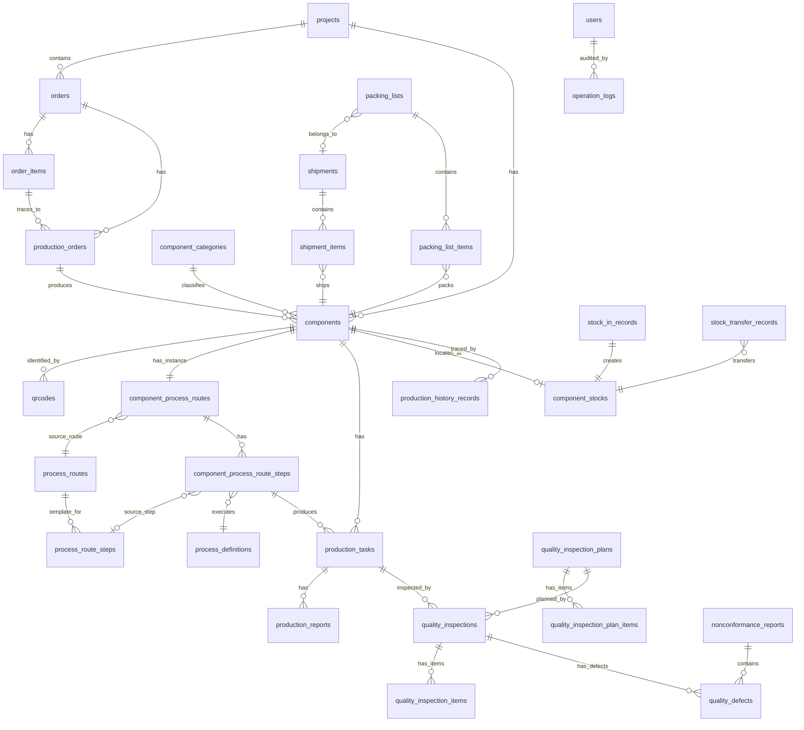

# MES 第2阶段数据库详细设计方案 V1.2

> 项目：钢结构出口加工厂 MES
> 数据库：PostgreSQL 16
> 开发库：jiangxing_mes
> 文档版本：V1.2（基于 V1.1 第二轮评审意见修订）
> 编写者：孙麦 / MES 项目开发工程师（AI）
> 状态：**待人工评审**（未执行任何 SQL，未创建业务表，未生成 Alembic migration，未修改业务代码）

---

## 目录

1. 设计总则
2. 数据库总体架构
3. 命名规范
4. 通用字段规范（按表类型分级）
5. 数据类型规范
6. 状态字段与状态流转规则（V1.2 修订版）
7. 核心业务主线与实体关系图（V1.2 重绘）
8. 模块划分与表清单（V1.2 机械核对）
9. 表结构详细设计
10. 索引设计策略
11. 约束设计策略
12. 二维码与构件关系设计
13. 生产履历贯穿机制设计
14. ERP / MES 接口预留字段
15. 数据库初始化 SQL（设计稿，不执行）
16. 自检报告（V1.2 重新生成）
17. V1.1 → V1.2 修改记录
18. 待人工确认事项

---

## 1. 设计总则

### 1.1 设计核心原则

| 原则 | 说明 |
|------|------|
| 构件为核心 | 所有业务数据最终都关联到「构件 (component)」 |
| 二维码为入口 | 车间操作通过扫码定位构件、工序、任务 |
| 生产履历为主线 | 全生命周期数据可追溯 |
| 数据完整性优先 | 主外键关系、唯一性、状态一致性 |
| 单一事实来源 | 每个业务事实只在一个地方表达，避免重复 |
| 可追溯性 | 关键操作记录操作人、时间、前后状态 |
| 软删除分级 | 业务表软删除，不可变表禁止修改；当前状态表例外 |
| 扩展能力 | 预留 ERP 接口字段、扩展字段 |

### 1.2 业务约束

- PostgreSQL 16 是正式数据库
- 字符集 UTF8，时区 Asia/Shanghai
- 不直接修改生产数据库结构，所有变更通过 Alembic migration 管理
- 当前阶段仅设计，不执行 SQL，不创建业务表，不生成 Alembic migration

### 1.3 V1.2 核心业务铁律

1. **一个 component = 一个物理构件**：构件级业务表 `quantity` 必须 `CHECK(quantity = 1)`，不允许"1 件构件但任务完成 10 件"的语义冲突。
2. **route_step_id 是生产任务实际执行身份的 Source of Truth**，`process_id` 为冗余查询/快照字段，服务层必须保证两者一致。
3. **component_stocks 是当前库存位置状态表**（非历史表），是 A 类中的特殊例外，不允许软删除。
4. **生产履历 production_history_records 为不可变事实表**，禁止 UPDATE/DELETE，业务动作与履历写入必须在同一数据库事务。
5. **返工 attempt_no 必须由服务端事务生成**（SELECT FOR UPDATE + MAX+1），客户端不得自行决定。
6. **工艺模板与实例快照独立**：模板修改不影响已实例化的构件路线，`source_route_id`/`source_step_id` 仅追溯不继承。

---

## 2. 数据库总体架构

### 2.1 Schema 划分

| Schema | 用途 | 当前阶段 |
|--------|------|----------|
| public | 所有业务表 | v1 默认使用 |
| audit | 操作审计日志（可选） | 预留 |
| meta | 系统元数据 | 预留 |

> 决策：v1 阶段统一使用 `public` schema。

### 2.2 模块依赖关系

```
系统与权限模块 (users/roles/permissions)
        ↑ 被所有模块引用（created_by/updated_by）
组织与人员模块 (departments/workers/work_centers/equipment)
        ↑
项目与订单模块 (projects/orders/order_items)
        ↓
构件与图纸模块 (component_categories/components/drawings)
   ← 二维码模块 (qrcodes/scan_logs)
   ← 工艺路线模块（模板: process_routes/steps, 实例: component_process_routes/steps）
        ↓
生产模块 (production_orders/tasks/reports)
   ← 质量模块 (inspection_plans/plan_items/inspections/inspection_items/defects/ncr)
   ← 仓储模块 (warehouses/locations/component_stocks/stock_in/stock_out/stock_transfer)
   ← 发运模块 (shipments/shipment_items/packing_lists/packing_list_items)
        ↓
生产履历模块 (production_history_records) - 不可变，与业务同事务
        ↓
系统支撑模块 (operation_logs/system_configs/attachments/dictionaries/dictionary_items) - 独立审计
```

依赖方向：上层依赖下层，不允许循环依赖。

---

## 3. 命名规范

### 3.1 表命名

| 规则 | 示例 |
|------|------|
| 全小写 snake_case | `production_tasks` |
| 表名用复数 | `components`、`orders` |
| 关联表用两实体单数 + `_` 连接 | `user_roles` |
| 不使用 SQL 关键字 | 避开 `order` 用 `orders` |

### 3.2 字段命名

| 规则 | 示例 |
|------|------|
| 全小写 snake_case | `created_at`、`project_id` |
| 主键统一为 `id` | `id` |
| 外键为 `{表单数}_id` | `component_id`、`order_id` |
| 布尔字段以 `is_` / `has_` 开头 | `is_active` |
| 时间字段以 `_at` 结尾 | `created_at`、`completed_at` |
| 操作人以 `_by` 结尾 | `created_by`、`inspected_by` |
| 状态字段为 `status` 或 `{模块}_status` | `status`、`inspection_status` |
| 枚举值用小写下划线 | `in_progress`、`pending` |

### 3.3 约束命名

| 类型 | 规则 | 示例 |
|------|------|------|
| 主键 | `pk_{table}` | `pk_components` |
| 外键 | `fk_{table}_{referenced_table}` | `fk_components_projects` |
| 唯一约束 | `uq_{table}_{columns}` | `uq_components_project_component_no` |
| 检查约束 | `ck_{table}_{rule}` | `ck_components_status` |
| 索引 | `idx_{table}_{columns}` | `idx_components_project_id` |
| 部分唯一索引 | `uq_{table}_{columns}_active` | `uq_qrcodes_component_active` |
| 复合外键 | `fk_{table}_{ref}_{columns}` | `fk_component_stocks_locations_wh` |

### 3.4 序列命名

- 使用 `GENERATED ALWAYS AS IDENTITY`，不显式创建 SEQUENCE。

---

## 4. 通用字段规范（按表类型分级）

> V1.2 重大修改：明确 `component_stocks` 是 A 类中的特殊例外（当前状态表，不允许软删除）。

### 4.1 表类型划分

| 类型 | 说明 | 示例 | 软删除 |
|------|------|------|------|
| A. 普通业务表 | 可增删改查，需审计与软删除 | components, orders, projects, users, shipments | deleted_at |
| A*. 当前状态表（特殊） | 记录当前状态，只 UPDATE 不软删除 | component_stocks | 无 deleted_at |
| B. 配置/字典表 | 低频修改，需审计，可选软删除 | system_configs, dictionaries, roles, permissions, work_centers, warehouses | is_active |
| C. 不可变日志/履历表 | 只允许 INSERT，禁止 UPDATE/DELETE | production_history_records, operation_logs, qrcode_scan_logs, production_reports | 无 |
| D. 关联表 | 纯多对多关联 | user_roles, role_permissions | 无 |

> **V1.2 关键规则**：`component_stocks` 属于 A 类中的特殊例外（A*）。它记录构件当前库存位置状态，一个构件始终对应一个当前库存状态记录。库存位置变化直接 UPDATE 当前记录，历史移动通过 `stock_in_records`/`stock_out_records`/`stock_transfer_records`/`production_history_records` 记录。因此 `component_stocks` **不允许软删除**（无 `deleted_at` 字段）。

### 4.2 A 类（普通业务表）通用字段

| 字段 | 类型 | NULL | 默认 | 说明 |
|------|------|------|------|------|
| id | BIGINT | NOT NULL | IDENTITY | 主键 |
| created_at | TIMESTAMPTZ | NOT NULL | NOW() | 创建时间 |
| updated_at | TIMESTAMPTZ | NOT NULL | NOW() | 更新时间，trigger 自动维护 |
| created_by | BIGINT | NULL | NULL | 创建人（FK→users.id，系统操作可为 NULL） |
| updated_by | BIGINT | NULL | NULL | 更新人 |
| deleted_at | TIMESTAMPTZ | NULL | NULL | 软删除时间 |
| remark | TEXT | NULL | NULL | 备注 |
| version | INTEGER | NOT NULL | 1 | 乐观锁（仅关键表） |

### 4.3 A* 类（当前状态表）通用字段

> 与 A 类相同，但**删除 `deleted_at` 字段**。

| 字段 | 类型 | NULL | 默认 | 说明 |
|------|------|------|------|------|
| id | BIGINT | NOT NULL | IDENTITY | 主键 |
| created_at | TIMESTAMPTZ | NOT NULL | NOW() | 创建时间 |
| updated_at | TIMESTAMPTZ | NOT NULL | NOW() | 更新时间，位置变化时 trigger 维护 |
| created_by | BIGINT | NULL | NULL | 创建人 |
| updated_by | BIGINT | NULL | NULL | 更新人 |
| remark | TEXT | NULL | NULL | 备注 |

### 4.4 B 类（配置/字典表）通用字段

| 字段 | 类型 | NULL | 默认 | 说明 |
|------|------|------|------|------|
| id | BIGINT | NOT NULL | IDENTITY | 主键 |
| created_at | TIMESTAMPTZ | NOT NULL | NOW() | 创建时间 |
| updated_at | TIMESTAMPTZ | NOT NULL | NOW() | 更新时间 |
| created_by | BIGINT | NULL | NULL | 创建人 |
| updated_by | BIGINT | NULL | NULL | 更新人 |
| is_active | BOOLEAN | NOT NULL | TRUE | 启用标志（代替软删除） |

### 4.5 C 类（不可变日志/履历表）通用字段

| 字段 | 类型 | NULL | 默认 | 说明 |
|------|------|------|------|------|
| id | BIGINT | NOT NULL | IDENTITY | 主键 |
| occurred_at | TIMESTAMPTZ | NOT NULL | NOW() | 事件发生时间（业务时间） |
| operator_id | BIGINT | NULL | NULL | 操作人（FK→users.id） |

> **关键约束**：
> - **不包含 updated_at / updated_by / deleted_at**
> - **禁止 UPDATE 与 DELETE**（通过 trigger 强制）
> - **不包含 version 字段**
> - **业务动作与履历写入必须在同一数据库事务**
> - **普通业务用户不能直接 INSERT history，必须通过受控服务逻辑写入**

### 4.6 D 类（关联表）通用字段

| 字段 | 类型 | NULL | 默认 | 说明 |
|------|------|------|------|------|
| created_at | TIMESTAMPTZ | NOT NULL | NOW() | 创建时间 |
| created_by | BIGINT | NULL | NULL | 创建人 |

> 关联表只需创建时间与人，不需要更新/软删除（解除关联即 DELETE 行）。

### 4.7 updated_at 自动更新 trigger（A/A*/B 类表）

```sql
CREATE OR REPLACE FUNCTION set_updated_at()
RETURNS TRIGGER AS $$
BEGIN
    NEW.updated_at = NOW();
    RETURN NEW;
END;
$$ LANGUAGE plpgsql;
```

### 4.8 不可变表保护 trigger（C 类表）

```sql
CREATE OR REPLACE FUNCTION prevent_immutable_modify()
RETURNS TRIGGER AS $$
BEGIN
    RAISE EXCEPTION 'Table % is immutable: UPDATE/DELETE not allowed', TG_TABLE_NAME;
END;
$$ LANGUAGE plpgsql;
```

对每张 C 类表：
```sql
CREATE TRIGGER trg_prevent_{table}_modify
    BEFORE UPDATE OR DELETE ON {table}
    FOR EACH ROW EXECUTE FUNCTION prevent_immutable_modify();
```

---

## 5. 数据类型规范

| 业务含义 | PostgreSQL 类型 | 说明 |
|------|------|------|
| 主键/外键 | BIGINT | 性能与扩展性 |
| 短编码 | VARCHAR(32) | 项目编号、订单号、构件号 |
| 长编码 | VARCHAR(64) | 二维码值、UUID |
| 名称 | VARCHAR(200) | 项目名、构件名 |
| 文本描述 | TEXT | 备注、说明 |
| 状态枚举 | VARCHAR(20) + CHECK | 字符串可读性强 |
| 构件数量 | INTEGER + CHECK(=1) | 构件级业务表，1 件 = 1 构件 |
| 统计/汇报数量 | INTEGER + CHECK(≥0) | 计划/累计统计，允许 ≥0 |
| 重量 | NUMERIC(12,3) | 重量，单位 kg |
| 尺寸 | NUMERIC(10,2) | 长度/宽度/厚度，单位 mm |
| 金额 | NUMERIC(14,2) | 单价、总价 |
| 时间戳 | TIMESTAMPTZ | 全部带时区 |
| 布尔 | BOOLEAN | 标志位 |
| JSON 配置 | JSONB | 扩展属性 |

> V1.2 区分"构件数量"与"统计/汇报数量"：构件级业务表（stock_in_records, stock_out_records, shipment_items, packing_list_items, production_reports）的 `quantity` 表示构件数量，必须 `CHECK(quantity = 1)`；production_orders/orders 的 `planned_quantity`/`actual_quantity` 表示统计数量，允许 `>= 0`。

---

## 6. 状态字段与状态流转规则（V1.2 修订版）

> V1.2 重大修改：
> 1. 质检状态机重设计：inspection status 只含 pending/inspecting/passed/failed/cancelled，返工不作为 inspection 本身的 status，走 defect.disposition=rework → 新 production_task → 新 inspection。
> 2. 构件状态去掉 rework/re_inspection（返工本质是回到 in_production，复检是回到 in_inspection，通过 production_tasks.attempt_no 推导）。
> 3. 二维码删除 is_primary，状态与主码唯一性解耦。
> 4. 明确 CHECK 只限制合法状态值，不限制状态转换；状态转换由服务层/事务逻辑保证。

### 6.1 项目状态 (projects.status)

```
planning(规划中)
  ↓
confirmed(已确认)
  ↓
in_progress(进行中) ⇄ on_hold(已暂停)
  ↓
completed(已完成)
  ↓
closed(已关闭) [终态]

任意非终态 → cancelled(已取消) [终态]
任意非终态 → on_hold(已暂停) → 回到原状态
```

CHECK 允许值：`planning, confirmed, in_progress, on_hold, completed, closed, cancelled`

终态：closed, cancelled

### 6.2 订单状态 (orders.status)

```
draft(草稿)
  ↓
confirmed(已确认)
  ↓
in_production(生产中) ⇄ on_hold(已暂停)
  ↓
completed(已完成)
  ↓
closed(已关闭) [终态]

任意非终态 → cancelled(已取消) [终态]
任意非终态 → on_hold(已暂停) → 回到原状态
```

CHECK 允许值：`draft, confirmed, in_production, on_hold, completed, closed, cancelled`

终态：closed, cancelled

### 6.3 构件状态 (components.status)【V1.2 修订】

> V1.2 修改：去掉 rework / re_inspection。返工本质是构件回到 in_production（由新 production_task attempt_no+1 驱动），复检是构件回到 in_inspection（由新 quality_inspection 驱动）。"这是返工还是首次"通过 production_tasks.attempt_no 推导，不占用构件状态位。

```
draft(草稿)
  ↓
released(已下发)
  ↓
in_production(生产中) ⇄ on_hold(已暂停)
  ↓
in_inspection(质检中)
  ↓ ┌──────────────┐
passed(质检合格)   failed(质检不合格)
  │                │
  ↓                ↓ (defect.disposition=rework → 新 task attempt_no+1 → 回到 in_production)
in_stock(已入库)    │
  ↓                ↓ (defect.disposition=scrap → scrapped)
shipped(已发运)    
  ↓            
completed(已完成) [终态]

任意非终态 → scrapped(已报废) [终态]
任意非终态 → on_hold(已暂停) → 回到原状态
```

CHECK 允许值：`draft, released, in_production, on_hold, in_inspection, passed, failed, in_stock, shipped, completed, scrapped`

终态：completed, scrapped

> 注意：failed 不是终态，构件在 failed 后必须走向 disposition（rework → 回 in_production / scrap → scrapped / accept → passed）。不允许长期停留在 failed。

### 6.4 生产任务状态 (production_tasks.status)

> V1.2 保留 V1.1 的返工支持。返工通过新建任务（attempt_no+1）实现，旧任务到 rework_requested 后不再变化。

```
pending(待分配)
  ↓
assigned(已分配)
  ↓
in_progress(进行中) ⇄ paused(已暂停)
  ↓
completed(已完成) → rework_requested(返工请求) [旧任务终态]

任意非终态 → cancelled(已取消) [终态]
```

CHECK 允许值：`pending, assigned, in_progress, paused, completed, rework_requested, cancelled`

终态：completed, rework_requested, cancelled

> **返工 attempt_no 规则（V1.2 强制）**：
> - attempt_no 必须由服务端事务生成，客户端不得自行决定
> - 标准流程：BEGIN → SELECT 相关 route_step/task FOR UPDATE → 查询 MAX(attempt_no) → +1 → 创建新 production_task → 写 production_history → COMMIT
> - 防止两台手机同时操作造成 attempt_no 冲突

### 6.5 质检状态 (quality_inspections.inspection_status)【V1.2 重设计】

> V1.2 重大修改：返工不作为 inspection 本身的 status。每次实际检验都是独立 inspection 记录，不能通过 rework/re_inspection 覆盖原来的 inspection。

```
pending(待检)
  ↓
inspecting(检验中)
  ↓ ┌──────────────┐
passed(合格) [终态]  failed(不合格) [终态]
                     │
                     ↓ (defect.disposition=rework → 新 production_task attempt_no+1 → 返工 → 新 quality_inspection 独立记录)
                     ↓ (defect.disposition=scrap → 构件 scrapped)
                     ↓ (defect.disposition=accept → 构件 passed)
                     ↓ (defect.disposition=re_sort → 重新分选)

任意非终态 → cancelled(已取消) [终态]
```

CHECK 允许值：`pending, inspecting, passed, failed, cancelled`

终态：passed, failed, cancelled

> **标准业务流程**：
> ```
> 检验 #1 (attempt_no=1)
>   ↓ failed
>   ↓ defect.disposition = rework
>   ↓ 创建新的 production_task (attempt_no + 1)
>   ↓ 返工生产
>   ↓ 新的 quality_inspection (独立记录，新 attempt_no)
>   ↓ passed / failed
> ```
> 每一次实际检验都是独立 inspection 记录，不能通过 rework 和 re_inspection 覆盖原来的 inspection。

### 6.6 二维码状态 (qrcodes.status)【V1.2 修订】

> V1.2 修改：删除 is_primary 字段（可由 status 推导）。主码唯一性通过部分唯一索引保证。

```
unused(未使用)
  ↓
active(已激活，当前主码)
  ↓
disabled(已停用，成为历史码) → 可重新激活为 active
  ↓
voided(已作废) [终态，永久终态，不允许恢复]

active → voided (构件销毁，直接作废)
```

CHECK 允许值：`unused, active, disabled, voided`

状态转换规则：
- unused → active
- active → disabled
- disabled → active
- active → voided
- disabled → voided
- voided：永久终态，不允许恢复

> **主码唯一性**：同一构件同一时间只能有一个 `active` 状态的二维码（通过部分唯一索引保证，见第 12 节）。不再需要 is_primary 字段，`status='active'` 即代表当前主码。

### 6.7 入库状态 (stock_in_records.status)

```
pending(待入库)
  ↓
completed(已入库) [终态]
  ↓
cancelled(已取消) [终态]

任意非终态 → cancelled(已取消) [终态]
```

CHECK 允许值：`pending, completed, cancelled`

终态：completed, cancelled

### 6.8 出库记录 (stock_out_records)【V1.2 无 status】

> V1.2 决策（方案 B）：stock_out_records 不设 status 字段。它本身是不可修改的实际出库事实记录——只有出库成功后才写入 stock_out_records。若出库需取消，通过反向记录处理。
>
> 这消除了 V1.1 正文引用 `stock_out_records.status = completed` 但表结构无 status 字段的矛盾。

### 6.9 构件库存状态 (component_stocks.status)【V1.2 修订】

> V1.2 修改：增加 scrapped 状态（V1.1 缺失，导致 out_type=scrap 后库存无对应状态）。

```
in_stock(在库)
  ↓ (出货预留)
reserved(已预留)
  ↓ (装箱/出库)
shipped(已发运) [终态]

in_stock → scrapped(已报废) [终态]
reserved → scrapped(已报废) [终态]
```

CHECK 允许值：`in_stock, reserved, shipped, scrapped`

终态：shipped, scrapped

> **reserved 业务来源（V1.2 明确）**：
> - 谁创建：出货分配/发运确认时由服务层创建
> - 谁解除：装箱完成 → shipped；或取消预留 → in_stock
> - 触发动作：发运单确认（shipments.status → confirmed）时将相关构件库存置为 reserved
> - 与 shipment 关系：reserved 表示构件已分配给某个有效 shipment
> - 与 packing_list 关系：装箱时构件必须处于 reserved 或 in_stock
> - 是否允许 reserved → shipped：是，装箱完成并发运后直接 → shipped
>
> **reserved 是否为 V1 必需，见第 18 节待人工确认事项。若 V1 不需要 reserved，可删除该状态，仅保留 in_stock/shipped/scrapped。**

### 6.10 发运状态 (shipments.status)

```
planning(计划中)
  ↓
confirmed(已确认)
  ↓
loading(装车中) ⇄ on_hold(已暂停)
  ↓
shipped(已发运)
  ↓
delivered(已送达) [终态]

任意非终态 → cancelled(已取消) [终态]
任意非终态 → on_hold(已暂停) → 回到原状态
```

CHECK 允许值：`planning, confirmed, loading, on_hold, shipped, delivered, cancelled`

终态：delivered, cancelled

### 6.11 生产工单状态 (production_orders.status)

```
pending(待下发)
  ↓
released(已下发)
  ↓
in_progress(进行中) ⇄ on_hold(已暂停)
  ↓
completed(已完成)
  ↓
closed(已关闭) [终态]

任意非终态 → cancelled(已取消) [终态]
任意非终态 → on_hold(已暂停) → 回到原状态
```

CHECK 允许值：`pending, released, in_progress, on_hold, completed, closed, cancelled`

终态：closed, cancelled

### 6.12 NCR 状态 (nonconformance_reports.status)

```
open(已创建)
  ↓
in_review(评审中)
  ↓
approved(已批准处理意见)
  ↓
in_rework(返工执行中)
  ↓
closed(已关闭) [终态]

任意非终态 → rejected(已驳回) [终态]
```

CHECK 允许值：`open, in_review, approved, in_rework, closed, rejected`

终态：closed, rejected

> 注意：rejected 是终态。CHECK 只限制合法状态值，不限制状态转换；状态转换由服务层/事务逻辑保证，不通过 CHECK 伪装成状态机。

### 6.13 设备状态 (equipment.status)

```
idle(空闲) ⇄ running(运行中)
idle/running → maintenance(维护中) → idle
idle/running → broken(故障) → maintenance → idle
```

CHECK 允许值：`idle, running, maintenance, broken`

> 设备状态无严格终态，由维护流程驱动。

---

## 7. 核心业务主线与实体关系图（V1.2 重绘）

### 7.1 业务主线

```
项目 project
  ↓ 1:N
订单 order
  ↓ 1:N
订单明细 order_item
  ↓ 1:N（通过 production_orders.order_item_id 精确追溯，V1.2 修复）
生产工单 production_order
  ↓ 1:N
构件 component  ←─── 二维码 qrcode (1 active 主码 + N 历史码，V1.2 删除 is_primary)
  ↓ 1:1
构件工艺路线实例 component_process_route
  ↓ 1:N
构件工艺步骤实例 component_process_route_step (route_step_id 是任务身份 Source of Truth)
  ↓ 1:N
生产任务 production_task (含 attempt_no 支持返工，服务端事务生成)
  ↓ 1:N
生产报工 production_report (CHECK quantity=1，构件级)
  ↓ 1:N
质检 quality_inspection → 质检明细 quality_inspection_item
  ↓ (合格后)
入库 stock_in_record → 构件库存 component_stock (当前状态表，无软删除)
  ↓ (库位变化)
库位转移 stock_transfer_record (事务+行锁)
  ↓ (发运)
发运明细 shipment_item → 装箱明细 packing_list_item
  ↓ (汇总，同事务写入)
生产履历 production_history_record (不可变，禁止 UPDATE/DELETE)
```

### 7.2 核心业务 ER 图（V1.2 修正版）

> V1.2 说明：本图为**核心业务 ER 图**（非完整 ER 图），覆盖核心业务主线实体关系。完整表清单见第 8 节。
> V1.1 修正点：
> 1. components ↔ component_categories 改为 `||--o{`（一个构件只有一个类别，一对多）
> 2. 补充 component_process_routes → process_routes（source_route_id）
> 3. 补充 component_process_route_steps → process_route_steps（source_step_id）
> 4. 补充 shipment_items → components、packing_list_items → components、packing_lists → shipments
> 5. 补充 stock_transfer_records
> 6. 补充 quality_inspections → quality_inspection_plans
> 7. 补充 quality_defects → nonconformance_reports（V1.2 新增 ncr_id）
> 8. 补充 production_orders → order_items（V1.2 新增 order_item_id）



### 7.3 ER 图关系基数说明

| 关系 | 基数 | 说明 |
|------|------|------|
| projects → orders | 1:N | 一个项目含多个订单 |
| orders → order_items | 1:N | 一个订单含多个明细行 |
| order_items → production_orders | 1:N | V1.2 新增：一个明细可对应多个生产工单（精确追溯） |
| orders → production_orders | 1:N | 一个订单可含多个生产工单 |
| production_orders → components | 1:N | 一个工单生产多个构件 |
| component_categories → components | 1:N | V1.2 修正：一个构件只有一个类别（非多对多） |
| components → qrcodes | 1:N | 一个构件可有多个二维码（1 active + N 历史） |
| components → component_process_routes | 1:1 | 一个构件一个路线实例 |
| component_process_routes → process_routes | N:1 | 实例来源模板 |
| component_process_route_steps → process_route_steps | N:0..1 | 实例步骤来源模板步骤（可空） |
| component_process_route_steps → production_tasks | 1:N | 一个步骤可多次执行任务（返工） |
| quality_defects → nonconformance_reports | N:1 | V1.2 新增：一个 NCR 含多个缺陷 |

---

## 8. 模块划分与表清单（V1.2 机械核对）

> V1.2 重大修改：机械核对 V1.1 实际表数量。V1.1 文档称"35 张"，但逐表清点实际为 **48 张**。V1.2 不增删表（仅修改字段/约束），故 V1.2 正式表数量 = **48 张**。

### 8.1 系统与权限模块

| 序号 | 表名 | 类型 | 说明 |
|------|------|------|------|
| 1 | users | A | 系统用户 |
| 2 | roles | B | 角色 |
| 3 | permissions | B | 权限点 |
| 4 | user_roles | D | 用户-角色关联 |
| 5 | role_permissions | D | 角色-权限关联 |

### 8.2 组织与人员模块

| 序号 | 表名 | 类型 | 说明 |
|------|------|------|------|
| 6 | departments | A | 部门 |
| 7 | workers | A | 车间工人 |
| 8 | work_centers | B | 工作中心 |
| 9 | equipment | A | 设备 |

### 8.3 项目与订单模块

| 序号 | 表名 | 类型 | 说明 |
|------|------|------|------|
| 10 | projects | A | 项目 |
| 11 | orders | A | 订单 |
| 12 | order_items | A | 订单明细行 |

### 8.4 构件与图纸模块

| 序号 | 表名 | 类型 | 说明 |
|------|------|------|------|
| 13 | component_categories | B | 构件类别 |
| 14 | components | A | 构件主表（核心） |
| 15 | component_specifications | A | 构件规格参数 |
| 16 | drawings | A | 图纸 |

### 8.5 二维码模块

| 序号 | 表名 | 类型 | 说明 |
|------|------|------|------|
| 17 | qrcodes | A | 二维码（主码 + 历史码，V1.2 删除 is_primary） |
| 18 | qrcode_scan_logs | C | 扫码日志（不可变） |

### 8.6 工艺与工序模块

| 序号 | 表名 | 类型 | 说明 |
|------|------|------|------|
| 19 | process_definitions | B | 工序定义 |
| 20 | process_routes | B | 工艺路线模板 |
| 21 | process_route_steps | B | 模板步骤 |
| 22 | component_process_routes | A | 构件工艺路线实例 |
| 23 | component_process_route_steps | A | 构件工艺步骤实例 |

### 8.7 生产任务与报工模块

| 序号 | 表名 | 类型 | 说明 |
|------|------|------|------|
| 24 | production_orders | A | 生产工单（V1.2 新增 order_item_id） |
| 25 | production_tasks | A | 生产任务（含 attempt_no，V1.2 唯一约束改 route_step_id） |
| 26 | production_reports | C | 报工记录（不可变，V1.2 CHECK quantity=1） |

### 8.8 质量管理模块

| 序号 | 表名 | 类型 | 说明 |
|------|------|------|------|
| 27 | quality_inspection_plans | B | 质检计划 |
| 28 | quality_inspection_plan_items | B | 质检计划检验项 |
| 29 | quality_inspections | A | 质检记录（V1.2 状态机重设计） |
| 30 | quality_inspection_items | A | 质检明细项 |
| 31 | quality_defects | A | 不合格缺陷（V1.2 新增 ncr_id） |
| 32 | nonconformance_reports | A | NCR 不合格品处理单 |

### 8.9 仓储与入库模块

| 序号 | 表名 | 类型 | 说明 |
|------|------|------|------|
| 33 | warehouses | B | 仓库 |
| 34 | locations | B | 库位（V1.2 新增 UNIQUE(id, warehouse_id)） |
| 35 | component_stocks | A* | 构件库存（当前状态表，V1.2 删除 deleted_at，新增 scrapped 状态） |
| 36 | stock_in_records | A | 入库记录（V1.2 CHECK quantity=1） |
| 37 | stock_out_records | A | 出库记录（V1.2 删除 transfer 类型，CHECK quantity=1，无 status） |
| 38 | stock_transfer_records | A | 库位转移记录（V1.2 明确事务+行锁规则） |

### 8.10 发运与装箱模块

| 序号 | 表名 | 类型 | 说明 |
|------|------|------|------|
| 39 | shipments | A | 发运单 |
| 40 | shipment_items | A | 发运明细（V1.2 CHECK quantity=1） |
| 41 | packing_lists | A | 装箱单 |
| 42 | packing_list_items | A | 装箱明细（V1.2 CHECK quantity=1） |

### 8.11 生产履历模块

| 序号 | 表名 | 类型 | 说明 |
|------|------|------|------|
| 43 | production_history_records | C | 生产履历（不可变，与业务同事务） |

### 8.12 系统支撑模块

| 序号 | 表名 | 类型 | 说明 |
|------|------|------|------|
| 44 | operation_logs | C | 操作审计日志（不可变） |
| 45 | system_configs | B | 系统配置 |
| 46 | attachments | A | 附件元数据 |
| 47 | dictionaries | B | 数据字典 |
| 48 | dictionary_items | B | 字典项 |

### 8.13 表数量机械核对

| 模块 | 数量 |
|------|------|
| 8.1 系统与权限 | 5 |
| 8.2 组织与人员 | 4 |
| 8.3 项目与订单 | 3 |
| 8.4 构件与图纸 | 4 |
| 8.5 二维码 | 2 |
| 8.6 工艺与工序 | 5 |
| 8.7 生产任务与报工 | 3 |
| 8.8 质量管理 | 6 |
| 8.9 仓储与入库 | 6 |
| 8.10 发运与装箱 | 4 |
| 8.11 生产履历 | 1 |
| 8.12 系统支撑 | 5 |
| **合计** | **48** |

> **V1.2 结论**：正式表数量 = **48 张**。V1.1 文档误写"35 张"，V1.2 已修正全文。
> V1.2 相对 V1.1 不增删表，仅修改字段/约束/状态机/规则，故表数量不变。

---

## 9. 表结构详细设计

> 以下所有 DDL 为**设计稿**，本阶段不执行。
> 字段顺序：业务字段 → 类型对应通用字段
> V1.2 修改标记：【V1.2】表示该处相对 V1.1 有修改。

### 9.1 系统与权限模块

#### 9.1.1 users（A 类）

| 字段 | 类型 | NULL | 默认 | 约束 | 说明 |
|------|------|------|------|------|------|
| id | BIGINT | NOT NULL | IDENTITY | PK | 用户 ID |
| username | VARCHAR(64) | NOT NULL | - | UNIQUE | 登录名 |
| password_hash | VARCHAR(255) | NOT NULL | - | - | 哈希密码（bcrypt） |
| real_name | VARCHAR(64) | NOT NULL | - | - | 真实姓名 |
| email | VARCHAR(128) | NULL | - | - | 邮箱 |
| phone | VARCHAR(32) | NULL | - | - | 手机 |
| department_id | BIGINT | NULL | - | FK→departments.id | 部门 |
| is_active | BOOLEAN | NOT NULL | TRUE | - | 是否启用 |
| last_login_at | TIMESTAMPTZ | NULL | - | - | 最后登录时间 |
| created_at | TIMESTAMPTZ | NOT NULL | NOW() | - | |
| updated_at | TIMESTAMPTZ | NOT NULL | NOW() | - | |
| created_by | BIGINT | NULL | - | FK→users.id | |
| updated_by | BIGINT | NULL | - | FK→users.id | |
| deleted_at | TIMESTAMPTZ | NULL | - | - | 软删除 |
| remark | TEXT | NULL | - | - | |
| version | INTEGER | NOT NULL | 1 | - | 乐观锁 |

索引：`idx_users_department_id`（FK 过滤路径）
唯一：`uq_users_username`

> 注：`idx_users_is_active` 不单独建（is_active 基数低，全表扫描优于索引）。

#### 9.1.2 roles（B 类）

| 字段 | 类型 | NULL | 默认 | 约束 | 说明 |
|------|------|------|------|------|------|
| id | BIGINT | NOT NULL | IDENTITY | PK | 角色 ID |
| code | VARCHAR(64) | NOT NULL | - | UNIQUE | 角色编码 |
| name | VARCHAR(64) | NOT NULL | - | - | 角色名称 |
| description | TEXT | NULL | - | - | 描述 |
| is_system | BOOLEAN | NOT NULL | FALSE | - | 系统内置 |
| is_active | BOOLEAN | NOT NULL | TRUE | - | 启用 |
| created_at | TIMESTAMPTZ | NOT NULL | NOW() | - | |
| updated_at | TIMESTAMPTZ | NOT NULL | NOW() | - | |
| created_by | BIGINT | NULL | - | FK→users.id | |
| updated_by | BIGINT | NULL | - | FK→users.id | |

#### 9.1.3 permissions（B 类）

| 字段 | 类型 | NULL | 默认 | 约束 | 说明 |
|------|------|------|------|------|------|
| id | BIGINT | NOT NULL | IDENTITY | PK | 权限 ID |
| code | VARCHAR(128) | NOT NULL | - | UNIQUE | 权限点 |
| name | VARCHAR(128) | NOT NULL | - | - | 权限名称 |
| module | VARCHAR(64) | NOT NULL | - | - | 所属模块 |
| description | TEXT | NULL | - | - | 描述 |
| is_active | BOOLEAN | NOT NULL | TRUE | - | 启用 |
| created_at | TIMESTAMPTZ | NOT NULL | NOW() | - | |
| updated_at | TIMESTAMPTZ | NOT NULL | NOW() | - | |
| created_by | BIGINT | NULL | - | FK→users.id | |
| updated_by | BIGINT | NULL | - | FK→users.id | |

#### 9.1.4 user_roles（D 类）

| 字段 | 类型 | NULL | 默认 | 约束 | 说明 |
|------|------|------|------|------|------|
| user_id | BIGINT | NOT NULL | - | FK→users.id, PK | 用户 |
| role_id | BIGINT | NOT NULL | - | FK→roles.id, PK | 角色 |
| created_at | TIMESTAMPTZ | NOT NULL | NOW() | - | |
| created_by | BIGINT | NULL | - | FK→users.id | |

PK：(user_id, role_id)
索引：`idx_user_roles_role_id`（反向查询角色下的用户，PK 已覆盖 user_id 正向）

#### 9.1.5 role_permissions（D 类）

| 字段 | 类型 | NULL | 默认 | 约束 | 说明 |
|------|------|------|------|------|------|
| role_id | BIGINT | NOT NULL | - | FK→roles.id, PK | 角色 |
| permission_id | BIGINT | NOT NULL | - | FK→permissions.id, PK | 权限 |
| created_at | TIMESTAMPTZ | NOT NULL | NOW() | - | |
| created_by | BIGINT | NULL | - | FK→users.id | |

PK：(role_id, permission_id)
索引：`idx_role_permissions_permission_id`（反向查询，PK 已覆盖 role_id 正向）

### 9.2 组织与人员模块

#### 9.2.1 departments（A 类）

| 字段 | 类型 | NULL | 默认 | 约束 | 说明 |
|------|------|------|------|------|------|
| id | BIGINT | NOT NULL | IDENTITY | PK | 部门 ID |
| code | VARCHAR(64) | NOT NULL | - | UNIQUE | 部门编码 |
| name | VARCHAR(128) | NOT NULL | - | - | 部门名称 |
| parent_id | BIGINT | NULL | - | FK→departments.id | 上级部门 |
| path | VARCHAR(512) | NULL | - | - | 层级路径 |
| is_active | BOOLEAN | NOT NULL | TRUE | - | 启用 |
| created_at | TIMESTAMPTZ | NOT NULL | NOW() | - | |
| updated_at | TIMESTAMPTZ | NOT NULL | NOW() | - | |
| created_by | BIGINT | NULL | - | FK→users.id | |
| updated_by | BIGINT | NULL | - | FK→users.id | |
| deleted_at | TIMESTAMPTZ | NULL | - | - | 软删除 |
| remark | TEXT | NULL | - | - | |

索引：`idx_departments_parent_id`（自引用 FK 过滤）

#### 9.2.2 workers（A 类）

| 字段 | 类型 | NULL | 默认 | 约束 | 说明 |
|------|------|------|------|------|------|
| id | BIGINT | NOT NULL | IDENTITY | PK | 工人 ID |
| user_id | BIGINT | NULL | - | FK→users.id, UNIQUE | 关联用户 |
| worker_no | VARCHAR(32) | NOT NULL | - | UNIQUE | 工号 |
| work_center_id | BIGINT | NULL | - | FK→work_centers.id | 所属工位 |
| skill_level | VARCHAR(20) | NULL | - | - | 技能等级 |
| is_active | BOOLEAN | NOT NULL | TRUE | - | 启用 |
| created_at | TIMESTAMPTZ | NOT NULL | NOW() | - | |
| updated_at | TIMESTAMPTZ | NOT NULL | NOW() | - | |
| created_by | BIGINT | NULL | - | FK→users.id | |
| updated_by | BIGINT | NULL | - | FK→users.id | |
| deleted_at | TIMESTAMPTZ | NULL | - | - | 软删除 |
| remark | TEXT | NULL | - | - | |

#### 9.2.3 work_centers（B 类）

| 字段 | 类型 | NULL | 默认 | 约束 | 说明 |
|------|------|------|------|------|------|
| id | BIGINT | NOT NULL | IDENTITY | PK | 工作中心 ID |
| code | VARCHAR(64) | NOT NULL | - | UNIQUE | 编码 |
| name | VARCHAR(128) | NOT NULL | - | - | 名称 |
| workshop | VARCHAR(64) | NULL | - | - | 车间 |
| type | VARCHAR(20) | NOT NULL | - | CHECK IN (...) | 类型 |
| is_active | BOOLEAN | NOT NULL | TRUE | - | 启用 |
| created_at | TIMESTAMPTZ | NOT NULL | NOW() | - | |
| updated_at | TIMESTAMPTZ | NOT NULL | NOW() | - | |
| created_by | BIGINT | NULL | - | FK→users.id | |
| updated_by | BIGINT | NULL | - | FK→users.id | |

CHECK：`type IN ('cutting','assembly','welding','grinding','painting','packaging','inspection','warehouse','other')`

#### 9.2.4 equipment（A 类）

| 字段 | 类型 | NULL | 默认 | 约束 | 说明 |
|------|------|------|------|------|------|
| id | BIGINT | NOT NULL | IDENTITY | PK | 设备 ID |
| code | VARCHAR(64) | NOT NULL | - | UNIQUE | 设备编码 |
| name | VARCHAR(128) | NOT NULL | - | - | 名称 |
| work_center_id | BIGINT | NULL | - | FK→work_centers.id | 所属工位 |
| status | VARCHAR(20) | NOT NULL | 'idle' | CHECK | idle/running/maintenance/broken |
| created_at | TIMESTAMPTZ | NOT NULL | NOW() | - | |
| updated_at | TIMESTAMPTZ | NOT NULL | NOW() | - | |
| created_by | BIGINT | NULL | - | FK→users.id | |
| updated_by | BIGINT | NULL | - | FK→users.id | |
| deleted_at | TIMESTAMPTZ | NULL | - | - | 软删除 |
| remark | TEXT | NULL | - | - | |

CHECK：`status IN ('idle','running','maintenance','broken')`（见 6.13）

### 9.3 项目与订单模块

#### 9.3.1 projects（A 类）

| 字段 | 类型 | NULL | 默认 | 约束 | 说明 |
|------|------|------|------|------|------|
| id | BIGINT | NOT NULL | IDENTITY | PK | 项目 ID |
| code | VARCHAR(32) | NOT NULL | - | UNIQUE | 项目编号 |
| name | VARCHAR(200) | NOT NULL | - | - | 项目名称 |
| client | VARCHAR(128) | NULL | - | - | 客户 |
| destination | VARCHAR(128) | NULL | - | - | 出口目的地 |
| status | VARCHAR(20) | NOT NULL | 'planning' | CHECK | 见 6.1 |
| planned_start_date | DATE | NULL | - | - | 计划开始 |
| planned_end_date | DATE | NULL | - | - | 计划结束 |
| actual_start_date | DATE | NULL | - | - | 实际开始 |
| actual_end_date | DATE | NULL | - | - | 实际结束 |
| erp_code | VARCHAR(64) | NULL | - | - | ERP 项目编码 |
| erp_synced_at | TIMESTAMPTZ | NULL | - | - | ERP 同步时间 |
| erp_sync_status | VARCHAR(20) | NOT NULL | 'pending' | CHECK | pending/syncing/synced/failed |
| erp_extra | JSONB | NULL | - | - | ERP 扩展字段 |
| created_at | TIMESTAMPTZ | NOT NULL | NOW() | - | |
| updated_at | TIMESTAMPTZ | NOT NULL | NOW() | - | |
| created_by | BIGINT | NULL | - | FK→users.id | |
| updated_by | BIGINT | NULL | - | FK→users.id | |
| deleted_at | TIMESTAMPTZ | NULL | - | - | 软删除 |
| remark | TEXT | NULL | - | - | |
| version | INTEGER | NOT NULL | 1 | - | 乐观锁 |

CHECK：
- `status IN ('planning','confirmed','in_progress','on_hold','completed','closed','cancelled')`
- `erp_sync_status IN ('pending','syncing','synced','failed')`
- `planned_end_date IS NULL OR planned_start_date IS NULL OR planned_end_date >= planned_start_date`
- `actual_end_date IS NULL OR actual_start_date IS NULL OR actual_end_date >= actual_start_date`

索引：`idx_projects_status`

#### 9.3.2 orders（A 类）

| 字段 | 类型 | NULL | 默认 | 约束 | 说明 |
|------|------|------|------|------|------|
| id | BIGINT | NOT NULL | IDENTITY | PK | 订单 ID |
| project_id | BIGINT | NOT NULL | - | FK→projects.id | 项目 |
| order_no | VARCHAR(32) | NOT NULL | - | UNIQUE | 订单号 |
| order_type | VARCHAR(20) | NOT NULL | - | CHECK | production/rework/sample |
| status | VARCHAR(20) | NOT NULL | 'draft' | CHECK | 见 6.2 |
| planned_quantity | INTEGER | NULL | - | CHECK ≥ 0 | 计划数量（统计数量，允许 ≥0） |
| actual_quantity | INTEGER | NULL | - | CHECK ≥ 0 | 实际数量（统计数量，见 6.2 说明） |
| planned_delivery_date | DATE | NULL | - | - | 计划交货 |
| actual_delivery_date | DATE | NULL | - | - | 实际交货 |
| erp_code | VARCHAR(64) | NULL | - | - | ERP 订单号 |
| erp_synced_at | TIMESTAMPTZ | NULL | - | - | |
| erp_sync_status | VARCHAR(20) | NOT NULL | 'pending' | CHECK | |
| erp_extra | JSONB | NULL | - | - | |
| created_at | TIMESTAMPTZ | NOT NULL | NOW() | - | |
| updated_at | TIMESTAMPTZ | NOT NULL | NOW() | - | |
| created_by | BIGINT | NULL | - | FK→users.id | |
| updated_by | BIGINT | NULL | - | FK→users.id | |
| deleted_at | TIMESTAMPTZ | NULL | - | - | 软删除 |
| remark | TEXT | NULL | - | - | |
| version | INTEGER | NOT NULL | 1 | - | 乐观锁 |

CHECK：
- `order_type IN ('production','rework','sample')`
- `status IN ('draft','confirmed','in_production','on_hold','completed','closed','cancelled')`
- `erp_sync_status IN ('pending','syncing','synced','failed')`
- `planned_quantity IS NULL OR planned_quantity >= 0`
- `actual_quantity IS NULL OR actual_quantity >= 0`
- `actual_delivery_date IS NULL OR planned_delivery_date IS NULL OR actual_delivery_date >= planned_delivery_date`

> 【V1.2】`actual_quantity` 语义重新定义：统计"唯一完成构件数"（不含返工重复），而非"所有生产尝试数量"。返工不重复计入 actual_quantity。因此保留 `actual_quantity <= planned_quantity` 不再机械约束（因报废可能导致 actual < planned，但返工补做可能使 actual 最终等于 planned）。去掉 V1.1 的 `actual_quantity <= planned_quantity` 限制，由服务层统计唯一构件数。
索引：`idx_orders_project_id`、`idx_orders_status`

#### 9.3.3 order_items（A 类）

| 字段 | 类型 | NULL | 默认 | 约束 | 说明 |
|------|------|------|------|------|------|
| id | BIGINT | NOT NULL | IDENTITY | PK | 明细 ID |
| order_id | BIGINT | NOT NULL | - | FK→orders.id | 订单 |
| line_no | VARCHAR(16) | NOT NULL | - | - | 行号 |
| category_id | BIGINT | NULL | - | FK→component_categories.id | 构件类别 |
| planned_quantity | INTEGER | NOT NULL | - | CHECK ≥ 0 | 计划数量（统计数量） |
| description | TEXT | NULL | - | - | 描述 |
| created_at | TIMESTAMPTZ | NOT NULL | NOW() | - | |
| updated_at | TIMESTAMPTZ | NOT NULL | NOW() | - | |
| created_by | BIGINT | NULL | - | FK→users.id | |
| updated_by | BIGINT | NULL | - | FK→users.id | |
| deleted_at | TIMESTAMPTZ | NULL | - | - | 软删除 |

唯一：`uq_order_items_order_line` (order_id, line_no)
索引：`idx_order_items_category_id`（按类别筛选构件）

### 9.4 构件与图纸模块

#### 9.4.1 component_categories（B 类）

| 字段 | 类型 | NULL | 默认 | 约束 | 说明 |
|------|------|------|------|------|------|
| id | BIGINT | NOT NULL | IDENTITY | PK | 类别 ID |
| code | VARCHAR(32) | NOT NULL | - | UNIQUE | 类别编码 |
| name | VARCHAR(128) | NOT NULL | - | - | 类别名称 |
| parent_id | BIGINT | NULL | - | FK→component_categories.id | 父类别 |
| path | VARCHAR(512) | NULL | - | - | 层级路径 |
| is_active | BOOLEAN | NOT NULL | TRUE | - | 启用 |
| created_at | TIMESTAMPTZ | NOT NULL | NOW() | - | |
| updated_at | TIMESTAMPTZ | NOT NULL | NOW() | - | |
| created_by | BIGINT | NULL | - | FK→users.id | |
| updated_by | BIGINT | NULL | - | FK→users.id | |

索引：`idx_component_categories_parent_id`

#### 9.4.2 components（核心表，A 类）

> V1.2 保持 V1.1 的去重设计（无 order_id/order_item_id/process_route_id/current_process_id），构件与订单明细的精确追溯通过 production_orders.order_item_id 解决（见 9.7.1）。

| 字段 | 类型 | NULL | 默认 | 约束 | 说明 |
|------|------|------|------|------|------|
| id | BIGINT | NOT NULL | IDENTITY | PK | 构件 ID |
| project_id | BIGINT | NOT NULL | - | FK→projects.id | 项目（直接关系） |
| component_no | VARCHAR(32) | NOT NULL | - | - | 构件业务编号（项目内唯一） |
| category_id | BIGINT | NULL | - | FK→component_categories.id | 类别 |
| drawing_no | VARCHAR(64) | NULL | - | - | 图纸号（冗余，便于查询） |
| name | VARCHAR(200) | NOT NULL | - | - | 构件名称 |
| material | VARCHAR(64) | NULL | - | - | 材质 |
| weight_kg | NUMERIC(12,3) | NULL | - | CHECK ≥ 0 | 重量 |
| length_mm | NUMERIC(10,2) | NULL | - | CHECK ≥ 0 | 长度 |
| width_mm | NUMERIC(10,2) | NULL | - | CHECK ≥ 0 | 宽度 |
| thickness_mm | NUMERIC(10,2) | NULL | - | CHECK ≥ 0 | 厚度 |
| surface_area_m2 | NUMERIC(10,2) | NULL | - | CHECK ≥ 0 | 表面积 |
| status | VARCHAR(20) | NOT NULL | 'draft' | CHECK | 见 6.3 |
| planned_start_date | DATE | NULL | - | - | 计划开工 |
| planned_end_date | DATE | NULL | - | - | 计划完工 |
| actual_start_date | DATE | NULL | - | - | 实际开工 |
| actual_end_date | DATE | NULL | - | - | 实际完工 |
| erp_code | VARCHAR(64) | NULL | - | - | ERP 构件码 |
| erp_synced_at | TIMESTAMPTZ | NULL | - | - | |
| erp_sync_status | VARCHAR(20) | NOT NULL | 'pending' | CHECK | |
| erp_extra | JSONB | NULL | - | - | |
| created_at | TIMESTAMPTZ | NOT NULL | NOW() | - | |
| updated_at | TIMESTAMPTZ | NOT NULL | NOW() | - | |
| created_by | BIGINT | NULL | - | FK→users.id | |
| updated_by | BIGINT | NULL | - | FK→users.id | |
| deleted_at | TIMESTAMPTZ | NULL | - | - | 软删除 |
| remark | TEXT | NULL | - | - | |
| version | INTEGER | NOT NULL | 1 | - | 乐观锁 |

CHECK：
- `status IN ('draft','released','in_production','on_hold','in_inspection','passed','failed','in_stock','shipped','completed','scrapped')`（V1.2 去掉 rework/re_inspection）
- `weight_kg IS NULL OR weight_kg >= 0`
- `length_mm IS NULL OR length_mm >= 0`
- `width_mm IS NULL OR width_mm >= 0`
- `thickness_mm IS NULL OR thickness_mm >= 0`
- `surface_area_m2 IS NULL OR surface_area_m2 >= 0`
- `planned_end_date IS NULL OR planned_start_date IS NULL OR planned_end_date >= planned_start_date`
- `actual_end_date IS NULL OR actual_start_date IS NULL OR actual_end_date >= actual_start_date`
- `erp_sync_status IN ('pending','syncing','synced','failed')`

唯一：`uq_components_project_component_no` (project_id, component_no)
索引：
- `idx_components_project_id`
- `idx_components_status`
- `idx_components_category_id`

**订单关系说明（V1.2 修复）**：构件与订单明细的精确追溯通过 `production_orders.order_item_id` 解决：`orders → order_items → production_orders → components`。不再需要把 order_id/order_item_id 塞回 components。样品构件（order_type=sample）无 order_item，production_orders.order_item_id 允许 NULL。

#### 9.4.3 component_specifications（A 类）

| 字段 | 类型 | NULL | 默认 | 约束 | 说明 |
|------|------|------|------|------|------|
| id | BIGINT | NOT NULL | IDENTITY | PK | 规格 ID |
| component_id | BIGINT | NOT NULL | - | FK→components.id | 构件 |
| spec_key | VARCHAR(64) | NOT NULL | - | - | 规格键 |
| spec_value | VARCHAR(255) | NULL | - | - | 规格值 |
| created_at | TIMESTAMPTZ | NOT NULL | NOW() | - | |
| updated_at | TIMESTAMPTZ | NOT NULL | NOW() | - | |
| created_by | BIGINT | NULL | - | FK→users.id | |
| updated_by | BIGINT | NULL | - | FK→users.id | |
| deleted_at | TIMESTAMPTZ | NULL | - | - | 软删除 |

唯一：`uq_component_specifications_component_key` (component_id, spec_key)
索引：`idx_component_specifications_component_id`（FK 过滤；唯一约束已含 component_id 前缀，但为单列过滤单独保留）

#### 9.4.4 drawings（A 类）

| 字段 | 类型 | NULL | 默认 | 约束 | 说明 |
|------|------|------|------|------|------|
| id | BIGINT | NOT NULL | IDENTITY | PK | 图纸 ID |
| component_id | BIGINT | NULL | - | FK→components.id | 构件（NULL=项目级图纸） |
| project_id | BIGINT | NULL | - | FK→projects.id | 项目（项目级图纸必填） |
| drawing_no | VARCHAR(64) | NOT NULL | - | - | 图号 |
| revision | VARCHAR(16) | NOT NULL | - | - | 版本 |
| file_path | VARCHAR(512) | NULL | - | - | 存储路径 |
| file_size | BIGINT | NULL | - | CHECK ≥ 0 | 文件大小 |
| created_at | TIMESTAMPTZ | NOT NULL | NOW() | - | |
| updated_at | TIMESTAMPTZ | NOT NULL | NOW() | - | |
| created_by | BIGINT | NULL | - | FK→users.id | |
| updated_by | BIGINT | NULL | - | FK→users.id | |
| deleted_at | TIMESTAMPTZ | NULL | - | - | 软删除 |
| remark | TEXT | NULL | - | - | |

CHECK：`(component_id IS NOT NULL OR project_id IS NOT NULL)` — 必须关联构件或项目之一
唯一：`uq_drawings_no_revision` (drawing_no, revision)
索引：`idx_drawings_component_id`、`idx_drawings_project_id`

### 9.5 二维码模块

#### 9.5.1 qrcodes（A 类）【V1.2 修订】

> V1.2 修改：
> 1. 删除 is_primary 字段（可由 status='active' 推导，主码即 status=active 的码）
> 2. V1 正式只支持 component QR；process/box QR 作为未来版本设计预留，不进入 V1 正式业务逻辑
> 3. code_type 枚举保留 component 为正式值，process/box 标注为预留

| 字段 | 类型 | NULL | 默认 | 约束 | 说明 |
|------|------|------|------|------|------|
| id | BIGINT | NOT NULL | IDENTITY | PK | 二维码 ID |
| component_id | BIGINT | NULL | - | FK→components.id | 绑定构件 |
| code_value | VARCHAR(64) | NOT NULL | - | UNIQUE | 二维码内容 |
| code_type | VARCHAR(20) | NOT NULL | 'component' | CHECK | V1 正式仅 component；process/box 预留 |
| status | VARCHAR(20) | NOT NULL | 'unused' | CHECK | 见 6.6 |
| printed_at | TIMESTAMPTZ | NULL | - | - | 打印时间 |
| printed_by | BIGINT | NULL | - | FK→users.id | 打印人 |
| activated_at | TIMESTAMPTZ | NULL | - | - | 激活时间 |
| voided_at | TIMESTAMPTZ | NULL | - | - | 作废时间 |
| voided_reason | VARCHAR(128) | NULL | - | - | 作废原因 |
| created_at | TIMESTAMPTZ | NOT NULL | NOW() | - | |
| updated_at | TIMESTAMPTZ | NOT NULL | NOW() | - | |
| created_by | BIGINT | NULL | - | FK→users.id | |
| updated_by | BIGINT | NULL | - | FK→users.id | |
| deleted_at | TIMESTAMPTZ | NULL | - | - | 软删除 |
| remark | TEXT | NULL | - | - | |

CHECK：
- `status IN ('unused','active','disabled','voided')`
- `code_type IN ('component','process','box')`
- `(status = 'unused') OR (component_id IS NOT NULL)` — 已激活必须绑定构件
- `code_type = 'component' OR component_id IS NULL` — V1 仅 component QR 绑定构件

**部分唯一索引**（核心约束）：
```sql
-- 同一构件同一时间只能有一个 active 主码
CREATE UNIQUE INDEX uq_qrcodes_component_active
    ON qrcodes(component_id)
    WHERE status = 'active' AND deleted_at IS NULL;
```

索引：`idx_qrcodes_component_id`
唯一：`uq_qrcodes_code_value` (code_value)

**主码/历史码/补码规则（V1.2，无 is_primary）**：
- 主码：`status = 'active'`，同一构件唯一（部分索引保证）。`status='active'` 即代表当前主码，无需 is_primary。
- 历史码：`status IN ('disabled', 'voided')`，保留供追溯，不限制数量
- 补码流程：原码 `active → voided`（释放部分唯一索引）→ 新码 `unused → active`（自动成为当前主码）

#### 9.5.2 qrcode_scan_logs（C 类，不可变）

> V1.2 分工明确：qrcode_scan_logs 记录所有扫码行为（成功/失败/无效/禁用/错误二维码）；production_history_records 只记录真正影响构件业务生命周期的业务事件，不再记录 qr_scanned，避免无意义扫码事件污染生产履历。

| 字段 | 类型 | NULL | 默认 | 约束 | 说明 |
|------|------|------|------|------|------|
| id | BIGINT | NOT NULL | IDENTITY | PK | 日志 ID |
| qrcode_id | BIGINT | NULL | - | FK→qrcodes.id | 二维码（无效码可为 NULL） |
| code_value_scanned | VARCHAR(64) | NULL | - | - | 实际扫到的码值（无效码兜底） |
| component_id | BIGINT | NULL | - | FK→components.id | 当时关联构件 |
| operator_id | BIGINT | NULL | - | FK→users.id | 扫码人 |
| device | VARCHAR(64) | NULL | - | - | 设备标识 |
| scan_purpose | VARCHAR(20) | NULL | - | - | 用途 |
| scan_result | VARCHAR(20) | NOT NULL | - | CHECK | success/invalid/disabled/not_found |
| error_message | TEXT | NULL | - | - | 失败原因 |
| occurred_at | TIMESTAMPTZ | NOT NULL | NOW() | - | 扫码时间 |

CHECK：`scan_result IN ('success','invalid','disabled','not_found')`

> C 类表：无 updated_at/deleted_at，禁止 UPDATE/DELETE。

索引：`idx_qrcode_scan_logs_qrcode_id`、`idx_qrcode_scan_logs_occurred_at`

### 9.6 工艺与工序模块

> V1.2 强调：模板与实例快照独立。模板修改不影响已实例化的构件路线，source_route_id/source_step_id 仅追溯不继承。
> process_definitions.sequence 是默认顺序提示，不是实际生产执行顺序；真正的执行顺序由 process_route_steps.step_no 决定。

#### 9.6.1 process_definitions（B 类）

| 字段 | 类型 | NULL | 默认 | 约束 | 说明 |
|------|------|------|------|------|------|
| id | BIGINT | NOT NULL | IDENTITY | PK | 工序 ID |
| code | VARCHAR(32) | NOT NULL | - | UNIQUE | 工序编码 |
| name | VARCHAR(128) | NOT NULL | - | - | 工序名称 |
| sequence | INTEGER | NULL | - | - | 默认顺序提示（非实际执行顺序，执行顺序由 route_steps.step_no 决定） |
| work_center_type | VARCHAR(20) | NULL | - | - | 关联工作中心类型 |
| need_inspection | BOOLEAN | NOT NULL | TRUE | - | 是否需要质检 |
| description | TEXT | NULL | - | - | 描述 |
| is_active | BOOLEAN | NOT NULL | TRUE | - | 启用 |
| created_at | TIMESTAMPTZ | NOT NULL | NOW() | - | |
| updated_at | TIMESTAMPTZ | NOT NULL | NOW() | - | |
| created_by | BIGINT | NULL | - | FK→users.id | |
| updated_by | BIGINT | NULL | - | FK→users.id | |

#### 9.6.2 process_routes（B 类，模板）

| 字段 | 类型 | NULL | 默认 | 约束 | 说明 |
|------|------|------|------|------|------|
| id | BIGINT | NOT NULL | IDENTITY | PK | 路线 ID |
| code | VARCHAR(32) | NOT NULL | - | UNIQUE | 路线编码 |
| name | VARCHAR(128) | NOT NULL | - | - | 路线名称 |
| category_id | BIGINT | NULL | - | FK→component_categories.id | 适用类别 |
| is_default | BOOLEAN | NOT NULL | FALSE | - | 默认路线 |
| is_active | BOOLEAN | NOT NULL | TRUE | - | 启用 |
| created_at | TIMESTAMPTZ | NOT NULL | NOW() | - | |
| updated_at | TIMESTAMPTZ | NOT NULL | NOW() | - | |
| created_by | BIGINT | NULL | - | FK→users.id | |
| updated_by | BIGINT | NULL | - | FK→users.id | |

#### 9.6.3 process_route_steps（B 类，模板步骤）

| 字段 | 类型 | NULL | 默认 | 约束 | 说明 |
|------|------|------|------|------|------|
| id | BIGINT | NOT NULL | IDENTITY | PK | 步骤 ID |
| route_id | BIGINT | NOT NULL | - | FK→process_routes.id | 路线 |
| step_no | INTEGER | NOT NULL | - | - | 步骤序号（实际执行顺序来源） |
| process_id | BIGINT | NOT NULL | - | FK→process_definitions.id | 工序 |
| work_center_id | BIGINT | NULL | - | FK→work_centers.id | 默认工作中心 |
| standard_time_min | NUMERIC(8,2) | NULL | - | CHECK ≥ 0 | 标准工时 |
| need_inspection | BOOLEAN | NOT NULL | TRUE | - | 本步是否质检 |
| created_at | TIMESTAMPTZ | NOT NULL | NOW() | - | |
| updated_at | TIMESTAMPTZ | NOT NULL | NOW() | - | |
| created_by | BIGINT | NULL | - | FK→users.id | |
| updated_by | BIGINT | NULL | - | FK→users.id | |

唯一：`uq_process_route_steps_route_step` (route_id, step_no)
索引：`idx_process_route_steps_process_id`

#### 9.6.4 component_process_routes（A 类，构件实例）

| 字段 | 类型 | NULL | 默认 | 约束 | 说明 |
|------|------|------|------|------|------|
| id | BIGINT | NOT NULL | IDENTITY | PK | 实例 ID |
| component_id | BIGINT | NOT NULL | - | FK→components.id, UNIQUE | 构件（1 构件 1 实例） |
| source_route_id | BIGINT | NOT NULL | - | FK→process_routes.id | 来源模板（仅追溯，不继承后续模板修改） |
| created_at | TIMESTAMPTZ | NOT NULL | NOW() | - | |
| updated_at | TIMESTAMPTZ | NOT NULL | NOW() | - | |
| created_by | BIGINT | NULL | - | FK→users.id | |
| updated_by | BIGINT | NULL | - | FK→users.id | |
| deleted_at | TIMESTAMPTZ | NULL | - | - | 软删除 |
| remark | TEXT | NULL | - | - | |

#### 9.6.5 component_process_route_steps（A 类，构件步骤实例）

> V1.2 强调：此表的 id 即 production_tasks.route_step_id 引用对象，是生产任务实际执行身份的 Source of Truth。

| 字段 | 类型 | NULL | 默认 | 约束 | 说明 |
|------|------|------|------|------|------|
| id | BIGINT | NOT NULL | IDENTITY | PK | 步骤实例 ID（route_step_id） |
| component_route_id | BIGINT | NOT NULL | - | FK→component_process_routes.id | 构件路线实例 |
| step_no | INTEGER | NOT NULL | - | - | 步骤序号（实际执行顺序） |
| process_id | BIGINT | NOT NULL | - | FK→process_definitions.id | 工序 |
| work_center_id | BIGINT | NULL | - | FK→work_centers.id | 实际工作中心 |
| standard_time_min | NUMERIC(8,2) | NULL | - | CHECK ≥ 0 | 实际标准工时（快照） |
| need_inspection | BOOLEAN | NOT NULL | TRUE | - | 本步是否质检（快照） |
| source_step_id | BIGINT | NULL | - | FK→process_route_steps.id | 来源模板步骤（仅追溯，不继承） |
| created_at | TIMESTAMPTZ | NOT NULL | NOW() | - | |
| updated_at | TIMESTAMPTZ | NOT NULL | NOW() | - | |
| created_by | BIGINT | NULL | - | FK→users.id | |
| updated_by | BIGINT | NULL | - | FK→users.id | |
| deleted_at | TIMESTAMPTZ | NULL | - | - | 软删除 |

唯一：`uq_component_route_steps_route_step` (component_route_id, step_no)
索引：`idx_component_route_steps_process_id`


### 9.7 生产任务与报工模块

#### 9.7.1 production_orders（A 类）【V1.2 修订：新增 order_item_id】

> V1.2 重大修改：新增 `order_item_id` 字段，解决 component → order_item 精确追溯问题。
> 关系链：`orders → order_items → production_orders → components`
> 一个 production_order 默认对应一个 order_item（1:1）。若业务实际允许一个 production_order 对应多个 order_items，需改为中间表（见第 18 节待确认事项）。

| 字段 | 类型 | NULL | 默认 | 约束 | 说明 |
|------|------|------|------|------|------|
| id | BIGINT | NOT NULL | IDENTITY | PK | 工单 ID |
| order_id | BIGINT | NOT NULL | - | FK→orders.id | 订单 |
| order_item_id | BIGINT | NULL | - | FK→order_items.id | V1.2 新增：订单明细（精确追溯，样品工单可为 NULL） |
| production_order_no | VARCHAR(32) | NOT NULL | - | UNIQUE | 工单号 |
| batch_no | VARCHAR(32) | NULL | - | - | 生产批次编号 |
| planned_quantity | INTEGER | NOT NULL | - | CHECK ≥ 0 | 计划数量（统计数量） |
| status | VARCHAR(20) | NOT NULL | 'pending' | CHECK | 见 6.11 |
| planned_start_date | DATE | NULL | - | - | 计划开始 |
| planned_end_date | DATE | NULL | - | - | 计划结束 |
| created_at | TIMESTAMPTZ | NOT NULL | NOW() | - | |
| updated_at | TIMESTAMPTZ | NOT NULL | NOW() | - | |
| created_by | BIGINT | NULL | - | FK→users.id | |
| updated_by | BIGINT | NULL | - | FK→users.id | |
| deleted_at | TIMESTAMPTZ | NULL | - | - | 软删除 |
| remark | TEXT | NULL | - | - | |
| version | INTEGER | NOT NULL | 1 | - | 乐观锁 |

CHECK：
- `planned_quantity >= 0`
- `planned_end_date IS NULL OR planned_start_date IS NULL OR planned_end_date >= planned_start_date`
- `status IN ('pending','released','in_progress','on_hold','completed','closed','cancelled')`

索引：`idx_production_orders_order_id`、`idx_production_orders_order_item_id`、`idx_production_orders_status`、`idx_production_orders_batch_no`

**batch_no 说明**：`batch_no` 是生产批次编号，指同一工单下的一批构件生产批次。不代表原材料批次或发运批次。

#### 9.7.2 production_tasks（A 类，核心表）【V1.2 重大修订】

> V1.2 P0-1/P0-2 修改：
> 1. 唯一约束从 `UNIQUE(component_id, process_id, attempt_no)` 改为 `UNIQUE(route_step_id, attempt_no)`
> 2. 明确 route_step_id 是生产任务实际执行身份的 Source of Truth
> 3. process_id 降级为冗余查询/快照字段，服务层必须保证 `production_tasks.process_id = component_process_route_steps.process_id`
>
> 原因：同一构件工艺路线中同一工序（如焊接）可能出现两次，component_id + process_id + attempt_no 无法准确识别"第几个工艺路线步骤"。route_step_id 精确指向 component_process_route_steps.id，可唯一定位具体步骤。

| 字段 | 类型 | NULL | 默认 | 约束 | 说明 |
|------|------|------|------|------|------|
| id | BIGINT | NOT NULL | IDENTITY | PK | 任务 ID |
| production_order_id | BIGINT | NOT NULL | - | FK→production_orders.id | 工单 |
| component_id | BIGINT | NOT NULL | - | FK→components.id | 构件（冗余，便于查询，可由 route_step_id 推导） |
| route_step_id | BIGINT | NOT NULL | - | FK→component_process_route_steps.id | **构件步骤实例（实际执行身份 Source of Truth）** |
| process_id | BIGINT | NOT NULL | - | FK→process_definitions.id | 工序（冗余查询/快照字段，服务层保证 = route_step 对应的 process_id） |
| work_center_id | BIGINT | NULL | - | FK→work_centers.id | 工作中心 |
| assigned_worker_id | BIGINT | NULL | - | FK→workers.id | 分配工人 |
| task_no | VARCHAR(32) | NOT NULL | - | UNIQUE | 任务号 |
| attempt_no | INTEGER | NOT NULL | 1 | CHECK ≥ 1 | 执行次数（1=首次, 2=首次返工, ...，服务端事务生成） |
| status | VARCHAR(20) | NOT NULL | 'pending' | CHECK | 见 6.4 |
| planned_quantity | INTEGER | NOT NULL | 1 | CHECK = 1 | 计划数量（1 构件 = 1 件，构件级） |
| actual_quantity | INTEGER | NOT NULL | 0 | CHECK IN (0,1) | 实际完成数量（0 或 1，构件级） |
| planned_start_at | TIMESTAMPTZ | NULL | - | - | 计划开始 |
| planned_end_at | TIMESTAMPTZ | NULL | - | - | 计划结束 |
| actual_start_at | TIMESTAMPTZ | NULL | - | - | 实际开始 |
| actual_end_at | TIMESTAMPTZ | NULL | - | - | 实际结束 |
| labor_time_min | NUMERIC(8,2) | NULL | - | CHECK ≥ 0 | 工时 |
| parent_task_id | BIGINT | NULL | - | FK→production_tasks.id | 父任务（返工时指向上次任务） |
| created_at | TIMESTAMPTZ | NOT NULL | NOW() | - | |
| updated_at | TIMESTAMPTZ | NOT NULL | NOW() | - | |
| created_by | BIGINT | NULL | - | FK→users.id | |
| updated_by | BIGINT | NULL | - | FK→users.id | |
| deleted_at | TIMESTAMPTZ | NULL | - | - | 软删除 |
| remark | TEXT | NULL | - | - | |
| version | INTEGER | NOT NULL | 1 | - | 乐观锁 |

CHECK：
- `attempt_no >= 1`
- `planned_quantity = 1`（V1.2：1 构件 = 1 件）
- `actual_quantity IN (0, 1)`（V1.2：构件级，0 或 1）
- `labor_time_min IS NULL OR labor_time_min >= 0`
- `actual_end_at IS NULL OR actual_start_at IS NULL OR actual_end_at >= actual_start_at`
- `planned_end_at IS NULL OR planned_start_at IS NULL OR planned_end_at >= planned_start_at`
- `status IN ('pending','assigned','in_progress','paused','completed','rework_requested','cancelled')`

唯一：`uq_production_tasks_route_step_attempt` (route_step_id, attempt_no)（V1.2 修改）
索引：
- `idx_production_tasks_component_id`
- `idx_production_tasks_production_order_id`
- `idx_production_tasks_status`
- `idx_production_tasks_assigned_worker_id`
- `idx_production_tasks_parent_task_id`

> 注：`idx_production_tasks_process_id` 不单独建（process_id 是冗余字段，查询应优先走 route_step_id 路径）。`idx_production_tasks_route_step_id` 不单独建（已有 UNIQUE(route_step_id, attempt_no) 覆盖 route_step_id 前缀）。

**route_step_id 与 process_id 主从关系（V1.2 P0-2 强制规则）**：
- `route_step_id` 指向 `component_process_route_steps.id`，是任务实际执行步骤的 **Source of Truth**
- `process_id` 属于冗余查询/快照字段，不能反过来决定实际执行步骤
- 服务层必须保证：`production_tasks.process_id = component_process_route_steps.process_id`（通过 route_step_id JOIN 获取）
- 创建任务时必须先确定 route_step_id，再从 route_step 读取 process_id 写入

**返工支持说明**：
- 首次任务 attempt_no = 1
- 返工时原任务 status → rework_requested，新建任务 attempt_no = 2, parent_task_id 指向原任务
- 同一 route_step 可有多个 attempt_no 不同的任务，互不冲突
- **attempt_no 必须由服务端事务生成**（见 6.4 返工 attempt_no 规则）

#### 9.7.3 production_reports（C 类，不可变）【V1.2 修订：CHECK quantity=1】

| 字段 | 类型 | NULL | 默认 | 约束 | 说明 |
|------|------|------|------|------|------|
| id | BIGINT | NOT NULL | IDENTITY | PK | 报工 ID |
| task_id | BIGINT | NOT NULL | - | FK→production_tasks.id | 任务 |
| component_id | BIGINT | NOT NULL | - | FK→components.id | 构件 |
| worker_id | BIGINT | NOT NULL | - | FK→workers.id | 报工人 |
| report_type | VARCHAR(20) | NOT NULL | - | CHECK | start/progress/complete/rework |
| quantity | INTEGER | NOT NULL | 1 | CHECK = 1 | 本次报工数量（构件级，1 件 = 1 构件） |
| labor_time_min | NUMERIC(8,2) | NULL | - | CHECK ≥ 0 | 工时 |
| work_center_id | BIGINT | NULL | - | FK→work_centers.id | 工作中心 |
| equipment_id | BIGINT | NULL | - | FK→equipment.id | 设备 |
| location | VARCHAR(128) | NULL | - | - | 操作地点 |
| remark | TEXT | NULL | - | - | 备注 |
| occurred_at | TIMESTAMPTZ | NOT NULL | NOW() | - | 报工时间 |
| operator_id | BIGINT | NULL | - | FK→users.id | 操作人 |

> C 类表：无 updated_at/deleted_at，禁止 UPDATE/DELETE。

CHECK：
- `report_type IN ('start','progress','complete','rework')`
- `quantity = 1`（V1.2：构件级报工，1 件 = 1 构件。报工进度通过 report_type=progress 多次记录，不通过 quantity 累计）

> **production_reports.quantity 语义（V1.2 明确）**：表示"本次报工涉及的构件数量"。由于 1 component = 1 物理件，quantity 恒为 1。报工进度（如完成 50%）通过 report_type=progress + 多次报工记录体现，不通过 quantity 表达。若业务实际需要"工序进度数量"而非"构件数量"，需改用其他字段（见第 18 节待确认事项）。

索引：`idx_production_reports_task_id`、`idx_production_reports_component_id`、`idx_production_reports_worker_id`、`idx_production_reports_occurred_at`

### 9.8 质量管理模块

#### 9.8.1 quality_inspection_plans（B 类）

> V1.2 决策：暂不引入 revision/version 版本管理。V1 通过 quality_inspection_items 快照（inspection_item/standard_value/tolerance 等字段在 inspection_items 中独立存储）保证历史一致性。模板修改不影响已生成的检验记录。
> 若未来需要版本管理，需同步唯一约束、plan item、inspection 历史追溯（见第 18 节待确认事项）。

| 字段 | 类型 | NULL | 默认 | 约束 | 说明 |
|------|------|------|------|------|------|
| id | BIGINT | NOT NULL | IDENTITY | PK | 计划 ID |
| process_id | BIGINT | NOT NULL | - | FK→process_definitions.id | 工序 |
| name | VARCHAR(128) | NOT NULL | - | - | 计划名称 |
| inspection_type | VARCHAR(20) | NOT NULL | - | CHECK | first/self/patrol/final |
| is_active | BOOLEAN | NOT NULL | TRUE | - | 启用 |
| created_at | TIMESTAMPTZ | NOT NULL | NOW() | - | |
| updated_at | TIMESTAMPTZ | NOT NULL | NOW() | - | |
| created_by | BIGINT | NULL | - | FK→users.id | |
| updated_by | BIGINT | NULL | - | FK→users.id | |

CHECK：`inspection_type IN ('first','self','patrol','final')`
索引：`idx_quality_inspection_plans_process_id`

#### 9.8.2 quality_inspection_plan_items（B 类）

| 字段 | 类型 | NULL | 默认 | 约束 | 说明 |
|------|------|------|------|------|------|
| id | BIGINT | NOT NULL | IDENTITY | PK | 检验项 ID |
| plan_id | BIGINT | NOT NULL | - | FK→quality_inspection_plans.id | 质检计划 |
| item_no | VARCHAR(16) | NOT NULL | - | - | 项号 |
| inspection_item | VARCHAR(128) | NOT NULL | - | - | 检验项名称 |
| inspection_method | VARCHAR(64) | NULL | - | - | 检验方法 |
| standard_value | VARCHAR(128) | NULL | - | - | 标准值 |
| tolerance_upper | VARCHAR(64) | NULL | - | - | 上公差 |
| tolerance_lower | VARCHAR(64) | NULL | - | - | 下公差 |
| is_required | BOOLEAN | NOT NULL | TRUE | - | 是否必检 |
| created_at | TIMESTAMPTZ | NOT NULL | NOW() | - | |
| updated_at | TIMESTAMPTZ | NOT NULL | NOW() | - | |
| created_by | BIGINT | NULL | - | FK→users.id | |
| updated_by | BIGINT | NULL | - | FK→users.id | |

唯一：`uq_inspection_plan_items_plan_no` (plan_id, item_no)
索引：`idx_inspection_plan_items_plan_id`（FK 过滤；唯一约束已含 plan_id 前缀，但为单列过滤单独保留）

#### 9.8.3 quality_inspections（A 类）【V1.2 重设计状态机】

> V1.2 P0-8 修改：inspection_status 只含 pending/inspecting/passed/failed/cancelled。去掉 rework/re_inspection。返工走 defect.disposition=rework → 新 production_task → 新 quality_inspection 独立记录。

| 字段 | 类型 | NULL | 默认 | 约束 | 说明 |
|------|------|------|------|------|------|
| id | BIGINT | NOT NULL | IDENTITY | PK | 质检 ID |
| task_id | BIGINT | NOT NULL | - | FK→production_tasks.id | 任务 |
| component_id | BIGINT | NOT NULL | - | FK→components.id | 构件 |
| process_id | BIGINT | NOT NULL | - | FK→process_definitions.id | 工序 |
| plan_id | BIGINT | NULL | - | FK→quality_inspection_plans.id | 质检计划 |
| inspector_id | BIGINT | NOT NULL | - | FK→users.id | 质检员 |
| inspection_status | VARCHAR(20) | NOT NULL | 'pending' | CHECK | 见 6.5 |
| inspection_type | VARCHAR(20) | NOT NULL | - | CHECK | first/self/patrol/final |
| attempt_no | INTEGER | NOT NULL | 1 | CHECK ≥ 1 | 质检次数（支持复检，每次独立记录） |
| inspected_at | TIMESTAMPTZ | NULL | - | - | 质检时间 |
| passed_items | INTEGER | NOT NULL | 0 | CHECK ≥ 0 | 合格数（缓存汇总，见下方说明） |
| failed_items | INTEGER | NOT NULL | 0 | CHECK ≥ 0 | 不合格数（缓存汇总，见下方说明） |
| created_at | TIMESTAMPTZ | NOT NULL | NOW() | - | |
| updated_at | TIMESTAMPTZ | NOT NULL | NOW() | - | |
| created_by | BIGINT | NULL | - | FK→users.id | |
| updated_by | BIGINT | NULL | - | FK→users.id | |
| deleted_at | TIMESTAMPTZ | NULL | - | - | 软删除 |
| remark | TEXT | NULL | - | - | |

CHECK：
- `inspection_status IN ('pending','inspecting','passed','failed','cancelled')`（V1.2 去掉 rework/re_inspection）
- `inspection_type IN ('first','self','patrol','final')`
- `attempt_no >= 1`
- `passed_items >= 0`
- `failed_items >= 0`

> **passed_items/failed_items 缓存汇总字段说明（V1.2 明确）**：
> - 这是缓存汇总字段，不是事实来源
> - 事实来源：`quality_inspection_items.result`
> - 更新规则：inspection_items 与汇总字段必须在**同一事务**中更新
> - 服务层在写入/更新 inspection_items 后同步刷新 passed_items/failed_items

索引：`idx_quality_inspections_task_id`、`idx_quality_inspections_component_id`、`idx_quality_inspections_inspection_status`、`idx_quality_inspections_process_id`

#### 9.8.4 quality_inspection_items（A 类）

| 字段 | 类型 | NULL | 默认 | 约束 | 说明 |
|------|------|------|------|------|------|
| id | BIGINT | NOT NULL | IDENTITY | PK | 明细 ID |
| inspection_id | BIGINT | NOT NULL | - | FK→quality_inspections.id | 质检记录 |
| plan_item_id | BIGINT | NULL | - | FK→quality_inspection_plan_items.id | 计划检验项（快照来源） |
| inspection_item | VARCHAR(128) | NOT NULL | - | - | 检验项名称（快照） |
| actual_value | VARCHAR(128) | NULL | - | - | 实际检验值 |
| standard_value | VARCHAR(128) | NULL | - | - | 标准值（快照） |
| tolerance_upper | VARCHAR(64) | NULL | - | - | 上公差（快照） |
| tolerance_lower | VARCHAR(64) | NULL | - | - | 下公差（快照） |
| result | VARCHAR(20) | NOT NULL | - | CHECK | passed/failed/na |
| remark | TEXT | NULL | - | - | 备注 |
| created_at | TIMESTAMPTZ | NOT NULL | NOW() | - | |
| updated_at | TIMESTAMPTZ | NOT NULL | NOW() | - | |
| created_by | BIGINT | NULL | - | FK→users.id | |
| updated_by | BIGINT | NULL | - | FK→users.id | |
| deleted_at | TIMESTAMPTZ | NULL | - | - | 软删除 |

CHECK：`result IN ('passed','failed','na')`
索引：`idx_quality_inspection_items_inspection_id`、`idx_quality_inspection_items_plan_item_id`

#### 9.8.5 quality_defects（A 类）【V1.2 修订：新增 ncr_id】

> V1.2 P0-9 修改：新增 `ncr_id` 字段，建立 NCR 与 quality_defects 的明确关系。
> 关系：一个 NCR 包含多个 defect（1:N）。`quality_inspections → quality_defects → nonconformance_reports`。
> V1 优先一对多。若业务实际需要多对多，再引入 ncr_defects 中间表（见第 18 节待确认事项）。

| 字段 | 类型 | NULL | 默认 | 约束 | 说明 |
|------|------|------|------|------|------|
| id | BIGINT | NOT NULL | IDENTITY | PK | 缺陷 ID |
| inspection_id | BIGINT | NOT NULL | - | FK→quality_inspections.id | 质检记录 |
| inspection_item_id | BIGINT | NULL | - | FK→quality_inspection_items.id | 质检明细项 |
| component_id | BIGINT | NOT NULL | - | FK→components.id | 构件 |
| ncr_id | BIGINT | NULL | - | FK→nonconformance_reports.id | V1.2 新增：关联 NCR（一个 NCR 含多个缺陷） |
| defect_type | VARCHAR(64) | NOT NULL | - | - | 缺陷类型 |
| severity | VARCHAR(20) | NOT NULL | - | CHECK | critical/major/minor |
| description | TEXT | NOT NULL | - | - | 描述 |
| disposition | VARCHAR(20) | NULL | - | CHECK | rework/scrap/accept/re_sort |
| created_at | TIMESTAMPTZ | NOT NULL | NOW() | - | |
| updated_at | TIMESTAMPTZ | NOT NULL | NOW() | - | |
| created_by | BIGINT | NULL | - | FK→users.id | |
| updated_by | BIGINT | NULL | - | FK→users.id | |
| deleted_at | TIMESTAMPTZ | NULL | - | - | 软删除 |
| remark | TEXT | NULL | - | - | |

CHECK：
- `severity IN ('critical','major','minor')`
- `disposition IS NULL OR disposition IN ('rework','scrap','accept','re_sort')`

索引：`idx_quality_defects_inspection_id`、`idx_quality_defects_component_id`、`idx_quality_defects_ncr_id`（V1.2 新增）

> 缺陷处置流转（V1.2 标准业务流程）：
> ```
> 检验 #1 (quality_inspection attempt_no=1)
>   ↓ failed
>   ↓ 创建 quality_defects (disposition=rework)
>   ↓ 创建 nonconformance_reports (status=open)
>   ↓ NCR approved → 创建新 production_task (attempt_no+1)
>   ↓ 返工生产
>   ↓ 新 quality_inspection (独立记录，新 attempt_no)
>   ↓ passed / failed
> ```

#### 9.8.6 nonconformance_reports（A 类）

| 字段 | 类型 | NULL | 默认 | 约束 | 说明 |
|------|------|------|------|------|------|
| id | BIGINT | NOT NULL | IDENTITY | PK | NCR ID |
| ncr_no | VARCHAR(32) | NOT NULL | - | UNIQUE | NCR 编号 |
| component_id | BIGINT | NOT NULL | - | FK→components.id | 构件 |
| inspection_id | BIGINT | NULL | - | FK→quality_inspections.id | 关联质检（可空，NCR 可独立创建） |
| defect_summary | TEXT | NOT NULL | - | - | 缺陷概述 |
| disposition | VARCHAR(20) | NOT NULL | - | CHECK | 处理意见 |
| status | VARCHAR(20) | NOT NULL | 'open' | CHECK | 见 6.12 |
| approved_by | BIGINT | NULL | - | FK→users.id | 审批人 |
| approved_at | TIMESTAMPTZ | NULL | - | - | 审批时间 |
| created_at | TIMESTAMPTZ | NOT NULL | NOW() | - | |
| updated_at | TIMESTAMPTZ | NOT NULL | NOW() | - | |
| created_by | BIGINT | NULL | - | FK→users.id | |
| updated_by | BIGINT | NULL | - | FK→users.id | |
| deleted_at | TIMESTAMPTZ | NULL | - | - | 软删除 |
| remark | TEXT | NULL | - | - | |

CHECK：
- `disposition IN ('rework','scrap','accept','re_sort')`
- `status IN ('open','in_review','approved','in_rework','closed','rejected')`

> NCR 状态机见 6.12。rejected 是终态。CHECK 只限制合法状态值，不限制状态转换；状态转换由服务层/事务逻辑保证。

### 9.9 仓储与入库模块

> V1.2 重大修改：
> 1. component_stocks 删除 deleted_at（当前状态表，A 类特殊例外，不允许软删除）
> 2. component_stocks 新增 scrapped 状态
> 3. stock_out_records 删除 transfer 类型（与 stock_transfer_records 重复）
> 4. stock_out_records 不设 status（只有出库成功才写入）
> 5. locations 新增 UNIQUE(id, warehouse_id)，支持联合外键
> 6. 构件级业务表 CHECK(quantity=1)
> 7. 库存调拨明确事务+行锁规则

#### 9.9.1 warehouses（B 类）

| 字段 | 类型 | NULL | 默认 | 约束 | 说明 |
|------|------|------|------|------|------|
| id | BIGINT | NOT NULL | IDENTITY | PK | 仓库 ID |
| code | VARCHAR(32) | NOT NULL | - | UNIQUE | 仓库编码 |
| name | VARCHAR(128) | NOT NULL | - | - | 名称 |
| address | VARCHAR(255) | NULL | - | - | 地址 |
| is_active | BOOLEAN | NOT NULL | TRUE | - | 启用 |
| created_at | TIMESTAMPTZ | NOT NULL | NOW() | - | |
| updated_at | TIMESTAMPTZ | NOT NULL | NOW() | - | |
| created_by | BIGINT | NULL | - | FK→users.id | |
| updated_by | BIGINT | NULL | - | FK→users.id | |

#### 9.9.2 locations（B 类）【V1.2 修订：新增 UNIQUE(id, warehouse_id)】

> V1.2 P0-5 修改：新增 `UNIQUE(id, warehouse_id)`，支持联合外键引用，保证 warehouse_id 与 location_id 一致性。

| 字段 | 类型 | NULL | 默认 | 约束 | 说明 |
|------|------|------|------|------|------|
| id | BIGINT | NOT NULL | IDENTITY | PK | 库位 ID |
| warehouse_id | BIGINT | NOT NULL | - | FK→warehouses.id | 仓库 |
| code | VARCHAR(32) | NOT NULL | - | - | 库位编码 |
| name | VARCHAR(128) | NOT NULL | - | - | 库位名称 |
| is_active | BOOLEAN | NOT NULL | TRUE | - | 启用 |
| created_at | TIMESTAMPTZ | NOT NULL | NOW() | - | |
| updated_at | TIMESTAMPTZ | NOT NULL | NOW() | - | |
| created_by | BIGINT | NULL | - | FK→users.id | |
| updated_by | BIGINT | NULL | - | FK→users.id | |

唯一：
- `uq_locations_warehouse_code` (warehouse_id, code) — 库位编码在仓库内唯一
- `uq_locations_id_warehouse` (id, warehouse_id) — V1.2 新增：支持联合外键引用

#### 9.9.3 component_stocks（A* 类，当前状态表）【V1.2 重大修订】

> V1.2 P0-3 修改：
> 1. 删除 deleted_at（当前状态表，不允许软删除，A 类特殊例外）
> 2. 新增 scrapped 状态（V1.1 缺失，导致 out_type=scrap 后库存无对应状态）
> 3. 使用 (location_id, warehouse_id) 联合外键引用 locations(id, warehouse_id)，保证一致性
>
> **特殊规则**：component_stocks 属于当前库存位置状态表，不是历史记录表。一个构件始终对应一个当前库存状态记录。库存位置变化直接 UPDATE 当前记录。历史移动通过 stock_in_records/stock_out_records/stock_transfer_records/production_history_records 记录。A 类业务表通常支持软删除，但 component_stocks 是例外，不允许软删除。

| 字段 | 类型 | NULL | 默认 | 约束 | 说明 |
|------|------|------|------|------|------|
| id | BIGINT | NOT NULL | IDENTITY | PK | 库存 ID |
| component_id | BIGINT | NOT NULL | - | FK→components.id, UNIQUE | 构件（1:1） |
| warehouse_id | BIGINT | NOT NULL | - | 联合 FK→locations(id, warehouse_id) | 当前仓库 |
| location_id | BIGINT | NULL | - | 联合 FK→locations(id, warehouse_id) | 当前库位（无库位管理时可为 NULL，但 warehouse_id 必填） |
| status | VARCHAR(20) | NOT NULL | 'in_stock' | CHECK | 见 6.9 |
| incoming_at | TIMESTAMPTZ | NULL | - | - | 入库时间 |
| outgoing_at | TIMESTAMPTZ | NULL | - | - | 出库时间 |
| created_at | TIMESTAMPTZ | NOT NULL | NOW() | - | |
| updated_at | TIMESTAMPTZ | NOT NULL | NOW() | - | |
| created_by | BIGINT | NULL | - | FK→users.id | |
| updated_by | BIGINT | NULL | - | FK→users.id | |
| remark | TEXT | NULL | - | - | |

> 注：无 deleted_at 字段（A* 类特殊例外）。

CHECK：`status IN ('in_stock','reserved','shipped','scrapped')`（V1.2 新增 scrapped）
唯一：`uq_component_stocks_component` (component_id) — 1 构件 1 行
联合外键：`FOREIGN KEY (location_id, warehouse_id) REFERENCES locations(id, warehouse_id)`（当 location_id IS NOT NULL 时校验一致性）

> **联合外键说明（V1.2 P0-5）**：
> - locations 新增 UNIQUE(id, warehouse_id)
> - component_stocks 使用 (location_id, warehouse_id) 联合外键引用 locations(id, warehouse_id)
> - 这样数据库层面保证 warehouse_id 与 location_id 一致（location 属于该 warehouse）
> - 当 location_id 为 NULL 时（无库位管理），联合外键不校验（NULL 不参与 FK 校验），warehouse_id 通过独立 FK→warehouses.id 校验
> - 若 location_id IS NOT NULL，则 (location_id, warehouse_id) 必须存在于 locations 表中

索引：`idx_component_stocks_warehouse_id`、`idx_component_stocks_status`

**数据来源说明**：
- `component_stocks` 行由 `stock_in_records.status = 'completed'` 时创建/更新（UPDATE status→in_stock, warehouse/location）
- `stock_transfer_records` 触发 UPDATE warehouse_id/location_id 变更（事务内）
- `stock_out_records`（out_type=shipment）时 UPDATE status→shipped
- `stock_out_records`（out_type=scrap）时 UPDATE status→scrapped

#### 9.9.4 stock_in_records（A 类）【V1.2 修订：CHECK quantity=1】

| 字段 | 类型 | NULL | 默认 | 约束 | 说明 |
|------|------|------|------|------|------|
| id | BIGINT | NOT NULL | IDENTITY | PK | 入库 ID |
| component_id | BIGINT | NOT NULL | - | FK→components.id | 构件 |
| warehouse_id | BIGINT | NOT NULL | - | 联合 FK→locations(id, warehouse_id) | 仓库 |
| location_id | BIGINT | NULL | - | 联合 FK→locations(id, warehouse_id) | 库位 |
| task_id | BIGINT | NULL | - | FK→production_tasks.id | 关联任务 |
| inspector_id | BIGINT | NULL | - | FK→users.id | 质检员 |
| quantity | INTEGER | NOT NULL | 1 | CHECK = 1 | 数量（构件级，1 件 = 1 构件） |
| status | VARCHAR(20) | NOT NULL | 'pending' | CHECK | 见 6.7 |
| incoming_at | TIMESTAMPTZ | NULL | - | - | 实际入库时间 |
| created_at | TIMESTAMPTZ | NOT NULL | NOW() | - | |
| updated_at | TIMESTAMPTZ | NOT NULL | NOW() | - | |
| created_by | BIGINT | NULL | - | FK→users.id | |
| updated_by | BIGINT | NULL | - | FK→users.id | |
| deleted_at | TIMESTAMPTZ | NULL | - | - | 软删除 |
| remark | TEXT | NULL | - | - | |

联合外键：`FOREIGN KEY (location_id, warehouse_id) REFERENCES locations(id, warehouse_id)`

CHECK：
- `quantity = 1`（V1.2：构件级）
- `status IN ('pending','completed','cancelled')`

索引：`idx_stock_in_records_component_id`、`idx_stock_in_records_status`

#### 9.9.5 stock_out_records（A 类）【V1.2 重大修订】

> V1.2 修改：
> 1. out_type 删除 transfer（与 stock_transfer_records 重复），只保留 shipment/scrap
> 2. 不设 status 字段（只有出库成功才写入，消除 V1.1 正文引用 .status 的矛盾）
> 3. CHECK(quantity=1)（构件级）

| 字段 | 类型 | NULL | 默认 | 约束 | 说明 |
|------|------|------|------|------|------|
| id | BIGINT | NOT NULL | IDENTITY | PK | 出库 ID |
| component_id | BIGINT | NOT NULL | - | FK→components.id | 构件 |
| warehouse_id | BIGINT | NOT NULL | - | FK→warehouses.id | 出库仓库 |
| out_type | VARCHAR(20) | NOT NULL | - | CHECK | shipment/scrap（V1.2 删除 transfer） |
| quantity | INTEGER | NOT NULL | 1 | CHECK = 1 | 数量（构件级，1 件 = 1 构件） |
| ref_table | VARCHAR(64) | NULL | - | - | 关联表名（多态引用，无 FK，应用层保证） |
| ref_id | BIGINT | NULL | - | - | 关联记录 ID（多态引用，无 FK，应用层保证） |
| outgoing_at | TIMESTAMPTZ | NOT NULL | NOW() | - | 实际出库时间 |
| created_at | TIMESTAMPTZ | NOT NULL | NOW() | - | |
| updated_at | TIMESTAMPTZ | NOT NULL | NOW() | - | |
| created_by | BIGINT | NULL | - | FK→users.id | |
| updated_by | BIGINT | NULL | - | FK→users.id | |
| deleted_at | TIMESTAMPTZ | NULL | - | - | 软删除 |
| remark | TEXT | NULL | - | - | |

CHECK：
- `out_type IN ('shipment','scrap')`（V1.2：删除 transfer，库存调拨只能使用 stock_transfer_records）
- `quantity = 1`（V1.2：构件级）

> 注：无 status 字段。stock_out_records 本身是不可修改的实际出库事实记录——只有出库成功后才写入。若出库需取消，通过反向记录处理。这消除了 V1.1 正文引用 `stock_out_records.status = completed` 但表结构无 status 字段的矛盾。

索引：`idx_stock_out_records_component_id`、`idx_stock_out_records_out_type`

#### 9.9.6 stock_transfer_records（A 类）【V1.2 修订：明确事务+行锁规则】

> V1.2 P0-6 修改：明确库存调拨不是简单 UPDATE+INSERT，而必须是数据库事务 + 行锁。
> 使用 (from_location_id, from_warehouse_id) 和 (to_location_id, to_warehouse_id) 联合外键引用 locations(id, warehouse_id)。

| 字段 | 类型 | NULL | 默认 | 约束 | 说明 |
|------|------|------|------|------|------|
| id | BIGINT | NOT NULL | IDENTITY | PK | 转移 ID |
| component_id | BIGINT | NOT NULL | - | FK→components.id | 构件 |
| from_warehouse_id | BIGINT | NOT NULL | - | 联合 FK→locations(id, warehouse_id) | 原仓库 |
| from_location_id | BIGINT | NULL | - | 联合 FK→locations(id, warehouse_id) | 原库位 |
| to_warehouse_id | BIGINT | NOT NULL | - | 联合 FK→locations(id, warehouse_id) | 目标仓库 |
| to_location_id | BIGINT | NULL | - | 联合 FK→locations(id, warehouse_id) | 目标库位 |
| transfer_reason | VARCHAR(128) | NULL | - | - | 转移原因 |
| transferred_at | TIMESTAMPTZ | NOT NULL | NOW() | - | 转移时间 |
| created_at | TIMESTAMPTZ | NOT NULL | NOW() | - | |
| updated_at | TIMESTAMPTZ | NOT NULL | NOW() | - | |
| created_by | BIGINT | NULL | - | FK→users.id | |
| updated_by | BIGINT | NULL | - | FK→users.id | |
| deleted_at | TIMESTAMPTZ | NULL | - | - | 软删除 |
| remark | TEXT | NULL | - | - | |

联合外键：
- `FOREIGN KEY (from_location_id, from_warehouse_id) REFERENCES locations(id, warehouse_id)`
- `FOREIGN KEY (to_location_id, to_warehouse_id) REFERENCES locations(id, warehouse_id)`

索引：`idx_stock_transfer_records_component_id`、`idx_stock_transfer_records_transferred_at`

**库存调拨完整事务与并发锁规则（V1.2 P0-6 强制）**：

```
标准流程（伪代码）：
BEGIN
  1. SELECT component_stocks WHERE component_id = ? FOR UPDATE  -- 行锁，防止并发覆盖
  2. 验证当前 warehouse_id/location_id 是否等于 from_warehouse_id/from_location_id
     -- 若不一致，ROLLBACK（构件已被其他操作转移）
  3. INSERT stock_transfer_records (from/to 仓库库位)
  4. UPDATE component_stocks SET warehouse_id = to_warehouse_id, location_id = to_location_id
  5. INSERT production_history_records (event_type='stock_transferred', ref_table='stock_transfer_records', ref_id=...)
COMMIT

如果任一步骤失败：ROLLBACK
```

> **并发控制说明**：手机端多人同时扫码时，通过 `SELECT FOR UPDATE` 行锁避免库存位置竞争和并发覆盖。第一个事务获取行锁后，其他事务等待；若验证发现当前仓库/库位与请求的 from 不一致（已被其他事务转移），则 ROLLBACK 并提示用户刷新重试。

### 9.10 发运与装箱模块

#### 9.10.1 shipments（A 类）

| 字段 | 类型 | NULL | 默认 | 约束 | 说明 |
|------|------|------|------|------|------|
| id | BIGINT | NOT NULL | IDENTITY | PK | 发运单 ID |
| shipment_no | VARCHAR(32) | NOT NULL | - | UNIQUE | 发运单号 |
| project_id | BIGINT | NOT NULL | - | FK→projects.id | 项目 |
| order_id | BIGINT | NULL | - | FK→orders.id | 订单 |
| destination | VARCHAR(255) | NULL | - | - | 目的地 |
| transport_type | VARCHAR(20) | NULL | - | CHECK | sea/land/air |
| container_no | VARCHAR(64) | NULL | - | - | 集装箱号（V1 一个 shipment 一个 container，见说明） |
| vehicle_no | VARCHAR(64) | NULL | - | - | 车牌/船名 |
| planned_shipment_date | DATE | NULL | - | - | 计划发运 |
| actual_shipment_date | DATE | NULL | - | - | 实际发运 |
| status | VARCHAR(20) | NOT NULL | 'planning' | CHECK | 见 6.10 |
| created_at | TIMESTAMPTZ | NOT NULL | NOW() | - | |
| updated_at | TIMESTAMPTZ | NOT NULL | NOW() | - | |
| created_by | BIGINT | NULL | - | FK→users.id | |
| updated_by | BIGINT | NULL | - | FK→users.id | |
| deleted_at | TIMESTAMPTZ | NULL | - | - | 软删除 |
| remark | TEXT | NULL | - | - | |
| version | INTEGER | NOT NULL | 1 | - | 乐观锁 |

CHECK：
- `transport_type IS NULL OR transport_type IN ('sea','land','air')`
- `status IN ('planning','confirmed','loading','on_hold','shipped','delivered','cancelled')`
- `actual_shipment_date IS NULL OR planned_shipment_date IS NULL OR actual_shipment_date >= planned_shipment_date`

> **container_no 业务含义（V1.2 明确）**：V1 一个 shipment 对应一个 container（container_no 单值）。若业务实际需要一个 shipment 对应多个 container，需引入 shipment_containers 表（见第 18 节待确认事项）。V1 不在没有业务依据时过度增加表。

索引：`idx_shipments_project_id`、`idx_shipments_status`

#### 9.10.2 shipment_items（A 类）【V1.2 修订：CHECK quantity=1】

| 字段 | 类型 | NULL | 默认 | 约束 | 说明 |
|------|------|------|------|------|------|
| id | BIGINT | NOT NULL | IDENTITY | PK | 明细 ID |
| shipment_id | BIGINT | NOT NULL | - | FK→shipments.id | 发运单 |
| component_id | BIGINT | NOT NULL | - | FK→components.id | 构件 |
| quantity | INTEGER | NOT NULL | 1 | CHECK = 1 | 数量（构件级，1 件 = 1 构件） |
| created_at | TIMESTAMPTZ | NOT NULL | NOW() | - | |
| updated_at | TIMESTAMPTZ | NOT NULL | NOW() | - | |
| created_by | BIGINT | NULL | - | FK→users.id | |
| updated_by | BIGINT | NULL | - | FK→users.id | |
| deleted_at | TIMESTAMPTZ | NULL | - | - | 软删除 |

CHECK：`quantity = 1`（V1.2：构件级）
唯一：`uq_shipment_items_shipment_component` (shipment_id, component_id) — 同一 shipment 内不重复
索引：`idx_shipment_items_component_id`（按构件反查发运记录）

> **构件重复发运规则（V1.2 待确认）**：`UNIQUE(shipment_id, component_id)` 只防止同一 shipment 内重复，不防止同一构件出现在多个 shipment。
> 若业务要求"一个构件只能在一个当前有效 shipment 中"，需增加部分唯一索引：
> ```sql
> CREATE UNIQUE INDEX uq_shipment_items_component_active
>     ON shipment_items(component_id)
>     WHERE deleted_at IS NULL
>       AND shipment_id IN (SELECT id FROM shipments WHERE status NOT IN ('cancelled','delivered'));
> ```
> 此规则需人工确认（见第 18 节待确认事项），因历史取消的 shipment 可保留记录。

#### 9.10.3 packing_lists（A 类）

> V1.2 待确认：shipment_id 允许 NULL 是否表示"先装箱后绑 shipment"。若业务不允许先装箱，改为 NOT NULL（见第 18 节待确认事项）。

| 字段 | 类型 | NULL | 默认 | 约束 | 说明 |
|------|------|------|------|------|------|
| id | BIGINT | NOT NULL | IDENTITY | PK | 装箱单 ID |
| packing_list_no | VARCHAR(32) | NOT NULL | - | UNIQUE | 装箱单号 |
| shipment_id | BIGINT | NULL | - | FK→shipments.id | 发运单（1 发运单 N 装箱单，允许 NULL=先装箱后绑定） |
| box_no | VARCHAR(32) | NULL | - | - | 箱号 |
| gross_weight_kg | NUMERIC(10,2) | NULL | - | CHECK ≥ 0 | 毛重 |
| net_weight_kg | NUMERIC(10,2) | NULL | - | CHECK ≥ 0 | 净重 |
| dimension_lwh | VARCHAR(64) | NULL | - | - | 长×宽×高 |
| created_at | TIMESTAMPTZ | NOT NULL | NOW() | - | |
| updated_at | TIMESTAMPTZ | NOT NULL | NOW() | - | |
| created_by | BIGINT | NULL | - | FK→users.id | |
| updated_by | BIGINT | NULL | - | FK→users.id | |
| deleted_at | TIMESTAMPTZ | NULL | - | - | 软删除 |
| remark | TEXT | NULL | - | - | |

CHECK：
- `gross_weight_kg IS NULL OR gross_weight_kg >= 0`
- `net_weight_kg IS NULL OR net_weight_kg >= 0`
- `gross_weight_kg IS NULL OR net_weight_kg IS NULL OR gross_weight_kg >= net_weight_kg`

索引：`idx_packing_lists_shipment_id`

#### 9.10.4 packing_list_items（A 类）【V1.2 修订：CHECK quantity=1】

| 字段 | 类型 | NULL | 默认 | 约束 | 说明 |
|------|------|------|------|------|------|
| id | BIGINT | NOT NULL | IDENTITY | PK | ID |
| packing_list_id | BIGINT | NOT NULL | - | FK→packing_lists.id | 装箱单 |
| component_id | BIGINT | NOT NULL | - | FK→components.id | 构件 |
| quantity | INTEGER | NOT NULL | 1 | CHECK = 1 | 数量（构件级，1 件 = 1 构件） |
| created_at | TIMESTAMPTZ | NOT NULL | NOW() | - | |
| updated_at | TIMESTAMPTZ | NOT NULL | NOW() | - | |
| created_by | BIGINT | NULL | - | FK→users.id | |
| updated_by | BIGINT | NULL | - | FK→users.id | |
| deleted_at | TIMESTAMPTZ | NULL | - | - | 软删除 |

CHECK：`quantity = 1`（V1.2：构件级）
唯一：`uq_packing_list_items_list_component` (packing_list_id, component_id)
索引：`idx_packing_list_items_component_id`

> 同 shipment_items，构件重复装箱规则待人工确认（见第 18 节）。

### 9.11 生产履历模块

#### 9.11.1 production_history_records（C 类，不可变）

> V1.2 修改：
> 1. 去掉 qr_scanned 事件（扫码日志由 qrcode_scan_logs 记录，避免污染生产履历）
> 2. 明确 ref_table + ref_id 是多态引用，无数据库 FK，由应用层保证引用完整性
> 3. 强调不可变：禁止 UPDATE/DELETE，业务动作与履历写入必须在同一事务，普通业务用户不能直接 INSERT

| 字段 | 类型 | NULL | 默认 | 约束 | 说明 |
|------|------|------|------|------|------|
| id | BIGINT | NOT NULL | IDENTITY | PK | 记录 ID |
| component_id | BIGINT | NOT NULL | - | FK→components.id | 构件 |
| project_id | BIGINT | NULL | - | FK→projects.id | 项目（冗余，便于查询） |
| event_type | VARCHAR(32) | NOT NULL | - | - | 事件类型 |
| event_subtype | VARCHAR(32) | NULL | - | - | 子类型 |
| ref_table | VARCHAR(64) | NULL | - | - | 关联业务表名（多态引用，无 FK，应用层保证） |
| ref_id | BIGINT | NULL | - | - | 关联业务记录 ID（多态引用，无 FK，应用层保证） |
| process_id | BIGINT | NULL | - | FK→process_definitions.id | 工序 |
| task_id | BIGINT | NULL | - | FK→production_tasks.id | 任务 |
| operator_id | BIGINT | NULL | - | FK→users.id | 操作人 |
| from_status | VARCHAR(20) | NULL | - | - | 前状态 |
| to_status | VARCHAR(20) | NULL | - | - | 后状态 |
| quantity | INTEGER | NULL | - | CHECK ≥ 0 | 涉及数量（统计/汇报数量，非构件级） |
| remark | TEXT | NULL | - | - | 备注 |
| occurred_at | TIMESTAMPTZ | NOT NULL | NOW() | - | 事件时间 |

> C 类表：无 updated_at/updated_by/deleted_at，禁止 UPDATE/DELETE。

CHECK：`quantity IS NULL OR quantity >= 0`

事件类型枚举（V1.2 去掉 qr_scanned）：
- `status_change` 构件状态变更
- `task_assigned` 任务分配
- `task_started` 任务开工
- `task_completed` 任务完工
- `task_rework_requested` 任务返工请求
- `production_reported` 报工
- `inspection_started` 质检开始
- `inspection_passed` 质检合格
- `inspection_failed` 质检不合格
- `rework_started` 返工开始
- `rework_completed` 返工完成
- `stock_in` 入库
- `stock_out` 出库
- `stock_transferred` 库位转移
- `shipped` 发运
- `qr_printed` 二维码打印
- `qr_activated` 二维码激活
- `qr_voided` 二维码作废
- `ncr_created` NCR 创建
- `ncr_closed` NCR 关闭

> 注：去掉 `qr_scanned`（扫码日志由 qrcode_scan_logs 记录）；去掉 `re_inspection_started`（复检由新 quality_inspection 独立记录，不再作为旧 inspection 的子状态）。

索引：
- `idx_production_history_records_component_id`
- `idx_production_history_records_event_type`
- `idx_production_history_records_occurred_at`
- `idx_production_history_records_project_id`
- `idx_production_history_records_ref_table_ref_id` (ref_table, ref_id)
- `idx_production_history_records_task_id`

> **不可变规则（V1.2 强制）**：
> - 不允许 UPDATE（trigger 强制）
> - 不允许 DELETE（trigger 强制）
> - 业务动作与履历写入必须在同一数据库事务
> - 普通业务用户不能直接 INSERT history，应通过受控服务逻辑写入
> - ref_table + ref_id 属于多态引用，没有数据库 FK，由应用层保证引用完整性

### 9.12 系统支撑模块

#### 9.12.1 operation_logs（C 类，不可变）

> V1.2 保持 V1.1 边界：production_history_records 关注构件生命周期/生产业务事实，operation_logs 关注谁对系统进行了什么操作。不合并。

| 字段 | 类型 | NULL | 默认 | 约束 | 说明 |
|------|------|------|------|------|------|
| id | BIGINT | NOT NULL | IDENTITY | PK | 日志 ID |
| user_id | BIGINT | NULL | - | FK→users.id | 操作人 |
| module | VARCHAR(64) | NOT NULL | - | - | 模块 |
| action | VARCHAR(64) | NOT NULL | - | - | 动作 |
| target_table | VARCHAR(64) | NULL | - | - | 操作表 |
| target_id | BIGINT | NULL | - | - | 记录 ID |
| changed_fields | JSONB | NULL | - | - | 仅变更字段 |
| ip | VARCHAR(64) | NULL | - | - | IP |
| user_agent | VARCHAR(255) | NULL | - | - | 客户端 |
| occurred_at | TIMESTAMPTZ | NOT NULL | NOW() | - | 时间 |

> C 类表：无 updated_at/deleted_at，禁止 UPDATE/DELETE。

索引：`idx_operation_logs_user_id`、`idx_operation_logs_target_table_target_id` (target_table, target_id)、`idx_operation_logs_occurred_at`

#### 9.12.2 system_configs（B 类）

| 字段 | 类型 | NULL | 默认 | 约束 | 说明 |
|------|------|------|------|------|------|
| id | BIGINT | NOT NULL | IDENTITY | PK | 配置 ID |
| config_key | VARCHAR(128) | NOT NULL | - | UNIQUE | 键 |
| config_value | TEXT | NULL | - | - | 值 |
| config_type | VARCHAR(20) | NULL | - | - | string/integer/boolean/json |
| description | TEXT | NULL | - | - | 描述 |
| is_active | BOOLEAN | NOT NULL | TRUE | - | 启用 |
| created_at | TIMESTAMPTZ | NOT NULL | NOW() | - | |
| updated_at | TIMESTAMPTZ | NOT NULL | NOW() | - | |
| created_by | BIGINT | NULL | - | FK→users.id | |
| updated_by | BIGINT | NULL | - | FK→users.id | |

#### 9.12.3 attachments（A 类）

| 字段 | 类型 | NULL | 默认 | 约束 | 说明 |
|------|------|------|------|------|------|
| id | BIGINT | NOT NULL | IDENTITY | PK | 附件 ID |
| ref_table | VARCHAR(64) | NOT NULL | - | - | 关联表（多态引用，无 FK，应用层保证） |
| ref_id | BIGINT | NOT NULL | - | - | 关联 ID（多态引用，无 FK，应用层保证） |
| file_name | VARCHAR(255) | NOT NULL | - | - | 原文件名 |
| file_path | VARCHAR(512) | NOT NULL | - | - | 存储路径 |
| file_size | BIGINT | NULL | - | CHECK ≥ 0 | 文件大小 |
| mime_type | VARCHAR(128) | NULL | - | - | MIME |
| created_at | TIMESTAMPTZ | NOT NULL | NOW() | - | |
| updated_at | TIMESTAMPTZ | NOT NULL | NOW() | - | |
| created_by | BIGINT | NULL | - | FK→users.id | 上传人 |
| updated_by | BIGINT | NULL | - | FK→users.id | |
| deleted_at | TIMESTAMPTZ | NULL | - | - | 软删除 |

索引：`idx_attachments_ref_table_ref_id` (ref_table, ref_id)

#### 9.12.4 dictionaries（B 类）

| 字段 | 类型 | NULL | 默认 | 约束 | 说明 |
|------|------|------|------|------|------|
| id | BIGINT | NOT NULL | IDENTITY | PK | 字典 ID |
| code | VARCHAR(64) | NOT NULL | - | UNIQUE | 字典编码 |
| name | VARCHAR(128) | NOT NULL | - | - | 字典名称 |
| description | TEXT | NULL | - | - | 描述 |
| is_active | BOOLEAN | NOT NULL | TRUE | - | 启用 |
| created_at | TIMESTAMPTZ | NOT NULL | NOW() | - | |
| updated_at | TIMESTAMPTZ | NOT NULL | NOW() | - | |
| created_by | BIGINT | NULL | - | FK→users.id | |
| updated_by | BIGINT | NULL | - | FK→users.id | |

#### 9.12.5 dictionary_items（B 类）

| 字段 | 类型 | NULL | 默认 | 约束 | 说明 |
|------|------|------|------|------|------|
| id | BIGINT | NOT NULL | IDENTITY | PK | 字典项 ID |
| dictionary_id | BIGINT | NOT NULL | - | FK→dictionaries.id | 字典 |
| item_code | VARCHAR(64) | NOT NULL | - | - | 项编码 |
| item_value | VARCHAR(255) | NOT NULL | - | - | 项值 |
| sort_order | INTEGER | NOT NULL | 0 | - | 排序 |
| is_active | BOOLEAN | NOT NULL | TRUE | - | 启用 |
| created_at | TIMESTAMPTZ | NOT NULL | NOW() | - | |
| updated_at | TIMESTAMPTZ | NOT NULL | NOW() | - | |
| created_by | BIGINT | NULL | - | FK→users.id | |
| updated_by | BIGINT | NULL | - | FK→users.id | |

唯一：`uq_dictionary_items_dict_code` (dictionary_id, item_code)
索引：`idx_dictionary_items_dictionary_id`（FK 过滤；唯一约束已含 dictionary_id 前缀，但为单列过滤单独保留）


## 10. 索引设计策略（V1.2 修订）

### 10.1 索引原则（V1.2 修订：不机械"所有 FK 加索引"）

| 原则 | 说明 |
|------|------|
| 主键自动索引 | IDENTITY PK 自带索引 |
| FK 按需索引 | 仅对 JOIN/过滤/排序/父表更新删除路径建索引；PK/UNIQUE/复合索引已覆盖的路径不重复建 |
| 高频查询字段 | status、component_no、code_value 等 |
| 唯一约束自动加索引 | UNIQUE 约束自动创建唯一索引 |
| 复合索引谨慎 | 仅在多列联合查询频繁时使用 |
| 部分索引 | 软删除查询用 `WHERE deleted_at IS NULL` |
| 部分唯一索引 | 二维码主码唯一性、构件当前有效 shipment 唯一性 |

> V1.2 修改：V1.1 原则"外键必加索引"过于机械。改为按需索引。例如：
> - `idx_production_tasks_process_id` 不建（process_id 是冗余字段，查询应走 route_step_id）
> - `idx_production_tasks_route_step_id` 不建（UNIQUE(route_step_id, attempt_no) 已覆盖 route_step_id 前缀）
> - `idx_users_is_active` 不建（is_active 基数低，全表扫描优于索引）
> - 反向关联表索引（如 user_roles.role_id）单独建，因 PK 是 (user_id, role_id) 只覆盖 user_id 正向

### 10.2 关键复合索引

```sql
-- 履历表：构件履历时间线查询
CREATE INDEX idx_history_comp_occurred
    ON production_history_records(component_id, occurred_at);

-- 履历表：按表+ID 反查
CREATE INDEX idx_history_ref
    ON production_history_records(ref_table, ref_id);

-- 构件：按项目查活跃构件
CREATE INDEX idx_components_project_active
    ON components(project_id)
    WHERE deleted_at IS NULL;
```

---

## 11. 约束设计策略

| 约束类型 | 用途 | 示例 |
|------|------|------|
| NOT NULL | 关键业务字段 | component_no、code_value、status |
| UNIQUE | 唯一性 | (project_id, component_no)、code_value |
| CHECK | 枚举值、范围、逻辑 | status IN (...)、quantity = 1、end >= start |
| FOREIGN KEY | 引用完整性 | component_id → components.id |
| 联合外键 | warehouse/location 一致性 | (location_id, warehouse_id) → locations(id, warehouse_id) |
| DEFAULT | 默认值 | status DEFAULT 'draft' |
| 部分唯一索引 | 业务状态唯一性 | uq_qrcodes_component_active WHERE status='active' |

外键删除策略：统一 `ON DELETE RESTRICT`，业务数据通过软删除处理。

关键 CHECK 补充清单（V1.2）：
- 构件级业务表 quantity：`= 1`（stock_in/out_records, shipment_items, packing_list_items, production_reports）
- 统计/汇报数量：`>= 0`（production_orders.planned_quantity, orders.planned/actual_quantity）
- production_tasks.planned_quantity：`= 1`；actual_quantity：`IN (0, 1)`
- 所有 weight/length/width/thickness 字段：`>= 0`
- 所有日期范围字段：`end >= start`
- 状态字段：`IN (...)` 枚举值
- 工时字段：`>= 0`
- 文件大小：`>= 0`
- 毛重 ≥ 净重
- 复检 attempt_no ≥ 1
- **注意**：orders.actual_quantity 不再限制 `<= planned_quantity`（V1.2 去掉，见 9.3.2 说明）

---

## 12. 二维码与构件关系设计

### 12.1 主码/历史码/补码关系（V1.2：无 is_primary）

```
构件 component
  │
  ├── 当前主码 (status='active')  ← 部分唯一索引保证唯一
  │
  └── 历史码 (status IN ('disabled','voided'))
        └── 可有多个，保留供追溯
```

> V1.2 修改：删除 is_primary 字段。`status='active'` 即代表当前主码，由部分唯一索引保证同一构件唯一。补码流程中，原码 voided 后释放部分唯一索引，新码 active 自动成为当前主码。

### 12.2 二维码编码规则

```
格式：MES-{项目编码}-{构件业务编号}-{校验码}
示例：MES-P2026001-B001-A3F7
```

**编码组成**：

| 组成 | 来源 | 长度 | 说明 |
|------|------|------|------|
| MES- | 系统前缀 | 4 | 固定前缀 |
| 项目编码 | projects.code | ≤28 | 如 P2026001 |
| 构件业务编号 | components.component_no | ≤28 | 如 B001（项目内业务编号） |
| 校验码 | 算法计算 | 4 | 大写十六进制 |

**校验码算法**：

- **输入**：`MES-{项目编码}-{构件业务编号}` 的完整字符串
- **算法**：CRC32 → 取末 4 位十六进制 → 转大写
- **输出**：4 字符大写十六进制（如 `A3F7`）
- **目的**：防伪、防输入错误

```python
import zlib
def calc_qr_checksum(payload: str) -> str:
    """计算二维码校验码"""
    crc = zlib.crc32(payload.encode('utf-8')) & 0xFFFFFFFF
    return f"{crc:08X}"[-4:]  # 取末4位大写十六进制
```

**关键原则**：
- 二维码内容**不依赖数据库内部自增 ID**
- 仅依赖业务编码（项目编码 + 构件业务编号）
- 校验码由算法确定性生成，可重算验证

### 12.3 二维码类型（V1.2：V1 仅正式支持 component QR）

| 类型 | 用途 | V1 | 说明 |
|------|------|-----|------|
| component | 构件身份码 | ✓ 正式实现 | 绑定 component_id |
| process | 工序码 | ✗ 预留 | V1 不正式实现，等真正设计时再增加目标实体和关系 |
| box | 装箱码 | ✗ 预留 | V1 不正式实现 |

> V1.2 P0-11 修改：V1 正式只支持 component QR。process/box QR 作为未来版本设计预留，不进入 V1 正式枚举和正式业务逻辑。code_type 枚举保留 component 为正式值，process/box 标注为预留，但 V1 不为其建立目标实体关系。

### 12.4 二维码使用场景

| 场景 | 操作 | 写入表 | 履历事件 |
|------|------|------|------|
| 扫码查构件 | 查询 | qrcode_scan_logs | （不写履历，扫码日志即可） |
| 扫码开工 | 任务开工 | production_reports + production_history_records | task_started |
| 扫码报工 | 报工 | 同上 | production_reported |
| 扫码质检 | 质检 | quality_inspections | inspection_started |
| 扫码入库 | 入库 | stock_in_records | stock_in |
| 扫码发运 | 装箱 | shipment_items 或 packing_list_items | shipped |

> V1.2 分工明确：扫码查构件只写 qrcode_scan_logs，不写 production_history_records（避免无意义扫码事件污染生产履历）。

---

## 13. 生产履历贯穿机制设计

### 13.1 履历设计原则

- **统一表**：所有业务事件写入 `production_history_records`
- **不可变**：只 INSERT，禁止 UPDATE/DELETE（trigger + 应用层双重保证）
- **同事务**：业务动作与履历写入必须在**同一数据库事务**中完成
- **完整链路**：从构件 draft → completed 全过程每一步都有记录
- **冗余字段**：component_id/project_id 冗余存储便于查询
- **关联追溯**：ref_table + ref_id 指向具体业务记录（多态引用，无 FK，应用层保证）
- **受控写入**：普通业务用户不能直接 INSERT history，应通过受控服务逻辑写入

### 13.2 同事务保证

**应用层强制规则**（伪代码）：

```python
async def complete_task(task_id, user_id):
    async with db.transaction():  # 开启事务
        # 1. 业务写入
        task = await update_task_status(task_id, 'completed')
        await insert_production_report(task_id, ...)
        # 2. 履历写入（同一事务）
        await insert_history_record(
            component_id=task.component_id,
            event_type='task_completed',
            ref_table='production_tasks',
            ref_id=task_id,
            ...
        )
        # 事务提交：业务与履历同时成功或同时失败
```

**保证**：
- 业务成功但履历失败 → 事务回滚，业务也失败
- 履历成功但业务失败 → 事务回滚，履历也回滚
- 不会出现"业务成功但无履历"或"有履历但无业务"的不一致

### 13.3 履历与操作日志边界

| 维度 | production_history_records | operation_logs |
|------|------|------|
| 视角 | 构件视角（构件经历了什么） | 用户视角（谁做了什么操作） |
| 范围 | 生产业务事件（开工/报工/质检/入库/发运） | 所有系统操作（含登录/配置修改/数据增删改） |
| 关联 | component_id（必须） | target_table + target_id（任意表） |
| 时机 | 业务动作发生时，同事务 | 用户操作后，可异步 |
| 用途 | 生产追溯、质量追溯 | 安全审计、操作审计 |
| 不可变 | 是（trigger 强制） | 是（trigger 强制） |

**边界示例**：
- 工人扫码报工 → 写 production_history_records（task_completed + production_reported）+ qrcode_scan_logs
- 管理员修改系统配置 → 写 operation_logs（不写履历，非生产事件）
- 管理员手动修改构件状态 → 写 production_history_records（status_change）+ operation_logs（update components）

### 13.4 履历与扫码日志分工

| 维度 | qrcode_scan_logs | production_history_records |
|------|------|------|
| 范围 | 所有扫码行为（成功/失败/无效/禁用/错误） | 真正影响构件业务生命周期的业务事件 |
| 触发 | 每次扫码都记录 | 仅成功进入业务操作时记录 |
| 目的 | 扫码追溯、问题排查 | 生产履历、质量追溯 |
| 示例 | 扫码查构件（success）→ 只写 scan_logs | 扫码报工（success）→ scan_logs + history（production_reported） |

---

## 14. ERP / MES 接口预留字段

### 14.1 通用预留（V1.2 逐表确认实际存在）

| 字段 | 适用表 | 用途 | V1.2 确认 |
|------|------|------|------|
| erp_code | projects, orders, components | ERP 主键映射 | ✓ 实际存在 |
| erp_synced_at | projects, orders, components | 最后同步时间 | ✓ 实际存在 |
| erp_sync_status | projects, orders, components | 同步状态 | ✓ 实际存在，统一 pending/syncing/synced/failed |
| erp_extra | projects, orders, components | ERP 扩展字段（JSONB） | ✓ 实际存在 |

> V1.2 P0-12 修复：V1.1 仅在"ERP 设计说明"中提到这些字段，但需逐表确认实际存在。V1.2 已确认 erp_code/erp_synced_at/erp_sync_status/erp_extra 实际存在于 projects（9.3.1）、orders（9.3.2）、components（9.4.2）三张表。其他表无 ERP 预留字段。

### 14.2 erp_sync_status 统一枚举

| 值 | 说明 |
|------|------|
| pending | 待同步 |
| syncing | 同步中 |
| synced | 已同步 |
| failed | 同步失败 |

> V1 暂时：手工/批量同步，不需要现在就引入复杂 outbox/event bus 架构。

### 14.3 接口对接策略

- MES 通过 `erp_code` 反查 ERP 数据
- 同步方向：读取 ERP 数据 + 上报完工
- 同步方式：批处理 + 手动触发，v1 不实现实时同步

---

## 15. 数据库初始化 SQL（设计稿，不执行）

> 本阶段不执行任何 SQL。完整 DDL 待评审通过后生成 Alembic migration。

### 15.1 创建顺序（V1.2 按 FK 依赖重排）

> V1.2 重大修改：V1.1 创建顺序存在依赖问题（如 users 依赖 departments 但原顺序可能先创建 users）。V1.2 按 FK 依赖关系重新排序。
> 注意 users.created_by/updated_by 自引用 FK 的 bootstrap 问题：users 表创建时 created_by/updated_by 指向 users.id 自身。解决方案：先建表结构（不含自引用 FK），插入初始管理员（created_by/updated_by 暂为 NULL），再 ADD CONSTRAINT 添加自引用 FK。

```
0. 通用 trigger 函数（set_updated_at, prevent_immutable_modify）

—— 基础字典/组织结构（无 FK 依赖或自引用）——
1. departments（自引用 parent_id，path 字段避免递归）
2. work_centers
3. component_categories（自引用 parent_id）

—— 权限（不依赖 users 自引用）——
4. roles
5. permissions
6. role_permissions（FK→roles, permissions）

—— 用户（自引用 created_by/updated_by，bootstrap 处理）——
7. users 表结构（先不含 created_by/updated_by 自引用 FK）
8. 插入初始管理员（created_by/updated_by = NULL）
9. ADD CONSTRAINT fk_users_created_by / fk_users_updated_by（自引用 FK）
10. user_roles（FK→users, roles）

—— 组织人员（FK→users, work_centers）——
11. departments 自引用 FK（parent_id）— 步骤 1 建表时已含或此处补充
12. equipment（FK→work_centers）
13. workers（FK→users, work_centers）

—— 项目订单（FK→users, component_categories）——
14. projects（FK→users, 含 ERP 字段）
15. orders（FK→projects, users）
16. order_items（FK→orders, component_categories, users）

—— 构件与图纸（FK→projects, component_categories, users）——
17. components（FK→projects, component_categories, users，含 ERP 字段）
18. component_specifications（FK→components, users）
19. drawings（FK→components, projects, users）

—— 工艺模板（FK→component_categories, process_definitions, work_centers, users）——
20. process_definitions（FK→users）
21. process_routes（FK→component_categories, users）
22. process_route_steps（FK→process_routes, process_definitions, work_centers, users）

—— 构件工艺实例（FK→components, process_routes, process_route_steps, process_definitions, work_centers, users）——
23. component_process_routes（FK→components, process_routes, users）
24. component_process_route_steps（FK→component_process_routes, process_route_steps, process_definitions, work_centers, users）

—— 二维码（FK→components, users）——
25. qrcodes（FK→components, users）
26. qrcode_scan_logs（C 类，FK→qrcodes, components, users）

—— 生产（FK→production_orders→orders, components, component_process_route_steps, process_definitions, workers, users）——
27. production_orders（FK→orders, order_items, users，V1.2 新增 order_item_id）
28. production_tasks（FK→production_orders, components, component_process_route_steps, process_definitions, work_centers, workers, users，自引用 parent_task_id）
29. production_reports（C 类，FK→production_tasks, components, workers, work_centers, equipment, users）

—— 质量（FK→process_definitions, quality_inspection_plans, production_tasks, components, users, nonconformance_reports）——
30. quality_inspection_plans（FK→process_definitions, users）
31. quality_inspection_plan_items（FK→quality_inspection_plans, users）
32. quality_inspections（FK→production_tasks, components, process_definitions, quality_inspection_plans, users）
33. quality_inspection_items（FK→quality_inspections, quality_inspection_plan_items, users）
34. nonconformance_reports（FK→components, quality_inspections, users）
35. quality_defects（FK→quality_inspections, quality_inspection_items, components, nonconformance_reports, users）

—— 仓储（FK→warehouses, locations, components, production_tasks, users）——
36. warehouses（FK→users）
37. locations（FK→warehouses, users，V1.2 新增 UNIQUE(id, warehouse_id)）
38. component_stocks（FK→components, locations 联合, users，V1.2 无 deleted_at）
39. stock_in_records（FK→components, locations 联合, production_tasks, users）
40. stock_out_records（FK→components, warehouses, users，V1.2 无 transfer 无 status）
41. stock_transfer_records（FK→components, locations 联合, users）

—— 发运（FK→projects, orders, components, shipments, packing_lists, users）——
42. shipments（FK→projects, orders, users）
43. shipment_items（FK→shipments, components, users）
44. packing_lists（FK→shipments, users）
45. packing_list_items（FK→packing_lists, components, users）

—— 履历（C 类，FK→components, projects, process_definitions, production_tasks, users）——
46. production_history_records（C 类，FK→components, projects, process_definitions, production_tasks, users）

—— 系统支撑（FK→users）——
47. operation_logs（C 类，FK→users）
48. system_configs（FK→users）
49. attachments（FK→users，ref_table/ref_id 多态无 FK）
50. dictionaries（FK→users）
51. dictionary_items（FK→dictionaries, users）

—— 后置 ——
52. 所有 A/A*/B 类表的 updated_at trigger
53. 所有 C 类表的不可变 trigger
54. 所有索引、约束（含部分唯一索引、联合外键）
```

> **users 自引用 FK bootstrap 解决方案**：
> 1. 创建 users 表结构时，先不添加 `created_by`/`updated_by` 的自引用 FK 约束
> 2. 插入初始管理员记录（created_by/updated_by 暂设为 NULL）
> 3. 使用 `ALTER TABLE users ADD CONSTRAINT fk_users_created_by FOREIGN KEY (created_by) REFERENCES users.id` 补充自引用 FK
> 4. 后续正常用户的 created_by/updated_by 可指向初始管理员

> **循环依赖检查**：users ↔ departments 存在双向引用（users.department_id → departments.id, departments.created_by → users.id）。解决方案：先建 departments（created_by/updated_by 暂为 NULL 或先建表不含 users FK），再建 users，再补充 departments 的 users FK。或统一在所有表创建后补充 created_by/updated_by FK。

---

## 16. 自检报告（V1.2 重新生成）

> V1.2 禁止"写了通过但实际设计仍有问题"的情况。逐项机械检查。

### 16.1 正式表数量

| 检查项 | V1.1 文档 | V1.2 机械核对 | 结果 |
|------|------|------|------|
| 表总数 | 35（误） | 48 | ✓ V1.2 修正 |
| 表清单 vs 实际表结构 | 不一致 | 一致 | ✓ |

V1.2 正式表 48 张，模块分布见 8.13。

### 16.2 FK 完整性

| 检查项 | 结果 |
|------|------|
| FK 是否指向存在表 | ✓ 全部指向存在的表 |
| FK 字段是否存在 | ✓ 全部存在 |
| 删除策略 | ✓ 统一 ON DELETE RESTRICT |
| 循环依赖 | ✓ 无（users↔departments 通过 bootstrap 解决） |
| 联合外键（warehouse/location） | ✓ locations UNIQUE(id, warehouse_id) + component_stocks/stock_in/stock_transfer 联合 FK |
| 多态引用（ref_table+ref_id） | ✓ 无 FK，应用层保证（production_history_records, stock_out_records, attachments 明确标注） |

### 16.3 UNIQUE

| 表 | 唯一约束 | V1.2 | 结果 |
|------|------|------|------|
| components | (project_id, component_no) | ✓ | 保留 |
| qrcodes | 部分唯一 WHERE status='active' | ✓ | V1.2 删除 is_primary，依赖此索引 |
| production_tasks | (route_step_id, attempt_no) | ✓ | V1.2 修改（原 component_id+process_id+attempt_no） |
| quality_inspections | 无（允许多次质检） | ✓ | 保留 |
| locations | (warehouse_id, code) + (id, warehouse_id) | ✓ | V1.2 新增后者 |
| component_stocks | (component_id) | ✓ | 1 构件 1 行 |
| shipment_items | (shipment_id, component_id) | ✓ | 同 shipment 内不重复 |
| 构件当前有效 shipment | 待确认 | ⏳ | 见第 18 节 |
| packing_list_items | (packing_list_id, component_id) | ✓ | 同 packing list 内不重复 |

### 16.4 状态机

| 业务对象 | 状态机 | 终态 | V1.2 修改 |
|------|------|------|------|
| 项目 | ✓ | closed/cancelled | 无 |
| 订单 | ✓ | closed/cancelled | 无 |
| 构件 | ✓ | completed/scrapped | V1.2 去掉 rework/re_inspection |
| 生产任务 | ✓ | completed/rework_requested/cancelled | 无 |
| 质检 | ✓ | passed/failed/cancelled | V1.2 去掉 rework/re_inspection |
| 二维码 | ✓ | voided | V1.2 删除 is_primary |
| 入库 | ✓ | completed/cancelled | 无 |
| 出库 | 无 status | - | V1.2 不设 status（方案 B） |
| 构件库存 | ✓ | shipped/scrapped | V1.2 新增 scrapped |
| 发运 | ✓ | delivered/cancelled | 无 |
| 生产工单 | ✓ | closed/cancelled | V1.2 新增状态机说明 |
| NCR | ✓ | closed/rejected | 无 |
| 设备 | ✓ | 无严格终态 | V1.2 新增 |

> CHECK 只限制合法状态值，不限制状态转换；状态转换由服务层/事务逻辑保证。

### 16.5 quantity 检查

| 表 | quantity 语义 | V1.2 约束 | 结果 |
|------|------|------|------|
| stock_in_records | 构件数量 | CHECK = 1 | ✓ |
| stock_out_records | 构件数量 | CHECK = 1 | ✓ |
| shipment_items | 构件数量 | CHECK = 1 | ✓ |
| packing_list_items | 构件数量 | CHECK = 1 | ✓ |
| production_reports | 构件数量 | CHECK = 1 | ✓ |
| production_tasks.planned_quantity | 构件级计划 | CHECK = 1 | ✓ |
| production_tasks.actual_quantity | 构件级实际 | CHECK IN (0,1) | ✓ |
| production_orders.planned_quantity | 统计数量 | CHECK ≥ 0 | ✓ |
| orders.planned/actual_quantity | 统计数量 | CHECK ≥ 0 | ✓ |
| order_items.planned_quantity | 统计数量 | CHECK ≥ 0 | ✓ |
| production_history_records.quantity | 统计/汇报 | CHECK ≥ 0（可空） | ✓ |

> 无"1 件构件但 task 完成 10 件"语义冲突。

### 16.6 库存检查

| 检查项 | V1.2 | 结果 |
|------|------|------|
| 构件实体模型（1:1） | ✓ | 保留 |
| component_stocks 无软删除 | ✓ | V1.2 删除 deleted_at |
| scrapped 状态 | ✓ | V1.2 新增 |
| reserved 业务来源 | ✓ | V1.2 明确（见 6.9，待确认是否 V1 需要） |
| warehouse/location 一致性 | ✓ | V1.2 联合外键 |
| 库位变化可追溯 | ✓ | stock_transfer_records + 事务行锁 |
| 入库 | ✓ | stock_in_records |
| 出库 | ✓ | stock_out_records（无 transfer，无 status） |
| 报废 | ✓ | stock_out_records out_type=scrap → component_stocks status=scrapped |

### 16.7 Shipment 检查

| 检查项 | V1.2 | 结果 |
|------|------|------|
| 发运单↔构件关系 | ✓ | shipment_items |
| 装箱单↔构件关系 | ✓ | packing_list_items |
| 发运单↔装箱单关系 | ✓ | packing_lists.shipment_id |
| 无重复表达 | ✓ | shipment_items 不含 packing_list_id |
| 构件重复装运 | ⏳ | 待确认（见第 18 节） |
| packing 先于 shipment | ⏳ | 待确认（见第 18 节） |
| container 多个 | ⏳ | 待确认（见第 18 节） |

### 16.8 QR 检查

| 检查项 | V1.2 | 结果 |
|------|------|------|
| 主码唯一 | ✓ | 部分唯一索引 WHERE status='active' |
| 历史码保留 | ✓ | 允许多个 disabled/voided |
| 补码流程 | ✓ | 原码 voided → 新码 active |
| is_primary | ✓ | V1.2 删除（status='active' 即主码） |
| process/box QR | ✓ | V1 不正式实现，预留 |
| 编码不依赖内部 ID | ✓ | 仅依赖项目编码 + 构件业务编号 |
| 校验算法 | ✓ | CRC32 末4位大写十六进制 |

### 16.9 工艺路线检查

| 检查项 | V1.2 | 结果 |
|------|------|------|
| 模板与实例分离 | ✓ | process_routes/steps vs component_process_routes/steps |
| 快照独立 | ✓ | source_route_id/source_step_id 仅追溯不继承 |
| route_step_id 是 Source of Truth | ✓ | V1.2 P0-2 强制 |
| process_id 主从关系 | ✓ | process_id 是冗余查询/快照字段 |
| 执行顺序 | ✓ | process_route_steps.step_no（非 process_definitions.sequence） |
| 任务唯一约束 | ✓ | UNIQUE(route_step_id, attempt_no) |

### 16.10 Quality 检查

| 检查项 | V1.2 | 结果 |
|------|------|------|
| inspection 独立记录 | ✓ | 每次检验独立，不覆盖 |
| inspection item 快照 | ✓ | quality_inspection_items 独立存储 |
| defect ↔ NCR 关系 | ✓ | V1.2 新增 ncr_id（1:N） |
| 返工走 defect.disposition | ✓ | V1.2 重设计 |
| 复检 = 新 inspection | ✓ | V1.2 重设计 |
| passed/failed_items 缓存 | ✓ | 事实来源 inspection_items.result，同事务更新 |
| plan revision | ⏳ | V1 暂不引入，见第 18 节 |

### 16.11 Immutable 检查

| 表 | 不可变 | V1.2 | 结果 |
|------|------|------|------|
| production_history_records | ✓ | 禁止 UPDATE/DELETE，同事务，受控写入 | ✓ |
| production_reports | ✓ | C 类，禁止 UPDATE/DELETE | ✓ |
| qrcode_scan_logs | ✓ | C 类，禁止 UPDATE/DELETE | ✓ |
| operation_logs | ✓ | C 类，禁止 UPDATE/DELETE | ✓ |

### 16.12 ERP 检查

| 字段 | 表 | V1.2 确认 |
|------|------|------|
| erp_code | projects, orders, components | ✓ 实际存在 |
| erp_synced_at | projects, orders, components | ✓ 实际存在 |
| erp_sync_status | projects, orders, components | ✓ 统一 pending/syncing/synced/failed |
| erp_extra | projects, orders, components | ✓ JSONB |

### 16.13 DDL 创建顺序检查

| 检查项 | V1.2 | 结果 |
|------|------|------|
| FK 依赖排序 | ✓ | V1.2 重排（见 15.1） |
| users 自引用 bootstrap | ✓ | 先建表不含自引用 FK → 插入管理员 → 补充 FK |
| users↔departments 循环 | ✓ | bootstrap 解决 |

### 16.14 ER 图检查

| 检查项 | V1.2 | 结果 |
|------|------|------|
| components↔categories 基数 | ✓ | V1.2 改为 ||--o{（一对多） |
| 标注核心 vs 完整 | ✓ | V1.2 标注"核心业务 ER 图" |
| 覆盖核心关系 | ✓ | V1.2 补充缺失关系 |
| 与真实表结构一致 | ✓ | V1.2 重绘 |

### 16.15 文档一致性检查

| 检查项 | V1.2 | 结果 |
|------|------|------|
| 已删除字段是否仍被引用 | ✓ | is_primary/deleted_at(component_stocks)/transfer(out_type)/qr_scanned 均无残留引用 |
| 已删除状态是否仍被引用 | ✓ | rework/re_inspection(components/inspections) 无残留 |
| 不存在字段是否出现在流程 | ✓ | stock_out_records.status 无残留 |
| 表数量一致 | ✓ | 48 张全文统一 |
| 表名一致 | ✓ | 全文统一 |
| 字段名一致 | ✓ | route_step_id/order_item_id/ncr_id 全文统一 |

---

## 17. V1.1 → V1.2 修改记录

### 修改 1：production_tasks 唯一身份改为 route_step 级别（P0-1）

- **修改内容**：唯一约束 `UNIQUE(component_id, process_id, attempt_no)` → `UNIQUE(route_step_id, attempt_no)`
- **修改原因**：同一构件工艺路线中同一工序（如焊接）可能出现两次，component_id + process_id + attempt_no 无法准确识别"第几个工艺路线步骤"
- **影响表**：production_tasks

### 修改 2：route_step_id 与 process_id 主从关系明确（P0-2）

- **修改内容**：明确 route_step_id 是生产任务实际执行身份的 Source of Truth；process_id 降级为冗余查询/快照字段；服务层必须保证 process_id = route_step 对应的 process_id
- **修改原因**：P0-2 要求在表设计、字段说明、业务规则、任务创建规则、ER 图、自检清单中保持一致
- **影响**：表设计、字段说明、业务规则、ER 图、自检清单

### 修改 3：component_stocks 删除软删除（P0-3）

- **修改内容**：删除 component_stocks.deleted_at；新增 A* 类（当前状态表）类型；明确不允许软删除
- **修改原因**：component_stocks 是当前库存位置状态表，1 构件 1 行，位置变化直接 UPDATE；旧记录 deleted_at 仍会阻止新记录创建
- **影响表**：component_stocks；影响通用字段规范（新增 A* 类）

### 修改 4：stock_out_records.out_type 删除 transfer（P0-4）

- **修改内容**：out_type 从 shipment/scrap/transfer 改为 shipment/scrap；库存调拨只能使用 stock_transfer_records
- **修改原因**：transfer 与 stock_transfer_records 重复
- **影响表**：stock_out_records

### 修改 5：warehouse/location 一致性（P0-5）

- **修改内容**：locations 新增 UNIQUE(id, warehouse_id)；component_stocks/stock_in_records/stock_transfer_records 使用 (location_id, warehouse_id) 联合外键引用 locations(id, warehouse_id)
- **修改原因**：防止 warehouse_id 与 location_id 不一致（location 属于其他 warehouse）
- **影响表**：locations, component_stocks, stock_in_records, stock_transfer_records

### 修改 6：库存调拨事务与行锁（P0-6）

- **修改内容**：明确库存调拨必须是数据库事务 + SELECT FOR UPDATE 行锁；标准流程 5 步
- **修改原因**：手机端多人同时扫码时避免库存位置竞争和并发覆盖
- **影响**：stock_transfer_records 业务规则

### 修改 7：quantity 规则（P0-7）

- **修改内容**：构件级业务表（stock_in/out_records, shipment_items, packing_list_items, production_reports, production_tasks）CHECK(quantity=1 或 IN(0,1))；区分构件数量与统计/汇报数量
- **修改原因**：1 component = 1 物理件，避免"1 件构件但 task 完成 10 件"语义冲突
- **影响表**：stock_in_records, stock_out_records, shipment_items, packing_list_items, production_reports, production_tasks

### 修改 8：质检状态机重设计（P0-8）

- **修改内容**：inspection_status 从 pending/inspecting/passed/failed/rework/re_inspection 改为 pending/inspecting/passed/failed/cancelled；返工走 defect.disposition=rework → 新 production_task → 新 quality_inspection 独立记录
- **修改原因**：V1.1 把检验状态、检验结果、返工、复检混在一个 status 中
- **影响表**：quality_inspections；影响 components.status（去掉 rework/re_inspection）

### 修改 9：NCR 与 quality_defects 关系（P0-9）

- **修改内容**：quality_defects 新增 ncr_id 字段（FK→nonconformance_reports.id）；一个 NCR 含多个 defect（1:N）
- **修改原因**：V1.1 两者无明确直接关系
- **影响表**：quality_defects

### 修改 10：QR 删除 is_primary（P0-10）

- **修改内容**：删除 qrcodes.is_primary；保留 status；部分唯一索引保证每构件一个 active 主码
- **修改原因**：(status='active') = is_primary，is_primary 可由 status 推导
- **影响表**：qrcodes

### 修改 11：V1 暂不正式实现 process/box QR（P0-11）

- **修改内容**：V1 正式只支持 component QR；process/box 作为未来预留，不进入 V1 正式枚举和业务逻辑
- **修改原因**：V1.1 有 code_type=process/box 但无对应目标实体，设计不完整
- **影响表**：qrcodes（code_type 枚举保留但标注预留）

### 修改 12：order_item 精确追溯（P0-12）

- **修改内容**：production_orders 新增 order_item_id（FK→order_items.id）；关系链 orders→order_items→production_orders→components
- **修改原因**：V1.1 删除 components.order_id/order_item_id 后，构件无法精确追溯到订单明细
- **影响表**：production_orders

### 修改 13：stock_out status 文档矛盾修复

- **修改内容**：stock_out_records 不设 status（方案 B：只有出库成功才写入）；删除正文对 .status 的引用
- **修改原因**：V1.1 正文引用 stock_out_records.status 但表结构无 status 字段
- **影响表**：stock_out_records

### 修改 14：component_stocks scrap 状态

- **修改内容**：component_stocks.status 新增 scrapped；枚举改为 in_stock/reserved/shipped/scrapped
- **修改原因**：V1.1 out_type=scrap 但库存无对应状态
- **影响表**：component_stocks

### 修改 15：reserved 状态明确

- **修改内容**：明确 reserved 的业务来源（谁创建/解除/触发，与 shipment/packing 关系）
- **修改原因**：V1.1 reserved 无业务来源说明
- **影响表**：component_stocks（见 6.9，是否 V1 使用待确认）

### 修改 16：production_reports quantity 语义

- **修改内容**：production_reports.quantity CHECK = 1；明确表示"本次报工涉及的构件数量"，报工进度通过 report_type=progress 多次记录
- **修改原因**：V1.1 quantity 语义不明
- **影响表**：production_reports

### 修改 17：qr_scanned 重复问题

- **修改内容**：production_history_records 去掉 qr_scanned 事件；扫码日志由 qrcode_scan_logs 记录
- **修改原因**：V1.1 两处都记录 qr_scanned，导致重复
- **影响表**：production_history_records, qrcode_scan_logs

### 修改 18：actual_quantity 规则

- **修改内容**：orders.actual_quantity 去掉 `<= planned_quantity` 限制；明确统计"唯一完成构件数"（不含返工重复）
- **修改原因**：返工/报废/复检场景下 actual 可能因补做而变化，机械限制不合理
- **影响表**：orders

### 修改 19：ER 图修正

- **修改内容**：components↔categories 改为 ||--o{；补充缺失关系；标注"核心业务 ER 图"
- **修改原因**：V1.1 ER 图有遗漏和关系错误
- **影响**：第 7 节 ER 图

### 修改 20：表数量修正

- **修改内容**：35 → 48（机械核对）
- **修改原因**：V1.1 文档误写
- **影响**：全文表数量

### 修改 21：DDL 创建顺序修正

- **修改内容**：按 FK 依赖重排；处理 users 自引用 bootstrap 和 users↔departments 循环
- **修改原因**：V1.1 创建顺序存在依赖问题
- **影响**：第 15 节

### 修改 22：自检报告重新生成

- **修改内容**：15 项机械检查重新生成，禁止"写了通过但实际有问题"
- **修改原因**：V1.1 自检报告存在部分"写了通过但实际设计仍有问题"
- **影响**：第 16 节

### 修改 23：软删除规则重新检查

- **修改内容**：新增 A* 类（当前状态表，无 deleted_at）；明确 component_stocks 是 A 类例外
- **修改原因**：V1.1 软删除规则与 component_stocks 冲突
- **影响**：第 4 节通用字段规范

### 修改 24：FK 索引规则重新检查

- **修改内容**：不机械"所有 FK 加索引"，按需索引；去掉冗余索引（如 process_id、已被 UNIQUE 覆盖的 route_step_id、低基数的 is_active）
- **修改原因**：V1.1 机械要求所有 FK 加索引
- **影响**：第 10 节

### 修改 25：工艺路线模板与实例快照独立

- **修改内容**：明确 process_definitions.sequence 是默认提示非执行顺序；执行顺序由 process_route_steps.step_no 决定；source_route_id/source_step_id 仅追溯不继承
- **修改原因**：避免模板修改影响已实例化构件
- **影响**：第 9.6 节

### 修改 26：返工 attempt_no 服务端生成

- **修改内容**：明确 attempt_no 必须由服务端事务生成（SELECT FOR UPDATE + MAX+1）
- **修改原因**：防止客户端并发冲突
- **影响**：第 6.4 节

### 修改 27：operation_logs 与 production_history_records 分工

- **修改内容**：保持两者分工不合并；履历=构件生命周期，日志=用户操作
- **修改原因**：V1.1 已明确，V1.2 继续保持
- **影响**：第 13 节

### 修改 28：NCR 状态机一致性

- **修改内容**：明确 rejected 是终态；CHECK 只限制合法值不限转换，转换由服务层保证
- **修改原因**：避免 CHECK 伪装成状态机
- **影响**：第 6.12 节

---

## 18. 待人工确认事项

> 以下问题无法从 V1.1 和现有业务背景单方面确定，需人工确认。V1.2 已给出技术层面的建议，但未擅自修改成最终业务规则。

### 18.1 component → order_item 的实际业务关系

- **问题**：一个 production_order 是否只对应一个 order_item（1:1），还是可能对应多个 order_items（1:N）？
- **影响**：production_orders.order_item_id 设计。若 1:1 则当前设计（单字段 order_item_id）合理；若 1:N 需引入 production_order_items 中间表
- **方案 A**：1:1，production_orders.order_item_id 单字段（V1.2 当前实现）
- **方案 B**：1:N，引入 production_order_items 中间表（production_order_id, order_item_id）
- **建议**：若业务上一个生产工单确实只生产一个订单明细的构件，选 A；若一个工单可能混合多个明细的构件，选 B。技术层面 A 更简单，B 更灵活。

### 18.2 reserved 是否 V1 使用

- **问题**：component_stocks.status = reserved 是否为 V1 必需？
- **影响**：component_stocks 状态机
- **方案 A**：保留 reserved，V1 实现出货预留
- **方案 B**：删除 reserved，V1 仅 in_stock/shipped/scrapped，出货直接 in_stock→shipped
- **建议**：若 V1 流程较简单（入库→出库），可删 reserved；若需要"先预留再装箱"的精细化流程，保留 reserved。

### 18.3 一个 shipment 是否允许多个 container

- **问题**：一个 shipment 是否可能对应多个 container？
- **影响**：shipments.container_no 设计
- **方案 A**：V1 一个 shipment 一个 container，保留 container_no 单值（V1.2 当前实现）
- **方案 B**：需要多 container，引入 shipment_containers 表
- **建议**：若 V1 业务一个发运单确实只装一个集装箱，选 A；若常有一单多箱，选 B。不要在没有业务依据时过度增加表。

### 18.4 一个 component 是否允许历史多次 shipment

- **问题**：一个构件是否只能在一个当前有效 shipment 中（历史取消的可保留）？
- **影响**：shipment_items 唯一约束
- **方案 A**：允许同一构件出现在多个 shipment（不限制）
- **方案 B**：增加部分唯一索引，一个构件只能在一个当前有效（非 cancelled/delivered）shipment 中
- **建议**：若业务上构件不可能重复发运（发出去就是出去了），选 B；若存在"发运取消后重新发运"且需保留历史，选 B（历史 cancelled 不影响）。packing_list_items 同理。

### 18.5 packing 是否允许先于 shipment

- **问题**：packing_lists.shipment_id 允许 NULL 是否表示"先装箱后绑 shipment"？
- **影响**：packing_lists.shipment_id 是否改 NOT NULL
- **方案 A**：允许 NULL（先装箱后绑定，V1.2 当前实现）
- **方案 B**：改为 NOT NULL（必须先有 shipment 才能装箱）
- **建议**：若业务流程是"先确认发运单→再装箱"，选 B；若允许"先装箱待发运单确认"，选 A。

### 18.6 quality plan 是否需要 revision

- **问题**：quality_inspection_plans 是否需要 revision/version 版本管理？
- **影响**：quality_inspection_plans 设计、唯一约束、历史追溯
- **方案 A**：V1 不引入，通过 inspection_items 快照保证历史一致性（V1.2 当前实现）
- **方案 B**：引入 revision 字段，需同步唯一约束、plan item、inspection 历史追溯
- **建议**：V1 通过快照已能保证历史一致性，暂不引入复杂版本管理。若质检计划频繁修订且需追溯"哪个版本的计划生成了哪次检验"，再考虑 B。

### 18.7 NCR 与 defect 是一对多还是多对多

- **问题**：NCR 与 quality_defects 是 1:N 还是需要多对多？
- **影响**：quality_defects.ncr_id 设计
- **方案 A**：1:N，quality_defects.ncr_id（V1.2 当前实现，一个 NCR 含多个 defect）
- **方案 B**：多对多，引入 ncr_defects 中间表（ncr_id, defect_id）
- **建议**：V1 优先保证简单可靠，选 A。若一个 defect 可能同时属于多个 NCR（如批量缺陷合并处理），再考虑 B。不要为了理论完整性过度设计。

### 18.8 stock_out 是否需要 status

- **问题**：stock_out_records 是否需要 status 字段？
- **影响**：stock_out_records 设计
- **方案 A**：不设 status，只有出库成功才写入（V1.2 当前实现，方案 B）
- **方案 B**：增加 status（pending/completed/cancelled），支持"待出库"流程
- **建议**：若 V1 出库是即时操作（扫码即出库），选 A（当前）；若需要"申请出库→确认出库"流程，选 B。

### 18.9 scrap 后 component_stocks 状态

- **问题**：报废后 component_stocks 应该是什么状态？
- **影响**：component_stocks.status
- **方案 A**：新增 scrapped 状态（V1.2 当前实现）
- **方案 B**：删除 component_stocks 记录（不保留报废库存记录）
- **方案 C**：保留 in_stock 但增加 is_scrapped 标记
- **建议**：选 A，保留记录便于追溯，状态清晰。报废是终态。

### 18.10 production_reports.quantity 的真实业务含义

- **问题**：production_reports.quantity 到底表示"完成构件数量"还是"工序进度数量"？
- **影响**：production_reports.quantity 约束
- **方案 A**：表示构件数量，CHECK = 1（V1.2 当前实现），报工进度通过 report_type=progress 多次记录
- **方案 B**：表示工序进度数量（如完成 50%），需重新命名或改用 progress_percent 字段
- **建议**：若 1 构件 = 1 件，选 A；若业务需要记录工序进度百分比，选 B 并引入新字段。

---

**文档结束。**

本设计稿 V1.2 **未执行任何 SQL**，**未创建任何业务表**，**未生成 Alembic migration**，**未修改业务代码**，**未修改 jiangxing_mes 数据库**，**未修改 docs/database_design_v1.1.md**。

等待人工评审。确认"V1.2 数据库设计冻结"后，才允许进入下一阶段：PostgreSQL DDL + Alembic Migration 设计。


