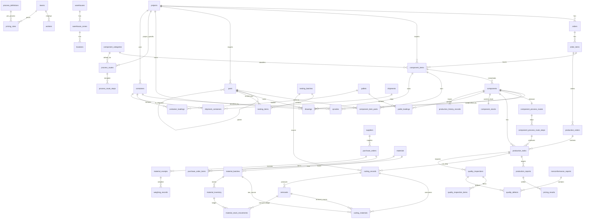

# 匠星智造 MES 数据库设计 V1.2 全面重新审查报告（Review）

> 项目：钢结构出口加工厂 MES
> 数据库：PostgreSQL 16（开发库 jiangxing_mes）
> 审查对象：docs/database_design_v1.1.md（48 张表）及已存在的 docs/database_design_v1.2.md 草案
> 文档性质：**审查报告 + V1.2 设计建议**，不是最终设计稿，不是 DDL
> 状态：**待人工评审 / 待业务确认**
> 编写日期：2026-09-16

---

## 0. 本轮工作边界声明

本轮**只做审查与设计建议**，以下操作均**未执行**：

- ❌ 未执行任何 SQL
- ❌ 未创建 PostgreSQL 业务表（已只读核实：jiangxing_mes 库用户表 = 0 张，仅有默认 plpgsql 扩展）
- ❌ 未创建、未执行任何 Alembic migration
- ❌ 未修改任何业务代码（backend/frontend/android 均为空占位目录）
- ❌ 未修改 Docker / PostgreSQL 配置
- ❌ 未修改 docs/database_design_v1.1.md（保持原样）
- ❌ 未修改已存在的 docs/database_design_v1.2.md（上一轮草案，本轮仅对其评审，见第 31 节）

本轮唯一新建文件：**docs/database_design_v1.2_review.md**（本文件）。

### 0.1 标记约定

| 标记 | 含义 |
|------|------|
| 【冲突】 | V1.1 与最新业务事实直接矛盾，必须改 |
| 【缺失】 | V1.1 完全没有覆盖的新业务域 |
| 【沿用】 | V1.1 设计合理，V1.2 可直接沿用 |
| 【待确认】 | 无法单方面确定，需人工/业务决策（见第 30 节） |
| 【建议】 | 技术层面的推荐方案，非已冻结规则 |

---

## 1. 项目现状核查结果（只读）

### 1.1 目录结构

```
匠星智造MES/
├─ android/        （空，.gitkeep）
├─ backend/        （空，.gitkeep）
├─ frontend/       （空，.gitkeep）
├─ database/       （空，.gitkeep，无任何 migration）
├─ deploy/docker/  （docker-compose.yml + 空 initdb/，无业务 SQL）
├─ docs/           （v1.0 / v1.1 / v1.1_review_pack / v1.2 草案 / v1.1_part1~5）
├─ scripts/ tests/ （空）
└─ README.md / .gitignore
```

- 无任何 Python/后端代码、无前端代码、无 migration 文件。
- deploy/docker/initdb/ 为空（仅 .gitkeep），无初始化业务脚本。

### 1.2 Git 状态

- 分支 main，存在 1 个提交：`550bb11 chore: initialize MES project environment`。
- docs/ 下设计文档均为 untracked（未提交），**无被跟踪文件被修改**。
- 结论：工作区"代码层 clean"（详见第 32 节汇报口径）。

### 1.3 PostgreSQL 现状

- 容器 `mes-postgres-dev`（postgres:16-alpine）运行中、healthy。
- 数据库 `jiangxing_mes` 存在，用户表数量经 information_schema 只读查询 = **0**。
- 扩展仅 `plpgsql 1.0`（默认）。
- 结论：**目前只有开发环境基础库，业务表尚未创建**，本轮设计不影响任何真实数据。

### 1.4 已有设计文档

| 文件 | 说明 |
|------|------|
| database_design_v1.0.md | 第 1 版设计 |
| database_design_v1.1.md | 第 2 版设计（本轮主要审查对象，自述"35 张表"，实际 48 张） |
| database_design_v1.1_review_pack.md | V1.1 人工评审包 |
| database_design_v1.2.md | 上一轮基于旧业务规则（"1 构件=1 物理件"）产出的修订草案 |
| v1.1_part1~5.md | V1.1 阅读拆分副本 |

---

## 2. V1.1 现状总结

### 2.1 设计主线

Project → Order → Order Item → Component → QR Code → Component Process Route（实例）→ Route Step → Production Task → Production Report → Quality Inspection → Component Stock → Shipment / Packing → Production History（不可变）。

工艺模板独立成线：Process Definition → Process Route（模板）→ Process Route Step，实例化后快照独立。

### 2.2 实际表数量（机械核对）

逐模块清点 8.1~8.12 节：

| 模块 | 数量 | 表 |
|------|------|----|
| 8.1 系统权限 | 5 | users, roles, permissions, user_roles, role_permissions |
| 8.2 组织人员 | 4 | departments, workers, work_centers, equipment |
| 8.3 项目订单 | 3 | projects, orders, order_items |
| 8.4 构件图纸 | 4 | component_categories, components, component_specifications, drawings |
| 8.5 二维码 | 2 | qrcodes, qrcode_scan_logs |
| 8.6 工艺工序 | 5 | process_definitions, process_routes, process_route_steps, component_process_routes, component_process_route_steps |
| 8.7 生产报工 | 3 | production_orders, production_tasks, production_reports |
| 8.8 质量 | 6 | quality_inspection_plans, quality_inspection_plan_items, quality_inspections, quality_inspection_items, quality_defects, nonconformance_reports |
| 8.9 仓储 | 6 | warehouses, locations, component_stocks, stock_in_records, stock_out_records, stock_transfer_records |
| 8.10 发运装箱 | 4 | shipments, shipment_items, packing_lists, packing_list_items |
| 8.11 履历 | 1 | production_history_records |
| 8.12 系统支撑 | 5 | operation_logs, system_configs, attachments, dictionaries, dictionary_items |
| **合计** | **48** | 文档第 600 行写"35 张"，**数字错误** |

### 2.3 V1.1 的合理基座（V1.2 应保留）

- 模板/实例分离的工艺路线结构（source_route_id/source_step_id 仅追溯）。
- 不可变履历 + 操作日志分工 + 同事务写入原则。
- 表类型分级 A/B/C/D 与 trigger 保护思路。
- 质检计划 → 计划检验项 → 检验记录 → 检验明细项的快照结构。
- 构件级当前库存（component_stocks）+ 入库/出库/转移事件分离的雏形。
- 部分唯一索引解决二维码一构件一主码的思路。
- attempt_no 支持返工的思路（但唯一约束锚点错误，见 4.4）。

### 2.4 V1.1 已暴露的设计缺陷（在新业务事实之外仍须修）

1. 表数量自相矛盾（写 35，实际 48；净增说明也算错）。
2. production_tasks 唯一约束 `(component_id, process_id, attempt_no)` 无法区分同构件同工序的不同路线步骤（焊接出现两次即冲突）。
3. component_stocks 同时有 `component_id UNIQUE` 与 `deleted_at`，软删后无法再建当前行。
4. stock_out_records.out_type 含 transfer，与 stock_transfer_records 重复；且正文引用了表中不存在的 `status` 字段（9.9.3"数据来源说明"）。
5. warehouse_id 与 location_id 各自独立 FK，可出现"A 仓库 + B 库位"错配。
6. qrcodes.is_primary 与 status='active' 语义重复；code_type 枚举 component/process/box 但只有 component_id，process/box 无目标实体。
7. 质检状态把"状态/结果/返工/复检"混在一个 status 中，复检覆盖原始检验记录风险。
8. quality_defects 与 NCR 无直接关系。
9. 构件订单明细追溯链断裂（V1.1 删了 components.order_item_id，又未在 production_orders 补 order_item_id）。
10. components.status 把返工/复检做成状态值，状态机过载。
11. production_reports 仅有 quantity + labor_time，无法表达重量、焊缝、切割长度等计量。
12. ER 图错误：`orders ||--o{ components`（实际无 FK）、`components }o--o{ component_categories`（多对多画法错误，实际 N:1），且缺大量真实关系。
13. DDL 创建顺序与 FK 依赖不一致（users/departments 循环依赖未给 bootstrap 方案）。
14. ERP 字段仅在说明中出现，需逐表确认（实测 projects/orders/components 三表有，其余无）。

---

## 3. 最新业务规则总结（本轮已确认事实）

| # | 业务域 | 已确认事实 |
|---|--------|-----------|
| F1 | 构件号 vs 实体 | 项目开始导入**构件清单、零件/部件清单、图纸**；一个构件号可对应多件实体（GZ1-1 × 12 件）；每个实体独立编号（GZ1-1-001…012）、独立追踪、独立二维码 |
| F2 | 安装位置 | 图纸含安装位置；V1 现场扫码查看安装位置；预留楼栋/区域/楼层/轴线/安装单元扩展，不做 BIM |
| F3 | 工艺路线 | 实际 19 道工序：排版、下料、组立、打底、埋弧、矫正、拼装、焊接、制孔、二次拼装、二次焊接、尺寸检、火校、打磨、成品检、抛丸、油漆、打包、发货；不同构件工序不同；按项目/构件类型匹配默认路线，导入后自动生成，主管可批量/单件调整，工人不能自选工序；任务由 MES 自动生成 |
| F4 | 套料下料 | 专人套料；构件清单→套料人员→套料图→激光下料，偶尔手工下料；记录套料人员/时间/批次/套料图、下料方式/人员/时间/结果/实际下料/材料消耗/余料/异常，可追责；V1 不做几何算法，套料结果 Excel/CSV 导入，预留 API |
| F5 | 材料 | 主材料钢板、型钢，另有辅材/必需品；采购多按吨、偶尔按自身单位；计量单位支持 t/kg/张/支/件/米/套/其他；区分采购/入库/库存/领用消耗/结算单位 |
| F6 | 过磅磅差 | 到厂过磅：区分合同量、供应商磅单重量、我方过磅重量、磅差量/率、时间、磅单附件、最终入库量、结算重量、磅差处理方式；不得用备注字段 |
| F7 | 余料 | 余料无人工编号，进公共余料池；不绑定原项目、可跨项目使用；必须保留产生与使用记录，可追溯来源/规格/材质/尺寸重量/时间/去向 |
| F8 | 采购优化 | 构件清单→材料需求→套料→库存→公共余料→在途采购→缺口→采购建议；钢板按重量、型钢须按材质/型号/截面/长度/根数/重量；型钢不足可经技术人员确认用钢板组焊替代，MES 只提示不自动批准 |
| F9 | 生产计量 | 完成/合格/返工/报废件数、理论/实际/完成重量、材料消耗、余料重量、焊缝/切割/加工长度、工时、设备工时、起止时间；生产事实与班组计价分离 |
| F10 | 班组计价 | 班组+工序+构件类型/结构条件+计价单位（吨/米/件）+单价+生效时间，规则可配置；生产事实不被计价覆盖；历史计价结果保留 |
| F11 | 质量 | V1 主要尺寸检、成品检，预留探伤等；预留 检验→不合格→缺陷→处理→返工→再生产→再检；原始检验不被覆盖 |
| F12 | 仓库 | 仓库→库区→库位→物料→批次→数量/重量→状态；覆盖原材料/辅材/余料/成品；动作：入库/领料/出库/转库/退料/余料入库/余料领用/报废；库存与履历一致 |
| F13 | 托盘集装箱 | 1 实体构件同一时间只属 1 个当前托盘；1 托盘多构件；1 集装箱多托盘；1 项目多集装箱；柜型/容量/承载不同；必须区分构件/托盘/集装箱三层；历史拆包重包保留 |
| F14 | 扫码 | V1 仅两种二维码：构件码（项目/构件号/实体编号/类型/重量/图纸/履历/质量/位置/托盘/集装箱/安装位置）、集装箱码（箱号/柜型/承载力/实载/项目/物流/目的地/状态/托盘/构件清单） |
| F15 | 采购 | 采购原材料/耗材/必需品；支持采购→到货→验收→入库；不做完整财务 ERP |
| F16 | 现场 | V1 扫码看构件信息与安装位置；扩展字段预留（楼栋/区域/楼层/轴线/安装单元） |

---

## 4. V1.1 与最新业务事实的重大冲突清单

### 4.1【冲突 C-01】"1 构件 = 1 件"铁律错误（影响全局）

- V1.1 第 1392-1394 行明文："钢结构构件是单件管理（1 构件 = 1 件）"，component_stocks 对 component_id 1:1，所有数量字段按单件设计。
- 已存在的 v1.2.md 草案进一步把它升级为"核心业务铁律"并加了多处 `CHECK(quantity=1)`。
- 最新事实 F1：**一个构件号可以对应多件实体**（GZ1-1 × 12）。
- 影响：components 语义、二维码绑定、工艺路线实例粒度、生产任务粒度、质检粒度、库存粒度、发运粒度全部需要重新分层。
- 这是本轮最大变更，详见第 6 节。

### 4.2【冲突 C-02】缺整个"物料/采购/仓储（原材料侧）"业务域

- V1.1 的仓储只覆盖**成品构件**（component_stocks）；没有物料主数据、供应商、采购、到货验收、过磅磅差、物料批次、物料库存、领料退料、余料池任何一张表。
- F5/F6/F7/F8/F12/F15 全部无表可落。
- V1.1 第 1152 行甚至写明"原材料批次由 ERP 管理"——与 F6/F12"MES 必须记录来料批次、过磅、库存动作"**直接矛盾**【待确认 Q-26：边界以哪一侧为准；按本轮指令理解，原材料批次/过磅/库存归 MES】。

### 4.3【冲突 C-03】缺"套料/下料"业务域

- F4 要求记录套料人员/时间/批次/套料图、下料方式/人员/时间/结果/材料消耗/余料/异常。
- V1.1 仅有工序主数据（process_definitions），19 道工序中"排版/下料"没有任何业务表承接。
- 下料是"钢板→零件"的转换点，是材料消耗与余料产生的源头，缺它则材料需求闭环（F8）无法成立。

### 4.4【冲突 C-04】缺"零件/部件清单"与 BOM

- F1 要求导入零件/部件清单；F4 套料对象是零件；F8 材料需求源自构件清单 + BOM。
- V1.1 只有 components（构件），没有 parts（零件/部件），也没有"构件号需要哪些零件、各几件"的用量关系。

### 4.5【冲突 C-05】托盘与集装箱被混成一个实体

- V1.1 shipments.container_no 是单值字段（一个发运单一个箱号），packing_lists 用 box_no 表达"箱"。
- F13 明确三层：实体构件 → 托盘（N:1 当前）→ 集装箱（N:1），且一项目多箱、箱有柜型/承载力/实载重量，一构件历史上可拆包重包。
- 现模型无法表达：一托盘多构件、一箱多托盘、一项目多箱、托盘历史、装箱能力校验。

### 4.6【冲突 C-06】二维码类型枚举与新事实不符

- V1.1：code_type = component/process/box，且 box/process 无目标实体。
- F14：V1 只要 **component + container** 两种码。旧枚举中的 box 从未实现，container 完全缺失。

### 4.7【冲突 C-07】生产计量模型过窄

- production_reports 仅有 quantity、labor_time_min。
- F9 要求件数（完成/合格/返工/报废）、三类重量、材料消耗/余料重量、焊缝/切割/加工长度、工时与设备工时、起止时间。
- F10 另要求班组计价独立成域（V1.1 无班组表、无计价规则、无计价结果）。

### 4.8【冲突 C-08】工艺路线"自动匹配 + 自动生成 + 批量调整"无承载

- V1.1 模板只能按 component_categories 挂一个 is_default；没有"项目专用路线"、没有匹配优先级、没有路线自动生成/批量调整的批次与审计。
- F3 要求：项目导入构件后自动生成实例路线，主管批量调整、特殊单件调整，工人扫码只看到当前应做工序、不能自选。

### 4.9【冲突 C-09】仓库层级少"库区"，且库存模型只适用单件成品

- F12 要求 仓库→库区→库位→物料→批次→数量/重量→状态。
- V1.1 只有 warehouses→locations 两级；成品库存是"1 构件 1 行"，原材料需要的是"按物料+批次聚合的数量/重量结存 + 流水"，两套模型均要存在。

### 4.10【冲突 C-10】安装位置无字段可落

- F2/F16：扫码要展示安装位置，V1 先做构件→安装位置关联。
- V1.1 components 无任何安装位置字段；drawings 也只有图号/版本/文件路径。

### 4.11【冲突 C-11】质检类型覆盖不足但扩展方式错误

- V1.1 inspection_type 写死 CHECK：first/self/patrol/final。
- F11：V1 主要是**尺寸检、成品检**，以后加**探伤**等专业检验。写死 CHECK 每加一种都要改表结构，建议字典化（V1 可保留 CHECK 但改为可扩展枚举集或引用字典）。

### 4.12【冲突 C-12】字段长度/编码规则可能不兼容实体编号

- F1 实体编号形如 GZ1-1-001；二维码内容规则 V1.1 为 `MES-{项目编码}-{构件业务编号}-{校验码}`。
- 构件业务编号将从 B001 变为 GZ1-1-001 形式，VARCHAR(32) 大概率仍够，但编码规则与校验码输入需重定义【待确认 Q-02 编号规则】。

---

## 5. V1.2 总体建模调整建议

### 5.1 从"单层构件"改为"三层 + 批次"结构

```
项目 projects
 ├─ 构件清单行 component_items（构件号层：GZ1-1，计划 12 件）── 图纸 drawings
 │    └─ BOM：component_item_parts ── parts（零件/部件清单：P001 钢板件…）
 │
 ├─ 实体构件 components（实例层：GZ1-1-001 … GZ1-1-012）
 │    ├─ 二维码 qrcodes（每实体独立码）
 │    ├─ 构件工艺路线实例 component_process_routes / steps（每实体一条）
 │    ├─ 生产任务 production_tasks（route_step 锚点，MES 自动生成）
 │    ├─ 质检/缺陷/NCR
 │    ├─ 成品当前库存 component_stocks（1 实体 1 行）
 │    └─ 托盘装载历史 pallet_loadings → 集装箱装载历史 container_loadings
 │
 └─ 导入批次 import_batches（构件清单/零件清单/图纸/套料结果 Excel/CSV 留痕）
```

【建议】保留物理表名 `components` 但**重定义为"实际构件实体"**（改动面最小），新增 `component_items` 作为构件号层；理由：V1.1 下游 20+ 张 FK 全部指向实体构件（码、任务、质检、库存、发运），若反过来把 components 改成构件号层，所有 FK 都要换表，风险更大。备选方案见【待确认 Q-01】。

### 5.2 物料侧独立成域（与成品侧平行）

```
供应商 suppliers
计量单位 units（t/kg/张/支/件/米/套/其他）
物料主数据 materials（钢板/型钢/焊材/涂料/辅材，材质/截面/厚度，四类单位）
物料批次 material_batches（炉批号、质保书）
采购单 purchase_orders / purchase_order_items
到货验收 material_receipts → 过磅 weighing_records（磅差/结算重量）
库区 warehouse_zones（仓库→库区→库位）
物料结存 material_inventory（物料+批次+库位，数量+重量+状态）
物料流水 material_stock_movements（入库/领料/出库/转库/退料/余料入/余料领/报废，不可变）
余料池 remnants（系统编号、跨项目、产生/使用可追溯）
需求计算 material_requirement_runs/items → 采购建议 purchase_suggestions
型钢替代 material_substitutions（技术人员审批）
```

### 5.3 套料/下料独立成域并接入材料与零件

```
nesting_batches（套料批次：专人、时间、套料图附件）
  └ nesting_items（套料明细：零件、材质、板厚、张数；Excel/CSV 导入）
cutting_records（下料：方式 laser/manual 等、人员、设备、时间、结果、异常）
  └ cutting_materials（材料消耗：原材料批次 或 余料 → 消耗量/重量；产出余料 → remnants）
```

### 5.4 包装/物流三层实体

```
components(实体) ──当前 N:1── pallets(托盘)      pallet_loadings 保留全部装卸历史
pallets         ──当前 N:1── containers(集装箱)  container_loadings 保留全部装卸历史
containers      ──N:1────── shipments(发运单)    shipment_containers 关联（一项目多箱）
```

- V1.1 packing_lists / packing_list_items 建议由 pallets / pallet_loadings **取代合并**（纸质装箱单可作为报表输出，不必再作业务表）【待确认 Q-19】。
- 集装箱有独立二维码（qrcodes.code_type='container', container_id）。
- 托盘 V1 不做二维码（F14 只要两种码）【待确认 Q-18】。

### 5.5 生产事实与计价分离

```
production_reports（不可变生产事实，扩展计量字段）
        ↓ 计价动作读取事实 + 规则快照
pricing_rules（可配置规则：班组+工序+构件类型/结构条件+吨/米/件+单价+生效时间）
pricing_results（不可变计价结果，保存规则快照与金额；规则以后改了也不影响历史结果）
```

### 5.6 V1.2 表数量预估

- V1.1：48 张。
- 建议新增：**34 张**（其中 1 张 route_generation_batches 为可选项，见第 20 节）。
- 建议废弃合并：**2 张**（packing_lists、packing_list_items）。
- V1.2 预计正式表：48 − 2 + 34 = **80 张**（不含可选项为 79 张）。
- 全部为建议值，待第 30 节问题确认后再冻结。

---

## 6. 构件实体与构件号建模方案（最高优先级）

### 6.1 概念定义（必须在 V1.2 文档中写死术语）

| 术语 | 定义 | 例子 | V1.2 落表 |
|------|------|------|-----------|
| 构件号（构件型号/清单行） | 图纸上的构件标记，同一型号可生产多件 | GZ1-1 | component_items |
| 计划件数 | 该构件号在本项目需要的实体数 | 12 | component_items.planned_qty |
| 实体构件（件号/序列号） | 一个物理构件，独立追踪、独立二维码 | GZ1-1-001 | components（重定义） |
| 零件/部件 | 下料与拼装的下级物料，构件由零件装配而成 | P001、B01 | parts + component_item_parts |

### 6.2 component_items（新增，构件清单行 / 构件号层）

| 字段 | 类型 | 约束 | 说明 |
|------|------|------|------|
| id | BIGINT | PK | |
| project_id | BIGINT | FK→projects.id | 项目 |
| category_id | BIGINT | FK→component_categories.id NULL | 构件类型（路线匹配/计价条件用） |
| order_item_id | BIGINT | FK→order_items.id NULL | 订单明细追溯（修 V1.1 断链，见 6.6） |
| component_no | VARCHAR(32) | NOT NULL | 构件号，如 GZ1-1 |
| name | VARCHAR(200) | NOT NULL | 构件名称 |
| planned_qty | INTEGER | NOT NULL CHECK ≥ 1 | 计划实体件数（12） |
| material_grade | VARCHAR(64) | NULL | 主材材质（如 Q355B） |
| section_spec | VARCHAR(64) | NULL | 截面/规格（型钢等） |
| theoretical_weight_kg | NUMERIC(12,3) | CHECK ≥ 0 | **单件**理论重量 |
| total_theoretical_weight_kg | NUMERIC(14,3) | CHECK ≥ 0 | 总理论重量（单件×件数，可由服务层算并落库，报表字段） |
| install_position_text | VARCHAR(255) | NULL | 安装位置文本（V1 主用，来自图纸） |
| install_building / install_area / install_floor / install_axis / install_unit | VARCHAR(64) 各 NULL | | 结构化安装位置（V1 预留，可空） |
| drawing_no | VARCHAR(64) | NULL | 图号（冗余） |
| import_batch_id | BIGINT | FK→import_batches.id NULL | 导入批次 |
| status | VARCHAR(20) | CHECK | imported/released/in_production/completed/closed/cancelled |
| 通用字段 | | | A 类（created/updated/created_by/updated_by/deleted_at/remark/version） |

- UNIQUE：`(project_id, component_no)`。
- 数量语义：planned_qty 是"构件号层计划实体数"，不是库存数量。

### 6.3 components（重定义：实际构件实体层）

字段调整建议（相对 V1.1 9.4.2）：

| 变更 | 说明 |
|------|------|
| 新增 component_item_id BIGINT NOT NULL FK→component_items.id | 所属构件号 |
| 新增 instance_seq SMALLINT NOT NULL CHECK ≥ 1 | 同构件号内流水（1..12） |
| 新增 instance_code VARCHAR(64) NOT NULL | 实体编号 GZ1-1-001（编码规则【待确认 Q-02】） |
| 保留 project_id / category_id / component_no / material / 规格重量字段 | 快照字段，避免每条轨迹都 JOIN 构件号层 |
| weight_kg | 语义改为"本实体重量"；新增 actual_weight_kg（实测重量），原 weight_kg 作理论重量 |
| 安装位置字段 | 从构件号层默认带出，允许实体级修正（实际就位位置），全部可空 |
| 删除/替换 | 删除 UNIQUE(project_id, component_no)（同号多实体不再唯一） |

约束建议：
- UNIQUE `(component_item_id, instance_seq)`
- UNIQUE `(project_id, instance_code)`
- CHECK：instance_seq ≥ 1；理论/实际重量 ≥ 0
- 索引：component_item_id、project_id+status、category_id、pallet/container 当前关系不在本表（见第 16 节，通过装载表查询）

状态机见第 24 节。每个实体独立经历完整生命周期与二维码。

### 6.4 零件/部件与 BOM（新增 3 张表）

**parts（零件/部件清单，项目级）**

| 字段 | 类型 | 约束 | 说明 |
|------|------|------|------|
| id | BIGINT | PK | |
| project_id | BIGINT | FK→projects.id | 项目 |
| part_no | VARCHAR(32) | NOT NULL | 零件/部件标记号（图号/件号） |
| part_type | VARCHAR(20) | CHECK | part（零件）/assembly（部件） |
| name | VARCHAR(200) | NULL | 名称 |
| material_grade | VARCHAR(64) | NULL | 材质（Q355B） |
| thickness_mm / length_mm / width_mm | NUMERIC(10,2) | CHECK ≥ 0 NULL | 板件尺寸（套料关键） |
| section_spec | VARCHAR(64) | NULL | 型钢件截面 |
| theoretical_weight_kg | NUMERIC(12,3) | CHECK ≥ 0 | 单件理论重量 |
| total_qty | INTEGER | CHECK ≥ 0 | 清单总数量（项目汇总，导入值） |
| import_batch_id | BIGINT | FK→import_batches.id NULL | |
| parent_part_id | BIGINT | FK→parts.id NULL | 部件下级（V1 仅预留一层/自引用，多级 BOM【待确认 Q-03】） |
| 通用字段 | | A 类 | |

- UNIQUE `(project_id, part_no)`。

**component_item_parts（构件号 BOM 用量）**

| 字段 | 说明 |
|------|------|
| component_item_id FK→component_items.id | 构件号 |
| part_id FK→parts.id | 零件/部件 |
| qty_per NUMERIC(10,2) NOT NULL CHECK > 0 | 每件构件用量 |
| created_at/created_by | D 类风格 |
- PK `(component_item_id, part_id)`。
- 材料需求 = Σ BOM 用量 × 计划件数（第 11 节），并以套料结果校准。

### 6.5 导入批次（新增 import_batches）

| 字段 | 说明 |
|------|------|
| id / batch_no UNIQUE / batch_type | batch_type：component_list/part_list/drawing/nesting_result |
| project_id FK NULL | 项目级导入 |
| file_name / file_path / attachment_id | 原始 Excel/CSV 留存（attachments） |
| total_rows / success_rows / failed_rows / error_file_path | 导入结果统计 |
| status | uploaded/parsed/imported/failed/cancelled |
| imported_by / occurred_at + A 类字段 | |

> 作用：构件清单、零件清单、图纸目录、套料结果全部通过文件导入并留痕，满足"导入即可追溯"与 F4"结果优先 Excel/CSV 导入"。

### 6.6 订单明细追溯（修 V1.1 断链）

- 在 **component_items 增加 order_item_id（可空）**：order_items → component_items → components，链完整。
- production_orders 同步增加 order_item_id（承接上一轮 v1.2 草案 P0-12，仍然成立）。
- 一个工单对一个还是多个 order_item【待确认 Q-21】，V1 建议单字段 1:1。
- 不把 order_id/order_item_id 直接塞回 components 实体表（避免与构件号层重复事实）。

### 6.7 数量字段语义重新定义（替代 v1.2 草案的 CHECK=1）

| 位置 | V1.1/v1.2 草案 | V1.2 新建议 |
|------|---------------|-------------|
| component_items.planned_qty | 无 | ≥1，构件号计划实体数 |
| components 实体 | quantity=1 铁律 | 实体本身就是 1 件，**不再设数量字段** |
| stock_in/out（成品） | CHECK quantity=1 | 改为按实体记录，无 quantity 字段（1 行=1 实体事件） |
| shipment_items/packing 类 | quantity=1 | 按实体记录；托盘/装箱关系本身即数量 1 |
| production_tasks | planned/actual_quantity | 任务绑定实体，删除数量字段或固定语义（见 12.1） |
| 物料域数量 | 无 | 数量 + 重量双计量，按库存单位，允许小数（NUMERIC） |

---

## 7. 工艺路线自动匹配与批量调整方案

### 7.1 工序主数据（process_definitions 初始化 19 道）

V1.2 以**初始化数据**方式提供 19 道工序（排版、下料、组立、打底、埋弧、矫正、拼装、焊接、制孔、二次拼装、二次焊接、尺寸检、火校、打磨、成品检、抛丸、油漆、打包、发货），不把"19 道"写死成任何构件的固定路线。

- 明确 `process_definitions.sequence` 仅为主数据展示顺序，**不是执行顺序**；执行顺序永远以 route_step.step_no 为准（沿用并强调 V1.1 正确部分）。
- work_center_type 与 work_centers 打通：下料/激光、焊接、油漆、打包等。
- need_inspection：尺寸检/成品检等工序为质检挂接点；探伤以后作为新工序+新检验类型扩展，不改表结构。
- 【待确认 Q-25】"发货"作为工序与发运模块存在重叠：建议"发货"工序只做车间节点确认，物流事实仍归 shipments/containers。

### 7.2 模板可按"项目 + 构件类型"匹配（修改 process_routes）

- process_routes 新增 `project_id BIGINT NULL FK→projects.id`：
  - project_id 为空 = 全局/类别默认模板；
  - project_id 非空 = 项目专用模板。
- 保留 category_id（构件类型）与 is_active/is_default。
- 匹配优先级【建议】：①项目+类别专用 → ②项目默认 → ③全局类别默认 → ④系统兜底路线。
- 不新建复杂规则表，用 project_id + category_id 两个维度足够（避免过度设计）；匹配失败必须人工选择并记录。

### 7.3 实例自动生成与调整

- 触发点：构件清单导入并确认（component_items + 实体 components 生成后），服务端批量为每个实体生成 component_process_routes + component_process_route_steps（快照独立，模板之后改动不影响已生成实例——沿用 V1.1 原则）。
- 批量调整：生产主管按"项目 / 构件类型 / 勾选构件号范围"批量增删改步骤；单件调整针对特殊构件。
- 调整动作必须：①权限受控（普通工人不可见调整入口）；②写 operation_logs；③已开工的步骤不允许删除（只允许追加/置取消）【建议规则，待确认 Q-24】。
- 工人端：扫码只返回该实体当前应执行步骤（第一个未完成的 route_step），不提供自由选工序入口。

### 7.4 路线生成/调整批次（可选新表 route_generation_batches）

| 字段 | 说明 |
|------|------|
| id / batch_no | |
| project_id / scope | 生成范围（auto_import/batch_adjust/single_adjust） |
| source_route_id | 使用的模板 |
| target_count / success_count / fail_count | 影响实体数 |
| status / created_by / occurred_at | |

> 标【可选】：也可仅用 import_batches + operation_logs 表达。是否单列表【待确认 Q-24】，本报告把它计入"34 张新增中的 1 张可选"。

---

## 8. 套料 / 下料建模方案

### 8.1 流程

```
构件清单/零件清单(BOM)
   → 套料任务分配给套料人员
   → 专业套料软件几何排版（V1 不在 MES 内做算法）
   → 套料结果 Excel/CSV 导入（nesting_batches + nesting_items，附套料图）
   → 激光下料（偶尔手工下料）：cutting_records
   → 材料消耗出库（原材料批次 或 公共余料）：cutting_materials + material_stock_movements
   → 余料产生入池：remnants（余料入库流水）
   → 零件产出（实际下料结果/异常/追责）
```

### 8.2 nesting_batches（套料批次，新增）

| 字段 | 类型/约束 | 说明 |
|------|-----------|------|
| id / batch_no UNIQUE | | 套料批次号 |
| project_id | FK→projects.id | 项目 |
| nesting_by | BIGINT FK→users.id/workers.id | 套料人员（专人） |
| nested_at | TIMESTAMPTZ | 套料时间 |
| status | VARCHAR(20) | pending/assigned/nesting/imported/completed/cancelled |
| source_file_attachment_id | FK→attachments.id | 套料结果 Excel/CSV |
| drawing_attachment_id | FK→attachments.id NULL | 套料图（可多张→走 attachments 多态关联） |
| plate_count / utilization_rate | NUMERIC NULL | 板材张数/材料利用率（导入计算，报表用） |
| remark + A 类字段 | | |

### 8.3 nesting_items（套料明细，新增）

| 字段 | 说明 |
|------|------|
| nesting_batch_id FK | 批次 |
| part_id FK→parts.id NULL | 对应零件（允许导入时暂未匹配，匹配后回填） |
| part_no / material_grade / thickness_mm | 导入原始值快照（防止零件主数据后改） |
| sheet_no VARCHAR(32) | 套料图中的板号/排版图编号 |
| qty INTEGER ≥ 1 | 该零件在本批下料数量 |
| cut_length_mm NUMERIC(12,2) | 切割长度（汇总/计价/计量用） |
| matched_status | imported/matched/conflict（与 parts 匹配状态） |
| 索引：(nesting_batch_id)、(part_id)、(sheet_no) | |

【待确认 Q-04】是否需要把每张被排版的钢板（sheet）单独建 nesting_sheets 表（板厚/材质/张数/余料预测）。建议 V1 用 nesting_items.sheet_no + 字段承载，不单独建表；若要逐板追溯消耗再升级。

### 8.4 cutting_records（下料记录，新增）

| 字段 | 类型/约束 | 说明 |
|------|-----------|------|
| id / cutting_no UNIQUE | | |
| project_id | FK | 项目 |
| nesting_batch_id | FK NULL | 来源于哪个套料批次（手工下料可空） |
| task_id | FK→production_tasks.id NULL | 对应"下料"工序任务（任务由 MES 自动生成，扫码报工关联） |
| cut_method | VARCHAR(20) CHECK | laser/manual，+预留 flame/plasma/shear【待确认 Q-05】 |
| equipment_id | FK→equipment.id NULL | 激光设备等 |
| operator_id | FK→workers.id | 下料操作人员 |
| started_at / completed_at | TIMESTAMPTZ | 实际下料起止时间 |
| result_status | VARCHAR(20) | normal/partial/exception/scrap |
| exception_desc | TEXT NULL | 异常情况（下料错误追责核心） |
| produced_parts_qty / exception_qty | INTEGER | 实际下料情况 |
| equipment_run_min | NUMERIC(10,2) | 设备工时 |
| 通用字段 A 类 | | |

### 8.5 cutting_materials（下料材料消耗/余料产出，新增）

| 字段 | 说明 |
|------|------|
| cutting_record_id FK | 下料记录 |
| source_type | raw_material（原材料批次）/ remnant（公共余料） |
| material_batch_id FK→material_batches.id NULL | 原材料时 |
| remnant_id FK→remnants.id NULL | 消耗余料时 |
| material_id FK→materials.id | 物料（钢板/型钢） |
| consumed_qty / consumed_weight_kg | 实际消耗（数量按库存单位 + 重量） |
| produced_remnant_id FK→remnants.id NULL | 本次切割新产生的余料 |
| CHECK：source_type 与对应外键非空一致；消耗 ≥ 0 | |
| 同事务联动 | 写 material_stock_movements（领料/余料领用）；余料产出写 remnants + 余料入库流水 |

> 追责闭环：人（operator/nesting_by）、时间、批次、套料图、设备、用料（炉批/余料）、结果、异常，全部可按零件/构件/批次反查。

---

## 9. 材料 / 采购 / 过磅建模方案

### 9.1 计量单位（新增 units + materials 上的四类单位）

**units（B 类字典）**：code/name（t、kg、张、支、件、米、套、其他）、is_active。

**materials（物料主数据，新增）**

| 字段 | 说明 |
|------|------|
| id / material_no UNIQUE / name | 物料编码/名称 |
| material_category | plate（钢板）/section（型钢）/consumable（焊材耗材）/coating（油漆涂料）/auxiliary（辅材）/other |
| material_grade | 材质 Q355B/Q235B… |
| section_spec | 型钢型号/截面，如 H400×200×8×13 |
| thickness_mm | 钢板默认厚度（主数据默认，批次可带实际） |
| base_unit_id | 库存基准单位（建议 kg 或米，按物料类别） |
| purchase_unit_id / stock_unit_id / issue_unit_id / settlement_unit_id | 采购/库存/领用/结算四类单位 |
| to_base_purchase / to_base_stock / to_base_issue / to_base_settlement NUMERIC | 各单位→基准单位换算系数 |
| unit_weight_kg_per_m NUMERIC NULL | 型钢每米理论重量（米↔kg） |
| theoretical_density | 理论密度（默认 7850 kg/m³，钢板换算用） |
| safety_stock / is_active / 通用 B 类字段 | |

【待确认 Q-09】换算系数是固定主数据还是按批次规格动态；理论重量（钢板体积×7.85）由系统计算还是人工录入——建议系统按尺寸+密度计算、允许人工覆写并留痕。

### 9.2 供应商（新增 suppliers，B 类）

code/name/contact_person/phone/address、is_active、通用字段。不做财务字段（税率/发票归未来 ERP 边界，【待确认 Q-12】）。

### 9.3 物料批次（新增 material_batches）

| 字段 | 说明 |
|------|------|
| id / batch_no UNIQUE | MES 批次号 |
| material_id FK | 物料 |
| supplier_id FK NULL | 供应商 |
| heat_no | 炉批号（钢板/型钢质保书关键追溯项） |
| cert_attachment_id | 质保书附件 |
| spec_snapshot（材质/厚度/截面 JSONB 或列） | 收货时规格快照 |
| received_at / 通用 A 类字段 | |

> 修 C-02：原材料批次改由 **MES 管理**（V1.1 曾写"由 ERP 管理"）。

### 9.4 采购（新增 2 张表）

**purchase_orders**：po_no UNIQUE、supplier_id、status（draft/submitted/approved/sent/partial_received/received/closed/cancelled）、order_date、expected_date、备注 + A 类。
**purchase_order_items**：po_id、material_id、qty、unit_id、unit_price、amount、received_qty（累计到货）、required_date；索引 po_id、material_id。

### 9.5 到货验收 + 过磅（新增 2 张表，磅差不得用备注）

**material_receipts（到货验收）**

| 字段 | 说明 |
|------|------|
| id / receipt_no UNIQUE | |
| po_id / po_item_id FK | 关联采购（也支持无采购单的零星到货，po_id 可空【待确认】） |
| material_id / material_batch_id（验收合格后生成批次） | |
| supplier_id | |
| arrived_at | 到货时间 |
| acceptance_status | arrived/pending_inspection/accepted/rejected |
| accepted_qty / accepted_weight_kg | 验收数量/重量 |
| inspector_id / inspected_at | 验收人 |
| 通用 A 类字段 | |

**weighing_records（过磅与磅差）**

| 字段 | 类型 | 说明 |
|------|------|------|
| id / weighing_no UNIQUE | | |
| receipt_id FK UNIQUE? | 到货单（是否多次过磅【待确认 Q-11】，V1 建议一验收单可多次过磅则不加 UNIQUE） |
| contract_qty / contract_weight_kg | NUMERIC | 采购/合同数量重量 |
| supplier_slip_weight_kg | NUMERIC | 供应商磅单重量 |
| gross_weight_kg / tare_weight_kg / net_weight_kg | NUMERIC | 我方毛重/皮重/净重（实际过磅） |
| diff_weight_kg | NUMERIC GENERATED/服务端算 | 磅差 = 我方净重 − 供应商磅单 |
| diff_rate | NUMERIC(8,4) | 磅差率 = 磅差/供应商磅单 |
| weighed_at | TIMESTAMPTZ | 过磅时间 |
| slip_attachment_id | FK→attachments | 磅单/附件 |
| stock_in_weight_kg | NUMERIC | **最终入库重量** |
| settlement_weight_kg | NUMERIC | **结算采用重量**（与入库重量可不同） |
| diff_disposition | VARCHAR(20) | accepted_as_is（让步接收）/price_deduct（扣款）/return_supplier（退货）/replenish（补货）【待确认 Q-10 枚举】 |
| status | | pending/weighed/confirmed |
| 通用 A 类字段 | | |

CHECK：各重量 ≥ 0；diff/diff_rate 由服务端计算后落库（报告字段）。

### 9.6 物料库存（新增 3 张表 + 库区）

**warehouse_zones（库区，新增）**：warehouse_id FK、code、name、is_active；UNIQUE(warehouse_id, code)。
**locations 修改**：新增 zone_id FK→warehouse_zones.id；保留 V1.1 联合一致性修复（UNIQUE(id, warehouse_id)，联合外键）。层级：warehouse→zone→location。

**material_inventory（物料结存 / 当前状态，A* 类无软删）**

| 字段 | 说明 |
|------|------|
| id | |
| warehouse_id / zone_id / location_id | 联合外键保证不错配（沿用 V1.2 草案 P0-5 思路） |
| material_id / material_batch_id | 物料 + 批次（批次可空为无批管理物料，但钢材必须有批） |
| quantity NUMERIC(14,4) | 结存数量（按库存单位） |
| weight_kg NUMERIC(14,3) | 结存重量 |
| status | available/reserved/quarantined/scrapped |
| 通用：created/updated/created_by/updated_by，**无 deleted_at**（当前状态表） | |
| UNIQUE(warehouse_id, zone_id, location_id, material_id, COALESCE(material_batch_id,0)) | 同一库位同物料同批一行 |

**material_stock_movements（物料流水，C 类不可变）**

| 字段 | 说明 |
|------|------|
| id / occurred_at / operator_id | C 类基座 |
| movement_type | inbound（入库）/issue（领料）/outbound（出库）/transfer（转库）/return（退料）/remnant_in（余料入库）/remnant_issue（余料领用）/scrap（报废） |
| warehouse_id/zone_id/location_id（from/to 两组） | |
| material_id / material_batch_id / remnant_id NULL | |
| qty / weight_kg（带正负号或两列，建议两列正数 + 方向由类型定） | |
| ref_table/ref_id | 多态来源（purchase receipt、cutting record、work order…），应用层保证引用完整 |
| project_id NULL | 领用/消耗归属项目（余料跨项目时，使用项目≠来源项目） |
| 索引：material+batch、location、occurred_at、ref | |

> 所有 8 类库存动作只写流水 + 同事务更新结存（SELECT ... FOR UPDATE 行锁，沿用 V1.2 草案 P0-6 并发原则），库存与履历天然一致。不另建 5 张领料/退料表【待确认 Q-08 是否按财务习惯拆表】。

---

## 10. 余料公共池建模方案

### 10.1 核心原则（F7）

- 余料**无人工业务编号**：由系统自动生成内部编码（建议规则：YL+日期+流水，或纯 BIGINT 配 QR/标签可后补）【待确认 Q-06】。
- 不绑定原项目：产生时记录 source_project_id 仅作来源追溯；使用时 project_id 可为任意项目（跨项目）。
- "不编号 ≠ 不追溯"：来源切割记录、材质、规格厚度、尺寸、重量、产生时间、当前库位、使用记录全部保留。

### 10.2 remnants（新增）

| 字段 | 类型/约束 | 说明 |
|------|-----------|------|
| id | BIGINT PK | 系统内部 ID（主追踪键） |
| remnant_no | VARCHAR(32) UNIQUE NULL | 系统自动编码（非人工编号；V1 甚至可只打标签不编号） |
| source_cutting_record_id | FK→cutting_records.id NOT NULL | 产生记录 |
| source_project_id | FK→projects.id | 来源项目（仅追溯） |
| source_nesting_batch_id | FK NULL | 来源套料批次 |
| material_id / material_grade / thickness_mm / section_spec | | 材质规格快照 |
| length_mm / width_mm / weight_kg | NUMERIC | 尺寸/重量 |
| warehouse_id / zone_id / location_id | 联合外键 | 当前库位 |
| status | VARCHAR(20) | available/reserved/used/scrapped |
| used_cutting_record_id | FK NULL | 被哪个下料记录消耗 |
| used_project_id | FK NULL | 使用项目（可≠来源项目） |
| used_at | TIMESTAMPTZ NULL | |
| 通用 A 类字段（有 updated_at，无 deleted_at？） | | 建议 A*：状态流转 UPDATE，不做软删；历史在流水 |

状态机：available→reserved→used（终态）；available/reserved→scrapped（终态）。

### 10.3 产生与使用事务（与第 8/9 节联动）

- 产生：cutting_records 完成事务内写 remnants + movement(remnant_in) + material_inventory（余料作为一种库存对象，见下）。
- 使用：cutting_materials.source_type='remnant' 事务内把 remnants 置 used + movement(remnant_issue)，允许 used_project_id ≠ source_project_id。
- 【待确认 Q-07】余料是否进入 material_inventory 统一结存：建议**是**（material_id 用"余料"虚拟物料或直接以 remnant_id 入流水），但实体属性仍以 remnants 表为准。

---

## 11. 材料需求与采购建议建模方案（F8）

### 11.1 计算链路

```
构件清单(component_items.planned_qty)
 × BOM(component_item_parts.qty_per, parts 材质/规格/尺寸/单重)
 = 毛需求
 再叠加套料结果(nesting_items) 校准钢板实际张数/切割长度
 − 现有库存(material_inventory available)
 − 公共余料池(remnants available）
 − 已采购未到货(po_items 未交量)
 = 材料缺口
 → purchase_suggestions（采购建议）
```

- 钢板按重量汇总；型钢必须按 材质+型号+截面+长度+根数+重量 多维计算，不能只算吨。

### 11.2 新增表

**material_requirement_runs（计算批次）**：run_no、project_id、trigger_type（manual/import/nesting_import）、status（running/completed/failed）、params JSONB、started/completed_at、created_by。
**material_requirement_items（需求明细）**：run_id、project_id、material_id、material_grade、section_spec、required_length_m/required_qty/required_weight_kg、source_type（bom/nesting）、source_ref（多态到 BOM 或套料明细）、deduct_stock_weight、deduct_remnant_weight、deduct_on_order_weight、gap_weight/gap_qty。
**purchase_suggestions（采购建议）**：run_id、material_id、suggest_qty/unit/suggest_weight_kg、status（open/converted/ignored/expired）、converted_po_item_id NULL、confirmed_by/at。

> 每次运行生成新 run 与明细（快照），不覆盖历史；采购建议是**建议**，转采购单需人工确认。

### 11.3 型钢不足的替代（新增 material_substitutions）

| 字段 | 说明 |
|------|------|
| requirement_item_id FK | 针对哪个缺口 |
| original_material_id / original_spec | 原设计型钢 |
| substitute_type | plate_welded（钢板组焊替代）/other |
| substitute_desc / estimated_weight_kg / estimated_qty | 替代方案与估算 |
| reason | 缺货等 |
| status | suggested/approved/rejected |
| reviewed_by（技术人员）/ reviewed_at / review_comment | MES 只提示和计算，**不能自动批准**，必须技术人员确认 |

---

## 12. 生产计量方案（F9）

### 12.1 production_tasks 字段语义

- 任务绑定**实体构件 + route_step**（沿用 V1.2 草案的正确修复：UNIQUE(route_step_id, attempt_no)，route_step_id 是身份锚点，process_id 仅冗余快照且服务层保证一致）。
- 一个任务对应一个实体构件的一道路线步骤，删除 planned_quantity/actual_quantity（实体任务无数量概念）；返工通过 attempt_no 服务端事务生成（锁 route_step 取 MAX(attempt_no)+1，沿用旧修复）。
- 任务时间：planned/actual start/end 保留；新增设备工时汇总可由报工汇总。

### 12.2 production_reports 扩展（C 类不可变事实）

在 V1.1 基础上新增（全部可空，按工序填报相关项）：

| 字段 | 类型 | 说明 |
|------|------|------|
| completed_qty | SMALLINT 默认 0 CHECK IN (0,1) | 完成件数（实体维度 0/1） |
| qualified_qty / rework_qty / scrap_qty | SMALLINT ≥0 | 合格/返工/报废件数（同一次报工分类汇总） |
| theoretical_weight_kg / actual_weight_kg / completed_weight_kg | NUMERIC(12,3) | 理论/实际/完成重量 |
| material_consumed_weight_kg / remnant_weight_kg | NUMERIC(12,3) | 材料消耗/余料重量（与 cutting_materials 对账） |
| weld_length_mm / cut_length_mm / process_length_mm | NUMERIC(12,2) | 焊缝/切割/加工长度 |
| labor_time_min（已有）/ equipment_run_min | NUMERIC(10,2) | 工时/设备工作时间 |
| started_at / completed_at | TIMESTAMPTZ | 开始/完成时间 |
| report_type 扩展 | start/progress/complete/rework/cut/inspection_handover | 可按字典扩展 |

> 原则：**生产事实只增不改**；汇总值由事实表计算；`actual<=planned` 旧规则废除（返工/重做天然产生多次事实，沿用 V1.2 草案结论）。

---

## 13. 班组计价方案（F10）

### 13.1 班组（新增 2 张表）

**teams**：team_no UNIQUE、name、leader_worker_id NULL、is_active、B 类字段。
**team_members**：team_id、worker_id、is_primary（是否主属班组）、joined_at、left_at NULL；V1 建议一工人一个主属班组（部分唯一索引），允许借调历史【待确认 Q-15】。

### 13.2 计价规则（新增 pricing_rules，B 类可配置）

| 字段 | 说明 |
|------|------|
| id / rule_no | |
| team_id NULL | 指定班组；空=全公司通用规则 |
| process_id FK | 工序 |
| category_id NULL | 构件类型 |
| structure_condition JSONB | 结构条件（如大小/结构形式键值对，表达"不同结构大小不同价"） |
| price_unit | ton（按吨）/meter（按米）/piece（按件） |
| unit_price NUMERIC(14,4) | 单价 |
| currency | 默认 CNY |
| effective_from / effective_to | 生效时间段（History by design，不覆盖旧规则） |
| is_active | |

- 规则匹配【建议】：班组+工序+类型+条件（JSONB 包含匹配）→ 取生效期内最新一条；匹配失败挂起人工定价。
- 不硬编码任何价格。

### 13.3 计价结果（新增 pricing_results，C 类不可变）

| 字段 | 说明 |
|------|------|
| id | |
| team_id / process_id / component_id（实体）/task_id/report_id NULL | 计价对象 |
| rule_id NULL + 规则快照（price_unit/unit_price/condition JSONB） | 即使规则以后修改/停用，结果可解释 |
| basis_weight_kg / basis_length_mm / basis_piece | 计价基数（取自生产事实） |
| amount NUMERIC(14,2) | 计价金额 = 基数 × 单价 |
| status | calculated/confirmed/settled/cancelled |
| period_start/period_end | 结算周期（按任务或按月） |
| confirmed_by/at | 审核 |
| occurred_at / operator_id | C 类 |

> 生产事实（production_reports）与计价结果（pricing_results）物理分离；历史结果永远保留，规则变更不影响已确认结果。粒度与审核流【待确认 Q-17】。

---

## 14. 质量返工方案（F11）

沿用旧 v1.2 草案的正确修复并与"实体构件"对齐：

1. quality_inspections.inspection_status：`pending/inspecting/passed/failed/cancelled`（删除 rework/re_inspection 两个状态值——返工不是检验状态）。
2. 缺陷处置放在 quality_defects.disposition：rework/scrap/accept/re_sort。
3. **每次检验都是独立 inspection 记录**：检验#1 failed → 缺陷处置 rework → 服务端生成新 production_task（attempt_no+1）→ 返工完成 → 新检验#2；原始检验#1 永不更新覆盖。
4. quality_defects 新增 ncr_id FK→nonconformance_reports.id（1:N；多对多中间表 V1 不做，【待确认 Q-23】）。
5. inspection 全部绑定**实体构件 component_id**（实体层）；attempt_no 服务端事务生成。
6. 检验类型扩展：V1 至少落地"尺寸检 dimension、成品检 final"，预留"探伤 ndt"；建议把 inspection_type 由写死 CHECK 改为引用 dictionaries（quality_inspection_type），检验方法/设备也走字典，避免以后每增一种检验改表【待确认 Q-22】。
7. NCR 状态机补全 rejected/closed 终态说明；明确 CHECK 只约束合法值，状态转换由服务层保证。
8. 探伤等专业检验以后新增时：新工序 + 新检验类型字典项 + 必要时扩展检验项，不需要改表结构。

---

## 15. 仓库方案（F12）

### 15.1 两套库存并存

| 对象 | 模型 | 表 |
|------|------|-----|
| 成品实体构件 | 单件当前状态（1 实体 1 行，无数量） | component_stocks（修改） |
| 原材料/辅材/余料 | 物料+批次+库位的数量/重量结存 + 不可变流水 | material_inventory + material_stock_movements |

### 15.2 component_stocks 修改要点（沿用旧修复，改挂实体层）

- component_id FK→components（实体）UNIQUE，**删除 deleted_at**（A* 当前状态表）。
- 层级改为 warehouse→zone→location，联合外键防错配。
- status：`in_stock/reserved/shipped/scrapped`（补 scrapped，解决报废后状态空洞；reserved 的业务来源/解除/与托盘发货关系见【待确认 Q-20】）。
- 成品入库/出库/转移仍用 stock_in_records/stock_out_records/stock_transfer_records（实体事件，无 quantity 字段）：
  - stock_out.out_type 只留 shipment/scrap（删 transfer）；
  - stock_out 不设 status（成功才写，删正文不存在的 status 引用）；
  - 转移走标准事务：BEGIN→SELECT component_stocks FOR UPDATE→校验 from→写转移记录→UPDATE 当前行→写履历→COMMIT（多手机并发行锁）。

### 15.3 库存动作与履历一致性

- 物料 8 类动作全部通过 material_stock_movements 表达，结存更新与流水同事务。
- 成品动作写 stock_* + production_history_records 同事务。
- 余料入池/领用同时进物料流水（remnant_in/remnant_issue）。

---

## 16. 托盘 / 集装箱 / 物流方案（F13/F14）

### 16.1 新增 pallets（托盘/包装单元）

| 字段 | 说明 |
|------|------|
| id / pallet_no UNIQUE | 托盘编号（人工或系统编；V1 不做托盘二维码） |
| project_id FK NULL | 当前所属项目（随装箱变化可更新，历史在装载表） |
| tare_weight_kg / max_payload_kg | 自重/最大承载 |
| current_gross_weight_kg | 当前实载重量（由装载构件重量汇总，报告字段） |
| status | empty/packing/packed/loaded/in_transit/arrived/unpacked/damaged |
| warehouse_id/location_id NULL | 在厂时位置 |
| 通用 A 类字段 | |

### 16.2 pallet_loadings（构件↔托盘，全部历史，新增）

| 字段 | 说明 |
|------|------|
| id | |
| pallet_id / component_id（实体） | |
| loaded_at/loaded_by / unloaded_at NULL/unloaded_by NULL | 装入/拆出时间人 |
| unload_reason | 拆包/重包原因 |
| is_current BOOLEAN | 是否当前有效关系 |
| 部分唯一索引 | `UNIQUE(component_id) WHERE is_current` —— 保证**一实体同一时间只在一个托盘**；历史行 is_current=false 全保留 |

### 16.3 containers（集装箱，新增）

| 字段 | 说明 |
|------|------|
| id / container_no UNIQUE | 集装箱号（箱体标识） |
| container_type | 柜型（20GP/40GP/40HQ…，字典 container_type，可扩展） |
| max_payload_kg / tare_weight_kg / capacity_m3 | 最大承载/自重/容积 |
| actual_loaded_weight_kg | 实际装载重量（托盘+构件汇总，报告字段） |
| project_id FK | 所属项目（一项目多箱） |
| destination / logistics_status | 目的地；empty/loading/loaded/in_transit/arrived/unloaded/returned |
| current_shipment_id NULL FK→shipments.id | 当前发运单 |
| 通用 A 类字段 | |

- 集装箱二维码：qrcodes(code_type='container', container_id)，部分唯一索引保证一箱一 active 码。

### 16.4 container_loadings（托盘↔集装箱历史，新增）

container_id/pallet_id/loaded_at/by/unloaded_at/by/is_current；部分唯一索引 `UNIQUE(pallet_id) WHERE is_current`。

### 16.5 shipments 改造与 shipment_containers（新增）

- shipments 删除 container_no 单值字段（一项目多箱，C-05）；保留 shipment_no/project/order/destination/transport_type/vehicle_vessel、planned/actual 日期、status。
- 新增物流字段（建议）：bl_no（提单号）、etd/eta、logistics_status【待确认 Q-21 范围】。
- **shipment_containers**：shipment_id + container_id + 装载时间（N 箱属一发运单）；UNIQUE(shipment_id, container_id)；集装箱能否重复发运/退运保留历史见【待确认 Q-21】。
- shipment_items 保留为**发运快照清单**（发运确认时把箱→托盘→实体构件展开落快照），也可改为纯视图派生【待确认 Q-21】。
- 能力校验（服务层）：装箱时校验托盘 max_payload、集装箱 max_payload/容积，超重阻断或警告（规则强度【待确认 Q-18】）。

### 16.6 扫码展示的数据装配

- 扫构件码：实体 + 构件号信息 + 类型 + 理论/实际重量 + 图纸 + 履历 + 质量状态 + component_stocks 库位 + 当前 pallet_loadings→pallet + container_loadings→container + 安装位置。
- 扫集装箱码：箱号/柜型/承载力/实载/项目/物流/目的地/托盘清单/箱内实体构件清单（两层展开）。

---

## 17. 二维码方案（F14）

### 17.1 qrcodes 修改

- code_type CHECK 改为 `component/container`（删 process/box；box 从未实现，container 为新增）【沿用旧修复 + 按 F14 调整】。
- 删除 is_primary（status='active' 即主码，部分唯一索引保证）。
- 字段：component_id NULL（实体构件）、container_id NULL（集装箱）。
- CHECK：
  - `code_type='component' → component_id IS NOT NULL AND container_id IS NULL`
  - `code_type='container' → container_id IS NOT NULL AND component_id IS NULL`
  - 非 unused 必须绑定目标。
- 部分唯一索引两个：实体一个 active 码、集装箱一个 active 码。
- 状态：unused/active/disabled/voided；voided 终态；补码流程不变。

### 17.2 编码规则（【待确认 Q-02/Q-27】）

- V1.1 `MES-{项目编码}-{构件业务编号}-{校验码}` 中的构件业务编号需要承载实体编号 GZ1-1-001；建议改为 `MES-{项目编码}-{实体编号}-{CRC32 校验}`，实体编号中的连字符保留；字段长度 instance_code VARCHAR(64)、code_value 评估扩到 VARCHAR(96)。
- 集装箱码内容建议 `MESC-{集装箱号}-{校验}`。

### 17.3 qrcode_scan_logs 修改

- 新增 container_id、code_type 快照、scan_context（query/pack/load/ship/install…）。
- 仍然记录所有扫码（成功/失败/无效/禁用）；production_history_records 不再记 qr_scanned（沿用旧修复，扫码与履历分工）。

---

## 18. 安装位置方案（F2/F16）

### 18.1 V1 做法（不过度设计 BIM）

- 构件号层 component_items 存图纸导入的安装位置：
  - install_position_text（主用，文本，如"③轴/A 轴交角，+12.000m 标高"）
  - install_building / install_area / install_floor / install_axis / install_unit（五个结构化字段，全部可空，为现场扩展预留）
- 实体层 components 同名字段一组：默认从构件号层复制，允许按实体修正（每个件实际就位可能不同）。
- 现场 V1：扫构件码只读展示，不做安装确认/回写流程。

### 18.2 图纸归属（drawings 修改）

- 明确归属四类：项目级（project_id）、构件号级（component_item_id 新增，推荐主挂这里）、零件级（part_id 新增）、通用。
- V1.1 的 `(component_id 或 project_id 二选一)` CHECK 升级为多态可空 + 服务层校验至少归属其一；图纸中的安装位置信息仍以构件/构件号图纸为准。
- 以后做 BIM 时再独立 installation 模型（install_units/axes 等字典），V1 不建表。

---

## 19. V1.1 全部 48 张表逐表审查

> 状态：保留 / 修改 / 废弃合并。粒度：小改 / 重大修改。

### 19.1 系统权限（5 张）

| 表 | 状态 | 审查结论 |
|----|------|----------|
| users | 修改（小） | 沿用；写清 created_by/updated_by 自引用 FK 的 bootstrap（先建表插管理员再补 FK）；与 departments 的循环依赖在 DDL 顺序中解决；班组不直挂 users（挂 workers） |
| roles | 保留 | 无问题 |
| permissions | 保留 | 无问题；权限点需覆盖新域（套料、采购、过磅、库存、计价、装箱等）——属初始化数据，不改表 |
| user_roles | 保留 | D 类 |
| role_permissions | 保留 | D 类 |

### 19.2 组织人员（4 张）

| 表 | 状态 | 审查结论 |
|----|------|----------|
| departments | 保留 | path 自引用沿用；与 users 的 FK 在 DDL 顺序说明 |
| workers | 修改 | 新增 team_id（主属班组，配合计价）；对接 F4 下料/套料人员 |
| work_centers | 修改 | type CHECK 增补 cutting_laser/cutting_manual 等或字典化，覆盖 19 道工序工位 |
| equipment | 修改（小） | 设备状态沿用；新增 equipment_category（激光切割机/焊机/抛丸/油漆/行车/地磅）；下料设备要能被 cutting_records 引用，地磅是否作设备管理【待确认 Q-11】 |

### 19.3 项目订单（3 张）

| 表 | 状态 | 审查结论 |
|----|------|----------|
| projects | 修改（小） | ERP 字段沿用；建议加 site_address（现场地址）/client 已有；安装体系不建表只预留 |
| orders | 修改（小） | 数量语义注释为"汇总实体数（报表）"；与 component_items 通过 order_items 关联 |
| order_items | 修改 | category_id 保留；与 component_items 建立 1:N（一个明细行对应多个构件号行）；数量=计划实体合计 |

### 19.4 构件图纸（4 张）

| 表 | 状态 | 审查结论 |
|----|------|----------|
| component_categories | 修改 | 作为路线匹配与计价条件维度；建议 structure_type（柱/梁/支撑/檩条/连接板…）字段或 JSONB，供计价规则匹配 |
| components | **重大修改** | 重定义为"实体构件"：加 component_item_id/instance_seq/instance_code/actual_weight_kg/安装位置五字段；删 (project_id,component_no) UNIQUE；状态机改版（24 节） |
| component_specifications | 修改 | 归属改建议：规格主要挂构件号层（component_item_id），实体层可用 instance 覆盖行；需明确两层规格合并规则 |
| drawings | 修改 | 归属扩展为 project/component_item/component/part 四选一（多 FK + 服务层校验）；图纸含安装位置信息 |

### 19.5 二维码（2 张）

| 表 | 状态 | 审查结论 |
|----|------|----------|
| qrcodes | **重大修改** | code_type=component/container；加 container_id；删 is_primary；两条部分唯一索引；code_value 加长评估 |
| qrcode_scan_logs | 修改 | 加 container_id/code_type/scan_context；C 类沿用；记录全部扫码 |

### 19.6 工艺工序（5 张）

| 表 | 状态 | 审查结论 |
|----|------|----------|
| process_definitions | 修改（小） | 初始化 19 道；sequence 仅展示顺序的说明写入文档；工序与计价/质检挂接 |
| process_routes | 修改 | 新增 project_id（项目专用模板）；匹配优先级规则；category_id 保留 |
| process_route_steps | 修改（小） | 沿用；不同类型路线步数可不同（成品型钢少工序天然支持） |
| component_process_routes | 修改 | 语义改为"每实体构件一条"；component_id 仍 UNIQUE（现在指向实体）；自动生成来源写 import/route_generation 批次 |
| component_process_route_steps | 修改（小） | 沿用快照独立；已开工步骤不可删除的调整限制 |

### 19.7 生产报工（3 张）

| 表 | 状态 | 审查结论 |
|----|------|----------|
| production_orders | 修改 | 新增 order_item_id（追溯）；planned_quantity 语义=实体数；与下料/领料的关联通过任务链 |
| production_tasks | **重大修改** | UNIQUE 改 (route_step_id, attempt_no)；component_id 指向实体；删数量字段；route_step 是 SoT、process_id 冗余快照；attempt_no 服务端事务生成；任务由 MES 自动生成不可工人自选 |
| production_reports | **重大修改** | 扩展 12.2 计量字段；C 类不可变；report_type 字典化扩展 |

### 19.8 质量（6 张）

| 表 | 状态 | 审查结论 |
|----|------|----------|
| quality_inspection_plans | 修改（小） | 不引入 revision（检验项快照已保历史）；inspection_type 字典化；按工序（尺寸检/成品检/探伤）配置 |
| quality_inspection_plan_items | 保留 | 快照设计正确 |
| quality_inspections | 修改 | 状态机 pending/inspecting/passed/failed/cancelled；每次检验独立记录；component 实体级；attempt_no 服务端生成 |
| quality_inspection_items | 保留 | result passed/failed/na；汇总字段与明细同事务 |
| quality_defects | 修改 | 新增 ncr_id（1:N）；disposition 与检验状态分离 |
| nonconformance_reports | 修改（小） | 状态机终态说明；CHECK 不限转换 |

### 19.9 仓储（6 张）

| 表 | 状态 | 审查结论 |
|----|------|----------|
| warehouses | 修改（小） | 说明"成品库/材料库"用 warehouse_type 区分或用库区区分【待确认 Q-08】 |
| locations | 修改 | 加 zone_id；UNIQUE(id, warehouse_id)；联合 FK |
| component_stocks | **重大修改** | 实体级 1:1；删 deleted_at（A*）；warehouse→zone→location 联合 FK；status 加 scrapped；reserved 规则待确认 |
| stock_in_records | 修改 | 实体级事件；删 quantity；warehouse/location 联合 FK；成品合格入库触发 |
| stock_out_records | 修改 | out_type 删 transfer（仅 shipment/scrap）；删 quantity；删正文虚构成分 status；联合 FK |
| stock_transfer_records | 修改 | 联合 FK；事务+行锁；实体成品转库 |

### 19.10 发运装箱（4 张）

| 表 | 状态 | 审查结论 |
|----|------|----------|
| shipments | **重大修改** | 删 container_no；加 bl_no/etd/eta/logistics_status（建议）；一箱多托、多箱归属通过新表 |
| shipment_items | 修改 | 语义改为发运快照明细（或视图）；删 quantity；当前有效唯一性规则【待确认 Q-21】 |
| packing_lists | **废弃合并** | 由 pallets 取代（托盘是实体包装单元，装箱单只是报表） |
| packing_list_items | **废弃合并** | 由 pallet_loadings 取代 |

### 19.11 履历（1 张）

| 表 | 状态 | 审查结论 |
|----|------|----------|
| production_history_records | 修改 | 去 qr_scanned；新增事件：nesting/cutting/material 类不入构件履历（物料动作走物料流水），但 packing/loading/container/shipping/install 位置相关事件加入；仍不可变同事务；多态 ref 应用层保证 |

> 边界：物料域事件（采购/过磅/领料）**不写**构件履历；只有真正影响实体构件生命周期的才写。

### 19.12 系统支撑（5 张）

| 表 | 状态 | 审查结论 |
|----|------|----------|
| operation_logs | 保留 | 与履历分工沿用；承接路线批量调整、规则变更、定价审核等审计 |
| system_configs | 保留 | 可放默认仓库、理论密度、编号规则等配置 |
| attachments | 修改（小） | 多态关联扩展到套料图/磅单/质保书/装箱照片；明确 ref_table/ref_id 无 FK |
| dictionaries | 保留 | 启用为：计量单位/检验类型/柜型/下料方式/磅差处理/结构类型 等字典载体 |
| dictionary_items | 保留 | 同上 |

### 19.3 汇总

- **保留 11 张**：roles, permissions, user_roles, role_permissions, departments, quality_inspection_plan_items, quality_inspection_items, operation_logs, system_configs, dictionaries, dictionary_items
- **修改 35 张**（含 8 张重大修改：components, qrcodes, production_tasks, production_reports, component_stocks, shipments + 见下；注：packing 2 张计入废弃）
- **废弃合并 2 张**：packing_lists, packing_list_items
- 48 = 11 + 35 + 2 ✓

---

## 20. 建议新增表清单（34 张，含 1 张可选）

### 20.1 构件号/实体/零件域（4 张）

| # | 表 | 类型 | 说明 |
|---|----|------|------|
| N01 | component_items | A | 构件清单行（构件号层 GZ1-1） |
| N02 | parts | A | 零件/部件清单 |
| N03 | component_item_parts | D | 构件号 BOM 用量 |
| N04 | import_batches | A | 清单/图纸/套料文件导入批次 |

### 20.2 工艺域（0~1 张，可选）

| # | 表 | 类型 | 说明 |
|---|----|------|------|
| N05 | route_generation_batches | A | **【可选】**路线自动生成/批量调整批次（也可用 import_batches+operation_logs 替代） |

### 20.3 套料/下料域（5 张）

| # | 表 | 类型 | 说明 |
|---|----|------|------|
| N06 | nesting_batches | A | 套料批次（专人/时间/套料图） |
| N07 | nesting_items | A | 套料明细（Excel 导入，零件/板号/切割长度） |
| N08 | cutting_records | A | 下料记录（方式/人员/设备/结果/异常） |
| N09 | cutting_materials | A | 下料材料消耗与余料产出 |
| N10 | remnants | A* | 公共余料池（无人工编号，跨项目） |

### 20.4 材料/采购/仓储域（15 张）

| # | 表 | 类型 | 说明 |
|---|----|------|------|
| N11 | suppliers | B | 供应商 |
| N12 | units | B | 计量单位（t/kg/张/支/件/米/套/其他） |
| N13 | materials | B | 物料主数据（钢板/型钢/辅材，四类单位） |
| N14 | material_batches | A | 物料批次/炉批号/质保书 |
| N15 | purchase_orders | A | 采购单 |
| N16 | purchase_order_items | A | 采购明细 |
| N17 | material_receipts | A | 到货验收 |
| N18 | weighing_records | A | 过磅与磅差（合同/磅单/我方/入库/结算） |
| N19 | warehouse_zones | B | 库区 |
| N20 | material_inventory | A* | 物料结存（库位+物料+批次，数量+重量） |
| N21 | material_stock_movements | C | 物料流水（8 类动作，不可变） |
| N22 | material_requirement_runs | A | 需求计算批次 |
| N23 | material_requirement_items | A | 需求/扣减/缺口明细 |
| N24 | purchase_suggestions | A | 采购建议 |
| N25 | material_substitutions | A | 型钢→钢板组焊替代（技术审批） |

### 20.5 组织/计价域（4 张）

| # | 表 | 类型 | 说明 |
|---|----|------|------|
| N26 | teams | B | 班组 |
| N27 | team_members | D/A | 班组成员（主属+历史） |
| N28 | pricing_rules | B | 计价规则（班组+工序+类型/条件+吨/米/件+生效期） |
| N29 | pricing_results | C | 计价结果（不可变，规则快照） |

### 20.6 托盘/集装箱/物流域（5 张）

| # | 表 | 类型 | 说明 |
|---|----|------|------|
| N30 | pallets | A | 托盘/包装单元 |
| N31 | pallet_loadings | A | 构件↔托盘装卸历史（部分唯一当前） |
| N32 | containers | A | 集装箱（柜型/承载力/实载/物流） |
| N33 | container_loadings | A | 托盘↔集装箱装卸历史（部分唯一当前） |
| N34 | shipment_containers | D | 发运单↔集装箱（一项目多箱） |

> 合计 34 张（N05 可选；若不建可选表则 33 张，正式表总数 79）。

---

## 21. 修改表建议（关键字段级，按主题汇总）

| 主题 | 涉及表 | 修改要点 |
|------|--------|----------|
| 实体分层 | components, component_specifications, drawings | 重定义实体层 + 新外键 component_item_id；图纸/规格多层归属 |
| 订单追溯 | order_items, production_orders, component_items | order_item_id 落位（构件号层 + 工单） |
| 路线锚点 | production_tasks | UNIQUE(route_step_id, attempt_no)；process_id 冗余且一致；删任务数量 |
| 项目模板 | process_routes | 加 project_id；匹配优先级 |
| 工位设备 | work_centers, equipment | 类型扩展/字典化 |
| 班组 | workers | team_id |
| 计量 | production_reports | 件数/三类重量/消耗/余料/三类长度/工时/设备工时/起止 |
| 质量 | quality_inspections, quality_defects, NCR, plans | 状态机拆分；ncr_id；类型字典化 |
| 二维码 | qrcodes, qrcode_scan_logs | component/container；container_id；删 is_primary；扫码上下文 |
| 仓储层级 | warehouses, locations | warehouse_type/zone_id；UNIQUE(id,warehouse_id)；联合 FK |
| 成品库存 | component_stocks + 3 张 stock 表 | A* 无软删；scrapped；删 quantity/out_type transfer/虚构 status；行锁事务 |
| 物流 | shipments, shipment_items | 删 container_no；物流字段；快照语义 |
| 履历 | production_history_records | 事件枚举改版；物料事件不入构件履历；去 qr_scanned |
| 附件/字典 | attachments, dictionaries | 多态业务扩展 |
| 安装位置 | components, component_items | install_position_text + 5 个结构化字段 |
| ERP | projects/orders/components(实体与构件号层) | erp 字段归属：建议 erp_code 落构件号层（对外编号稳定），实体层按需冗余【待确认 Q-28】 |

---

## 22. 删除 / 合并表建议

| 表 | 建议 | 替代 |
|----|------|------|
| packing_lists | 废弃（数据迁移为 pallets；纸质装箱清单改为报表输出） | pallets |
| packing_list_items | 废弃（迁移为 pallet_loadings 历史行） | pallet_loadings |

- 不建议删除其他任何 V1.1 表。
- v1.2 草案中建议过的"stock_out 增加 status"未采纳（采用不设 status、成功才写）。
- 是否保留 shipment_items：建议保留为**发运快照表**（发运确认时固化，便于历史查询与对单），不作为当前装载事实来源。

---

## 23. FK / UNIQUE / CHECK / INDEX 修改建议

### 23.1 关键外键（新增/修改）

| 子表 | 外键 | 说明 |
|------|------|------|
| component_items | order_item_id, category_id, project_id, import_batch_id | |
| components | component_item_id（新核心 FK） | 实体→构件号 |
| parts | project_id, parent_part_id, import_batch_id | |
| component_item_parts | component_item_id, part_id | 复合 PK |
| nesting_items | nesting_batch_id, part_id | |
| cutting_records | project_id, nesting_batch_id, task_id, equipment_id, operator_id | |
| cutting_materials | cutting_record_id, material_batch_id, remnant_id, material_id, produced_remnant_id | |
| remnants | source_cutting_record_id, source_project_id, used_cutting_record_id, used_project_id, 库位联合 FK | |
| material_batches | material_id, supplier_id, cert_attachment_id | |
| purchase_order_items | purchase_order_id, material_id, unit_id | |
| material_receipts | po_id, po_item_id, material_id, material_batch_id, supplier_id | |
| weighing_records | receipt_id, slip_attachment_id | |
| material_inventory / material_stock_movements | warehouse+zone+location 联合 FK | 沿用 (location_id, warehouse_id) 思路并扩 zone |
| requirement/suggestion/substitution 链 | run_id, material_id, requirement_item_id, converted_po_item_id | |
| teams/members/pricing | team_id, worker_id, process_id, category_id | |
| pallets/loadings/containers | pallet_id, component_id, container_id, shipment_id | |
| qrcodes | component_id, container_id（按 code_type 二选一） | |
| drawings | component_item_id, part_id 新增（与 project_id/component_id 四选一） | |
| production_orders | order_item_id 新增 | |
| process_routes | project_id 新增 | |
| workers | team_id 新增 | |
| quality_defects | ncr_id 新增 | |

循环依赖与 bootstrap（DDL 中处理）：
- users ↔ departments（users.department_id、departments.created_by）：先建 departments（created_by 暂空）→ users → 后补 FK；users 自引用 created_by/updated_by 先插初始管理员再补约束。
- pallets.project_id 与 containers.project_id 均为普通 N:1，无环。
- remnants 自引用/跨表引用均为有向无环。

### 23.2 关键 UNIQUE / 部分唯一索引

| 对象 | 约束 |
|------|------|
| component_items | UNIQUE(project_id, component_no) |
| components（实体） | UNIQUE(component_item_id, instance_seq)；UNIQUE(project_id, instance_code) |
| parts | UNIQUE(project_id, part_no) |
| qrcodes | 部分唯一：component 一实体一 active；container 一箱一 active；code_value 全局 UNIQUE |
| production_tasks | UNIQUE(route_step_id, attempt_no) |
| locations | UNIQUE(warehouse_id, code)；UNIQUE(id, warehouse_id)（供联合 FK） |
| warehouse_zones | UNIQUE(warehouse_id, code)；UNIQUE(id, warehouse_id) |
| material_inventory | UNIQUE(warehouse_id, zone_id, location_id, material_id, material_batch_id)（NULL 批次用 COALESCE/COALESCE 表达式索引或部分索引） |
| pallet_loadings | 部分唯一 UNIQUE(component_id) WHERE is_current |
| container_loadings | 部分唯一 UNIQUE(pallet_id) WHERE is_current |
| shipment_containers | UNIQUE(shipment_id, container_id) + 容器当前在途唯一性规则（部分唯一 WHERE 发运有效，【待确认 Q-21】） |
| 业务单号 | batch/no 类字段各自 UNIQUE（nesting/cutting/receipt/weighing/po/team/pallet/container 等） |

### 23.3 关键 CHECK

- 实体 instance_seq ≥ 1；component_items.planned_qty ≥ 1；BOM qty_per > 0。
- 物料数量/重量：结存 quantity ≥ 0、weight_kg ≥ 0；流水正数 + movement_type 定方向。
- 重量对账：weighing 各重量 ≥ 0；diff/diff_rate 服务端算。
- remnants：source_type 与外键一致性（raw_material↔material_batch_id、remnant↔remnant_id 二选一非空）。
- qrcodes：code_type 与 component_id/container_id 互斥一致。
- 质检：inspection_status 五值；defect.disposition 四值；NCR 六值；CHECK 均不承担状态转换。
- 装载：is_current 布尔；同实体当前唯一靠部分唯一索引而非应用层。
- 计价：unit_price ≥ 0、amount ≥ 0、effective_to 为空或 ≥ effective_from。
- 库存状态：成品四值（in_stock/reserved/shipped/scrapped）；物料四值（available/reserved/quarantined/scrapped）。

### 23.4 索引原则（沿用旧修复，不机械建索引）

- JOIN/过滤/排序高频 FK 建索引；被 PK/UNIQUE/复合索引前缀覆盖的不重复建。
- 新增重点索引：
  - components(component_item_id)、(project_id, status)
  - nesting_items(nesting_batch_id)、(part_id)
  - cutting_materials(material_batch_id)、(remnant_id)
  - remnants(status)、(material_id)、(source_project_id)、(used_project_id)
  - material_stock_movements(material_id, material_batch_id)、(occurred_at)、(ref_table, ref_id)
  - material_inventory(status)、(material_id)
  - purchase_order_items(material_id)、purchase_orders(status, supplier_id)
  - pricing_rules(team_id, process_id, effective_from)
  - pallet_loadings/container_loadings 的 component_id/pallet_id 部分唯一索引本身即索引。
- 表达式/JSONB 索引（structure_condition）V1 不建议，规则匹配数据量小，走普通扫描 + 服务层匹配。

---

## 24. 状态机修改建议

> 统一原则：CHECK 只限定合法状态值；**状态转换合法性由服务层事务保证**；每个状态机标注终态。

### 24.1 构件号 component_items.status（新增）

```
imported → released → in_production → completed → closed
任意非终态 → cancelled[终态]
```
（on_hold 可沿用项目暂停，构件号层不单独设暂停。）

### 24.2 实体构件 components.status（改版）

```
draft → released → in_production ⇄ on_hold
in_production → in_inspection → passed → in_stock → packed → loaded → shipped → delivered → completed[终态]
in_inspection → failed → (缺陷处置: rework) → in_production（返工新任务 attempt_no+1，不再用 rework/re_inspection 状态）
任意非终态 → scrapped[终态]
```
- 删除 V1.1 的 rework/re_inspection/failed 作为构件长期状态的混乱表达；failed 仅检验时点临时态，返工通过新任务+新检验表达。
- packed/loaded 来源于当前托盘/集装箱装载关系（状态由装载事件驱动，与装载表同事务）。

### 24.3 套料批次 nesting_batches.status（新增）

pending → assigned → nesting → imported → completed；任意非终态 → cancelled。

### 24.4 下料 cutting_records.result_status（新增）

不是流程状态而是结果分类：normal / partial / exception / scrap；配合任务状态机使用。

### 24.5 余料 remnants.status（新增）

```
available ⇄ reserved → used[终态]
available/reserved → scrapped[终态]
```

### 24.6 采购 purchase_orders.status（新增）

```
draft → submitted → approved → sent → partial_received → received → closed[终态]
任意非终态 → cancelled[终态]
```

### 24.7 到货验收 material_receipts.acceptance_status（新增）

arrived → pending_inspection → accepted →（过磅/入库后续）；→ rejected[终态]。

### 24.8 过磅 weighing_records.status（新增）

pending → weighed → confirmed[终态]；confirmed 后入库重量/结算重量锁定（不可改，更正走红冲/新单【待确认 Q-10】）。

### 24.9 物料结存 material_inventory.status

available ⇄ reserved（预留给出货/工单锁定）；→ quarantined（待检/隔离）→ available 或 scrapped[终态]。

### 24.10 采购建议/替代/计价

- purchase_suggestions：open → converted / ignored / expired（皆终态分支）。
- material_substitutions：suggested → approved / rejected[终态]。
- pricing_results：calculated → confirmed → settled；calculated/confirmed → cancelled。

### 24.11 托盘 pallets.status / 集装箱 logistics_status（新增）

- 托盘：empty → packing → packed → loaded → in_transit → arrived → unpacked → empty（循环复用）；任意在用态 → damaged。
- 集装箱：empty → loading → loaded → in_transit → arrived → unloaded → empty；→ damaged。

### 24.12 沿用/修订 V1.1 状态机

- projects/orders：沿用。
- production_tasks：沿用七值，明确 rework_requested 后由服务端开新 attempt 任务。
- quality_inspections：**五值** pending/inspecting/passed/failed/cancelled（删 rework/re_inspection）。
- qrcodes：unused/active/disabled/voided（voided 终态）。
- stock_in：pending/completed/cancelled 沿用。
- shipments：planning/confirmed/loading/on_hold/shipped/delivered/cancelled 沿用，物流节点另由 container 状态表达。
- NCR：open/in_review/approved/in_rework/closed、rejected[终态]。

---

## 25. 完整 ER 关系修改建议（核心业务 ER 图）

> 下图为 **V1.2 核心业务 ER 图（建议稿）**，覆盖主要新增域；纯字典/日志表未全部展开。



> 说明：
> - `components ||--|| component_stocks` 表示一实体一行当前库存（A*）。
> - pallet_loadings / container_loadings 用 is_current 部分唯一索引维护"当前唯一"，图中画 1:N（历史多行）。
> - 成品 stock_in/out/transfer、attachments、字典、扫码日志、操作日志未全部画出（空间有限），关系仍按第 9/12/15/16 节建议落表。

---

## 26. DDL 创建顺序建议（按 FK 依赖重排，设计稿不执行）

```
0. trigger 函数（set_updated_at / prevent_immutable_modify）

— 基础组织/字典（无业务 FK 或自引用）—
1. departments（自引用，created_by 先可空）
2. work_centers
3. warehouse_zones 依赖 warehouses → 调整：先 warehouses(4) 再 zones
4. warehouses
5. warehouse_zones
6. locations（zone_id）
7. component_categories（自引用）
8. units / dictionaries / dictionary_items / system_configs

— 权限与用户 bootstrap —
9. roles / permissions / role_permissions
10. users（先无自引用 FK）→ 插入初始管理员 → 补自引用 FK
11. user_roles

— 人员/班组/设备 —
12. teams
13. workers（users, work_centers, teams）
14. team_members
15. equipment（work_centers）

— 供应商/物料（独立于项目，先于采购）—
16. suppliers
17. materials（units）
18. material_batches（materials, suppliers, attachments 后补）

— 项目订单 —
19. projects
20. orders（projects）
21. order_items（orders, categories）

— 导入与构件号/零件/实体 —
22. attachments（可提前，多态无 FK；如用强 FK 则在 users 后）
23. import_batches
24. component_items（projects, categories, order_items, import_batches）
25. parts（projects 自引用, import_batches）
26. component_item_parts（component_items, parts）
27. components（实体；component_items, projects, categories）
28. component_specifications / drawings（多归属）

— 工艺模板与实例 —
29. process_definitions
30. process_routes（categories, projects）
31. process_route_steps（routes, definitions, work_centers）
32. (可选) route_generation_batches
33. component_process_routes（components, routes）
34. component_process_route_steps

— 二维码 —
35. qrcodes（components；container_id 先可空）
36. qrcode_scan_logs

— 生产 —
37. purchase_orders / purchase_order_items
38. material_receipts / weighing_records
39. production_orders（orders, order_items）
40. production_tasks（route_steps, components, orders, workers，自引用）
41. production_reports

— 套料下料（在 parts/tasks/materials/remnants 之后）—
42. nesting_batches（先建，attachments）
43. nesting_items（batches, parts）
44. remnants（cutting_records 为 NOT NULL → 先建表后补 FK 或允许建表阶段约束后置）
45. cutting_records（tasks, nesting_batches, equipment）
46. cutting_materials（cutting, batches, remnants, materials）
    → 回填 remnants.source_cutting_record_id FK

— 物料库存（流水不可变）—
47. material_inventory（locations, materials, batches）
48. material_stock_movements

— 需求/采购建议/替代 —
49. material_requirement_runs / items / purchase_suggestions / material_substitutions

— 质量 —
50. quality_inspection_plans / plan_items
51. quality_inspections / inspection_items
52. nonconformance_reports（先于 defects）
53. quality_defects（inspections, NCR）

— 成品库存事件 —
54. component_stocks（components）
55. stock_in_records / stock_out_records / stock_transfer_records

— 托盘/集装箱/发运 —
56. pallets
57. containers（projects）
58. 回填 qrcodes.container_id FK
59. pallet_loadings（pallets, components）
60. container_loadings（containers, pallets）
61. shipments
62. shipment_containers（shipments, containers）
63. shipment_items（快照，shipments, components）

— 履历/计价/日志 —
64. production_history_records（C）
65. pricing_rules（teams, process, categories）
66. pricing_results（C）
67. operation_logs（C）

— 索引/CHECK/部分唯一索引/trigger 统一在最后装配 —
```

> 注意 remnants.cutting 与 cutting.remnants 的互引：采用"建表后 ADD CONSTRAINT"后置 FK 解决（同 users bootstrap 思路）。

---

## 27. 完整自检清单（V1.2 设计冻结前必须逐项过）

> 本清单是"待核对项"，本报告阶段**不宣称全部通过**；冻结 V1.2 正式稿时逐项打勾并给证据。

| # | 类别 | 检查项 |
|---|------|--------|
| 1 | 表数量 | 正式表清单去重计数 = 文中数字（当前建议 79/80）；模块小计加总一致；ER 图实体数与清单一致 |
| 2 | 分层 | 构件号层/实体层/零件层职责无重叠；实体编号唯一；planned_qty 与实体行数一致（服务层校验） |
| 3 | BOM | component_item_parts 复合 PK；用量 >0；需求计算口径（BOM×件数+套料校准）文档化 |
| 4 | 路线 | route_step 是任务身份 SoT；UNIQUE(route_step_id, attempt_no)；process_id 一致性服务层保证；模板改动不影响实例 |
| 5 | 自动生成 | 导入后自动生成路线的触发/失败处理；批量调整权限；已开工步骤保护；工人不可自选工序 |
| 6 | 套料 | 专人/时间/批次/套料图/导入文件留痕；nesting_items 与 parts 匹配状态；手工下料路径 |
| 7 | 下料追责 | 人/时/设备/方式/结果/异常/用料（炉批或余料）/产出余料 全链可反查 |
| 8 | 计量单位 | 四类单位字段齐全；换算系数；钢板理论重/型钢每米重；库存双计量（数量+重量） |
| 9 | 过磅 | 合同量/供应商磅单/我方毛皮净/磅差量率/时间/磅单附件/入库重量/结算重量/处理方式 全部是独立字段 |
| 10 | 批次 | 炉批号、质保书；material_batches 与库存/下料消耗贯通 |
| 11 | 余料 | 无人工编号；source/used 双向记录；跨项目使用；状态终态；入池/领用同事务 |
| 12 | 采购闭环 | 需求→库存→余料→在途→缺口→建议→采购→到货→验收→过磅→入库 链路字段闭合 |
| 13 | 替代 | 型钢→钢板替代必须技术人员审批；无自动批准路径 |
| 14 | 库存层级 | 仓库→库区→库位；联合 FK 防跨库错配；结存 A* 无软删；流水不可变；行锁并发 |
| 15 | 库存动作 | 8 类动作都能用 movement_type 表达；结存与流水同事务；无悬空库存状态 |
| 16 | 成品库存 | component_stocks 1 实体 1 行无软删；scrapped 有出口；reserved 有来源/解除；stock_out 无 transfer/无虚构 status |
| 17 | 计量 | 12.2 全部指标有字段；实体维度 0/1 与物料维度小数不混用；actual≤planned 旧规则已废 |
| 18 | 计价 | 规则可配置含生效期；结果不可变含规则快照；事实与计价分离；历史结果不被覆盖 |
| 19 | 质量 | 五值状态机；独立检验记录不被覆盖；缺陷处置分离；NCR 1:N；类型可扩展 |
| 20 | 托盘 | 一实体当前唯一托盘（部分唯一索引）；拆包重包有历史；自重/承载字段 |
| 21 | 集装箱 | 柜型/承载力/容积/实载；一项目多箱；托盘当前唯一箱；箱码 |
| 22 | 装载校验 | 托盘/箱超重校验规则明确（阻断或警告）；实载重量汇总口径 |
| 23 | 发运 | 无单值 container_no；shipment_containers；退运/重发规则；快照 vs 视图决策 |
| 24 | 二维码 | 仅 component/container；互斥 CHECK；双部分唯一索引；is_primary 已删；编码长度 |
| 25 | 扫码 | 两种码展示字段都有数据来源；scan_logs 记全部扫码；履历不记 qr_scanned |
| 26 | 安装位置 | 构件号层+实体层字段；V1 只读；BIM 扩展不建表 |
| 27 | 履历 | 不可变 trigger；同事务；物料事件不污染构件履历；多态 ref 应用层保证 |
| 28 | 日志分工 | operation_logs 与履历不合并 |
| 29 | ERP | erp 字段逐表存在性核实；编号落构件号层还是实体层已决策 |
| 30 | FK | 所有 FK 指向存在的表/字段；循环依赖有 bootstrap；删除策略明确 |
| 31 | 唯一约束 | 普通/复合/部分唯一清单无遗漏、无冲突（软删/历史行场景） |
| 32 | 状态机 | 每个状态字段有合法值+转换图+终态；CHECK 不伪装状态机 |
| 33 | DDL 顺序 | 与 FK 拓扑一致；互引用后置约束；trigger/索引最后装配 |
| 34 | ER 图 | 标题注明核心/完整；关系基数正确（无假多对多）；与表清单一致 |
| 35 | 一致性 | 全文搜索：已删字段/状态无残留；表名/字段名/数量数字全文统一 |
| 36 | 越界确认 | 无任何 SQL 执行、无业务表、无 Alembic、无代码改动；V1.1 原件未改 |

---

## 28. V1.1 → V1.2 修改清单（汇总）

### 28.1 结构性大改（7 项）

1. 构件建模从"单层 components"拆为"构件号层 component_items + 实体层 components + 零件 parts + BOM"。
2. 新增物料/采购/到货/过磅/物料库存整套业务域（15 张表）。
3. 新增套料/下料/余料业务域（5 张表）。
4. 新增材料需求/采购建议/型钢替代（MRP-lite，4 张表）。
5. 包装物流从"发运单单值箱号+装箱单"改为"托盘→装载历史→集装箱→发运单"（5 张表，废弃 2 张）。
6. 新增班组与计价域（4 张表），生产事实与计价分离。
7. 二维码从 component/process/box 改为 component/container 两种。

### 28.2 V1.1 缺陷修复（沿用上一轮 v1.2 草案中仍成立的项）

8. production_tasks UNIQUE 改 (route_step_id, attempt_no)，route_step 为 SoT。
9. attempt_no 服务端事务生成（行锁防并发重号）。
10. component_stocks 删 deleted_at（A* 当前状态表，实体级 1:1）。
11. stock_out_records.out_type 删除 transfer；不设 status；删正文虚构引用。
12. 仓库/库区/库位联合 FK 防错配；库存转移事务 + SELECT FOR UPDATE。
13. 质检状态机五值化；返工走新任务+新检验；quality_defects.ncr_id。
14. qrcodes 删 is_primary；部分唯一索引。
15. production_orders/order 明细追溯补 order_item_id（落在构件号层+工单）。
16. actual_qty ≤ planned_qty 规则废除；quantity 语义按实体/物料两套重定义。
17. production_history_records 去 qr_scanned；不可变同事务；多态 ref 说明。
18. DDL 创建顺序按 FK 重排 + users/departments/remnants 互引用 bootstrap。
19. 表数量纠错（35 → 48 → 预计 79/80）。
20. ER 图重绘（修假多对多、补全新域关系）。
21. 索引按需，避免与 UNIQUE/PK 前缀重复。
22. ERP 字段逐表核实；软删除 A/B/C/D + A* 分级与表结构一致。

### 28.3 字段/枚举扩展（按域）

23. 生产报工计量字段扩展（件数/重量/长度/工时/设备工时/起止）。
24. 安装位置 6 字段（构件号层+实体层）。
25. inspection_type 字典化（尺寸检/成品检/探伤可扩展）。
26. 工艺模板加 project_id；19 道工序作为初始化数据；工位/设备类型扩展。
27. 图纸归属扩为四类；附件多态支撑套料图/磅单/质保书。
28. shipments 物流字段（bl_no/etd/eta/logistics_status）建议。

---

## 29. 表数量机械核对

| 项 | 数量 |
|----|------|
| V1.1 正式表（8.1~8.12 逐节清点） | 48（文档误写 35） |
| V1.2 保留 | 11 |
| V1.2 修改（含重大修改） | 35 |
| V1.2 废弃合并 | 2（packing_lists, packing_list_items） |
| V1.2 新增（确定） | 33（N01~N04, N06~N34） |
| V1.2 新增（可选 N05 route_generation_batches） | 1 |
| **V1.2 预计正式表（含可选）** | **48 − 2 + 34 = 80** |
| **V1.2 预计正式表（不含可选）** | **79** |

新增域小计核对：构件 4 + 工艺可选 1 + 套料下料 5 + 材料采购仓储 15 + 班组计价 4 + 物流 5 = 34 ✓

---

## 30. 待人工确认事项（28 项）

> 格式：问题 / 影响 / 备选 / 建议。未确认前不作为冻结规则。

**Q-01 构件分层的表命名落位**：保留 components=实体（推荐，改动小）还是改名 components=构件号层+新 component_instances？影响全部下游 FK 命名。建议：保留 components=实体，新增 component_items。
**Q-02 实体编号规则**：格式是否固定 `{构件号}-{3位流水}`（GZ1-1-001）；补制/补件如何编号（-013？加后缀？）；流水是否跨项目/按构件号归零；二维码 code_value 长度。
**Q-03 零件/部件层级**：V1 是否需要"部件→零件"多级 BOM，还是只做构件号↔零件两级；parts.parent_part_id 是否启用。
**Q-04 套料钢板（sheet）粒度**：是否为每张被排版钢板建 nesting_sheets（逐板消耗/余料预测），V1 建议仅用 nesting_items.sheet_no。
**Q-05 下料方式枚举**：V1 仅 laser/manual 还是包含 flame（火焰）/plasma（等离子）/shear（剪板）。
**Q-06 余料标识**：系统自动编号规则（YL+日期+流水？）、是否打印标签/贴码；车间无编号场景的识别方式（货架定位？）。
**Q-07 余料库存口径**：余料是否进入 material_inventory 统一结存（建议是），还是独立台账；入池时重量以理论还是实测。
**Q-08 物料动作表形态**：8 类动作共用一张流水表（建议），还是财务习惯拆领料单/退料单等；材料库与成品库是否用 warehouse_type 区分。
**Q-09 单位换算与理论重量**：换算系数维护层级；钢板理论重（7.85）系统计算口径；型钢每米重量表来源；允许人工覆写的审批/留痕。
**Q-10 磅差处理与更正**：diff_disposition 完整枚举（让步/扣款/退货/补货/其他）；过磅确认后更正方式（红冲/新单）；结算重量与入库重量分别驱动什么。
**Q-11 过磅次数与地磅**：一张到货单是否允许多次过磅（分批/复磅）；地磅是否作为 equipment 管理并自动取数。
**Q-12 财务边界**：采购是否含税/发票/对账字段，V1 是否明确不做（建议不做，仅留价格字段）。
**Q-13 材料需求触发**：需求计算的触发时机与数据源（导入即算/套料回算/手动）；在途量口径（已下单未到货）。
**Q-14 型钢替代流程**：可替代判定由谁维护（技术）；替代件编码/工艺（焊接组焊工序）如何挂路线。
**Q-15 班组成员关系**：一工人是否只属一个班组；借调如何记录；计价时跨班组作业归属规则。
**Q-16 计价结构条件**：structure_condition 的具体键（结构形式/吨位区间/尺寸区间）与匹配优先级；规则冲突时取价原则。
**Q-17 计价粒度与审核**：按报工/按任务/按月结算；谁审核；确认后能否红冲；班组单价历史变更对在制任务的适用时点。
**Q-18 托盘与承载**：托盘 V1 是否确认无二维码；超重是硬阻断还是警告放行；托盘是否循环复用及回收状态管理。
**Q-19 装箱单形态**：纸质/系统"装箱单"是否就是托盘清单报表（建议是），废弃 packing_lists 是否有合规留档要求。
**Q-20 reserved 语义**：成品 reserved 由"配箱预留"还是"出货计划"产生；是否允许 in_stock 直接 shipped；物料 reserved 由工单还是装箱锁定。
**Q-21 发运关系**：一发运单与多箱关系；构件是否允许历史多次发运（退运/补发）；shipment_items 用快照表还是视图；集装箱复用规则；当前在途唯一性是否建部分唯一索引。
**Q-22 质检类型与探伤**：inspection_type 字典化是否采纳；探伤 V1 是否只预留还是录入报告；探伤设备/人员资质是否管理。
**Q-23 NCR↔defect 基数**：1:N（建议）还是多对多（批量缺陷合并开 NCR 场景）。
**Q-24 路线调整治理**：批量/单件调整的角色权限；已开工步骤保护规则；是否建 route_generation_batches（可选表）；匹配失败兜底流程。
**Q-25 “发货”工序**：19 道工序中的"发货"与发运模块边界（车间节点 vs 物流事实）。
**Q-26 原材料批次归属**：V1.1 曾写"原材料批次由 ERP 管理"，本轮按 MES 管理设计——请最终确认 MES/ERP 边界。
**Q-27 编码与标签体系**：构件实体码、箱码、托盘标签、余料标签、物料批次标签的编码/打印规则统一确认。
**Q-28 ERP 字段归属**：erp_code 落构件号层（对外稳定）还是实体层也冗余；物料/采购是否需要 erp 字段对接。

---

## 31. 与已存在 docs/database_design_v1.2.md 草案的关系

该文件是上一轮在**旧业务规则**（"1 个 component = 1 个物理件"铁律）下产出的修订稿。对照本轮新事实：

| 旧 v1.2 草案内容 | 本轮结论 |
|------------------|----------|
| UNIQUE(route_step_id, attempt_no)、route_step SoT、attempt_no 服务端生成 | ✅ 仍成立，纳入 V1.2 |
| component_stocks 删 deleted_at、联合 FK、行锁事务 | ✅ 仍成立（改为实体层） |
| stock_out 删 transfer/删虚构 status、质检五值状态机、ncr_id、删 is_primary、order_item_id、履历去 qr_scanned、DDL bootstrap | ✅ 仍成立，纳入 |
| "1 构件=1 物理件"铁律与多处 CHECK(quantity=1) | ❌ **作废**：构件号可对应多实体，数量语义按第 6.7 节重定义 |
| code_type 仅 component（process/box 预留） | ⚠️ 调整为 component/**container** |
| shipments 单值 container_no、一个 shipment 一个 container 的假设 | ❌ 作废：三层实体 + 一项目多箱 |
| 48 张表总量 | ⚠️ 变更：预计 79/80 张 |
| 待确认 10 项 | 由本报告第 30 节 28 项取代/扩展 |

建议：本评审通过、关键问题确认后，**重新起草正式 database_design_v1.2.md**（以本 review 为蓝本），不要在旧草案上小修小补。

---

## 32. 结论与停止点

本报告仅为审查与设计建议：

- 未执行 SQL、未建业务表（已只读核实 jiangxing_mes 业务表为 0）、未生成/执行 Alembic、未改业务代码与 Docker 配置、未改 V1.1 原稿。
- 所有标注【待确认】的事项均未被当作既定规则。
- 下一步：人工评审本文件 → 回答第 30 节问题 → 再起草正式 V1.2 设计稿 → 评审冻结后才进入 DDL/Alembic 阶段。

**审查报告结束。等待继续指令。**
